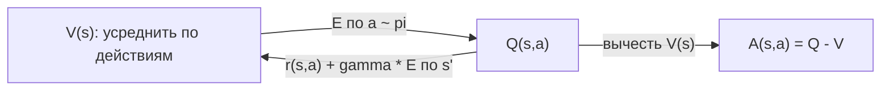
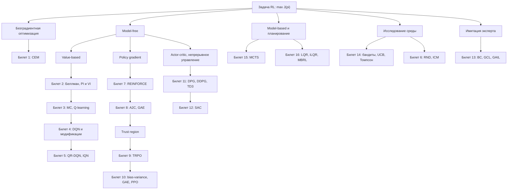

# Основы: всё, что нужно знать до билетов

> **Источники:** лекция 1 (`Slides/RL_MIPT_Lecture_1.pdf`), начало лекции 2 (`Slides/RL_MIPT_Lecture_2.pdf`); конспект [1] (Иванов, «Reinforcement Learning Textbook») глава 1, стр. 6–22; разделы 3.1 (стр. 39–48) и 3.4.6–3.4.7 (стр. 68–70).
> **Зачем этот файл:** это пререквизиты для всех 16 билетов. Здесь собраны постановка задачи, обозначения и минимум математики, чтобы дальше не отвлекаться на них.
> **Как читать:** подряд — один раз; потом возвращаться по ссылкам вида `00-osnovy.md#mdp` из билетов.

[TOC]

## Постановка задачи RL: агент, среда, цикл взаимодействия

Обучение с подкреплением (reinforcement learning, RL) — это формализация обучения **методом проб и ошибок**. Есть **агент** (agent) — та сущность, которую мы программируем и над которой у нас полный контроль. Есть **среда** (environment) — всё остальное, для нас чёрный ящик. Агент видит **состояние** (state) среды, выбирает **действие** (action), среда отвечает **наградой** (reward) — скалярным числом — и новым состоянием. И так по кругу.

Цель агента — набрать как можно больше суммарной награды за всё взаимодействие. Обратите внимание: цель формулируется **только** через награду. Никто не говорит агенту, какое действие правильное; он узнаёт лишь, сколько очков ему начислили.

!!! note Интуиция
    Обучение с учителем — это «вот фотографии кошек и собак, вот правильные подписи, научись подписывать». RL — это «вот джойстик, вот экран, вот счётчик очков; разбирайся». Правильных ответов нет ни у агента, ни, зачастую, у самого человека: мы не знаем наилучший ход в шахматах и не умеем расписать, как именно робот должен переставлять ноги.

Три отличия от обучения с учителем (supervised learning), которые действительно важны:

| | Обучение с учителем | Обучение с подкреплением |
|---|---|---|
| Данные | датасет дан на вход | агент **сам собирает** данные, взаимодействуя со средой |
| Сигнал обучения | правильный ответ $y$ для каждого объекта | скалярная награда, часто редкая и запоздалая |
| Влияние модели на данные | никакого: выборка фиксирована | агент своими действиями **меняет** распределение того, что увидит дальше |

Третий пункт — главный. Именно из него растут почти все специфические сложности RL, и именно поэтому нельзя просто «взять градиент по лоссу и успокоиться».

!!! info Связь с другими темами
    Обучение с учителем — частный случай RL: положим состоянием объект $x$, действием — предсказанную метку $\hat y$, наградой — $-\mathrm{Loss}(\hat y, y)$, а эпизод длиной в один шаг. Максимизация награды тогда ровно эквивалентна минимизации лосса. Обратное неверно: RL строго общее. Практический вывод — **если задачу можно свести к supervised, так и делайте**: это проще и стабильнее.

Именованные сложности задачи RL, о которые спотыкаются все алгоритмы курса:

- **Отложенный сигнал** (delayed reward): выстрел сделан сейчас, очки начислены через две секунды и сорок решений.
- **Credit assignment problem**: какое из совершённых действий привело к награде? «Поймали скунса, сварили яичницу, ..., получили +1 — чему вы научились?»
- **Разреженная награда** (sparse reward): в Mountain Car награда $-1$ всюду, и чтобы её увеличить, нужно **уже уметь** решать задачу.
- **Локальные оптимумы**: агент выучивает пассивное «ничего не делать за +0», лишь бы не получать $-1$ за грабли.
- **Дилемма исследования-использования**: идти в любимый ресторан или попробовать новый (см. [§exploration](#exploration)).

## Марковский процесс принятия решений (MDP)

Чтобы что-то доказывать, среду нужно формализовать. Базовая модель — «управляемая марковская цепь».

**Определение (среда).** Среда — тройка $(\mathcal{S}, \mathcal{A}, p)$, где $\mathcal{S}$ — пространство состояний, $\mathcal{A}$ — пространство действий, а $p(s' \mid s, a)$ — **функция переходов** (динамика среды): вероятность оказаться в $s'$, если в состоянии $s$ выбрано действие $a$.

**Определение (MDP).** Марковский процесс принятия решений (Markov Decision Process) — четвёрка $(\mathcal{S}, \mathcal{A}, p, r)$, где дополнительно задана **функция награды** $r: \mathcal{S} \times \mathcal{A} \to \mathbb{R}$. Часто в MDP включают и дисконт $\gamma$, тогда пишут $(\mathcal{S}, \mathcal{A}, p, r, \gamma)$.

В это определение зашиты два предположения:

1. **Марковское свойство** (Markov property): переход зависит только от текущего состояния и действия, а не от всей истории. «В настоящем содержится вся информация, нужная для будущего».
2. **Стационарность** (однородность, time-homogeneity): законы среды не меняются со временем, $p$ и $r$ не зависят от $t$.

!!! warning Типичная ошибка
    «Марковость — это ограничение на задачу». Почти нет: если истории не хватает, её всегда можно **засунуть в состояние** (так и делают — например, в Atari состоянием считают стопку из 4 последних кадров, иначе по одному кадру не понять, куда летит мяч). Ограничение здесь не столько математическое, сколько инженерное: состояние может распухнуть.

Время дискретно. Пространство действий бывает двух видов: **дискретное** ($|\mathcal{A}| < \infty$, и обычно мало) и **непрерывное** ($\mathcal{A} \subseteq [-1,1]^m$; задачи непрерывного управления, continuous control). Многие алгоритмы принципиально работают только с одним из них — об этом будет отдельный разговор в билетах [11](11-dpg-ddpg-td3.md) и [12](12-sac.md).

По умолчанию среда считается **полностью наблюдаемой** (fully observable): агент видит состояние целиком, наблюдение = состояние. Иначе нужен формализм PoMDP, который мы не разбираем.

!!! tip Как запомнить
    Разные учебники определяют MDP чуть по-разному: награда $r(s)$, или $r(s,a)$, или $r(s,a,s')$, или стохастическая, или совместное распределение $p(r, s' \mid s, a)$, начальное состояние фиксировано или сэмплируется из $\mu_0$. **Все эти определения эквивалентны**: любую стохастику можно «спрятать» в функцию переходов, размножив состояния. Так что на экзамене спокойно пользуйтесь той версией, которая вам удобнее, — только оговорите её.

**Эпизодичность.** Состояние $s$ называется **терминальным** (terminal), если из него нельзя выйти и награда там нулевая: $\forall a:\ p(s \mid s, a) = 1,\ r(s,a) = 0$. Один цикл от старта до терминального состояния — **эпизод** (episode). Среда **эпизодична**, если эпизод гарантированно завершается не более чем за $T_{\max}$ шагов при любой стратегии. Такой трюк с «поглощающими» терминальными состояниями позволяет всюду писать суммы до бесконечности и не разбирать отдельно конечный случай.

!!! warning Подводный камень
    На практике эпизоды обрывают по таймеру («сделал 200 шагов — reset»). Формально это ломает марковость: агент не знает, сколько осталось до обрыва, хотя это влияет на будущее. Строго надо было бы положить время в состояние; обычно так не делают, а просто аккуратно обращаются с флагом `done` — не считать обрыв по таймеру настоящим терминальным состоянием.

## Траектория, return $G_t$, дисконтирование

**Траектория** (trajectory) — запись одного взаимодействия: $\tau = (s_0, a_0, r_0, s_1, a_1, r_1, \dots)$. Траектория — случайная величина: действия приходят из политики, состояния — из динамики. Её распределение (trajectory distribution) распадается в произведение:

$$
p(\tau \mid \pi) = p(s_0) \prod_{t \ge 0} \pi(a_t \mid s_t)\, p(s_{t+1} \mid s_t, a_t)
$$

Матожидание по траекториям обозначаем $\mathbb{E}_{\tau \sim \pi}$ — это бесконечная цепочка вложенных матожиданий $\mathbb{E}_{a_0} \mathbb{E}_{s_1} \mathbb{E}_{a_1} \dots$

**Суммарная дисконтированная награда** (return) траектории и **reward-to-go** с шага $t$:

$$
R(\tau) = \sum_{t \ge 0} \gamma^t r_t,
\qquad
G_t = \sum_{k \ge 0} \gamma^k r_{t+k}
$$

Ключевое рекуррентное соотношение, из которого потом вырастут все уравнения Беллмана:

$$
G_t = r_t + \gamma G_{t+1}
$$

«Награда за игру = награда за следующий шаг плюс дисконтированная награда за оставшуюся игру».

### Зачем нужен $\gamma$: три ответа

**Ответ 1: чтобы сумма вообще существовала.** Если награда ограничена, $|r(s,a)| \le r_{\max}$, то при $\gamma < 1$ по формуле геометрической прогрессии $|R(\tau)| \le \frac{r_{\max}}{1-\gamma}$. При $\gamma = 1$ и бесконечном эпизоде сумма может расходиться или не существовать (например, $+1, -1, +1, -1, \dots$).

!!! warning Оговорка о конвенции: диапазон $\gamma$
    В конспекте [1] дисконт определён как $\gamma \in (0, 1]$, а здесь и во всех билетах по умолчанию $\gamma \in [0,1)$. Противоречия нет: конспект отдельно оговаривает, что всюду предполагается **либо** $\gamma < 1$, **либо** эпизодичность среды — и того, и другого хватает, чтобы $J(\pi)$ был конечен (при $\gamma=1$ и эпизодах не длиннее $T_{\max}$ сумма содержит не более $T_{\max}$ слагаемых, поэтому $|R(\tau)| \le T_{\max} r_{\max}$). Поэтому случай $\gamma = 1$ законен, но **только в эпизодичных средах**; им пользуются в билетах [1](01-cem.md) (CEM), [13](13-imitation-irl.md) и [16](16-lqr-ilqr-mbrl.md), где горизонт конечен, а формулы без $\gamma$ читаются легче. Все теоремы, опирающиеся на сжимаемость оператора Беллмана ([Билет 2](02-bellman-pi-vi.md)), требуют строго $\gamma < 1$.

**Ответ 2: чтобы различать стратегии.** Вот числовой пример. Стратегия $\pi_1$ получает $+1$ **каждый** шаг, стратегия $\pi_2$ — $+1$ через шаг (на чётных шагах). При $\gamma = 1$ обе дают $+\infty$, и формально они «одинаково оптимальны» — абсурд. При $\gamma = 0.9$:

$$
J(\pi_1) = \sum_{t\ge 0} 0.9^t = \frac{1}{1-0.9} = 10,
\qquad
J(\pi_2) = \sum_{k\ge 0} 0.9^{2k} = \frac{1}{1-0.81} \approx 5.26
$$

Разница видна, и $\pi_1$ честно лучше.

**Ответ 3: интерпретация.** Дисконтирование — это «на каждом шаге с вероятностью $1-\gamma$ взаимодействие обрывается». Отсюда **эффективный горизонт** $\approx \frac{1}{1-\gamma}$ шагов: при $\gamma = 0.99$ агент смотрит примерно на 100 шагов вперёд, при $\gamma = 0.9$ — примерно на 10. Награда через 10 шагов при $\gamma=0.9$ весит $0.9^{10} \approx 0.35$, то есть втрое дешевле сегодняшней.

!!! warning Подводный камень
    $\gamma$ — это **часть постановки задачи**, а не «гиперпараметр оптимизатора». Меняя $\gamma$, вы меняете, какая стратегия оптимальна. В конспекте есть MDP, где при $\gamma = 10/11$ оптимально одно действие, а при $\gamma = 15/19$ все стратегии одинаково хороши.

### Пример: GridWorld 3×3 с числами

Поле 3×3, строки нумеруем сверху вниз, столбцы слева направо, клетка обозначается $(row, col)$:

| | столбец 1 | столбец 2 | столбец 3 |
|---|---|---|---|
| **строка 1** | старт-зона | пусто | 🎂 **цель**, терминал |
| **строка 2** | пусто | пусто | 🔥 **лава**, терминал |
| **строка 3** | **старт** $s_0=(3,1)$ | пусто | пусто |

- $\mathcal{S}$: 9 клеток, из них $(1,3)$ и $(2,3)$ терминальные. $\mathcal{A} = \{\uparrow, \downarrow, \leftarrow, \rightarrow\}$.
- Динамика детерминированная: ход в стену оставляет на месте.
- Награда: $-0.1$ за обычный шаг («время — деньги»), $+1$ за шаг, приводящий в 🎂, $-1$ за шаг, приводящий в 🔥.
- $\gamma = 0.9$.

**Траектория A (удачная):** $(3,1) \xrightarrow{\uparrow} (2,1) \xrightarrow{\uparrow} (1,1) \xrightarrow{\rightarrow} (1,2) \xrightarrow{\rightarrow} (1,3)$.
Награды: $r_0 = -0.1,\ r_1 = -0.1,\ r_2 = -0.1,\ r_3 = +1$.

$$
G_0 = -0.1 - 0.1\cdot 0.9 - 0.1 \cdot 0.81 + 1 \cdot 0.729 = -0.1 - 0.09 - 0.081 + 0.729 = 0.458
$$

Проверим рекурсию. $G_1 = -0.1 - 0.1\cdot0.9 + 1\cdot 0.81 = 0.62$, и действительно $G_0 = r_0 + \gamma G_1 = -0.1 + 0.9 \cdot 0.62 = 0.458$. ✔

**Траектория B (неудачная):** $(3,1) \xrightarrow{\rightarrow} (3,2) \xrightarrow{\rightarrow} (3,3) \xrightarrow{\uparrow} (2,3)$.
Награды: $-0.1,\ -0.1,\ -1$. Итого $G_0 = -0.1 - 0.09 - 0.81 = -1.0$.

Этот GridWorld мы будем использовать дальше как рабочий пример.

## Политика и целевой функционал $J(\pi)$

**Политика** (стратегия, policy) — правило выбора действия по состоянию. Бывает:

- **детерминированная**: $a = \mu(s)$, функция $\mathcal{S} \to \mathcal{A}$. В непрерывном управлении обозначаем $\mu_\theta(s)$ (билеты 11–12);
- **стохастическая**: $\pi(a \mid s)$ — распределение на действиях. Именно она нужна для исследования среды и для policy gradient;
- **параметризованная**: $\pi_\theta(a \mid s)$, где $\theta$ — веса нейросети. Для дискретных действий сеть выдаёт логиты и на них softmax; для непрерывных — обычно среднее и дисперсию гауссианы.

Мы ищем политику в классе **стационарных** (не зависящих от $t$). Это не потеря общности: доказывается, что оптимальная стационарная детерминированная политика существует (конспект, гл. 3).

**Целевой функционал** (score, performance):

$$
J(\pi) = \mathbb{E}_{\tau \sim \pi} \big[ R(\tau) \big] \longrightarrow \max_{\pi}
$$

То есть: средняя по всем возможным траекториям дисконтированная суммарная награда. Это и есть **вся** задача RL — одна строчка. Всё дальнейшее содержание курса — способы приблизительно решить эту оптимизационную задачу, зная только сэмплы из $p(\tau \mid \pi)$.

!!! question На экзамене спросят
    «Почему политика стохастическая, если оптимальная всё равно детерминированная?» Ответ: детерминированную нельзя отправить собирать данные — она не исследует среду (см. [§exploration](#exploration)); плюс стохастическая политика дифференцируема по $\theta$ и допускает policy gradient; плюс в частично наблюдаемых средах и в играх против противника оптимальная политика может быть честно стохастической.

## Функции ценности $V^\pi$, $Q^\pi$, $A^\pi$

Оптимизировать $J(\pi)$ «в лоб» тяжело: награда отложена, credit assignment не решён. Идея классической теории — ввести **вспомогательные переменные**, которые связаны между собой красивыми рекуррентными уравнениями.

**V-функция** (функция ценности состояния, state value function):

$$
V^\pi(s) = \mathbb{E}_{\tau \sim \pi \mid s_0 = s} \big[ R(\tau) \big]
$$

Сколько в среднем наберёт агент, действующий по $\pi$, **начиная из состояния** $s$. Благодаря марковости и стационарности неважно, попали мы в $s$ на нулевом шаге или на сотом: $V^\pi(s) = \mathbb{E}_{\tau \mid s_t = s} G_t$. История не важна.

**Q-функция** (ценность пары состояние-действие, action value function):

$$
Q^\pi(s,a) = \mathbb{E}_{\tau \sim \pi \mid s_0 = s,\, a_0 = a} \big[ R(\tau) \big]
$$

Сколько наберёт агент, если **сейчас** сделает именно $a$ (возможно, вопреки $\pi$), а дальше будет следовать $\pi$.

**Advantage-функция** (преимущество):

$$
A^\pi(s,a) = Q^\pi(s,a) - V^\pi(s)
$$

Насколько действие $a$ лучше «среднего поведения политики $\pi$» в состоянии $s$.

**Связи между ними** (следуют прямо из определений):

$$
V^\pi(s) = \mathbb{E}_{a \sim \pi(\cdot \mid s)} Q^\pi(s,a),
\qquad
Q^\pi(s,a) = r(s,a) + \gamma\, \mathbb{E}_{s' \sim p(\cdot\mid s,a)} V^\pi(s')
$$

Из первой сразу следует важное: $\mathbb{E}_{a \sim \pi} A^\pi(s,a) = 0$ — **преимущество в среднем по политике равно нулю**. Это тот самый факт, который делает $V$ хорошим baseline в policy gradient (билеты 7–8).

!!! note Интуиция: V vs Q vs A на бытовом примере
    Субботнее утро, курсовая через неделю. **$V(s)$** — «насколько хороша сама ситуация», средняя оценка вашей субботы с учётом того, как вы обычно её проводите. **$Q(s, a)$** — «насколько хорош конкретный вариант»: $Q(s, \text{сесть за курсовую})$, $Q(s, \text{пойти в зал})$, $Q(s, \text{залипнуть в сериал})$ — при условии, что **дальше** вы ведёте себя как обычно. **$A(s,a)$** — «лучше или хуже это вашего обычного поведения»: если $A(s, \text{курсовая}) = +0.7$, значит, конкретно этот выбор поднимает ваш день выше среднего, и такие действия надо делать чаще. Если все $A$ около нуля — в этой ситуации выбор не принципиален.

**Числа на нашем GridWorld** (для оптимальной политики, $\gamma = 0.9$). Из $(1,2)$ один шаг вправо приводит к 🎂, значит $V^*(1,2) = 1$. Из $(1,1)$ нужно два шага: $V^*(1,1) = -0.1 + 0.9 \cdot 1 = 0.8$. Теперь сравним действия в $(1,2)$:

| $s$ | $a$ | $Q^*(s,a)$ | $A^*(s,a)$ |
|---|---|---|---|
| $(1,2)$ | $\rightarrow$ | $1.0$ | $0$ |
| $(1,2)$ | $\leftarrow$ | $-0.1 + 0.9\cdot V^*(1,1) = -0.1 + 0.72 = 0.62$ | $-0.38$ |
| $(1,2)$ | $\downarrow$ | $-0.1 + 0.9 \cdot V^*(2,2) = -0.1 + 0.72 = 0.62$ | $-0.38$ |

И $V^*(1,2) = \max_a Q^*(1,2,a) = 1$. Видно, что $A^*\le 0$ всегда, а ноль достигается на оптимальном действии, — это общий факт.

**Оптимальные функции ценности.** $V^*(s) = \max_\pi V^\pi(s)$, $Q^*(s,a) = \max_\pi Q^\pi(s,a)$. Нетривиальный (и доказываемый в билете 2) результат: существует **одна** политика, максимизирующая $V^\pi(s)$ сразу во **всех** состояниях, и её можно взять стационарной и детерминированной. Из этого следует **принцип оптимальности Беллмана**: жадный выбор действия в предположении дальнейшей оптимальности оптимален, то есть

$$
V^*(s) = \max_a Q^*(s,a),
\qquad
\pi^*(s) = \operatorname*{argmax}_a Q^*(s,a)
$$

!!! tip Как запомнить
    **Зачем вообще нужна $Q$, если есть $V$?** Потому что из $V^*$ без знания динамики $p(s'\mid s,a)$ нельзя достать политику: вы знаете ценности состояний, но не знаете, какое действие куда приведёт. А из $Q^*$ политика достаётся мгновенно — берём argmax. Именно поэтому весь model-free value-based подход учит $Q$, а не $V$.

Подробный разбор уравнений Беллмана, их операторный вид, сжимаемость и алгоритмы Policy/Value Iteration — [Билет 2](02-bellman-pi-vi.md).

## Матожидание и оценка Монте-Карло

Вся практика RL — это замена матожиданий средними по сэмплам. Поэтому эти полстраницы важнее, чем кажется.

**Матожидание** — среднее значение случайной величины с весами-вероятностями: $\mathbb{E}_{x \sim p} f(x) = \sum_x p(x) f(x)$ (или интеграл в непрерывном случае). Это число, а не случайная величина.

**Оценка Монте-Карло (МК):** насэмплируем $x_1, \dots, x_N \sim p$ независимо и возьмём среднее:

$$
\hat f_N = \frac{1}{N} \sum_{i=1}^N f(x_i)
$$

**Закон больших чисел** гарантирует $\hat f_N \to \mathbb{E} f$ при $N \to \infty$.

**Несмещённость** (unbiasedness): $\mathbb{E}[\hat f_N] = \mathbb{E} f$ — оценка «в среднем правильная», без систематической ошибки. МК-оценка среднего несмещена при любом $N$, даже при $N = 1$.

**Дисперсия оценки**: $\mathrm{Var}[\hat f_N] = \frac{1}{N}\mathrm{Var}[f(x)]$. Отсюда золотое правило: **точность растёт как $1/\sqrt{N}$**. Чтобы уменьшить ошибку вдвое, нужно вчетверо больше сэмплов. Это ужасно медленно — поэтому полкурса посвящено не увеличению $N$, а уменьшению $\mathrm{Var}[f(x)]$ (baseline, GAE, бутстрэппинг).

!!! example Пример
    В GridWorld запустим политику 3 раза из $s_0$ и получим returns $0.458$, $-1.0$, $0.458$. МК-оценка $V^\pi(s_0) \approx (0.458 - 1.0 + 0.458)/3 = -0.028$. Оценка несмещённая, но разброс между отдельными эпизодами огромен — от $-1$ до $+0.46$. Вот вам весь табличный Монте-Карло из билета 3 в одном абзаце.

!!! warning Типичная ошибка
    «Несмещённость = точность». Нет. Несмещённая оценка может иметь чудовищную дисперсию и на одном сэмпле быть далёкой от истины. И наоборот: смещённая оценка с малой дисперсией часто полезнее на практике. См. дальше.

## Смещение и разброс (bias–variance) на пальцах

Пусть $\hat X$ — наша оценка неизвестной величины $X$. Разложим среднеквадратичную ошибку:

$$
\mathbb{E}\big[(\hat X - X)^2\big] = \underbrace{\big(\mathbb{E}\hat X - X\big)^2}_{\text{bias}^2} + \underbrace{\mathrm{Var}[\hat X]}_{\text{variance}}
$$

**Смещение** (bias) — систематический промах: стреляем кучно, но не туда. **Разброс** (variance) — нестабильность: стреляем в среднем туда, но во все стороны. Обычно их нельзя уменьшить одновременно, и приходится выбирать компромисс.

!!! note Интуиция
    Весы, которые всегда завышают на 2 кг, — это bias. Весы, которые показывают то $+3$, то $-3$ кг от правды, — это variance. Первые предсказуемо врут, вторые честны в среднем, но бесполезны для одного взвешивания.

Где это всплывает в RL:

| Оценка $V^\pi(s_t)$ | Смещение | Разброс |
|---|---|---|
| Монте-Карло: $G_t$ целиком до конца эпизода | нет (несмещённая) | огромный — накопился шум всех шагов |
| Одношаговый TD: $r_t + \gamma V_\phi(s_{t+1})$ | есть — $V_\phi$ неточна | маленький — один шаг шума |
| $n$-шаговый / GAE($\lambda$) | регулируется $n$ или $\lambda$ | регулируется $n$ или $\lambda$ |

Эта таблица — скелет [Билета 10](10-bias-variance-ppo.md) и половина [Билета 8](08-a2c-gae.md). Приём «подставить в формулу собственную текущую оценку вместо честного будущего» называется **бутстрэппинг** (bootstrapping): он вносит смещение, но резко режет дисперсию.

## Нужная вероятность: правдоподобие, энтропия, KL, трюк с логарифмом

**Плотность / вероятность** $p(x)$ — насколько «часто» встречается $x$. Для дискретного $x$ это вероятность, для непрерывного — плотность (может быть больше 1, интегрируется в 1).

**Правдоподобие** (likelihood) и **логарифм правдоподобия** (log-likelihood). Если данные $x_1,\dots,x_N$ независимы и приходят из $p_\lambda$, то правдоподобие — произведение $\prod_i p_\lambda(x_i)$, а логарифм превращает его в сумму $\sum_i \log p_\lambda(x_i)$. Логарифм берут по трём причинам: сумма удобнее произведения, монотонность не меняет argmax, а произведение маленьких чисел в float просто обнуляется.

**Максимум правдоподобия** (maximum likelihood estimation, MLE): $\hat\lambda = \operatorname*{argmax}_\lambda \sum_i \log p_\lambda(x_i)$ — подбираем параметры распределения так, чтобы наблюдённые данные были как можно правдоподобнее. Это ровно то, что делает кросс-энтропийный метод на шаге обновления ([Билет 1](01-cem.md)) и behavior cloning ([Билет 13](13-imitation-irl.md)).

**Энтропия** распределения:

$$
\mathcal{H}(p) = -\mathbb{E}_{x\sim p} \log p(x) = -\sum_x p(x)\log p(x)
$$

Мера «неопределённости»/«размазанности». Максимальна у равномерного распределения, равна нулю у детерминированного. Для политики высокая энтропия = агент пробует разное. Добавление $\mathcal{H}(\pi(\cdot\mid s))$ в целевой функционал — основа Maximum Entropy RL и Soft Actor-Critic ([Билет 12](12-sac.md)).

**KL-дивергенция** (Kullback–Leibler divergence):

$$
\mathrm{KL}(p \,\|\, q) = \mathbb{E}_{x \sim p} \log \frac{p(x)}{q(x)} \ge 0
$$

«Насколько $q$ отличается от $p$». Ноль тогда и только тогда, когда $p = q$ почти всюду. Это **не** метрика: не симметрична и не удовлетворяет неравенству треугольника. KL — главный инструмент ограничения шага в trust-region методах: TRPO явно требует $\mathrm{KL}(\pi_{old} \| \pi_\theta) \le \delta$ ([Билет 9](09-trpo.md)), PPO аппроксимирует это клиппингом ([Билет 10](10-bias-variance-ppo.md)), SAC и GAIL используют KL в выводе ([Билеты 12](12-sac.md), [13](13-imitation-irl.md)).

**«Трюк с логарифмом»** (log-derivative trick) — самое полезное тождество курса:

$$
\nabla_\theta p_\theta(x) = p_\theta(x)\, \nabla_\theta \log p_\theta(x)
$$

Это просто производная логарифма наоборот: $\nabla \log p = \frac{\nabla p}{p}$. Зачем он нужен: пусть надо посчитать градиент матожидания, а распределение само зависит от $\theta$:

$$
\nabla_\theta \mathbb{E}_{x \sim p_\theta} f(x)
= \nabla_\theta \int p_\theta(x) f(x)\,dx
= \int p_\theta(x) \nabla_\theta \log p_\theta(x) f(x)\,dx
= \mathbb{E}_{x\sim p_\theta}\big[ f(x) \nabla_\theta \log p_\theta(x) \big]
$$

Слева матожидание взять нельзя (градиент стоит снаружи), справа — стоит матожидание, которое оценивается по сэмплам. Именно так получается policy gradient theorem в [Билете 7](07-reinforce.md).

!!! info Связь с другими темами
    Есть второй способ протащить градиент внутрь матожидания — **репараметризация** (reparametrization trick): вместо $a \sim \mathcal{N}(\mu_\theta, \sigma_\theta)$ пишем $a = \mu_\theta + \sigma_\theta \varepsilon$, где $\varepsilon \sim \mathcal{N}(0,1)$ уже не зависит от $\theta$. Он даёт оценку градиента с меньшей дисперсией, но требует дифференцируемости $f$ по действию. Подробно — в [Билете 11](11-dpg-ddpg-td3.md) (DPG) и [Билете 12](12-sac.md) (SAC).

## Градиентный спуск и подъём

**Градиент** $\nabla_\theta L(\theta)$ — вектор частных производных; он показывает направление **наискорейшего роста** функции. Отсюда:

- **Градиентный спуск** (минимизация): $\theta \leftarrow \theta - \alpha \nabla_\theta L(\theta)$.
- **Градиентный подъём** (максимизация, наш случай — мы максимизируем $J$): $\theta \leftarrow \theta + \alpha \nabla_\theta J(\theta)$.

$\alpha > 0$ — **learning rate** (скорость обучения). Слишком большой — процесс расходится или прыгает; слишком маленький — учится вечно.

**Стохастический градиент** (SGD): настоящий $\nabla J$ мы не знаем, у нас есть только его **несмещённая оценка** по мини-батчу сэмплов. Шаги становятся шумными, но в среднем идут в нужную сторону; при убывающем $\alpha$ (условия Роббинса–Монро: $\sum_k \alpha_k = \infty$, $\sum_k \alpha_k^2 < \infty$) это сходится. Те же условия всплывут в теореме сходимости Q-learning ([Билет 3](03-mc-q-learning.md)).

**Adam** — стандартный на практике оптимизатор: адаптивно масштабирует шаг по каждой координате, опираясь на скользящие средние градиента и его квадрата. Для экзамена достаточно знать, что он делает обучение устойчивее и почти всегда используется вместо ванильного SGD.

## Нейросеть как аппроксиматор функций

Табличные методы хранят по числу на каждую пару $(s,a)$. Это работает, пока состояний десятки. В Atari состояние — картинка $84\times84$, и таблица физически невозможна. Значит, функцию надо **аппроксимировать**.

Нейросеть $f_\theta$ — это параметризованное семейство функций «вход → выход» с весами $\theta$, устроенное как цепочка линейных преобразований и нелинейностей. Что важно знать для курса:

- **Что на входе/выходе.** Q-сеть в DQN: вход — состояние $s$, выход — вектор из $|\mathcal{A}|$ чисел, по одному $Q_\phi(s,a)$ на действие. Политика в PG: вход — $s$, выход — логиты (дискретный случай) или $\mu, \sigma$ гауссианы (непрерывный). Критик: вход — $s$ (или $s,a$), выход — одно число.
- **Лосс.** Функция, которую минимизируем. Для регрессии на таргеты — MSE: $L(\phi) = \big(f_\phi(x) - y\big)^2$.
- **Backprop.** Алгоритм, считающий $\nabla_\theta L$ по правилу цепочки за один проход назад. Деталей знать не нужно — считайте, что градиент вам дают.
- **«Обучить сеть на таргеты»** — эта фраза будет встречаться постоянно. Означает: у нас есть набор пар «вход $x_i$, желаемое значение $y_i$», и мы делаем несколько шагов градиентного спуска по $\sum_i (f_\phi(x_i) - y_i)^2$. В RL таргеты $y_i$ мы **придумываем сами** из собственных текущих оценок (например, $y = r + \gamma \max_{a'} Q_{\phi^-}(s', a')$).

!!! warning Подводный камень
    Именно эта самодельность таргетов — источник всех бед value-based RL. Таргет зависит от обучаемой сети, то есть «цель убегает от стрелка». Лечится таргет-сетью $\phi^-$ — замороженной копией весов ([Билет 4](04-dqn.md)). Плюс сеть обобщает: обновив $Q(s,a)$, вы **непреднамеренно меняете** $Q$ в соседних состояниях, чего в табличном случае не было и на чём построены все теоремы сходимости.

## On-policy vs off-policy, реплей-буфер

В RL алгоритм сам решает, какой политикой ходить в среду. Отсюда два понятия:

- **Целевая политика** (target policy) — та, которую алгоритм выдаст как ответ, если его остановить.
- **Политика взаимодействия** (behavior policy, $\mu$) — та, которой реально собираются данные.

**Определение.** Алгоритм **off-policy**, если он умеет делать шаг обучения на опыте **произвольной** стратегии. Алгоритм **on-policy**, если для очередной итерации ему нужен опыт конкретной, им же предоставленной стратегии.

!!! tip Как запомнить
    On-policy учится **на своих** ошибках; off-policy — **и на своих, и на чужих**.

Граница строгая: если алгоритм умеет переиспользовать данные, но лишь с недавних итераций (как PPO — несколько эпох по свежему батчу), он всё равно **on-policy**, потому что для каждой новой итерации данные нужно собирать заново.

**Реплей-буфер** (replay buffer, experience replay) $\mathcal{D}$ — память со всеми собранными переходами $(s, a, r, s', done)$. Это ключевое преимущество off-policy алгоритмов: каждый переход можно переиспользовать сколько угодно раз. Появляются два независимых процесса — сбор данных и обучение, — и их соотношение можно настраивать (1 шаг среды на 1 обновление? 1 на 10? обучение вообще без среды, с чужого датасета?).

!!! info Связь с другими темами
    Если зафиксировать буфер и учиться только с него, Q-learning сойдётся к $Q^*$ **эмпирического MDP** — того, где $\hat p(s'\mid s,a) = N(s,a,s')/N(s,a)$ посчитаны по буферу. Чем больше и разнообразнее буфер, тем ближе эмпирический MDP к настоящему. Это формальное обоснование того, почему off-policy обучение с буфера вообще работает.

Практическое следствие — **sample efficiency** (эффективность по сэмплам). Очень грубый порядок: мета-эвристики (CEM) — сотни переходов на одно обновление; policy gradient — десятки; value-based с буфером — порядка одного; model-based — меньше всего сэмплов, но больше всего вычислений. Выбор класса алгоритма на практике определяется тем, что дороже: шаг в среде или шаг оптимизатора.

## Exploration vs exploitation, $\varepsilon$-greedy

**Использование** (exploitation) — делать то, что по текущим оценкам лучше всего. **Исследование** (exploration) — пробовать новое, чтобы узнать, не лучше ли оно. Ресторан любимый или новый? Конфликт неустраним: чтобы узнать ценность действия, его надо совершить, а совершать заведомо плохие действия дорого.

!!! example Пример: почему жадность не работает
    Два действия: «взять приз» ($+100$) и «тупить в стену» ($+0$), после любого игра кончается. Инициализировали неудачно: $Q_0(\text{приз}) = -1$, $Q_0(\text{стена}) = +1$. Жадная политика выбирает стену, получает $0$, сглаживает: $Q_1(\text{стена}) \ge 0 > -1 = Q_1(\text{приз})$. Приз не будет выбран **никогда**. Детерминированная политика не даёт свойства infinite visitation, без которого нет никаких гарантий сходимости.

**Теорема.** Любая стратегия с $\mu(a \mid s) > 0$ для всех $s,a$ обеспечивает infinite visitation: любая **достижимая** пара $(s,a)$ (то есть такая, в состояние $s$ которой при этой стратегии можно попасть из стартового распределения) встретится в траекториях с ненулевой вероятностью, а значит, при бесконечном взаимодействии — бесконечно много раз. Про состояния, куда не ведёт ни один путь, сказать нечего — и не нужно.

Два базовых способа сделать жадную политику стохастической:

- **$\varepsilon$-greedy**: с вероятностью $\varepsilon$ берём $a \sim \mathrm{Uniform}(\mathcal{A})$, иначе $a = \operatorname*{argmax}_a Q(s,a)$. Просто; не различает «чуть хуже» и «катастрофа». Обычно $\varepsilon$ отжигают от $1$ к $0.01$–$0.1$.
- **Больцмановская** (softmax) политика: $\mu(a\mid s) = \mathrm{softmax}_a\big(Q(s,a)/\tau\big)$, где $\tau$ — температура. Реже выбирает откровенно плохие действия, но чувствительна к масштабу $Q$ и требует настройки $\tau$. Её интерпретация всплывёт в Maximum Entropy RL ([Билет 12](12-sac.md)).

!!! warning Типичная ошибка
    Случайная политика **корректна, но неэффективна**: в пределе она выучит всё, но «через экспоненциально много попыток случайно пройти первый уровень Марио» — не план. Жадная эффективна, но некорректна: застревает в локальном оптимуме. Хороший алгоритм должен уметь и то, и другое, и $\varepsilon$-greedy — это самый грубый из возможных компромиссов. Умные схемы — оптимизм в лице неопределённости и сэмплирование Томпсона ([Билет 14](14-bandits.md)), внутренняя мотивация RND/ICM ([Билет 6](06-intrinsic-motivation.md)), шумные сети ([Билет 4](04-dqn.md)).

!!! question На экзамене спросят
    «Cliff World: Q-learning выучил оптимальный маршрут вдоль обрыва — почему он продолжает падать в лаву?» Потому что **целевая** политика жадная и идёт кратчайшим путём вдоль края, а **поведенческая** с вероятностью $\varepsilon$ делает случайный шаг — и падает. Off-policy алгоритм не учитывает, что взаимодействовать он обязан с эксплорейшном. Алгоритм, который это учитывает, — on-policy SARSA: он выучит маршрут подальше от края.

## Карта методов курса

Главная развилка — **что именно мы параметризуем и учим**: функцию ценности (и политика из неё достаётся argmax'ом), саму политику (и градиент считаем напрямую), или модель среды (и тогда планируем). Всё остальное — вариации и склейки.

| Билет | Метод | Ключевая идея в одной строке |
|---|---|---|
| [1](01-cem.md) | CEM | Сэмплировать стратегии, оставить лучшие $\rho$-квантиль, подогнать распределение по максимуму правдоподобия. |
| [2](02-bellman-pi-vi.md) | Bellman, Policy/Value Iteration | Оптимальные $V^*,Q^*$ — неподвижная точка сжимающего оператора; итерируем его до сходимости. |
| [3](03-mc-q-learning.md) | MC, Q-learning | Заменить матожидания в уравнениях Беллмана сэмплами и сглаживать: $Q \mathrel{+}= \alpha(r + \gamma\max Q' - Q)$. |
| [4](04-dqn.md) | DQN | То же, но $Q$ — нейросеть; лечим нестабильность буфером, таргет-сетью и семью модификациями. |
| [5](05-distributional.md) | QR-DQN, IQN | Учить не среднее, а всё **распределение** return'а — квантили вместо одного числа. |
| [6](06-intrinsic-motivation.md) | RND, ICM | Выдавать себе внутреннюю награду за новизну состояния — лечим разреженную награду. |
| [7](07-reinforce.md) | REINFORCE | $\nabla J = \mathbb{E}[\nabla\log\pi_\theta(a\mid s)\,G_t]$: повышать логвероятность действий из удачных траекторий. |
| [8](08-a2c-gae.md) | A2C, GAE | Заменить $G_t$ на advantage от критика; $\lambda$ плавно крутит ручку bias–variance. |
| [9](09-trpo.md) | TRPO | Нижняя оценка на прирост $J$ ⟹ шаг с ограничением $\mathrm{KL} \le \delta$ гарантированно не ухудшает политику. |
| [10](10-bias-variance-ppo.md) | PPO | Та же идея, но через дешёвый клиппинг importance-отношения вместо честной оптимизации с ограничением. |
| [11](11-dpg-ddpg-td3.md) | DPG, DDPG, TD3 | Для непрерывных действий argmax недоступен — учим детерминированный актор как «argmax по $Q$»; TD3 гасит переоценку. |
| [12](12-sac.md) | SAC | Добавить энтропию политики в награду: стохастичность становится частью цели, а не костылём. |
| [13](13-imitation-irl.md) | BC, GCL, GAIL | Награда неизвестна — восстановить её по демонстрациям эксперта (или сразу подогнать распределение траекторий). |
| [14](14-bandits.md) | Бандиты, UCB, Томпсон | MDP из одного состояния: чистая дилемма exploration-exploitation, оптимизм и байесовское сэмплирование. |
| [15](15-mcts.md) | MCTS | Есть симулятор — строим дерево поиска, балансируя UCB, и оцениваем листья роллаутами. |
| [16](16-lqr-ilqr-mbrl.md) | LQR, iLQR, MBRL | Известна (или выучена) динамика — решаем задачу управления аналитически и перепланируем по ходу. |

## Глоссарий обозначений

| Обозначение | Что это | Комментарий |
|---|---|---|
| $s,\ a,\ r,\ s'$ | состояние, действие, награда, следующее состояние | штрих = «следующий момент времени» |
| $t$; $s_t, a_t, r_t$ | номер шага и величины на нём | время дискретно, начинается с $0$ |
| $\mathcal{S},\ \mathcal{A}$ | пространства состояний и действий | $\mathcal{A}$ дискретно ($|\mathcal{A}|<\infty$) или непрерывно ($\subseteq[-1,1]^m$) |
| $p(s'\mid s,a)$ | динамика среды | по умолчанию агенту **неизвестна** |
| $r(s,a)$ | функция награды | считаем детерминированной и ограниченной, $\lvert r\rvert \le r_{\max}$ |
| $\gamma$ | коэффициент дисконтирования | по умолчанию $\gamma\in[0,1)$ (в эпизодичных средах допускается $\gamma=1$, см. [§trajectory](#trajectory)); эффективный горизонт $\approx 1/(1-\gamma)$ |
| $\tau$ | траектория $(s_0,a_0,r_0,s_1,\dots)$ | случайная величина с плотностью $p(\tau\mid\pi)$; в больцмановской политике и в имитации отжига ([билет 1](01-cem.md)) $\tau$ — температура, это оговаривается по месту |
| $R(\tau)=\sum_t \gamma^t r_t$ | return траектории | то же, что $G_0$ |
| $G_t=\sum_{k\ge0}\gamma^k r_{t+k}$ | return с шага $t$, reward-to-go | $G_t = r_t + \gamma G_{t+1}$ |
| $\pi(a\mid s)$ | стохастическая политика | распределение на $\mathcal{A}$ |
| $\pi_\theta$ | параметризованная политика | $\theta$ — веса сети-актора |
| $\mu_\theta(s)$ | детерминированная политика | DDPG/TD3 (билет 11); также $\mu$ — behavior policy |
| $J(\pi)=\mathbb{E}_{\tau\sim\pi}R(\tau)$ | целевой функционал (score) | то, что максимизируем; $J(\pi)=V^\pi(s_0)$ при фиксированном старте (иначе $\mathbb{E}_{s_0}V^\pi(s_0)$) |
| $V^\pi(s)$ | ценность состояния | сколько наберём из $s$, следуя $\pi$ |
| $Q^\pi(s,a)$ | ценность пары состояние-действие | сделать $a$, дальше по $\pi$ |
| $A^\pi(s,a)=Q^\pi-V^\pi$ | преимущество (advantage) | $\mathbb{E}_{a\sim\pi}A^\pi(s,a)=0$ |
| $V^*,\ Q^*,\ \pi^*$ | оптимальные функции ценности и политика | $\pi^*(s)=\operatorname*{argmax}_a Q^*(s,a)$ |
| $\mathcal{T}^\pi,\ \mathcal{T}^*$ | операторы Беллмана (оценивания / оптимальности) | оба — сжатия с коэффициентом $\gamma$ (билет 2) |
| $\theta$ | параметры политики (актора) | |
| $\phi$ | параметры критика / Q-сети | |
| $\bar\phi$, $\phi^-$ | параметры таргет-сети | замороженная или медленно обновляемая копия $\phi$ |
| $\mathcal{D}$ | реплей-буфер / датасет | набор переходов $(s,a,r,s',done)$ |
| $\alpha$ | learning rate | **в SAC** $\alpha$ — температура энтропии, это оговаривается явно |
| $\lambda$ | параметр GAE / TD($\lambda$) | $\lambda=0$ — одношаговый TD, $\lambda=1$ — Монте-Карло |
| $\varepsilon$, $\epsilon$ | параметр $\varepsilon$-greedy **или** клиппинга PPO | в наборе $\varepsilon$ — исследование ($\varepsilon$-greedy), $\epsilon$ — клиппинг PPO ([билет 10](10-bias-variance-ppo.md)) и константа $\max_{s,a}\lvert A\rvert$ в оценке TRPO ([билет 9](09-trpo.md)); какой именно — оговаривается в каждом билете |
| $\mathbb{E},\ \mathrm{Var},\ \mathbb{I}[\cdot]$ | матожидание, дисперсия, индикатор | |
| $\mathrm{KL}(p\,\|\,q)$ | дивергенция Кульбака–Лейблера | $\ge 0$, не симметрична |
| $\mathcal{H}(p)$ | энтропия распределения | $-\mathbb{E}_{p}\log p$ |
| $done$ | флаг терминального состояния | мнемоника: $\gamma$ всюду домножается на $(1-done)$ |

## Как пользоваться этим файлом

1. **Первый проход** — прочитать подряд §§ [rl-task](#rl-task) – [value](#value) и [onoff-policy](#onoff-policy) – [exploration](#exploration). Это обязательный минимум: без них не читается ни один билет.
2. §§ [expectation-mc](#expectation-mc) – [nn](#nn) — справочные. Если вы знаете, что такое MLE, KL и backprop, просмотрите по диагонали и запомните только «трюк с логарифмом» и таблицу bias–variance.
3. §§ [taxonomy](#taxonomy) и [notation](#notation) — держать открытыми при чтении билетов; карта отвечает на вопрос «где я сейчас», глоссарий — «что это за буква».
4. **Перед экзаменом** достаточно перечитать карту методов, глоссарий и три числовых примера (GridWorld, «зачем $\gamma<1$», $V$/$Q$/$A$ в $(1,2)$): этого хватает, чтобы уверенно начать любой ответ у доски.
