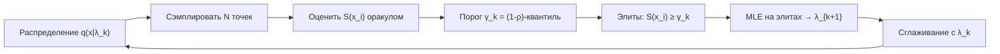

# Вопрос 1. Кросс-энтропийный метод в общем виде. Его применение для решения задач оптимизации и задач обучения с подкреплением.

> **Источники:** лекция 1 (`Slides/RL_MIPT_Lecture_1.pdf`, слайды 20–25), конспект [1] (Иванов, «Reinforcement Learning Textbook») глава 2 «Мета-эвристики», §2.1–2.2, стр. 23–38 (ядро — 2.2.1–2.2.4, стр. 32–35); Botev, Kroese, Rubinstein, L'Ecuyer, «The Cross-Entropy Method for Optimization» (`Papers/Cross-Entropy Method.pdf`), §1–2, §4.1; ноутбук `Notebooks/Cross-Entropy method basics/Cross-Entropy Method.ipynb`.
> **Пререквизиты:** [Основы: политика](00-osnovy.md#policy), [Основы: траектория и return](00-osnovy.md#trajectory), [Основы: вероятность, правдоподобие, KL](00-osnovy.md#probability), [Основы: матожидание и Монте-Карло](00-osnovy.md#expectation-mc).
> **Связанные билеты:** [Билет 13](13-imitation-irl.md) — имитационное обучение (CEM в пространстве траекторий = имитация собственных лучших траекторий); [Билет 7](07-reinforce.md) — policy gradient, градиентная альтернатива тому же функционалу.

[TOC]

## 1. Зачем это нужно и где стоит в курсе

Представьте, что вы учитесь бросать дротики, но вам не говорят, куда именно вы промахнулись — только «попал / не попал». Никакой «производной по углу локтя» у вас нет. Единственное, что можно сделать: бросить сотню дротиков, слегка варьируя хват, запомнить десяток самых удачных бросков и в следующей сотне бросать «как в них». Постепенно разброс сузится вокруг хорошего хвата. Это и есть кросс-энтропийный метод (cross-entropy method, CEM): **отбираем лучших и учимся их повторять**.

Формально CEM — это **мета-эвристика**, то есть метод black-box оптимизации со стохастическим оракулом нулевого порядка: для любой точки $\theta$ мы умеем получить лишь несмещённую оценку $\hat J \approx J(\theta)$, но не градиент и даже не гарантию дифференцируемости [1, опр. 20]. Такие методы — «инструмент последней надежды», зато универсальный: они работают на графах, на дискретных пространствах, на функциях с плато и седловыми точками.

Соседи CEM по главе 2 конспекта — простые безградиентные бэйзлайны. **Случайный поиск** (random search) просто сэмплирует особи из фиксированного распределения-«стратегии перебора» и берёт лучшую. **Hill climbing** добавляет *мутацию* $m(\hat\theta \mid \theta)$ и на каждом шаге выбирает лучшего из $N$ потомков текущей точки — локальная оптимизация «случайным перебором направлений». **Имитация отжига** (simulated annealing) чинит проблему застревания в локальном оптимуме умным отбором: худший потомок принимается с вероятностью $\min\bigl(1, \exp\frac{\hat J(\theta') - \hat J(\theta)}{\tau}\bigr)$, а температура $\tau$ постепенно снижается; по теореме Метрополиса-Гастингса цепочка сходится к распределению $\propto \exp \frac{J(\theta)}{\tau}$. **Эволюционные алгоритмы** ведут не одну точку, а целую *популяцию* $P = (\theta_1,\dots,\theta_N)$ и на каждом шаге строят новое *поколение* отбором + мутацией.

Ключевой шаг от эволюционных алгоритмов к CEM такой: вместо того чтобы хранить саму популяцию, будем **явно хранить распределение $q(\theta \mid \lambda)$, из которого популяция порождается** (в конспекте это называется эволюционной стратегией, evolutionary strategy, ES, опр. 30). Тогда «скрещивание» — это не хитрая операция над парами особей, а честное обновление параметров $\lambda$ по всей популяции сразу. CEM — первый из двух способов такого обновления (второй — градиентный, NES/OpenAI-ES/CMA-ES, см. §6).

В карте курса CEM — это **policy-based** метод, но нулевого порядка: он оптимизирует ту же цель $J(\pi_\theta)$, что и policy gradient ([Билет 7](07-reinforce.md)), но не пользуется структурой MDP вообще — ни уравнениями Беллмана, ни функциями ценности. Это самый простой рабочий RL-алгоритм и стандартная «нулевая точка отсчёта» курса.

## 2. Постановка задачи и обозначения

**Задача оптимизации.** Дано пространство $\mathcal{X}$ и функционал $S: \mathcal{X} \to \mathbb{R}$ (в статье Botev et al. — `score function`); надо найти

$$
S(x) \to \max_{x \in \mathcal{X}}, \qquad \gamma^* := \max_{x} S(x).
$$

Мы умеем только вычислять (возможно, зашумлённо) $S$ в точках. Градиента нет.

**Параметрическое семейство.** $q(x \mid \lambda)$ — семейство распределений на $\mathcal{X}$ с параметром $\lambda$ (в статье — $f(\cdot; v)$). Примеры: покоординатная гауссиана $\mathcal{N}(\mu, \mathrm{diag}\,\sigma^2)$ для $\mathcal{X} = \mathbb{R}^n$, покоординатная бернуллиевская $\prod_j v_j^{x_j}(1-v_j)^{1-x_j}$ для $\mathcal{X} = \{0,1\}^n$, категориальное для конечного $\mathcal{X}$.

**Элиты.** $N$ — размер популяции (число сэмплов за итерацию), $\rho \in (0,1)$ — доля элит (rarity parameter), $N_e = \lceil \rho N \rceil$ — число элит, $\gamma_k$ — порог на $k$-й итерации: выборочная $(1-\rho)$-квантиль значений $S(x_1),\dots,S(x_N)$. Элитная выборка — $E_k = \{x_i : S(x_i) \ge \gamma_k\}$.

**RL-специфика.** $\pi(a \mid s, \theta)$ — стохастическая политика с параметрами $\theta$, $\tau = (s_0,a_0,r_0,s_1,\dots)$ — траектория, $R(\tau) = \sum_t r_t$ — её суммарная награда (в CEM обычно берут недисконтированную, $\gamma = 1$), $J(\theta) = \mathbb{E}_{\tau \sim \pi_\theta} R(\tau)$ — целевой функционал ([Основы, §Политика](00-osnovy.md#policy)). Чтобы свести RL к black-box оптимизации, достаточно положить $x := \theta$, $S := J$, а в роли оракула использовать Монте-Карло оценку $\hat J(\theta) = \frac{1}{B}\sum_{i=1}^{B} R(\tau_i)$, $\tau_i \sim \pi_\theta$.

!!! warning Осторожно с обозначениями
    Во всём этом билете $\gamma$ (с индексом $k$ или со звёздочкой) — это **порог отбора**, а не коэффициент дисконтирования: так принято и в статье Botev et al., и в конспекте. Дисконт в CEM обычно равен единице и в формулах не появляется.

    Второе расхождение — способ задать порог. В конспекте он определяется как $\gamma_k := R_{(M)}$ при сортировке **по возрастанию** $R_{(1)} \le \dots \le R_{(N)}$, то есть $M$ — индекс снизу и элитами оказываются top-$(N-M+1)$. В слайдах и в статье используется квантильная запись через долю $\rho$: $\gamma_k = S_{(N - N_e + 1)}$ — выборочная $(1-\rho)$-квантиль. Это одно и то же (связь: $M = N - N_e + 1$); на экзамене безопаснее говорить «порог — это $(1-\rho)$-квантиль наград, элиты — лучшие $\rho\cdot N$ траекторий».

## 3. Основная теория

### 3.1. Откуда берётся название: оценка вероятности редкого события

Историю CEM удобно начать «сбоку» — с задачи оценивания, а не оптимизации (конспект 2.2.2; Botev et al. §2).

Пусть надо оценить вероятность редкого события

$$
\ell = \mathbb{P}\bigl(S(x) \ge \gamma\bigr) = \mathbb{E}_{x \sim p(x)} \mathbb{I}[S(x) \ge \gamma],
$$

где $p(x)$ — заданное распределение, $\mathbb{I}$ — индикатор. «Редкое» значит, что $\ell$ порядка $10^{-6}$: наивная Монте-Карло оценка при разумном $N$ выдаст ноль (или $1/N$, если один раз повезёт) и будет бесполезна.

Лекарство — **importance sampling**: сэмплируем не из $p$, а из удобного нам $q$, и компенсируем перекос отношением плотностей:

$$
\ell = \mathbb{E}_{x \sim q(x)} \frac{p(x)}{q(x)} \mathbb{I}[S(x) \ge \gamma].
$$

Какое $q$ лучшее? Ответ красивый: оценка имеет **нулевую дисперсию** при $q^*(x) \propto p(x)\,\mathbb{I}[S(x)\ge\gamma]$ (утв. 4 конспекта; формула (4) в статье). Проверяется подстановкой: нормировочная константа такого $q^*$ равна как раз $\ell$, поэтому подынтегральное выражение $\frac{p(x)}{q^*(x)}\mathbb{I}[\cdot] \equiv \ell$ — константа, а у константы дисперсии нет. Смысл $q^*$ прост: это условное распределение $p$ **при условии, что событие произошло**.

Беда в том, что сэмплировать из $q^*$ мы не умеем (в нём спрятано неизвестное $\ell$). Поэтому приблизим $q^*$ ближайшим членом параметрического семейства, минимизируя KL-дивергенцию ([Основы, §Вероятность](00-osnovy.md#probability)):

$$
\mathrm{KL}\bigl(q^*(x) \,\|\, q(x\mid\lambda)\bigr) = \underbrace{\mathbb{E}_{q^*} \log q^*(x)}_{\text{не зависит от }\lambda} - \mathbb{E}_{q^*} \log q(x \mid \lambda) \to \min_\lambda .
$$

Единственное зависящее от $\lambda$ слагаемое $-\mathbb{E}_{q^*}\log q(x\mid\lambda)$ называется **кросс-энтропией** (cross entropy) между $q^*$ и $q_\lambda$ — отсюда название всего метода. Минимизация кросс-энтропии = максимизация ожидаемого логарифма правдоподобия = **метод максимального правдоподобия**, у которого для экспоненциальных семейств есть решение в явном виде.

Подставив $q^* \propto p\,\mathbb{I}[\cdot]$ и переписав матожидание через importance sampling из текущего приближения $q(x\mid\lambda_k)$, получаем итерационную схему:

$$
\lambda_{k+1} = \operatorname*{argmax}_\lambda \; \frac{1}{N}\sum_{j=1}^{N} \mathbb{I}[S(x_j) \ge \gamma_k]\,\frac{p(x_j)}{q(x_j \mid \lambda_k)} \log q(x_j \mid \lambda) , \qquad x_j \sim q(\cdot \mid \lambda_k).
$$

Остаётся последняя проблема: при настоящем $\gamma$ все индикаторы всё ещё нули. Ключевая идея — **многоуровневость**: не брать сразу целевой порог, а «разогревать» его. На каждом шаге берём $\gamma_k := \min(\gamma,\, \text{выборочная }(1-\rho)\text{-квантиль})$ — то есть такой порог, чтобы элит было ровно $\rho N$ штук, и он сам собой рос от итерации к итерации. Останов — когда $\gamma_k = \gamma$.

### 3.2. Кросс-энтропийный метод для оптимизации

Теперь переход к оптимизации почти бесплатный (конспект 2.2.3; Botev et al., Algorithm 2.2). Задачу $S(x)\to\max$ ассоциируем с задачей оценивания $\ell = \mathbb{P}(S(x)\ge\gamma)$ при $\gamma$ близком к неизвестному максимуму $\gamma^*$. Тогда:

* порог $\gamma$ фактически «не ограничен» — критерий останова по достижению $\gamma$ выкидывается, остаются только разогревающие $\gamma_k$;
* $p(x)$ мы вольны выбирать сами (в задаче оптимизации оценивать $\ell$ не надо); положим $p(x) := q(x \mid \lambda_k)$ — тогда importance-коррекция $\frac{p}{q}$ сокращается в единицу.

Остаётся предельно простое обновление: **максимум правдоподобия на элитах**.

$$
\lambda_{k+1} = \operatorname*{argmax}_\lambda \sum_{x \in E_k} \log q(x \mid \lambda), \qquad E_k = \{x_i : S(x_i) \ge \gamma_k\}.
$$

Эквивалентная «геометрическая» формулировка (конспект, 2.2.3): на каждом шаге минимизируется расстояние

$$
\mathrm{KL}\bigl(\mathbb{I}[S(x)\ge\gamma_k]\,q(x\mid\lambda_k) \,\bigl\|\, q(x\mid\lambda_{k+1})\bigr) \to \min_{\lambda_{k+1}},
$$

где первое распределение — «идеальное»: это текущее распределение, у которого обрезан хвост плохих точек (задано с точностью до нормировочной константы). Словами: *мы не умеем шагнуть к оптимуму, но умеем отрезать от текущего распределения плохую половину и подтянуть параметрическое семейство к тому, что осталось.* Раз выкинута доля плохих точек, новое распределение заведомо «не хуже» старого.

!!! note Интуиция в одну строку
    CEM = «сэмплируй — оцени — отрежь хвост неудачников — обучись методом максимального правдоподобия повторять выживших».

### 3.3. Формулы обновления для конкретных семейств

Поскольку шаг — это обычный MLE, формулы выписываются в явном виде (обозначим $E_k$ — множество элит, $|E_k| = N_e$).

**Гауссовское семейство** $q(x\mid\lambda) = \mathcal{N}(\mu, \mathrm{diag}\,\sigma^2)$, $\lambda = (\mu,\sigma^2)$ — покоординатно:

$$
\mu_{k+1,j} = \frac{1}{N_e}\sum_{x \in E_k} x_j, \qquad
\sigma^2_{k+1,j} = \frac{1}{N_e}\sum_{x \in E_k} \bigl(x_j - \mu_{k+1,j}\bigr)^2 .
$$

То есть буквально: **среднее и дисперсия элит**. По мере сходимости элиты жмутся друг к другу, $\sigma \to 0$, распределение вырождается в точку — найденный оптимум.

**Дискретное (бернуллиевское/категориальное) семейство.** Для $\mathcal{X} = \{0,1\}^n$ и $q(x\mid v) = \prod_j v_j^{x_j}(1-v_j)^{1-x_j}$ MLE — это просто **частоты единиц среди элит**:

$$
v_{k+1,j} = \frac{\sum_{i=1}^{N} \mathbb{I}[S(x_i)\ge\gamma_k]\, x_{ij}}{\sum_{i=1}^{N} \mathbb{I}[S(x_i)\ge\gamma_k]} .
$$

**Сглаживание.** На практике параметр не заменяют целиком, а смешивают со старым (Botev et al., формула (10)):

$$
\lambda_{k+1} \leftarrow \alpha\,\tilde\lambda_{k+1} + (1-\alpha)\,\lambda_k, \qquad \alpha \in (0,1],
$$

где $\tilde\lambda_{k+1}$ — «чистый» MLE на элитах. Это лечит преждевременное схлопывание распределения (особенно опасное для дискретных семейств, где вероятность, ставшая нулём, уже никогда не восстановится).

### 3.4. Цикл CEM



## 4. Алгоритмы

### 4.1. Базовый CEM для black-box оптимизации

Алгоритм 4 конспекта (= Algorithm 2.2 у Botev et al.):

```text
Вход: оракул Ŝ(x)
Гиперпараметры: семейство q(x|λ), N — размер популяции, ρ — доля элит, α — сглаживание
Инициализировать λ_0 (например, широкой гауссианой / равномерным распределением)
На шаге k = 0, 1, 2, ...:
  1. сэмплировать популяцию x_1, ..., x_N ~ q(x|λ_k)
  2. оценить Ŝ(x_i) для всех i, отсортировать по возрастанию
  3. порог γ_k := (1-ρ)-квантиль значений Ŝ(x_i)
  4. элиты E_k := { x_i : Ŝ(x_i) ≥ γ_k }
  5. λ̃ := argmax_λ  Σ_{x ∈ E_k} log q(x|λ)     (MLE, часто в явном виде)
  6. λ_{k+1} := α·λ̃ + (1-α)·λ_k
  7. останов: разброс q схлопнулся / бюджет вызовов оракула исчерпан
```

**Почему это работает.** Шаг 4 строит «идеальное» распределение — текущее с отрезанным хвостом; шаг 5 проецирует его обратно в семейство по кросс-энтропии. Каждая итерация сдвигает массу распределения в сторону лучших значений; порог $\gamma_k$ при этом монотонно (в среднем) растёт — это и есть «разогрев», унаследованный от задачи редких событий.

Пример из §4.1 статьи Botev et al.: нелинейная задача оптимального управления на отрезке $[0,1]$. Непрерывное управление $u(\tau)$ дискретизируется $n$ контрольными точками $x = (x_1,\dots,x_n)$, каждая сэмплируется из усечённой $\mathcal{N}(\mu_j,\sigma_j^2)$ на $[-1,1]$; $S(x)$ вычисляется численным решением ОДУ. При $N = 100$, $N_e = 20$ и сглаживании $\alpha = 0.5$ (его применяют только к $\sigma$) метод сходится примерно за 50 итераций, а разброс $\sigma_j$ схлопывается к нулю; критерий останова — $\max_j \sigma_j < \varepsilon$. Это, кстати, прямой предок современного **CEM-планирования** в model-based RL ([Билет 16](16-lqr-ilqr-mbrl.md)): там ровно так же сэмплируют последовательности действий и обновляют гауссиану по элитам.

### 4.2. CEM для RL, версия (а): отбор в пространстве параметров

Самый прямолинейный способ. Берём $x := \theta$ — вектор весов политики, $S(\theta) := \hat J(\theta)$ — средняя награда за $B$ сыгранных эпизодов, $q(\theta\mid\lambda) = \mathcal{N}(\mu,\mathrm{diag}\,\sigma^2)$.

```text
На шаге k:
  1. сэмплировать N векторов весов θ_1, ..., θ_N ~ N(μ_k, diag σ_k²)
  2. для каждого θ_i сыграть B эпизодов, Ĵ(θ_i) := средняя суммарная награда
  3. отобрать top-ρN особей по Ĵ
  4. μ_{k+1}, σ²_{k+1} := среднее и дисперсия элитных векторов весов
```

Это буквально эволюционная стратегия; одна «особь» стоит $B$ эпизодов. Плюсы: политика может быть даже детерминированной и недифференцируемой; всё тривиально параллелится. Минус: размерность $\theta$ — это число весов сети, и обучать таким способом что-то крупнее маленького MLP — расточительство.

### 4.3. CEM для RL, версия (б): отбор в пространстве траекторий (Алгоритм 5)

Ключевой трюк конспекта (2.2.4): в RL можно отбирать **не стратегии, а траектории**. Держим **одну** политику $\pi(a\mid s,\theta)$; в силу её стохастичности сыгранные ею эпизоды получаются разными, и часть из них — удачнее остальных. Вот их и объявим элитами.

```text
Алгоритм 5 (Cross Entropy Method для RL)
Гиперпараметры: π(a|s,θ), N — число эпизодов за итерацию, ρ — доля элит, α — сглаживание
Инициализировать θ_0 (равномерная / случайно инициализированная политика)
На шаге k:
  1. сыграть N эпизодов τ_1, ..., τ_N политикой π(a|s, θ_k)
  2. посчитать суммарные награды R(τ_i)
  3. порог γ_k := (1-ρ)-квантиль величин R(τ_i)
  4. элитные пары: D_k := { (s,a) ∈ τ_i : R(τ_i) ≥ γ_k }
  5. θ_{k+1} := argmax_θ  Σ_{(s,a) ∈ D_k} log π(a|s,θ)
  6. (опционально) сгладить новую политику со старой
```

**Почему в шаге 5 исчезла среда.** Правдоподобие траектории при политике $\pi_\theta$ равно

$$
p(\tau \mid \theta) = p(s_0)\prod_{t} p(s_{t+1}\mid s_t,a_t)\,\pi(a_t \mid s_t, \theta),
$$

и, логарифмируя, получаем $\log p(\tau\mid\theta) = \mathrm{const}(\theta) + \sum_t \log \pi(a_t\mid s_t,\theta)$: все члены с динамикой среды от $\theta$ не зависят и при максимизации по $\theta$ отбрасываются. Поэтому MLE на элитных траекториях сводится к сумме логарифмов вероятностей **действий** в посещённых состояниях — модель среды не нужна.

**Почему это имитационное обучение.** Шаг 5 — это в точности behavior cloning ([Билет 13](13-imitation-irl.md)): дан датасет пар «состояние → действие», и мы обучаем политику воспроизводить действие по состоянию максимумом правдоподобия. Разница только в том, откуда датасет: не от эксперта-человека, а от **собственных лучших траекторий**. CEM — это «имитационное обучение на самом себе, отфильтрованном по награде». Отсюда же и современное название семейства: self-imitation / filtered behavior cloning.

Версия (б) резко экономнее версии (а): одна итерация стоит $N$ эпизодов, но обучающих примеров даёт $\sum_{\text{элиты}} |\tau|$ — по одному на каждый шаг элитных траекторий, а не по одному числу на особь.

## 5. Примеры

### 5.1. Табличный CEM: Taxi-v3 / GridWorld

Пусть $\mathcal{S}$ и $\mathcal{A}$ конечны (в Taxi-v3 — 500 состояний и 6 действий), а политика — просто таблица вероятностей $\pi[s,a]$, инициализированная равномерно: $\pi[s,a] = 1/|\mathcal{A}|$. Тогда MLE из шага 5 решается устно — это **частоты действий в элитах**:

$$
\pi_{k+1}(a \mid s) = \frac{\#\{(s,a) \text{ в элитах}\}}{\#\{(s,\cdot) \text{ в элитах}\}} .
$$

Два обязательных технических момента:

* **Непосещённые состояния.** Если в элитах состояние $s$ не встретилось, знаменатель нулевой; оставляем там равномерное распределение $1/|\mathcal{A}|$ (так сделано в ноутбуке курса).
* **Сглаживание.** Чистые частоты обнуляют вероятности действий, ни разу не попавших в элиты, — политика мгновенно становится детерминированной и перестаёт исследовать. Лечится либо сглаживанием Лапласа (добавить $+1$ к каждому счётчику), либо экспоненциальным смешением со старой политикой: $\pi_{k+1} \leftarrow \alpha\,\tilde\pi_{k+1} + (1-\alpha)\,\pi_k$. В ноутбуке используется второй вариант с $\alpha = 0.5$ и затуханием $\alpha \mathrel{*}= 0.99$ каждую итерацию.

!!! example Мини-пример: одно состояние, три действия
    Пусть все шаги происходят в одном состоянии $s$, действия $a_1,a_2,a_3$, старт с равномерной политики $(\tfrac13,\tfrac13,\tfrac13)$. Сыграли $N = 10$ эпизодов по 3 шага:

    | эпизод | действия | $R$ | | эпизод | действия | $R$ |
    |---|---|---|---|---|---|---|
    | 1 | $a_1,a_2,a_3$ | 2 | | 6 | $a_3,a_1,a_3$ | 0 |
    | 2 | $a_2,a_2,a_1$ | 5 | | 7 | $a_2,a_3,a_2$ | 3 |
    | 3 | $a_1,a_1,a_2$ | **9** | | 8 | $a_1,a_1,a_1$ | **8** |
    | 4 | $a_3,a_3,a_2$ | −1 | | 9 | $a_2,a_3,a_1$ | 1 |
    | 5 | $a_1,a_2,a_1$ | **7** | | 10 | $a_3,a_2,a_3$ | −2 |

    Доля элит $\rho = 0.3$ ⟹ $N_e = 3$, порог $\gamma_k = 7$ (третья по величине награда). Элиты — эпизоды 3, 8, 5; в них 9 пар $(s,a)$: $a_1$ — 7 раз, $a_2$ — 2 раза, $a_3$ — 0 раз.

    Чистый MLE: $\tilde\pi = (7/9,\; 2/9,\; 0) \approx (0.78,\, 0.22,\, 0)$ — $a_3$ уже мёртв.
    Сглаживание Лапласа $(+1)$: $(8/12,\, 3/12,\, 1/12) \approx (0.67,\, 0.25,\, 0.08)$.
    Смешение со старой политикой при $\alpha = 0.5$: $0.5\cdot(0.78,0.22,0) + 0.5\cdot(0.33,0.33,0.33) \approx (0.56,\, 0.28,\, 0.17)$.

    Оба варианта сохраняют ненулевой шанс попробовать $a_3$ на следующей итерации.

В ноутбуке курса Taxi решается с $N = 250$ эпизодами за итерацию и `percentile = 20` — обратите внимание, это означает «выбросить 20% худших», то есть элитами становятся **80%** траекторий. Мягкий отбор компенсируется 100 итерациями и сглаживанием; при агрессивном отборе (top-10%) табличная политика схлопывается быстрее, но рискует зафиксировать неудачные действия.

### 5.2. Нейросетевой CEM: CartPole

Когда состояний слишком много (или они непрерывны, как четырёхмерное состояние CartPole), таблицу заменяет сеть: вход — вектор состояния, выход — логиты по действиям, $\pi(a\mid s,\theta) = \mathrm{softmax}$ ([Основы, §Нейросеть](00-osnovy.md#nn)). Шаг 5 тогда — это «дообучить сеть на датасете элитных пар», а максимизация $\sum \log\pi(a\mid s,\theta)$ — это ровно **минимизация кросс-энтропийного лосса многоклассовой классификации**, где «правильный класс» для состояния $s$ — действие $a$, сделанное в элитной траектории:

$$
L(\theta) = -\frac{1}{|D_k|}\sum_{(s,a)\in D_k} \log \pi(a \mid s, \theta) \to \min_\theta .
$$

Практически: $N \approx 100$ эпизодов за итерацию, top-30%, несколько шагов Adam по этому лоссу, повтор. CartPole (награда = длина эпизода, максимум 500) решается за пару десятков итераций. Никакого «сглаживания» вручную не нужно: роль сглаживания играет то, что мы делаем не полный MLE-максимум, а лишь несколько градиентных шагов от текущих весов.

!!! tip Как запомнить
    В нейросетевом CEM слово «кросс-энтропия» встречается дважды и по разным поводам: в *теории* — как KL-проекция идеального распределения на семейство; на *практике* — как обычный `CrossEntropyLoss` в обучении классификатора. Это не совпадение: второе — и есть выборочная версия первого.

## 6. Подводные камни, сравнения, типичные ошибки

**Гиперпараметры.**

| Параметр | Что делает | Что будет при неверном выборе |
|---|---|---|
| $N$ — эпизодов/особей за итерацию | точность оценки $\hat J$ и порога $\gamma_k$ | мало ⟹ порог шумный, в элиты попадают везунчики |
| $\rho$ — доля элит (percentile) | сила отбора | слишком жёсткий ⟹ мало данных на MLE и быстрое схлопывание; слишком мягкий ⟹ обучение почти не двигается |
| $\alpha$ — сглаживание | скорость забывания старой политики | $\alpha=1$ ⟹ нулевые вероятности и потеря исследования; $\alpha\to 0$ ⟹ «не учится» |
| $B$ — эпизодов на особь (версия «а») | шум оценки одной особи | $B=1$ ⟹ «выживают везучие, а не сильнейшие» [1, стр. 23] |

**Зачем политике быть стохастической.** В версии (б) единственный источник разнообразия траекторий — случайность самой политики (и среды). Если $\pi$ станет детерминированной, все $N$ траекторий совпадут, все награды сравняются, отбор выродится и обучение встанет. Стохастичность здесь играет роль и мутации, и exploration ([Основы, §Exploration](00-osnovy.md#exploration)).

!!! warning Стохастическая среда — главный враг CEM
    Отбор идёт по $R(\tau)$, но $R(\tau)$ зависит не только от действий, а ещё и от случайности переходов $p(s'\mid s,a)$. В «идеальном» распределении $\mathbb{I}[R(\tau)\ge\gamma]\,p(\tau\mid\theta)$ индикатор обрезает **траектории**, а не **действия**, поэтому в элиты попадают не только хорошие решения, но и **везучие исходы плохих решений**. CEM честно выучивает «ставить всё на красное, ведь в элитах это сработало». В ноутбуке курса это демонстрируется явно: Taxi в «дождливую погоду» (`is_rainy=True`: машина с вероятностью 0.1 сворачивает влево и с вероятностью 0.1 вправо относительно выбранного направления) обучается заметно хуже детерминированного Taxi.

!!! warning Частичная наблюдаемость
    Если состояние наблюдается не полностью, две физически разные ситуации выглядят для политики одинаково, и «правильное» действие в них разное. Элиты подсовывают в один и тот же наблюдаемый $s$ противоречивые метки $a$, и MLE усредняет их в нечто бессмысленное. Третий сюжет ноутбука — «забывчивый пассажир», который с вероятностью 0.3 меняет пункт назначения через шаг после посадки (`fickle_passenger=True`), — как раз про это: часть релевантной информации в состояние не входит.

!!! warning Прочие грабли
    **Sample inefficiency.** Из $N$ эпизодов используется только $\rho N$, остальные выбрасываются целиком; вся информация о награде сжимается в один бит «элита / не элита». Величина награды, её распределение по шагам, промежуточные $r_t$ — игнорируются. Именно поэтому в конспекте подчёркивается, что метод «почти ничего не использует из структуры задачи».
    **Локальный оптимум.** Как только $\sigma$ (или энтропия табличной политики) схлопнулась, разнообразия для выхода уже нет. Лечится сглаживанием, добавлением шума к $\sigma$, перезапусками.
    **Разреженная награда.** Если в первых $N$ эпизодах все награды одинаковы (например, все нули), порог не различает траектории и элиты выбираются случайно — метод не стартует.

**Сравнение с градиентными методами.**

| | CEM (нулевой порядок) | Policy gradient / REINFORCE ([Билет 7](07-reinforce.md)) |
|---|---|---|
| Что нужно от $\pi$ | уметь сэмплировать и считать $\log\pi$ | дифференцируемость $\log\pi_\theta$ по $\theta$ |
| Что делает с наградой | бинаризует по порогу (элита / не элита) | взвешивает $\nabla\log\pi$ величиной $R(\tau)$ или $A^\pi$ |
| Использование структуры MDP | никакого | reward-to-go, baseline, бутстрэп, критик |
| Стохастическая среда | ломается (везучие траектории) | корректно: усреднение по $\tau$ даёт несмещённый градиент $J$ |
| Sample efficiency | низкая, ~$1/\rho$ эпизодов «в мусор» | выше, все траектории используются |
| Простота и устойчивость | очень простой, почти нет чему ломаться | нужен подбор шага, бейзлайна, дисперсия велика |
| Параллелизация | идеальная | хорошая |

!!! info Родственники CEM
    CEM подбирает $\lambda$ отбором и правдоподобием. Альтернатива — подбирать $\lambda$ **градиентно**, максимизируя $g(\lambda) = \mathbb{E}_{\theta\sim q(\theta\mid\lambda)} J(\theta)$; по log-derivative trick $\nabla_\lambda g = \mathbb{E}\,\nabla_\lambda \log q(\theta\mid\lambda) J(\theta)$. Так устроены **NES** (natural evolution strategies), **OpenAI-ES** и **CMA-ES**. В OpenAI-ES семейство — гауссиана $\mathcal{N}(\lambda, \sigma^2 I)$ с фиксированным $\sigma$, а главный инженерный трюк в том, что random seed фиксируется на всех процессах: каждый процесс сам генерирует всю популяцию, честно оценивает только «свою» особь и обменивается с остальными исключительно скалярами $\hat J$ — веса сети между серверами не пересылаются. Платой за это служит чудовищная параллелизация: в оригинальной статье (Salimans et al., 2017) 3D-ходьба гуманоида решается за 10 минут на 1440 процессорах, а конкурентный результат на Atari — примерно за час; конспект (стр. 36) пересказывает это как «одна игра Atari за 10 минут, если у вас есть 1440 процессоров». Ни о какой sample efficiency речи не идёт. **CMA-ES** адаптирует вместе со средним ещё и полную матрицу ковариации (работает, пока сеть крошечная, зато очень хорош в непрерывном управлении). Формулы CMA-ES оказались формулами натурального градиентного спуска для того же функционала — отсюда «natural» в названии. А если применить тот же градиентный трюк не в пространстве стратегий, а в пространстве траекторий, получатся методы первого порядка — те самые policy gradient.

## 7. Ответ за 5 минут

1. **Задача.** $S(x)\to\max_x$, доступны только (зашумлённые) значения $S$ — black-box оптимизация со стохастическим оракулом нулевого порядка. В RL: $x = \theta$, $S = J(\theta) = \mathbb{E}_\tau R(\tau)$.
2. **Идея.** Хранить не точку, а распределение-генератор $q(x\mid\lambda)$; на каждой итерации сдвигать его в сторону хороших точек.
3. **Откуда название.** Из задачи оценки редкого события $\ell = \mathbb{P}(S(x)\ge\gamma)$. Оптимальное importance-sampling распределение $q^*(x)\propto p(x)\mathbb{I}[S(x)\ge\gamma]$ даёт нулевую дисперсию, но из него не посэмплировать; приближаем в семействе, минимизируя $\mathrm{KL}(q^*\|q_\lambda)$, а зависящее от $\lambda$ слагаемое $-\mathbb{E}_{q^*}\log q_\lambda$ — это кросс-энтропия.
4. **Многоуровневость.** Порог «разогреваем»: $\gamma_k$ = выборочная $(1-\rho)$-квантиль, чтобы элит всегда было $\rho N$.
5. **Переход к оптимизации.** Порог не ограничиваем, кладём $p := q(\cdot\mid\lambda_k)$ ⟹ importance-вес сокращается, остаётся $\lambda_{k+1} = \operatorname*{argmax}_\lambda \sum_{x\in E_k}\log q(x\mid\lambda)$ — **максимум правдоподобия на элитах**. Эквивалентно: $\mathrm{KL}(\mathbb{I}[S\ge\gamma_k]q(\cdot\mid\lambda_k)\,\|\,q(\cdot\mid\lambda_{k+1}))\to\min$.
6. **Формулы MLE.** Гаусс: $\mu$ и $\sigma^2$ — среднее и дисперсия элит. Дискрет: $v_j$ — частоты. Плюс сглаживание $\lambda_{k+1}=\alpha\tilde\lambda+(1-\alpha)\lambda_k$.
7. **CEM в RL, версия (а).** Отбор в пространстве параметров: сэмплируем веса $\theta_i\sim\mathcal{N}(\mu,\sigma^2)$, оцениваем $\hat J$ за $B$ эпизодов, новое $\mu,\sigma^2$ — по элитным весам. Это эволюционная стратегия.
8. **CEM в RL, версия (б), алгоритм 5.** Отбор в пространстве траекторий: играем $N$ эпизодов одной политикой $\pi_\theta$, порог $\gamma_k$ по наградам, максимизируем $\sum_{(s,a)\in\text{элиты}}\log\pi(a\mid s,\theta)$. Динамика среды выпадает из $\log p(\tau\mid\theta)$, поэтому модель не нужна.
9. **Интерпретация (б).** Это behavior cloning на собственных лучших траекториях — имитационное обучение самого себя.
10. **Реализация.** Табличный случай — частоты действий в элитах + сглаживание; нейросетевой — обычный кросс-энтропийный лосс классификации «состояние → действие».
11. **Проблемы.** Стохастическая среда (в элиты попадают везучие, а не умные), частичная наблюдаемость (противоречивые метки), sample inefficiency (награда сжата до одного бита), схлопывание распределения в локальный оптимум.
12. **Место в курсе.** Простейший policy-based метод нулевого порядка; градиентная альтернатива — NES/CMA-ES в пространстве параметров и policy gradient в пространстве траекторий.

## 8. Вероятные допвопросы экзаменатора

**Почему метод называется «кросс-энтропийным», ведь в RL-версии мы просто максимизируем правдоподобие?**
Потому что MLE на элитах — это выборочная версия минимизации кросс-энтропии $-\mathbb{E}_{q^*}\log q(x\mid\lambda)$ между «идеальным» распределением $q^*\propto \mathbb{I}[S\ge\gamma]\,p$ и параметрическим семейством; единственный зависящий от $\lambda$ член KL-дивергенции — как раз кросс-энтропия.

**Куда делась importance-коррекция $p(x)/q(x\mid\lambda_k)$ при переходе от оценивания к оптимизации?**
В задаче оптимизации нам не нужно оценивать саму вероятность $\ell$, поэтому $p$ можно выбрать произвольно. Выбор $p := q(\cdot\mid\lambda_k)$ обращает отношение в единицу, и остаётся чистый MLE.

**Что будет, если взять долю элит $\rho = 1$ или $\rho \to 0$?**
При $\rho = 1$ порог ниже всех наград, элиты — вся популяция, MLE воспроизводит текущее распределение и метод стоит на месте. При очень малом $\rho$ элит остаются единицы: обновление становится шумным, распределение схлопывается на одну случайную траекторию, метод превращается в жадный поиск и застревает.

**Почему CEM плохо работает в стохастической среде?**
Индикатор отбора действует на траектории, а награда траектории зависит и от случайности среды. В элиты попадают исходы, где «повезло», и метод учится повторять действия, которые на самом деле плохи в среднем. Частично лечится оценкой каждой траектории/политики по нескольким запускам ($B > 1$).

**В чём отличие CEM от policy gradient, если оба максимизируют $J(\pi_\theta)$?**
Policy gradient использует величину награды как вес при $\nabla_\theta\log\pi_\theta$ и опирается на структуру MDP (reward-to-go, бейзлайн, критик); CEM сводит всю награду к бинарному признаку «элита или нет» и вообще не требует дифференцируемости $J$. CEM проще и устойчивее, но существенно менее sample-efficient.

**Почему в шаге обновления не участвует модель среды $p(s'\mid s,a)$?**
Потому что $\log p(\tau\mid\theta) = \mathrm{const}(\theta) + \sum_t \log\pi(a_t\mid s_t,\theta)$: члены с переходами среды не зависят от $\theta$ и не влияют на $\operatorname*{argmax}_\theta$.

**Зачем нужно сглаживание политики и что будет без него?**
Чистые частоты элит обнуляют вероятности действий, ни разу не попавших в элитную выборку. Нулевая вероятность означает, что действие больше никогда не будет опробовано, а значит, и не сможет вернуться в элиты — политика преждевременно становится детерминированной и застревает.

**Чем отличается CEM от (M,K)-эволюционной стратегии или hill climbing?**
Hill climbing и эволюционные алгоритмы хранят сами особи и порождают новые мутацией; CEM хранит параметры распределения-генератора и агрегирует информацию всей элитной выборки одним MLE («скрещивает всех детей сразу»). Кроме того, только CEM умеет вести отбор в пространстве траекторий, а не стратегий.
