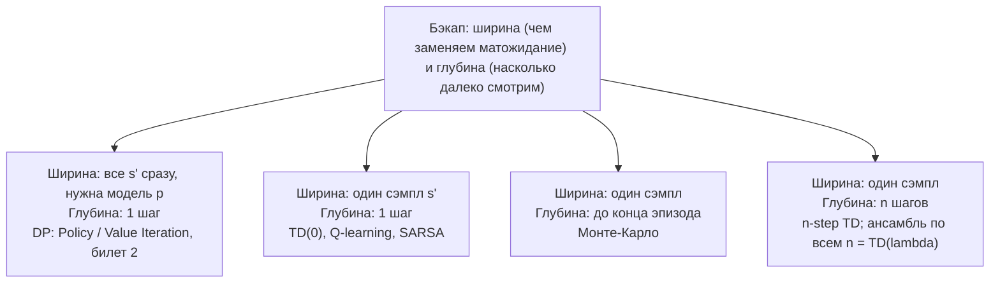

# Вопрос 3. Табличные методы: Монте-Карло, Q-learning.

> **Источники:** лекция 3 (`Slides/RL_MIPT_Lecture_3.pdf`), конспект [1] (Иванов, «Reinforcement Learning Textbook») § 3.4 «Табличные алгоритмы» (стр. 62–72), § 3.5 «Bias-Variance Trade-Off» (стр. 73–84), приложение A.3 «Сходимость Q-learning» (стр. 234–236). Для сверки — Sutton & Barto, гл. 5, 6, 12.
> **Пререквизиты:** [Основы: MDP](00-osnovy.md#mdp), [функции ценности](00-osnovy.md#value), [оценка Монте-Карло](00-osnovy.md#expectation-mc), [on-policy vs off-policy](00-osnovy.md#onoff-policy), [exploration](00-osnovy.md#exploration).
> **Связанные билеты:** [Билет 2](02-bellman-pi-vi.md) — уравнения Беллмана, сжимающие операторы, Policy/Value Iteration; [Билет 4](04-dqn.md) — что делать, когда таблица не помещается в память (DQN); [Билет 10](10-bias-variance-ppo.md) — bias-variance trade-off как концепция и оценка GAE; [Билет 14](14-bandits.md) — exploration в чистом виде (бандиты, UCB, Томпсон).

[TOC]

## 1. Зачем это нужно и где стоит в курсе

В [билете 2](02-bellman-pi-vi.md) мы решали MDP **точно**: зная динамику $p(s' \mid s,a)$ и награду $r(s,a)$, выписывали уравнения Беллмана, доказывали сжимаемость оператора Беллмана и итерировали Policy Iteration или Value Iteration. У этого два ограничения. Первое: надо хранить таблицу $|\mathcal{S}| \times |\mathcal{A}|$ и перебирать все состояния — лечится нейросетями, [билет 4](04-dqn.md). Второе, принципиальное: **надо знать $p(s' \mid s, a)$**. Его мы и лечим здесь.

Причём дело не в том, что динамику нельзя выучить. Дело в том, что в уравнении Беллмана стоит матожидание $\mathbb{E}_{s' \sim p(s' \mid s,a)}$, и в среде с астрономическим числом состояний этот интеграл никто не возьмёт — его можно только **оценить по сэмплам**. Отсюда рецепт всего билета: взять формулы динамического программирования и всюду заменить матожидания на сэмплы реального взаимодействия со средой.

!!! note Интуиция
    Model-based подход — «изучить правила игры, а потом посчитать оптимальную стратегию за столом». Model-free — «правил не знаю, но сыграл тысячу партий и запомнил, какие ходы в каких позициях ведут к победе». Второй путь тупее, зато не требует ничего, кроме опыта: набора переходов $(s, a, r, s')$.

Место в карте курса: **value-based** методы, самая базовая их ветка. Учим оценочную функцию, стратегию получаем из неё жадно. Монте-Карло — model-free версия Policy Iteration, Q-learning — model-free версия Value Iteration. Дальше из Q-learning вырастет DQN ([билет 4](04-dqn.md)), а из многошаговых оценок — GAE и PPO ([билет 10](10-bias-variance-ppo.md)).

## 2. Постановка задачи и обозначения

Дан MDP $(\mathcal{S}, \mathcal{A}, p, r, \gamma)$ с **конечными** $\mathcal{S}$ и $\mathcal{A}$ (иначе таблицу не завести). Динамика $p(s'\mid s,a)$ и, вообще говоря, $r(s,a)$ **неизвестны**. Всё, что агент умеет: находясь в $s$, выбрать $a$, получить $r$ и один сэмпл $s' \sim p(s'\mid s,a)$. Доступ жёсткий: сэмпл ровно один, следующий придётся брать уже из $s'$ — «перемотать назад» среду нельзя.

Ищем ту же оптимальную стратегию $\pi^*$, что и в [билете 2](02-bellman-pi-vi.md). Напомню оттуда ровно то, что понадобится:

$$
Q^\pi(s,a) = \mathbb{E}_{s'}\big[\,r(s,a) + \gamma\, \mathbb{E}_{a' \sim \pi} Q^\pi(s',a')\,\big],
\qquad
Q^*(s,a) = \mathbb{E}_{s'}\big[\,r(s,a) + \gamma \max_{a'} Q^*(s',a')\,\big].
$$

Первое — уравнение оценивания политики (неподвижная точка сжимающего оператора $\mathcal{T}^\pi$), второе — уравнение оптимальности (неподвижная точка $\mathcal{T}^*$). Жадная по $Q^*$ стратегия оптимальна, policy improvement по $Q^\pi$ не ухудшает стратегию. Доказательства — [билет 2](02-bellman-pi-vi.md).

Ключевой момент: работаем с $Q$, а не с $V$. Причина — policy improvement: чтобы взять $\operatorname*{argmax}_a$, при $V$-функции нужна модель среды (заглянуть на шаг вперёд), а при $Q$-функции достаточно посмотреть в строку таблицы.

Обозначения: $\alpha \in [0,1]$ — learning rate (параметр экспоненциального сглаживания), $\varepsilon$ — параметр $\varepsilon$-жадности, $G_t = \sum_{k \ge 0}\gamma^k r_{t+k}$ — return (reward-to-go), $\delta$ — временная разность, $\lambda \in [0,1]$ — параметр затухания следа, $\mathcal{D}$ — реплей-буфер.

## 3. Основная теория

### 3.1. Монте-Карло оценивание

Матожидание оцениваем усреднением сэмплов ([Основы](00-osnovy.md#expectation-mc)). По определению $Q^\pi(s,a) = \mathbb{E}[G_t \mid s_t = s, a_t = a]$, значит:

$$
Q^\pi(s,a) \approx \frac{1}{N}\sum_{i=1}^{N} R(\tau_i), \qquad \tau_i \sim \pi \mid s_0 = s,\ a_0 = a,
$$

где $R(\tau_i)$ — суммарная дисконтированная награда траектории, стартовавшей из $(s,a)$ и доигранной до конца. На практике эпизоды не стартуют специально из каждой пары: играем эпизод, а потом для **каждой** встретившейся пары считаем reward-to-go от момента посещения и берём это число как сэмпл. Такое обновление — **МК-бэкап (Monte-Carlo backup)**: «бэкап ширины один» бесконечной длины (один сэмпл будущего, зато до самого конца).

**First-visit vs every-visit.** Если пара $(s,a)$ встретилась в эпизоде несколько раз, берут все сэмплы (**every-visit**) или только первый (**first-visit**). Every-visit удобнее, но сэмплы из одного эпизода скоррелированы: покрутившись в петле и получив $+1$, агент насчитает $\gamma^5, \gamma^4, \gamma^3, \dots$ — одно событие, посчитанное пять раз. Независимость сэмплов даёт first-visit; на практике сходятся оба.

**MC-control.** Схема Generalized Policy Iteration: оценили $Q^{\pi_k}$ по Монте-Карло → улучшили $\pi_{k+1}(s) = \operatorname*{argmax}_a Q(s,a)$ → снова собрали эпизоды. Тонкость: точное $Q^{\pi_k}$ за конечное время не получить, поэтому improvement делается по недосчитанной оценке, с потерей части гарантий.

**Почему МК on-policy.** Сэмпл $G_t$ — награда, набранная конкретной стратегией $\pi$, которая играла эпизод, и оцениваем мы именно $Q^\pi$ для неё. Как только стратегия изменилась, старые эпизоды стали сэмплами «не из того распределения» ([Основы, §on/off-policy](00-osnovy.md#onoff-policy)).

!!! warning Чем плох Монте-Карло
    1) Нужен конец эпизода — в неэпизодичных средах неприменим. 2) Огромная дисперсия: сэмплами заменены **все** матожидания. 3) Не используем структуру задачи: получив сэмпл $+100$, мы «забыли», какая часть пришла сразу после $a$, а какая — через сто шагов. 4) Теряем информацию о связях состояний: если две траектории пересеклись, марковость даёт больше, чем два независимых числа. 5) Если $\pi(a\mid s)=0$, про $Q^\pi(s,a)$ не узнаем ничего — а именно эти значения нужны для improvement.

### 3.2. Инкрементальное среднее и экспоненциальное сглаживание

Хранить всю историю расточительно; обычное среднее $m_k = \frac{1}{k}\sum_{i=1}^k x_i$ переписывается рекуррентно:

$$
m_k = \frac{k-1}{k}m_{k-1} + \frac{1}{k}x_k = (1-\alpha_k)\,m_{k-1} + \alpha_k x_k, \qquad \alpha_k := \tfrac{1}{k}.
$$

**Определение.** *Экспоненциальное сглаживание (exponential smoothing)* — оценка $m_k := (1-\alpha_k)m_{k-1} + \alpha_k x_k$ с произвольным $m_0$ и последовательностью learning rate $\alpha_k \in [0,1]$.

Смысл обобщения: при $\alpha_k > 1/k$ свежие сэмплы получают больший вес. Это и нужно в GPI: после improvement старые сэмплы пришли от предыдущей стратегии — они «слегка неправильные», но выбрасывать их жалко. Эквивалентная форма $m_k = m_{k-1} + \alpha_k(x_k - m_{k-1})$ — шаг градиентного спуска по MSE-лоссу $\frac12(m - x_k)^2$, то есть SGD ([Основы](00-osnovy.md#gradient)).

### 3.3. Условия Роббинса–Монро и стохастическая аппроксимация

При каких $\alpha_k$ сглаживание всё ещё сходится к среднему?

**Определение.** Learning rate $\alpha_k \in [0,1]$ удовлетворяет **условиям Роббинса–Монро (Robbins–Monro conditions)**, если

$$
\sum_{k \ge 0} \alpha_k = +\infty, \qquad \sum_{k \ge 0} \alpha_k^2 < +\infty.
$$

**Теорема.** Пусть $x_k$ независимы, $\mathbb{E}x_k = m$, $\mathrm{Var}\,x_k \le C < \infty$, $m_0$ произвольно, $\alpha_k$ удовлетворяют условиям Роббинса–Монро. Тогда $m_k \to m$ с вероятностью 1.

!!! tip Интуиция двух условий
    Первое ($\sum\alpha_k = \infty$) — «шагов хватит, чтобы дойти»: как бы плохо ни выбрали $m_0$, суммарная длина шагов бесконечна. Второе ($\sum\alpha_k^2 < \infty$) — «шум затухнет»: шаги убывают достаточно быстро, чтобы дисперсия оценки сошлась к нулю, а не дрожала вокруг ответа вечно. Обоим условиям удовлетворяет $\alpha_k = 1/k$; не удовлетворяют $\alpha_k = \mathrm{const}$ (нарушено второе) и $\alpha_k = 1/k^2$ (нарушено первое).

Идея доказательства: запишем $m_k - m = (1-\alpha_k)(m_{k-1}-m) + \alpha_k(x_k - m)$. Возводим в квадрат и берём матожидание; перекрёстное слагаемое обнуляется, так как $x_k$ не зависит от $m_{k-1}$ и $\mathbb{E}(x_k - m) = 0$. Для $v_k := \mathbb{E}(m_k-m)^2$ получаем

$$
v_k = (1-\alpha_k)^2 v_{k-1} + \alpha_k^2\,\mathrm{Var}\,x_k .
$$

Отсюда $v_k$ ограничена и имеет предел (тут работает $\sum\alpha_k^2<\infty$: вклад шума суммируем), а положительным он быть не может, иначе ряд $\sum\alpha_k v_k$ расходился бы из-за $\sum\alpha_k=\infty$.

**Стохастическая аппроксимация.** Обобщим: пусть надо решить уравнение

$$
x = \mathbb{E}_{\xi \sim p(\xi)} f(x, \xi),
$$

где $\xi$ — случайность среды (здесь это будет пара $(s',a')$), распределение $p(\xi)$ неизвестно (есть только сэмплы), а $f$ при данных $x$ и $\xi$ мы считать умеем. Букву $\xi$ берём, чтобы не путать её с параметром $\varepsilon$-жадности. Соединяем метод простой итерации ($x_k := f(x_{k-1})$, работает для сжатий) со сглаживанием: подставляем текущее приближение в правую часть, но не заменяем им $x$ жёстко:

$$
x_k = (1-\alpha_k)x_{k-1} + \alpha_k f(x_{k-1}, \xi_k) = x_{k-1} + \alpha_k\big(f(x_{k-1},\xi_k) - x_{k-1}\big), \qquad \xi_k \sim p(\xi).
$$

Вторая форма — буквально SGD: $f(x_{k-1},\xi_k) - x_{k-1}$ играет роль «стохастического градиента», в точке решения $x^*$ его матожидание равно нулю.

**Главное наблюдение билета:** оба уравнения Беллмана из § 2 имеют в точности вид «$x$ = матожидание по неизвестному распределению от функции, которую мы умеем считать». Значит, их можно решать стохастической аппроксимацией.

!!! info Чего так сделать нельзя
    Уравнение $V^*(s) = \max_a\big[r(s,a) + \gamma\mathbb{E}_{s'}V^*(s')\big]$ имеет форму «максимум от матожидания», а не «матожидание от чего-то»; сэмплом $\max$ снаружи не оценишь. Ещё одна причина учить $Q$, а не $V$.

### 3.4. Temporal Difference

Применяем рецепт к уравнению оценивания. Из $s$ выполнили $a$, получили $r$ и $s'$, сгенерировали $a' \sim \pi$; строим **таргет (Bellman target)** $y := r + \gamma Q(s',a')$ и сглаживаем с ним текущую ячейку:

$$
Q_{k+1}(s,a) \leftarrow Q_k(s,a) + \alpha_k\big(\underbrace{r + \gamma Q_k(s',a')}_{\text{таргет}} - Q_k(s,a)\big).
$$

Выражение в скобках $\delta := r + \gamma Q(s',a') - Q(s,a)$ — **временная разность (temporal difference, TD-ошибка)**: отличие пришедшего сэмпла от текущей оценки среднего.

**Бутстрапирование (bootstrapping).** В отличие от МК, здесь всё будущее после первого шага заменено нашей же текущей аппроксимацией: «тянем себя за волосы из болота», делая сэмплы из уже имеющихся сэмплов. Корректным сэмплом $Q^\pi(s,a)$ такой псевдосэмпл не является, но он **чуть лучше** текущей оценки — в нём раскрыт один реальный шаг дерева, настоящие $r$ и $s'$. Движение в сторону чуть более правильного и есть обучение.

!!! example Пример про кафе (из конспекта)
    Вы в кафе ($s$) и хотите домой; оценка $-Q(s,a) = 30$ минут. Тратите минуту на выход ($-r = 1$) и видите пробку ($s'$), новая оценка $-Q(s',a') = 40$ минут. Монте-Карло сказал бы: «засеки время до дома и потом уточни прогноз». TD говорит: ошибка уже случилась и равна $41 - 30 = 11$ минут — оценка «30» занижена, подвинем её чуть-чуть вверх, не дожидаясь конца поездки.

**Какие переходы годятся для обновления?** Схема решает $Q(s,a) = \mathbb{E}_{s'}\mathbb{E}_{a'} y$, поэтому требований ровно два: $s' \sim p(s'\mid s,a)$ (иначе учим $Q$ для другого MDP) и $a' \sim \pi(a'\mid s')$ (иначе — для другой стратегии). И **никаких** требований на то, откуда взялись сами пары $(s,a)$ и в каком порядке они обновляются. Эта дырка и позволит учиться не с онлайн-опыта.

### 3.5. MC vs TD

| | Монте-Карло | TD(0) |
|---|---|---|
| Таргет | $G_t = r + \gamma r' + \gamma^2 r'' + \dots$ | $r + \gamma Q(s',a')$ |
| Смещение | несмещённая оценка $Q^\pi$ | смещённая (бутстрап) |
| Дисперсия | огромная (сэмплируется весь хвост) | малая (случайность только от $s', a'$) |
| Нужен конец эпизода | да | нет, работает и в неэпизодичных средах |
| Когда обновляем | в конце эпизода | после каждого шага (online) |
| Распространение сигнала | быстрое: $+1$ разом уходит во все пары эпизода | медленное: за одно обновление на один шаг назад |
| Использует марковость | нет | да |

Выбор между «нет смещения, но большая дисперсия» и «мало дисперсии, но есть смещение» — это **bias-variance trade-off**; здесь мы фиксируем факт, разбор — [Основы](00-osnovy.md#bias-variance) и [билет 10](10-bias-variance-ppo.md).



### 3.6. Q-learning, SARSA, Expected SARSA

Точное $Q^\pi$ мы не получим никогда, значит improvement всё равно придётся делать «досрочно». А что, если после **каждого** шага? Тогда $\pi_k(s) = \operatorname*{argmax}_a Q_k(s,a)$, и таргет сворачивается:

$$
y = r + \gamma Q_k(s', a') = r + \gamma Q_k\big(s', \operatorname*{argmax}_{a'} Q_k(s',a')\big) = r + \gamma \max_{a'} Q_k(s',a').
$$

Это стохастическая аппроксимация **уравнения оптимальности**, то есть model-free Value Iteration — **Q-learning**:

$$
Q_{k+1}(s,a) \leftarrow Q_k(s,a) + \alpha_k\Big(r + \gamma\max_{a'}Q_k(s',a') - Q_k(s,a)\Big).
$$

А если оставить в таргете то самое $a'$, которое агент реально сыграл в среде, получаем **SARSA** (название от пятёрки $s,a,r,s',a'$):

$$
Q(s,a) \leftarrow Q(s,a) + \alpha\big(r + \gamma Q(s',a') - Q(s,a)\big).
$$

**Почему Q-learning off-policy, а SARSA — нет.** В Q-learning действие $a'$ **не берётся из данных, а вычисляется** по текущей таблице (это и есть $\max_{a'}$). Из данных нужен только переход $(s,a,r,s')$, а требование «$a'$ из целевой политики» выполнено автоматически, ведь целевая политика — жадная. Значит, данные могла собрать любая стратегия: старая версия нас самих, эксперт, кто угодно. В SARSA $a'$ берётся из траектории, и мы учим $Q^\mu$ для той стратегии $\mu$, которая его выбрала: целевая (target policy) и поведенческая (behavior policy) обязаны совпадать.

**Что off-policy даёт.** Обучение с **реплей-буфера (replay buffer)** — памяти всех переходов $(s,a,r,s',\text{done})$. Формально Q-learning на фиксированном буфере выучит $Q^*$ для **эмпирического MDP** с динамикой $\hat p(s'\mid s,a) = N(s,a,s')/N(s,a)$, и чем больше буфер, тем ближе $\hat p$ к настоящему $p$. Практическая ценность: сбор данных и обучение — независимые процессы, каждый переход переиспользуется сколько угодно раз, можно учиться на чужих траекториях ([Основы](00-osnovy.md#onoff-policy)). SARSA с буфером бессмысленна: каждый сэмпл тянул бы $Q$ к ценности той древней стратегии, которая его породила.

**Expected SARSA.** Матожидание по $a'$ можно взять честно, сбив лишнюю дисперсию:

$$
Q(s,a) \leftarrow Q(s,a) + \alpha\big(r + \gamma\, \mathbb{E}_{a'\sim\pi}Q(s',a') - Q(s,a)\big),
\quad
\mathbb{E}_{a'\sim\pi}Q(s',a') = (1-\varepsilon)\max_{a'}Q(s',a') + \frac{\varepsilon}{|\mathcal{A}|}\sum_{a'}Q(s',a').
$$

Вопреки названию, работает с четвёрками $(s,a,r,s')$, а не с пятёрками.

**К чему сходится SARSA.** При фиксированном $\varepsilon$ — не к $Q^*$: внутри её оценочной функции сидит знание «в будущем я тоже буду с вероятностью $\varepsilon$ дёргаться случайно». Предел — $Q^*_{\varepsilon\text{-soft}}$, оптимум в классе $\varepsilon$-мягких стратегий ($\pi(a\mid s) \ge \varepsilon/|\mathcal{A}|$), удовлетворяющий уравнению

$$
Q^*_{\varepsilon\text{-soft}}(s,a) = r(s,a) + \gamma\,\mathbb{E}_{s'}\Big[(1-\varepsilon)\max_{a'}Q^*_{\varepsilon\text{-soft}}(s',a') + \frac{\varepsilon}{|\mathcal{A}|}\sum_{a'}Q^*_{\varepsilon\text{-soft}}(s',a')\Big].
$$

!!! example Cliff Walking — классический пример на экзамене
    Сетка, вдоль нижнего края — обрыв с лавой (огромный штраф, эпизод обрывается), в углу — цель ($+1$). Кратчайший путь идёт вплотную вдоль обрыва.
    **Q-learning** выучит именно его: таргет считает, что в будущем агент действует жадно и в лаву не шагнёт. Но по ходу обучения агент каждый шаг кидает монетку и с вероятностью $\varepsilon$ сваливается в лаву — оптимальную стратегию он знает, а награды набирает меньше.
    **SARSA** учитывает собственную $\varepsilon$-дёрганность: ценность клеток у края падает из-за риска случайного шага вниз, и выучивается безопасный обходной маршрут. Для реального робота это часто предпочтительнее.

### 3.7. Exploration: без него ничего не сходится

**Утверждение.** Собирая траектории жадной стратегией, есть риск не сойтись к оптимальной. Пример: два действия — «взять приз» ($+100$) и «тупить в стену» ($0$), после любого игра кончается. Инициализировали $Q_0(\text{приз}) = -1$, $Q_0(\text{стена}) = +1$. Жадный агент выбирает стену, сглаживает $0$ с $+1$, получает $Q(\text{стена}) \ge 0 > -1 = Q(\text{приз})$ — и больше никогда не попробует приз.

Причина: детерминированные стратегии не дают **infinite visitation** — многие пары $(s,a)$ никогда не встречаются. Зато любая стратегия с $\mu(a\mid s) > 0$ его обеспечивает: до любого достижимого $s$ ведёт цепочка действий, и каждое её звено такая стратегия выберет с ненулевой вероятностью. Способы сделать жадную стратегию стохастичной:

- **$\varepsilon$-жадная ($\varepsilon$-greedy)**: с вероятностью $\varepsilon$ играем $a \sim \mathrm{Uniform}(\mathcal{A})$, иначе $\operatorname*{argmax}_a Q(s,a)$. Проста и применяется повсеместно, но исследует «слепо»: не различает «чуть хуже жадного» и «катастрофа».
- **Больцмановская с температурой $\tau$**: $\mu(a\mid s) = \mathrm{softmax}_a\big(Q(s,a)/\tau\big)$. Редко выбирает совсем плохие действия, но чувствительна к масштабу $Q$ и требует настройки $\tau$.

Чисто случайная стратегия теоретически годится, но неэффективна: случайная игра в Mario доберётся до второго уровня за экспоненциальное время. Exploration — корректный, но неэффективный способ генерации данных, exploitation — эффективный, но «некорректный». Отсюда **затухание $\varepsilon$**, формализуемое условием **GLIE (Greedy in the Limit with Infinite Exploration)**: (а) каждая пара $(s,a)$ посещается бесконечно часто; (б) стратегия в пределе становится жадной, например $\varepsilon_k = 1/k$. Для Q-learning нужен только пункт (а) — он учит $Q^*$ при любой достаточно исследующей поведенческой политике; для SARSA нужны оба, иначе она сойдётся к $Q^*_{\varepsilon\text{-soft}}$. Подробнее — [Основы](00-osnovy.md#exploration) и [билет 14](14-bandits.md).

### 3.8. Сходимость Q-learning

**Теорема.** Пусть $\mathcal{S}$ и $\mathcal{A}$ конечны, $Q_0$ произвольно, и на шаге $k$ обновление имеет вид

$$
Q_{k+1}(s,a) := Q_k(s,a) + \alpha_k(s,a)\Big(r(s,a) + \gamma\max_{a'}Q_k\big(s'_k(s,a), a'\big) - Q_k(s,a)\Big),
$$

где $s'_k(s,a) \sim p(s'\mid s,a)$, а случайные $\alpha_k(s,a)\in[0,1]$ с вероятностью 1 удовлетворяют условиям Роббинса–Монро **для каждой пары** $(s,a)$. Тогда $Q_k \to Q^*$ с вероятностью 1.

Требование «$\sum_k \alpha_k(s,a) = \infty$ для каждой пары» — формальная запись infinite visitation: если на шаге $k$ обновляется одна ячейка, то $\alpha_k(s,a) \ne 0$ только для неё, и ряд разойдётся, лишь если пара обновляется бесконечно часто.

!!! info Идея доказательства (приложение A.3) — одного абзаца достаточно
    Строится вспомогательный MDP — **Action Replay Process (ARP)**. Запишем всю историю запуска Q-learning «на карточках»: на $k$-й карточке для каждой пары $(s,a)$ лежат использованный сэмпл $s'_k(s,a)$ и коэффициент $\alpha_k(s,a)$. Состояние ARP — пара $(s, n)$, где $n$ — номер карточки; из $(s,n,a)$ с вероятностью $\alpha_{n-1}(s,a)$ «останавливаемся» и переходим в $(s'_{n-1}(s,a),\, n-1)$, иначе снимаем карточку и повторяем бросок; на нулевой карточке игра кончается с наградой $Q_0(s,a)$. Дальше два факта. Первый: по индукции $Q^*_{\mathrm{ARP}}(s,n,a) = Q_n(s,a)$ — динамика ARP построена ровно так, чтобы уравнение Беллмана для неё совпало с формулой обновления Q-learning. Второй: $p_{\mathrm{ARP}}(s'\mid s,n,a) \to p(s'\mid s,a)$, потому что эта вероятность сама удовлетворяет рекурренте экспоненциального сглаживания для индикаторов $\mathbb{I}[s'_n(s,a) = s']$, а их матожидание и есть $p(s'\mid s,a)$. Значит, при больших $n$ ARP всё больше похож на настоящий MDP, и его оптимальная $Q$-функция (то есть $Q_n$) стремится к $Q^*$. Альтернативный путь — общая теорема о стохастической аппроксимации неподвижной точки сжатия: $\mathcal{T}^*$ — $\gamma$-сжатие ([билет 2](02-bellman-pi-vi.md)), шум таргета центрирован, шаги удовлетворяют Роббинсу–Монро.

### 3.9. n-step TD, eligibility traces, TD(λ)

TD(0) и МК — крайности; промежуточный вариант — заглянуть на $n$ шагов вперёд:

$$
G_t^{(n)} = r_t + \gamma r_{t+1} + \dots + \gamma^{n-1}r_{t+n-1} + \gamma^n V(s_{t+n}),
\qquad V(s_t) \leftarrow V(s_t) + \alpha\big(G_t^{(n)} - V(s_t)\big).
$$

При $n \to \infty$ это МК, при $n=1$ — TD(0). С ростом $n$ больше матожиданий заменяется сэмплами (дисперсия растёт), но смещённое слагаемое $V(s_{t+n})$ домножается на $\gamma^n$ (смещение падает), и сигнал распространяется в $n$ раз быстрее. Схема корректна: $V^\pi$ — неподвижная точка $n$-шагового уравнения Беллмана при любом $n$. Сам компромисс разбирается в [билете 10](10-bias-variance-ppo.md).

Недостаток $n$-step: гиперпараметр имеет смысл времени, что странно в стационарной задаче. Лучше взять **все** $n$ сразу: раз $V^\pi$ — неподвижная точка каждого $n$-шагового уравнения, она неподвижная точка и их выпуклой комбинации. Это **λ-return**:

$$
G_t^\lambda = (1-\lambda)\sum_{n \ge 1}\lambda^{n-1} G_t^{(n)}, \qquad \lambda \in [0,1].
$$

Множитель $(1-\lambda)$ нормирует веса в единицу; $\lambda = 0$ даёт TD(0), $\lambda = 1$ — Монте-Карло. Это **forward view**: «зная будущее, выдаём кредит настоящему». **Backward view** делает наоборот — используя настоящее, обновляет прошлое; ключевое тождество в том, что $n$-шаговая ошибка $\Psi^{(n)}(s_t) := G^{(n)}_t - V(s_t)$ есть сумма дисконтированных одношаговых TD-ошибок:

$$
\Psi^{(n)}(s_t) = \sum_{k=0}^{n-1}\gamma^k \delta_{t+k}, \qquad \delta_t := r_t + \gamma V(s_{t+1}) - V(s_t).
$$

Проверяется телескопированием: в сумме $\sum_k \gamma^k\big(r_{t+k} + \gamma V(s_{t+k+1}) - V(s_{t+k})\big)$ все промежуточные $V$ взаимно уничтожаются, остаются награды, хвост $\gamma^n V(s_{t+n})$ и $-V(s_t)$.

Значит, ждать $n$ шагов не нужно: свежую одношаговую ошибку можно на каждом шаге добавлять ко **всем** ранее посещённым состояниям с подходящим весом. Вес хранится в векторе **следов (eligibility traces)**:

$$
e_t(s) = \gamma\lambda\, e_{t-1}(s) + \mathbb{I}[s = s_t], \qquad V(s) \leftarrow V(s) + \alpha\, e_t(s)\,\delta_t \quad \text{для всех } s.
$$

При $\lambda = 1$ след тухнет только в $\gamma$ раз (эквивалент МК, но онлайн — работает и в неэпизодичных средах), при $\lambda = 0$ обнуляется мгновенно (обычный TD(0)). Смысл $e_t(s)$ — «степень ответственности» решений, принятых в $s$, за происходящее сейчас: мелом на стене написали «я здесь был», и надпись выцветает со скоростью $\gamma\lambda$.

**Теорема (эквивалентность форм).** Если копить обновления и применять их в конце эпизода, то суммарная поправка к ячейке $V(s_t)$, накопленная следами, равна $\alpha\sum_{k\ge0}(\gamma\lambda)^k\delta_{t+k} = \alpha\big(G_t^\lambda - V(s_t)\big)$ — ровно то обновление, которое предписывает forward view. Параметр $\lambda$ непрерывен и не имеет смысла времени, поэтому подбирается легче, чем $n$; и даже при $\lambda < 1$ в оценку попадает информация о далёкой награде.

!!! warning Многошаговые оценки требуют on-policy
    В $n$-шаговом таргете неявно сэмплируются $a' \sim \pi$, $s'' \sim p(\cdot\mid s',a')$ и так далее. Из буфера их не достать: там $a'$ выбран старой стратегией, а своё $a'$ сгенерировать можно, но соответствующего $s''$ никто не даст. Off-policy коррекция многошаговых таргетов существует — **Retrace(λ)**: следы домножаются на обрезанные отношения правдоподобия $\min\!\big(1, \pi(a\mid s)/\mu(a\mid s)\big)$, что «схлопывает» оценку в одношаговую там, где политики разошлись. См. [билет 4](04-dqn.md) и [билет 10](10-bias-variance-ppo.md).

## 4. Алгоритмы

**MC-control (every-visit, с экспоненциальным сглаживанием):**

```text
Гиперпараметры: alpha, epsilon
1. Инициализируем Q(s,a) произвольно для всех s, a
2. Повторяем:
3.   играем эпизод s_0, a_0, r_0, ..., s_T, действия из eps-greedy(Q)
4.   G := 0
5.   для t = T-1, T-2, ..., 0 (идём с конца эпизода):
6.       G := r_t + gamma * G                      # reward-to-go
7.       Q(s_t, a_t) <- Q(s_t, a_t) + alpha * (G - Q(s_t, a_t))
8.   (improvement неявный: eps-greedy строится по обновлённой Q)
```

**SARSA (on-policy TD control):**

```text
Гиперпараметры: alpha, epsilon
1. Инициализируем Q(s,a) произвольно
2. Наблюдаем s_0, выбираем a_0 ~ eps-greedy(Q(s_0, .))
3. На шаге k = 0, 1, 2, ...:
4.   играем a_k, наблюдаем r_k, s_{k+1}
5.   выбираем a_{k+1} ~ eps-greedy(Q(s_{k+1}, .))
6.   Q(s_k, a_k) <- Q(s_k, a_k) + alpha * (r_k + gamma*(1-done)*Q(s_{k+1}, a_{k+1}) - Q(s_k, a_k))
```

**Q-learning (off-policy TD control, с реплей-буфером):**

```text
Гиперпараметры: alpha, epsilon
1. Инициализируем Q(s,a) произвольно, буфер D пуст
2. Наблюдаем s_0
3. На шаге k = 0, 1, 2, ...:
4.   с вероятностью eps играем a_k ~ Uniform(A), иначе a_k = argmax_a Q(s_k, a)
5.   наблюдаем r_k, s_{k+1}, done
6.   кладём (s_k, a_k, r_k, s_{k+1}, done) в D
7.   сэмплируем случайный переход (s, a, r, s', done) из D
8.   y := r + gamma * (1 - done) * max_{a'} Q(s', a')
9.   Q(s,a) <- Q(s,a) + alpha * (y - Q(s,a))
```

Шаги 4–6 (сбор) и 7–9 (обучение) независимы: можно делать несколько шагов сбора на одно обновление, наоборот, или крутить их параллельно. В классическом табличном Q-learning шаги 6–7 убираются и обновляется только что собранный переход.

!!! tip Про флаг done
    В терминальном состоянии оценочная функция равна нулю. Мнемоника: `done` — часть дисконтирования, множитель $(1-\text{done})$ ставится всюду, где стоит $\gamma$. Забыть его — самая частая ошибка в реализации.

| Алгоритм | Таргет | On/off-policy | К чему сходится | Реплей-буфер |
|---|---|---|---|---|
| MC-control | $G_t$ | on-policy | $Q^*$ при GLIE | нет |
| SARSA | $r + \gamma Q(s',a')$ | on-policy | $Q^*_{\varepsilon\text{-soft}}$ (при GLIE — $Q^*$) | нет |
| Expected SARSA | $r + \gamma\mathbb{E}_{a'\sim\pi}Q(s',a')$ | on-policy (при $\pi\ne\mu$ — off) | то же, дисперсия меньше | ограниченно |
| Q-learning | $r + \gamma\max_{a'}Q(s',a')$ | off-policy | $Q^*$ | да |

## 5. Пример с числами

Коридор $A \to B \to C \to G$, где $G$ — терминальная цель. Действие «вправо» детерминированно переводит в следующую клетку; награда $0$ всюду, кроме входа в $G$, где $+1$. Берём $\gamma = 0.9$, $\alpha = 0.5$, таблицу инициализируем нулями. Агент прошёл эпизод $(A,\rightarrow,0,B),\ (B,\rightarrow,0,C),\ (C,\rightarrow,1,G)$.

**Одно обновление Монте-Карло.** Считаем reward-to-go с конца:

- $G(C,\rightarrow) = 1$;
- $G(B,\rightarrow) = 0 + 0.9 \cdot 1 = 0.9$;
- $G(A,\rightarrow) = 0 + 0.9\cdot 0 + 0.81 \cdot 1 = 0.81$.

Обновление для $A$: $Q(A,\rightarrow) \leftarrow 0 + 0.5\,(0.81 - 0) = \mathbf{0.405}$. Аналогично $Q(B,\rightarrow) = 0.45$, $Q(C,\rightarrow) = 0.5$. **Одним эпизодом сигнал долетел до всех трёх состояний.**

**Те же данные в Q-learning** (обновляем переходы в порядке поступления):

- $(A,\rightarrow,0,B)$: таргет $= 0 + 0.9\cdot\max_a Q(B,a) = 0$, обновление $Q(A,\rightarrow) \leftarrow 0 + 0.5(0-0) = 0$;
- $(B,\rightarrow,0,C)$: таргет $= 0$, тоже ничего;
- $(C,\rightarrow,1,G)$: $G$ терминально, $\max_a Q(G,a) = 0$, таргет $=1$, и $Q(C,\rightarrow) \leftarrow 0 + 0.5(1-0) = \mathbf{0.5}$.

**За весь эпизод сигнал сдвинулся ровно на один шаг назад.** Только во втором эпизоде обновится $B$ (таргет $0.9\cdot 0.5 = 0.45$, значит $Q(B,\rightarrow) \leftarrow 0.225$), и лишь в третьем — $A$. Это и есть проблема распространения сигнала: чтобы протащить награду на 100 шагов, одношаговому методу нужно порядка 100 проходов. Зато таргет TD дёргается меньше: если бы среда в половине случаев уводила из $A$ в тупик, сэмплы МК прыгали бы между $0.81$ и $0$, а таргет TD смотрел бы на усреднённое $Q(B,\cdot)$.

## 6. Подводные камни, сравнения, типичные ошибки

!!! warning Константный learning rate и забытый exploration
    Константный learning rate нарушает второе условие Роббинса–Монро: строгой сходимости к $Q^*$ нет, оценка вечно «дрожит» вокруг ответа с амплитудой порядка $\alpha$. На практике так почти всегда и делают (среда нестационарна, забывать старое полезно), но это осознанный отказ от гарантий. Второе типовое место — жадный сбор данных: «каждая пара обновляется бесконечно часто» не формальность, а требование исследовать (пример со стеной из § 3.7).

!!! warning Перепутать, что где сходится, и SARSA с буфера
    «SARSA и Q-learning сходятся к одному и тому же» — неверно: при фиксированном $\varepsilon$ Q-learning идёт к $Q^*$, SARSA — к $Q^*_{\varepsilon\text{-soft}}$; совпадут они только при $\varepsilon \to 0$ по GLIE. И не запускайте SARSA с реплей-буфера: на буфере эксперта она выучит $Q^{\pi_{\text{expert}}}$ (ещё осмысленно), а на собственной старой истории — бессмыслицу.

!!! warning Максимизационное смещение (maximization bias)
    $\mathbb{E}[\max_a \hat{Q}] \ge \max_a \mathbb{E}[\hat{Q}]$ — оператор $\max$ в таргете систематически завышает оценки, подхватывая случайно завышенные шумом ячейки. Лечится Double Q-learning: две таблицы, одна выбирает argmax, другая его оценивает. Развитие — Double DQN, [билет 4](04-dqn.md).

**Когда табличные методы не работают.** Когда $|\mathcal{S}|$ велико или состояния непрерывны: таблица не помещается в память, ячейки обновляются независимо (обобщения между похожими состояниями нет), а посетить все пары бесконечно часто невозможно. Ответ — заменить таблицу на $Q$-сеть, [билет 4](04-dqn.md); гарантии § 3.8 при этом теряются: сжатие $\mathcal{T}^*$ плюс проекция на класс нейросетей уже не обязано быть сжатием.

## 7. Ответ за 5 минут

1. **Задача:** тот же MDP, что в [билете 2](02-bellman-pi-vi.md), но $p(s'\mid s,a)$ неизвестна, доступен только опыт. Матожидания в уравнениях Беллмана заменяем сэмплами. Учим $Q$, а не $V$: по $Q$ improvement делается без модели.
2. **Монте-Карло:** $Q^\pi(s,a) \approx \frac1N\sum_i R(\tau_i)$, таргет — reward-to-go $G_t$, оценка несмещённая. First-visit / every-visit. Минусы: нужен конец эпизода, огромная дисперсия.
3. **Экспоненциальное сглаживание** $m_k = (1-\alpha_k)m_{k-1} + \alpha_k x_k$ (обобщение инкрементального среднего): историю хранить не надо, свежим сэмплам можно дать больший вес. Сходится к $\mathbb{E}x$ п.н. при условиях **Роббинса–Монро** $\sum\alpha_k = \infty$ (дойдём откуда угодно), $\sum\alpha_k^2 < \infty$ (шум затухнет).
4. **Стохастическая аппроксимация:** уравнение $x = \mathbb{E}_\xi f(x,\xi)$ решается как $x_k = x_{k-1} + \alpha_k(f(x_{k-1},\xi_k)-x_{k-1})$. Оба уравнения Беллмана — ровно этого вида.
5. **TD(0):** таргет $r + \gamma Q(s',a')$, TD-ошибка $\delta = r+\gamma Q(s',a') - Q(s,a)$, бутстрапирование. Учимся после каждого шага, дисперсия мала, зато есть смещение.
6. **Q-learning:** делаем improvement после каждого шага $\Rightarrow$ таргет $r + \gamma\max_{a'}Q(s',a')$. Это model-free Value Iteration.
7. **SARSA:** $a'$ берём из траектории $\Rightarrow$ on-policy, учим $Q$ текущей $\varepsilon$-жадной стратегии. **Expected SARSA:** усредняем по $a'$ явно. **Cliff Walking:** Q-learning идёт по краю обрыва, SARSA — безопасным обходом.
8. **Off-policy:** в Q-learning $a'$ вычисляется, а не берётся из данных $\Rightarrow$ годится любой источник переходов $\Rightarrow$ реплей-буфер (учим $Q^*$ эмпирического MDP), переиспользование данных, обучение с чужого опыта.
9. **Exploration:** жадная стратегия может не сойтись (пример с $Q_0(\text{приз}) = -1$); нужна $\varepsilon$-жадная или Больцмановская, $\varepsilon$ затухает (GLIE).
10. **Сходимость Q-learning:** конечный MDP + все пары обновляются бесконечно часто + Роббинс–Монро $\Rightarrow$ $Q_k\to Q^*$ п.н. Идея: Action Replay Process, у которого $Q^*_{\mathrm{ARP}}(s,n,a) = Q_n(s,a)$, а его динамика сходится к настоящей $p$.
11. **Между МК и TD:** $n$-step, λ-return $G^\lambda_t = (1-\lambda)\sum_n\lambda^{n-1}G^{(n)}_t$ (forward view) $\equiv$ eligibility traces $e_t(s) = \gamma\lambda e_{t-1}(s) + \mathbb{I}[s=s_t]$ (backward view). Это bias-variance trade-off, [билет 10](10-bias-variance-ppo.md).

## 8. Вероятные допвопросы экзаменатора

**Почему Q-learning off-policy, а SARSA — нет?** В таргете Q-learning действие $a'$ не берётся из данных, а вычисляется как $\operatorname*{argmax}$ по текущей таблице: требование «$a'$ из целевой политики» выполнено при любом источнике переходов. В SARSA $a'$ — реально сыгранное действие, и обновление учит $Q$ той стратегии, которая его выбрала.

**Зачем в Монте-Карло ждать конца эпизода?** Таргет — reward-to-go $G_t = \sum_k \gamma^k r_{t+k}$, для него нужны все награды до конца; хвост ничем не заменяется, в этом и смысл несмещённости. Следствие: в неэпизодичных средах МК неприменим (частично лечится TD(λ) с $\lambda=1$).

**Что такое bootstrapping?** Построение таргета с использованием собственной текущей оценки: $r + \gamma Q(s',a')$ вместо честного сэмпла будущего. Делаем сэмплы из уже имеющихся сэмплов; малая дисперсия и онлайн-обучение ценой смещения.

**Почему в Q-learning $\max$, а не среднее по действиям?** Q-learning решает уравнение **оптимальности** Беллмана, в правой части которого стоит $\max_{a'}$ — это зашитый внутрь policy improvement. Со средним по $\pi$ получится Expected SARSA: она решает уравнение **оценивания** для текущей исследующей стратегии, и если та — $\varepsilon$-жадная по обучаемой $Q$ с фиксированным $\varepsilon$, то предел не $Q^*$, а $Q^*_{\varepsilon\text{-soft}}$ (то же, к чему сходится SARSA, только с меньшей дисперсией).

**Что будет, если $\alpha$ не убывает к нулю?** Нарушается $\sum\alpha_k^2<\infty$: сходимости п.н. нет, оценка колеблется вокруг $Q^*$ с амплитудой порядка $\alpha$. На практике константный $\alpha$ всё равно берут — ради адаптивности к нестационарности.

**Почему нельзя стохастически аппроксимировать уравнение для $V^*$?** В нём максимум стоит **снаружи** матожидания: $V^*(s) = \max_a[r(s,a)+\gamma\mathbb{E}_{s'}V^*(s')]$, а схема требует формы «$x = \mathbb{E}_\xi f(x,\xi)$». У $Q^*$ максимум внутри — поэтому в model-free режиме учат $Q$.

**Почему TD распространяет сигнал медленнее МК?** Одно обновление двигает награду ровно на один шаг назад по цепочке. Лечится многошаговыми оценками: в TD(λ) свежая TD-ошибка сразу добавляется всем недавно посещённым состояниям с весом $e_t(s)$.
