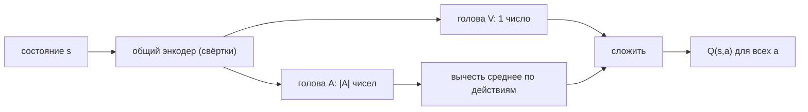
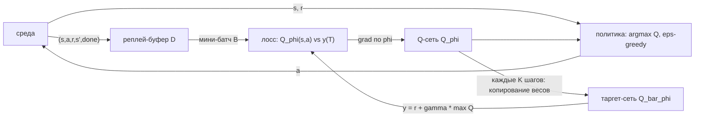

# Вопрос 4. Алгоритм DQN и его модификации: Double DQN, приоритезированный буфер, дуэльная архитектура, шумные сети, многошаговый DQN, память.

> **Источники:** лекция 4 (`Slides/RL_MIPT_Lecture_4.pdf`), конспект [1] (Иванов, «Reinforcement Learning Textbook») §4.1 «Deep Q-learning» (стр. 85–90), §4.2 «Модификации DQN» (стр. 91–99), §4.3.11 «Rainbow DQN» (стр. 118), §8.5 «Частично наблюдаемые среды» (стр. 216–219). Оригинальные статьи: Mnih et al. 2015 (DQN), van Hasselt et al. 2016 (Double DQN), Schaul et al. 2016 (PER), Wang et al. 2016 (Dueling), Fortunato et al. 2018 (Noisy Nets), Hessel et al. 2018 (Rainbow), Kapturowski et al. 2019 (R2D2).
> **Пререквизиты:** [Основы: функции ценности](00-osnovy.md#value), [нейросеть как аппроксиматор](00-osnovy.md#nn), [on-policy vs off-policy и реплей-буфер](00-osnovy.md#onoff-policy), [exploration и ε-greedy](00-osnovy.md#exploration), [градиентный спуск](00-osnovy.md#gradient).
> **Связанные билеты:** [Билет 2](02-bellman-pi-vi.md) — уравнения Беллмана и Value Iteration; [Билет 3](03-mc-q-learning.md) — табличный Q-learning, откуда всё растёт; [Билет 5](05-distributional.md) — distributional-подход (седьмая компонента Rainbow); [Билет 10](10-bias-variance-ppo.md) — bias-variance и n-шаговые оценки, Retrace; [Билет 11](11-dpg-ddpg-td3.md) — Twin-оценка в TD3 и перенос DQN на непрерывные действия.

[TOC]

## 1. Зачем это нужно и где стоит в курсе

Это **value-based** подход: агент учит не стратегию, а оптимальную $Q^*(s,a)$, и действует жадно, $\pi(s) = \arg\max_a Q^*(s,a)$. В [билете 3](03-mc-q-learning.md) это делалось таблицей: своя ячейка на каждую пару $(s,a)$, обновление $Q(s,a) \leftarrow Q(s,a) + \alpha\,(r + \gamma \max_{a'} Q(s',a') - Q(s,a))$, и была теорема сходимости. Здесь мы делаем ровно один шаг: заменяем таблицу на нейросеть — и смотрим, что ломается.

Почему таблица не масштабируется. В Atari состояние — это экран $84\times84$ в градациях серого, четыре подряд идущих кадра, то есть $28\,224$ числа; при 256 уровнях яркости различных состояний $256^{28224}$. Но главное даже не память: в таблице **нет обобщения** — два почти одинаковых экрана это две независимые строки, и каждую пришлось бы посетить лично.

!!! note Интуиция
    Нейросеть здесь — «сжатая таблица с обобщением»: вместо $|\mathcal{S}|\times|\mathcal{A}|$ независимых чисел храним миллионы весов, и похожие состояния автоматически получают похожие оценки. Цена — ячейки перестают быть независимыми: подвинув $Q$ в одной точке, мы шевелим её во всех похожих.

Почему наивное «Q-learning + нейросеть» не работает — **смертельная триада (deadly triad)**, сочетание трёх вещей: **бутстрэппинг** (таргет $r+\gamma\max_{a'}Q(s',a')$ строится из собственного предсказания, а не из настоящей награды), **аппроксимация функции** (нельзя подвинуть одно значение, не тронув соседние — ошибка размазывается на непосещённые состояния) и **off-policy** (учимся на данных старой стратегии и не контролируем, где наша оценка вообще проверяется реальностью).

Каждый ингредиент по отдельности безобиден, вместе они дают положительную обратную связь: неудачный градиентный шаг портит сеть → сеть выдаёт завышенные таргеты → на них она учится ошибаться ещё сильнее. Выглядит это как неограниченный рост $Q$ и развал обучения. **DQN — это набор инженерных костылей, разрывающих эту обратную связь.**

## 2. Постановка задачи и обозначения

Среда — MDP $(\mathcal{S},\mathcal{A},p,r,\gamma)$ с **конечным** (и не очень большим, десятки) множеством действий $\mathcal{A}$ и произвольно сложным $\mathcal{S}$. Требование конечности $\mathcal{A}$ остаётся принципиальным ограничением всего подхода: жадный максимум $\max_a$ мы берём перебором (снимается в [билете 11](11-dpg-ddpg-td3.md), DDPG).

- $Q_\phi(s,a)$ — Q-сеть с параметрами $\phi$; $\bar\phi$ (в конспекте $\theta^-$) — параметры **таргет-сети** (target network), замороженной копии.
- $\mathcal{D}$ — реплей-буфер (replay buffer), хранилище переходов $T = (s,a,r,s',\mathrm{done})$; $N$ — его размер, $B$ — размер мини-батча.
- $\delta = y(T) - Q_\phi(s,a)$ — временная разница (TD-ошибка) на переходе $T$; $y(T)$ — таргет (целевая переменная).
- $\mathrm{done} \in \{0,1\}$ — флаг терминальности $s'$.

**Архитектура.** Сеть принимает на вход только состояние $s$ и выдаёт вектор из $|\mathcal{A}|$ чисел $\big(Q_\phi(s,a_1),\dots,Q_\phi(s,a_{|\mathcal{A}|})\big)$. Альтернатива «подавать $(s,a)$ на вход, выдавать скаляр» хуже: тогда $\arg\max_a$ требует $|\mathcal{A}|$ прямых проходов вместо одного. Для картинок это несколько свёрточных слоёв **без макспулинга** (он даёт инвариантность к сдвигу, а нам критично, *где* на экране объект), обычно без батчнорма и дропаута (у них разное поведение на train/test, а в RL «тест» — это и сбор данных, и генерация таргетов).

## 3. Основная теория

### 3.1. От Q-learning к задаче регрессии

Хотелось бы минимизировать невязку уравнения оптимальности Беллмана $\big(Q_\phi(s,a) - r - \gamma\mathbb{E}_{s'}\max_{a'}Q_\phi(s',a')\big)^2$, но $\mathbb{E}_{s'}$ внутри квадрата не выносится и не оценивается по одному сэмплу. Трюк: превратить это в **обычную задачу регрессии**, где роль «правильного ответа» играет сэмплированный таргет.

$$
y(T) := r + \gamma\,(1-\mathrm{done})\max_{a'} Q_{\bar\phi}(s',a'), \qquad s' \sim p(\cdot\mid s,a)
$$

$$
\mathcal{L}(\phi) = \mathbb{E}_{(s,a,r,s')\sim\mathcal{D}}\Big[\big(r + \gamma\max_{a'}Q_{\bar\phi}(s',a') - Q_\phi(s,a)\big)^2\Big]
$$

Ключевое обоснование (теорема 34 в [1]): оптимальным ответом регрессии с MSE является **среднее** целевой переменной, а $\mathbb{E}_{s'}y(T)$ — это в точности правая часть уравнения Беллмана. Значит, решив эту регрессию при замороженных $\bar\phi$, мы сделаем один шаг метода простой итерации $Q_{k+1} = \mathcal{T}Q_k$ — один шаг Value Iteration, но в мире аппроксимаций. Отсюда и требование именно квадратичного лосса: он «извлекает» матожидание из зашумлённого таргета. Табличный Q-learning — частный случай: при $Q_\phi(s,a)=\phi_{s,a}$ градиент предсказания есть единичный вектор, и шаг спуска совпадает с обновлением одной ячейки (теорема 35 в [1]).

!!! warning Почему это «полуградиент»
    Формально $\mathcal{L}$ зависит от параметров дважды — через предсказание и через таргет ($\phi$ и $\bar\phi$ почти одно и то же). Но градиент берём **только по предсказанию**, а таргет объявляем константой (`stop-gradient`, `.detach()`) — это **полуградиент (semi-gradient)**. Причина содержательная: мы подстраиваем прошлое под будущее, а не наоборот; если градиенты потекут в таргет, сеть начнёт подкручивать цель под себя, и процедура перестанет приближать решение уравнений Беллмана.

### 3.2. Два трюка, делающие это работоспособным

**Реплей-буфер.** Идущие подряд переходы сильно скоррелированы (соседние кадры почти одинаковы), а нейросети на скоррелированных мини-батчах учатся плохо или не учатся вовсе. Решение: складывать переходы в большой буфер (порядка $10^6$; при переполнении выбрасываются самые старые) и сэмплировать мини-батчи равномерно. Бонус — переиспользование данных (sample efficiency).

*Почему это законно?* Q-learning **off-policy**: в таргете из «правильного» распределения должно приходить только $s'\sim p(s'\mid s,a)$, а динамика стационарна, поэтому годится любая тройка $(s,a,s')$ от любой стратегии любой давности. Распределение самих пар $(s,a)$ может быть каким угодно, лишь бы разнообразным. (Альтернатива буферу — параллельные среды; тоже декоррелирует батч.)

**Таргет-сеть.** Сколько шагов градиента тратить на одну задачу регрессии? Пересчитывать таргет каждый шаг — нестабильно (та самая цепная реакция), ждать сходимости — долго. Компромисс: замороженная копия весов $\bar\phi$ генерирует таргеты, а раз в $K$ шагов (сотни–тысячи) делается **hard update** $\bar\phi \leftarrow \phi$. Альтернатива — **мягкое (Polyak / soft) обновление** на каждом шаге:

$$
\bar\phi \leftarrow (1-\tau)\,\bar\phi + \tau\,\phi, \qquad \tau \ll 1
$$

Hard update даёт всплески лосса в момент смены задачи регрессии; soft меняет задачу плавно. В DQN исторически hard, в DDPG/SAC — soft.

!!! tip Как запомнить
    Таргет-сеть — это «догоняем движущуюся цель». Если цель убегает с той же скоростью, что и мы, догнать нельзя; надо, чтобы она периодически замирала.

**Мелочи, без которых на Atari не заводится:** **Huber-лосс** (smooth L1) вместо MSE — ограничивает градиент на больших TD-ошибках; **клиппинг наград** в $\{-1,0,+1\}$ — чтобы один набор гиперпараметров работал на играх с разным масштабом очков; **frame stacking** из 4 кадров — чтобы состояние стало почти марковским; **множитель $(1-\mathrm{done})$** — без «точки отсчёта» в терминальных состояниях приближённое ДП не сходится никуда.

### 3.3. Смещение в сторону переоценки (overestimation bias)

Даже с таргет-сетью $Q$ систематически завышается. Источник — оператор $\max$ в таргете. Пусть оценки зашумлены, $Q(s',a') = Q^*(s',a') + \varepsilon(a')$, причём шум в среднем нулевой. Максимум — **выпуклая** функция вектора оценок, поэтому по неравенству Йенсена

$$
\mathbb{E}\big[\max_{a'} Q(s',a')\big] \;\ge\; \max_{a'} \mathbb{E}\big[Q(s',a')\big] \;=\; \max_{a'} Q^*(s',a')
$$

Словами: **максимум по несмещённым оценкам — смещённая оценка максимума**, всегда в сторону завышения. Оператор $\max$ не отличает «действительно хорошее действие» от «действия, которому повезло с ошибкой», и систематически выбирает второе; дальше завышение через таргеты расползается по буферу. Формально (утверждение 37 в [1]): если действий хотя бы два, ошибки независимы по действиям и $P(\varepsilon>0)=P(\varepsilon<0)=0.5$, то $P\big(\max_{a'}Q(s',a') > \max_{a'}Q^*(s',a')\big) > 0.5$ (при $|\mathcal{A}|=1$ было бы ровно $0.5$ — завышение создаёт именно выбор из нескольких). Числовой пример — в §5.

**Идея лечения — расцепление (decoupling).** Запишем максимум как композицию двух операций:

$$
\max_{a'} Q(s',a') \;=\; \underbrace{Q\big(s',\ \underbrace{\arg\max_{a'} Q(s',a')}_{\text{выбор действия}}\big)}_{\text{оценка действия}}
$$

Завышение возникает потому, что **выбор** и **оценка** используют одну и ту же реализацию шума. Разведём их по двум хотя бы слабо скоррелированным оценкам — смещение резко упадёт.

**Double Q-learning (twin-версия, 2010).** Учим два независимых приближения:

$$
y_1(T) := r + \gamma\, Q_{\phi_2}\big(s', \arg\max_{a'}Q_{\phi_1}(s',a')\big), \qquad
y_2(T) := r + \gamma\, Q_{\phi_1}\big(s', \arg\max_{a'}Q_{\phi_2}(s',a')\big)
$$

Близнец играет роль более пессимистичного критика. Почему «чужой» сетью именно *оценивают*, а не *выбирают*? Если $Q_{\phi_1}$ после неудачного шага сломалась, мы не хотим, чтобы её сломанные **значения** попали в её же таргет; сломанные **действия** пусть попадают — их пессимистично оценит близнец.

**Double DQN (van Hasselt et al., 2016) — рабочий вариант.** Учить вторую сеть дорого, а при общем буфере они всё равно скоррелированы. Но вторая сеть у нас *уже есть* — таргет-сеть:

$$
\boxed{\,y(T) := r + \gamma\,(1-\mathrm{done})\, Q_{\bar\phi}\big(s',\ \arg\max_{a'} Q_{\phi}(s',a')\big)\,}
$$

Действие выбирает **онлайн-сеть** $\phi$, оценивает — **таргет-сеть** $\bar\phi$. Это бесплатно и эмпирически хорошо гасит завышение. Отличие от Double Q-learning: там две равноправные независимо обучаемые сети; здесь «вторая сеть» — отставшая во времени копия первой, декорреляция слабее, зато цена нулевая.

**Twin DQN (clipped double).** А вдруг близнец завышает ещё сильнее? Возьмём минимум:

$$
y_1(T) := r + \gamma \min_{i=1,2} Q_{\phi_i}\big(s', \arg\max_{a'}Q_{\phi_1}(s',a')\big)
$$

«Клин клином»: зная, что $\max$ завышает, вводим искусственное занижение через $\min$. Это ансамблирование, где вместо среднего берут минимум; плохо масштабируется (учат ровно две), но именно эта оценка стала стандартом в непрерывном управлении — см. TD3 в [билете 11](11-dpg-ddpg-td3.md).

### 3.4. Дуэльная (dueling) архитектура

**Проблема.** Вы упали в яму $s$ и попробовали там действие $a$ = «поднять правую руку», получив $-100$. Обычный DQN понизит только $Q(s,a)$; оценка самого состояния $V(s)=\max_a Q(s,a)$ почти не изменится, и агент вернётся в яму перепроверять остальные действия. А в реальных задачах плохая награда обычно означает, что **плоха вся область**, а не одно действие. Чем больше $|\mathcal{A}|$, тем острее.

**Решение — сменить вычислительный граф**, а не лосс. Две головы, скаляр $V_\phi(s)$ и вектор $A_\phi(s,a)$:

$$
Q_\phi(s,a) := V_\phi(s) + A_\phi(s,a)
$$

Апдейт одной пары $(s,a)$ теперь неизбежно тронет $V_\phi(s)$ — слагаемое, общее для всех действий. Это встроенный «прайор»: ценности действий в одном состоянии связаны, и обобщение идёт по состояниям, где выбор действия не важен.

**Подвох — идентифицируемость.** Мы моделируем $|\mathcal{A}|$ чисел, выдавая $|\mathcal{A}|+1$: прибавив $c$ к $V$ и вычтя $c$ из всех $A$, получим тот же $Q$. Разложение не определено однозначно, головы могут неограниченно дрейфовать, семантика «$V$ — ценность состояния» теряется. Фиксируем лишнюю степень свободы через свойство оптимального advantage: $\max_a A^*(s,a) = \max_a Q^*(s,a) - V^*(s) = 0$. Отсюда теоретически правильная формула

$$
Q_\phi(s,a) := V_\phi(s) + A_\phi(s,a) - \max_{\hat a} A_\phi(s,\hat a)
$$

Но авторы эмпирически обнаружили, что **среднее работает лучше**:

$$
\boxed{\,Q_\phi(s,a) := V_\phi(s) + A_\phi(s,a) - \frac{1}{|\mathcal{A}|}\sum_{\hat a} A_\phi(s,\hat a)\,}
$$

Причина: в буфере очень часто $a$ — это и есть текущий $\arg\max$, и тогда $A_\phi(s,a) - \max_{\hat a}A_\phi(s,\hat a)\equiv 0$, градиент по advantage-голове зануляется. Со средним такого нет, зато семантика становится приблизительной. Головы **не обучаются по отдельности** (для $V^*$ уравнение оптимальности к регрессии не сводится, для $A^*$ уравнения Беллмана нет вовсе): минимизируется тот же DQN-лосс по $Q$.



### 3.5. Приоритезированный реплей (Prioritized Experience Replay, PER)

**Проблема.** Переходы не равноценны. Большая часть — «сделал шаг, награды нет, следующее состояние оценено почти случайно»: такое обновление не несёт информации и лишь схлопывает выход сети к константе. Ценны терминальные переходы (где $y(T)=r$ — абсолютно точное значение) и те, до которых только что докатилась «волна» распространения награды. Признак и тех и других — большая TD-ошибка.

**Приоритет** перехода (proportional-вариант):

$$
p_i := |\delta_i| + \varepsilon, \qquad \delta_i = y(T_i) - Q_\phi(s_i,a_i)
$$

Добавка $\varepsilon > 0$ гарантирует ненулевую вероятность у любого перехода. Ранговый (rank-based) вариант: $p_i := 1/\mathrm{rank}(i)$, где ранг — место перехода в списке, отсортированном по $|\delta|$; он устойчивее к выбросам. Вероятность сэмплирования:

$$
P(i) = \frac{p_i^{\alpha}}{\sum_k p_k^{\alpha}}, \qquad \alpha \ge 0
$$

$\alpha=0$ — равномерное сэмплирование, $\alpha\to\infty$ — жадное по приоритету (типично $\alpha\approx0.6$). Новые переходы кладутся с максимальным приоритетом, чтобы каждый был увиден хотя бы раз. Приоритеты пересчитываются **только для переходов текущего батча** (миллион пересчитывать после каждого шага нереально) — отсюда недостаток: если у перехода был низкий приоритет, алгоритм не узнает, что тот стал важным, пока случайно его не вытащит.

**Смещение и IS-веса.** Поменяв распределение сэмплирования, мы поменяли и минимизируемый функционал. Конкретный вред: $s'$ внутри таргета больше не распределён по $p(s'\mid s,a)$. Если из $(s,a)$ с вероятностью $0.9$ попадаем в $A$ и с $0.1$ в $B$, но переходы в $B$ дают большую TD-ошибку, то $B$ будет вытаскиваться чаще своей истинной вероятности, и $Q(s,a)$ уедет от правильного среднего. Лечится **importance sampling**: «интересные» переходы сэмплируем чаще, но делаем по ним **меньшие шаги**:

$$
w_i = \Big(\frac{1}{N\,P(i)}\Big)^{\beta}, \qquad w_i \leftarrow \frac{w_i}{\max_j w_j}
$$

Здесь $N$ — размер буфера; нормировка на максимум по мини-батчу гарантирует $w_i\le1$ (веса только уменьшают шаги — важно для устойчивости). Лосс становится $\frac1B\sum_i w_i\delta_i^2$. Параметр $\beta$ **отжигается** от $\beta_0\approx0.4$ к $1$: в начале смещение не страшно (распределение и так бедное), к концу коррекция должна быть полной; при $\beta=1$ она точная, но польза приоритезации частично съедается.

**SumTree.** Сэмплировать с вероятностями $\propto p_i^\alpha$ по миллиону элементов позволяет бинарное дерево, в каждом узле которого лежит сумма значений детей (в корне — нормировочная константа): сэмплирование — спуск от корня с равномерной величиной на $[0,\sum p]$, обновление приоритета — подъём до корня, оба за $O(\log N)$.

### 3.6. Шумные сети (Noisy Nets)

ε-greedy плох всем: нужен вручную подобранный график затухания $\varepsilon(t)$; слишком большой шум замедляет обучение, слишком быстрое затухание запирает агента в локальном оптимуме (Марио вечно прыгает в одну и ту же яму). **Главный порок: шум не зависит от состояния.** Правильнее шуметь там, где состояние ново, и действовать жадно там, где всё изучено.

Идея: сделать стохастическими **веса**, а не действия:

$$
w = \mu + \sigma \odot \varepsilon, \qquad \varepsilon \sim \mathcal{N}(0, I)
$$

где $\mu,\sigma$ — обучаемые параметры ($\odot$ — поэлементное умножение). Выход сети становится случайным, и $\arg\max_a Q(s,a,\varepsilon)$ иногда выбирает «не то» действие — но **насколько** иногда, зависит от входа $s$, потому что шум проходит через сеть вместе с ним. Оптимизируем $\mathbb{E}_\varepsilon\mathcal{L}(\phi,\varepsilon)\to\min$; градиент несмещённо оценивается одним сэмплом шума. Надежда: если модель часто видит $s$ и лосс требует выдавать там конкретное значение, ей выгодно уменьшить $\sigma$ на релевантных связях; на новых состояниях шум остаётся большим. Гарантий этого нет — это эвристика.

**Factorized gaussian noise.** Генерировать шум по числу весов дорого. Для слоя $n\to m$ сэмплируют $\varepsilon^{(1)}\in\mathbb{R}^m,\ \varepsilon^{(2)}\in\mathbb{R}^n$ и кладут $\varepsilon_{ij}:=f(\varepsilon^{(1)}_i)f(\varepsilon^{(2)}_j)$, где $f(x)=\mathrm{sign}(x)\sqrt{|x|}$ (чтобы дисперсия осталась единичной): $m+n$ сэмплов вместо $mn$ ценой независимости внутри слоя. В свёрточные слои шум обычно не добавляют.

| | ε-greedy | Noisy Nets |
|---|---|---|
| Гиперпараметры | график $\varepsilon(t)$, подбирается вручную | только инициализация $\sigma_0$ |
| Зависимость от состояния | нет | есть (через прямой проход) |
| Согласованность во времени | нет (шум независим каждый шаг) | шум фиксирован на эпизод/проход → «целенаправленное» поведение |
| Цена | ~0 | заметно дороже прямой проход |
| Гарантии | есть теория для табличного случая | нет гарантий, что $\sigma$ убывает |

### 3.7. Многошаговый (multi-step) DQN

Одношаговый таргет распространяет награду на один шаг за одну задачу регрессии: донести сигнал на 100 шагов назад — это 100 этапов, каждый со своей ошибкой аппроксимации (**проблема накапливающейся ошибки, compound error**). Эвристика — $n$-шаговый таргет:

$$
y(T) := \sum_{k=0}^{n-1}\gamma^{k} r_{t+k} \;+\; \gamma^{n}\max_{a}Q_{\bar\phi}(s_{t+n},a)
$$

В буфер вместо $(s,a,r,s',\mathrm{done})$ кладём $\big(s_t,\,a_t,\,\sum_{k=0}^{n-1}\gamma^k r_{t+k},\,s_{t+n},\,\mathrm{done}\big)$, где флаг означает «эпизод кончился в течение этих $n$ шагов». Всё остальное не меняется; $n=1$ — обычный DQN.

**Плюсы:** награда распространяется в $n$ раз быстрее; меньше доля бутстрэпа в таргете, значит меньше смещение от собственных кривых оценок.

**Минус — теоретическая некорректность.** В $n$-шаговом уравнении оптимальности Беллмана промежуточные действия $a_{t+1},\dots,a_{t+n-1}$ должны приходить из **оптимальной** стратегии, а в буфере лежат действия старой, произвольно плохой стратегии $\mu$. Мы решаем уравнение «а что если я $n$ шагов веду себя как $\mu$ и только потом начну вести себя оптимально», то есть **систематически занижаем** правую часть; вдобавок $\mu$ у каждого перехода своя, так что это даже не Generalized Policy Iteration. *Пример вреда:* в $s_1$ можно съесть тортик или прыгнуть в лаву, и в первом эпизоде агент прыгнул в лаву; при $n>1$ в буфер попал переход со стартом $s_0$ и огромной отрицательной наградой, и $Q(s_0,\cdot)$ будет тянуться вниз, пока эта запись жива, даже если агент давно ест тортики.

Поэтому на практике $n=2$–$3$, максимум $5$. Исключение — среды **без критических решений** (где $\max_a Q^*(s,a)-\min_a Q^*(s,a)$ мало: «робот едет в соседнюю комнату, действия чуть-чуть его сдвигают»): там неоптимальность $n$ шагов почти не стоит награды, и $n=5$–$10$ может помочь.

**Retrace — теоретически корректная альтернатива.** Вместо игнорирования несоответствия стратегий Retrace обрезает след importance-весами $c_k=\min\big(1,\pi(a_k\mid s_k)/\mu(a_k\mid s_k)\big)$ и суммирует одношаговые ошибки с затухающим весом $\prod c_i$: чем менее вероятны записанные действия для текущей политики, тем короче получается оценка (в худшем случае схлопывается в одношаговую, но не ломается). Чтобы целевая политика была стохастичной (иначе след зануляется мгновенно), в качестве $\pi$ берут ε-жадную по $Q$; в буфере приходится хранить роллауты и вероятности $\mu(a\mid s)$. Подробнее — [билет 3](03-mc-q-learning.md) и [билет 10](10-bias-variance-ppo.md).

### 3.8. Память: частично наблюдаемые среды

**PoMDP** (partially observable MDP) — к MDP добавлены пространство наблюдений $\mathcal{O}$ и распределение $p(o\mid s)$: агент видит не состояние, а наблюдение. Классический пример: один кадр Pong — видно, где мяч, но **не видно, куда он летит**; марковости нет, и оптимального решения в виде функции от $o_t$ может просто не существовать.

Теоретически правильный объект — **belief state** $b_t(s_t)=p(s_t\mid \mathcal{T}_{:t})$, распределение на состояниях при условии всей наблюдаемой истории; обновляется по Байесу, $b_t(s_t)\propto p(o_t\mid s_t)\int p(s_t\mid s_{t-1},a_{t-1})b_{t-1}(s_{t-1})\,ds_{t-1}$, и является достаточной статистикой истории, так что PoMDP сводится к обычному MDP над пространством распределений (**Belief MDP**). На практике бесполезно: нужны все распределения среды и вычислимые интегралы.

Практические решения, по возрастанию силы:

1. **Frame stacking** — дешёвая память фиксированной длины: склеить $k$ последних кадров в один вход. Хватает для Atari (4 кадра дают скорость и ускорение), не хватает, если помнить надо десятки шагов.
2. **DRQN** — рекуррентный слой (LSTM/GRU) поверх свёрток вместо стека кадров: скрытое состояние инициализируется нулём в начале эпизода и накапливает историю, Q-функция становится функцией всей истории.
3. **R2D2** (Recurrent Replay Distributed DQN) — как совместить рекуррентность с буфером. Проблема: сохранённое скрытое состояние «протухает», потому что веса изменились и его семантика поплыла. Две эвристики: (а) хранить в буфере **последовательности** длины $N$ (у авторов 80), инициализировать память сохранённым значением (**stored state**), прогонять сеть по всей последовательности, но лосс и backprop-through-time считать только на последних $M$ шагах (40) — первые $N-M$ служат **прогревом (burn-in)**, чтобы память догналась до свежих весов; (б) после прогрева записывать обновлённое скрытое состояние обратно в буфер. Тот же прогон делается для таргет-сети. $M$ ограничивает, на сколько шагов агент в принципе может научиться запоминать.

## 4. Алгоритмы

### 4.1. Псевдокод DQN

```text
Вход: B — размер батча, K — период обновления таргет-сети, eps(t) — расписание
      исследования, N — размер буфера, gamma, оптимизатор (Adam)

 0. Инициализировать phi случайно; положить bar_phi := phi; D := пустой буфер
 1. Наблюдать s_0
 2. На каждом шаге t:
 3.   с вероятностью eps(t) выбрать a_t случайно, иначе a_t := argmax_a Q_phi(s_t, a)
 4.   выполнить a_t, наблюдать r_t, s_{t+1}, done_{t+1}
 5.   положить (s_t, a_t, r_t, s_{t+1}, done_{t+1}) в D (вытеснив самый старый)
 6.   засэмплировать мини-батч из B переходов T = (s, a, r, s', done) из D
 7.   для каждого T посчитать таргет (градиенты в него НЕ текут):
            y(T) := r + gamma * (1 - done) * max_{a'} Q_bar_phi(s', a')
 8.   Loss(phi) := (1/B) * sum_T Huber( Q_phi(s, a) - y(T) )
 9.   сделать шаг оптимизатора по grad_phi Loss(phi)
10.   если t mod K == 0:  bar_phi := phi        # либо на каждом шаге: soft update
```

Что где: шаг 3 — исследование (иначе жадный агент упрётся в ближайшую стену); шаг 5 — накопление off-policy данных; шаг 6 — декорреляция; шаг 7 — заморозка задачи регрессии; шаг 9 — полуградиентный шаг; шаг 10 — переход к следующему шагу простой итерации.



### 4.2. Rainbow: шесть модификаций

Все перечисленные улучшения **ортогональны**: лечат разные болезни и включаются независимо. Rainbow (Hessel et al., 2018) собирает шесть в один алгоритм.

| Модификация | Какую проблему лечит | Как именно | Цена |
|---|---|---|---|
| **Double DQN** | overestimation bias от $\max$ | действие выбирает онлайн-сеть, оценивает таргет-сеть | бесплатно |
| **Dueling** | плохое обобщение по действиям в «плохих» состояниях | две головы $V$ и $A$, из $A$ вычитается среднее | чуть больше параметров; размывается семантика голов |
| **PER** | редкие информативные переходы тонут в тривиальных | $P(i)\propto(\lvert\delta_i\rvert+\varepsilon)^\alpha$, SumTree, IS-веса с отжигом $\beta\to1$ | смещение (нужны IS-веса), $O(\log N)$ на сэмпл, 2 гиперпараметра |
| **Noisy Nets** | примитивное, не зависящее от состояния исследование | $w=\mu+\sigma\odot\varepsilon$, обучаемая $\sigma$, factorized noise; ε-greedy выключается | вдвое больше параметров в FC-слоях, заметно медленнее прямой проход |
| **Multi-step** | медленное распространение награды, накопление ошибки | таргет из $n$ наград + бутстрэп на $n$-м шаге | смещение от off-policy данных; при больших $n$ разваливается |
| **Distributional (C51)** | сеть учит только среднее, теряя информацию о разбросе | вместо числа предсказывается распределение возврата; лосс — KL | дороже, отдельная параметризация (см. [билет 5](05-distributional.md)) |

Тонкости совмещения: в distributional-версии приоритет берётся как KL-лосс, а не $|\delta|$; при совмещении Noisy Nets с Double DQN шум сэмплируется **заново на каждый проход** (отдельно для выбора $a'$, для оценки и для градиентного прохода); Dueling поверх C51 делается по каждому атому с софтмаксом в конце. **Ablation** (Hessel et al., 2018; качество меряют медианой human-normalized score по 57 играм Atari): сильнее всего бьёт удаление **приоритезированного реплея** и **multi-step** — это два самых важных компонента, причём multi-step портит и раннее, и финальное качество. Следом **distributional**: первые ~40 млн кадров разницы нет, а дальше без него агент начинает отставать. Без **Noisy Nets** медиана заметно хуже, но по отдельным играм эффект разный. Удаление **dueling** и **double** на медиану значимо не влияет (помогает или мешает в зависимости от игры) — авторы предполагают, что клиппинг распределения в C51 сам по себе гасит переоценку, из-за которой нужен double.

## 5. Пример

!!! example Одно обновление DQN и то же обновление в Double DQN
    Три действия, $\gamma = 0.9$. Текущая сеть в $s$ даёт $Q_\phi(s,\cdot) = (2.0,\ 1.5,\ 3.0)$; в буфере лежит переход, где агент выбрал $a_1$, получил $r = 1$ и попал в нетерминальное $s'$. Там таргет-сеть даёт $Q_{\bar\phi}(s',\cdot) = (4.0,\ 2.0,\ 1.0)$, онлайн-сеть — $Q_\phi(s',\cdot) = (3.5,\ 3.8,\ 1.0)$.

    **Обычный DQN:** $\max_{a'}Q_{\bar\phi}(s',a') = 4.0$, значит $y = 1 + 0.9\cdot4.0 = 4.6$; TD-ошибка $\delta = 4.6-2.0 = 2.6$, лосс $\tfrac12\delta^2 = 3.38$. При «табличном» шаге с $\alpha = 0.1$ получилось бы $2.0 + 0.1\cdot2.6 = 2.26$.

    **Double DQN:** аргмаксимум по **онлайн**-сети — это $a_2$ (значение $3.8$), а оценка берётся у **таргет**-сети в том же индексе: $Q_{\bar\phi}(s',a_2) = 2.0$. Тогда $y = 1 + 0.9\cdot2.0 = 2.8$, $\delta = 0.8$.

    $4.6$ против $2.8$ — ровно тот случай, когда сети не сошлись во мнении, какое действие лучшее: обычный DQN берёт самое оптимистичное число, Double DQN требует согласия двух оценщиков.

!!! example Откуда берётся завышение: три действия и монетки
    В $s'$ три действия с одинаковыми истинными значениями $Q^*(s',a') = 0$. Оценки зашумлены симметрично: каждая равна $+1$ или $-1$ с вероятностью $1/2$, независимо. Максимум из трёх равен $-1$ только если все три дали $-1$, то есть с вероятностью $1/8$; иначе он равен $+1$. Значит
    $\mathbb{E}\big[\max_{a'} Q(s',a')\big] = \tfrac78\cdot(+1) + \tfrac18\cdot(-1) = 0.75 > 0 = \max_{a'}Q^*(s',a')$.
    Каждая оценка несмещена, а максимум завышен на $0.75$, и это завышение $\gamma\cdot0.75$ поедет в таргет предыдущего состояния, оттуда дальше — цепная реакция.

    Теперь Double с двумя независимыми оценщиками: действие выбираем по первому, значение берём у второго. Второй не знает, какой индекс выбрал первый, поэтому его значение там — просто $\pm1$ поровну, и $\mathbb{E}\big[Q_2(\arg\max Q_1)\big] = 0$: смещения нет. (В настоящем Double DQN оценщики скоррелированы, поэтому смещение уменьшается, но не до нуля.)

## 6. Подводные камни, сравнения, типичные ошибки

!!! warning Три ошибки реализации
    (1) Забыть `detach()`/`stop_gradient` на таргете: обучение «поедет», но будет минимизировать другой функционал (residual gradient) — см. §3.1. (2) PER без IS-весов: меняется неподвижная точка, к которой сходится $Q$; $\beta=1$ с самого начала — другая крайность, приоритезация обесценивается. (3) Dueling без вычитания среднего/максимума: разложение $Q=V+A$ не определено однозначно, головы могут разъехаться в $\pm10^6$. (4) Слишком большое $n$ в multi-step: в off-policy режиме таргет занижен тем сильнее, чем важнее «критические решения» в среде, и $n>5$ почти всегда вредит.

!!! warning Где DQN принципиально буксует
    При сильно отложенной награде (сигнал на 100 шагов назад) нужно 100 этапов простой итерации с накоплением ошибки аппроксимации, а жадная стратегия должна различать $\gamma^{100}$ и $\gamma^{102}$ — такой точности не будет. Здесь value-based подход проигрывает on-policy policy-gradient методам ([билеты 8](08-a2c-gae.md), [10](10-bias-variance-ppo.md)).

| | DQN и потомки | REINFORCE / A2C / PPO |
|---|---|---|
| Что учим | только $Q$, политика — жадная | явную $\pi_\theta$ (+ критика) |
| Режим | off-policy, реплей-буфер | on-policy (PPO — почти) |
| Sample efficiency | высокая (данные переиспользуются) | низкая |
| Пространство действий | только дискретное и небольшое | любое, включая непрерывное |
| Стабильность | требует таргет-сети, буфера, костылей | стабильнее, но шумнее |
| Credit assignment на длинных горизонтах | плохо (compound error) | лучше (GAE, $\lambda$) |

## 7. Ответ за 5 минут

1. **Задача.** Состояний слишком много (Atari: $84\times84\times4$), таблица невозможна и не обобщает. Приближаем $Q^*(s,a) \approx Q_\phi(s,a)$ нейросетью: вход $s$, выход $|\mathcal{A}|$ чисел, действие — $\arg\max$ за один проход.
2. **Лосс.** $\mathcal{L}(\phi) = \mathbb{E}_{\mathcal{D}}\big[(r+\gamma\max_{a'}Q_{\bar\phi}(s',a') - Q_\phi(s,a))^2\big]$; это задача регрессии, в которой MSE «извлекает» $\mathbb{E}_{s'}$ и даёт шаг метода простой итерации по Беллману. Таргет — константа, градиенты в него не текут → **полуградиент**.
3. **Почему нестабильно.** Deadly triad: бутстрэппинг + аппроксимация + off-policy. Отсюда два трюка.
4. **Реплей-буфер** — декорреляция батча + переиспользование данных; законен потому, что нужен только $s'\sim p(\cdot\mid s,a)$, а динамика стационарна.
5. **Таргет-сеть** — замороженная копия $\bar\phi$; hard update раз в $K$ шагов или Polyak $\bar\phi\leftarrow(1-\tau)\bar\phi+\tau\phi$. Плюс Huber, клиппинг наград, frame stacking, множитель $(1-\mathrm{done})$.
6. **Overestimation:** $\mathbb{E}\max \ge \max\mathbb{E}$ (Йенсен), $\max$ подхватывает ошибки оценивания. **Double DQN:** $y = r+\gamma Q_{\bar\phi}(s',\arg\max_{a'}Q_\phi(s',a'))$ — расцепление выбора и оценки, бесплатно. **Twin:** $\min$ из двух — база TD3.
7. **Dueling:** $Q = V + A - \frac{1}{|\mathcal{A}|}\sum A$; вычитание — фиксация лишней степени свободы ($\max_a A^* = 0$); выигрыш — обновление одного действия двигает оценку всего состояния.
8. **PER:** $p_i = |\delta_i|+\varepsilon$, $P(i) = p_i^\alpha/\sum p^\alpha$, SumTree за $O(\log N)$; смещение чинится IS-весами $w_i = (NP(i))^{-\beta}$ с нормировкой на максимум и отжигом $\beta\to1$.
9. **Noisy Nets:** $w = \mu+\sigma\odot\varepsilon$, обучаемая $\sigma$, factorized noise; исследование зависит от состояния, ε-greedy не нужен.
10. **Multi-step:** $y = \sum_{k=0}^{n-1}\gamma^k r_{t+k} + \gamma^n\max_a Q(s_{t+n},a)$; быстрее распространяет награду, но в off-policy смещён (действия в буфере не оптимальны) → $n=2$–$3$; корректная версия — Retrace.
11. **Память:** PoMDP (один кадр Pong не показывает направление мяча); frame stacking → LSTM (DRQN) → R2D2 (последовательности в буфере, stored state, burn-in).
12. **Rainbow** = Double + Dueling + PER + Noisy + Multi-step + Distributional; все ортогональны.

## 8. Вероятные допвопросы экзаменатора

**Зачем таргет-сеть, если можно просто взять маленький learning rate?** Маленький lr одинаково замедляет и обучение, и «убегание» цели — относительная скорость погони не меняется. Таргет-сеть делает другое: **фиксирует задачу регрессии** и разрывает мгновенную связь «сломанная сеть → сломанный таргет». (Soft update — почти «медленная копия», так что интуиция не совсем пустая.)

**Почему DQN off-policy?** Потому что в таргете стоит $\max_{a'}$, а не действие, реально выбранное в данных: мы оцениваем жадную политику независимо от того, кто собирал переходы. Единственное требование — чтобы $s'$ приходил из истинной динамики $p(s'\mid s,a)$, а это верно для траектории любой стратегии. Отсюда законность буфера.

**Почему нельзя PER без IS-весов?** Приоритет зависит от TD-ошибки, а она коррелирует с тем, в какое $s'$ мы попали, — значит, $s'$ внутри таргета перестаёт быть сэмплом из $p(s'\mid s,a)$ и $Q$ сходится не к тому среднему. Веса $w_i\propto(NP(i))^{-\beta}$ возвращают исходный функционал.

**В чём разница Double DQN и Double Q-learning?** Double Q-learning (2010) держит две равноправные обучаемые Q-функции, каждая оценивает выбор другой; Double DQN (2015) второй сети не заводит — аргмакс берёт онлайн-сеть, значение даёт уже существующая таргет-сеть. Декорреляция слабее, зато бесплатно.

**Почему dueling вычитает среднее, если теория требует максимума?** Теория даёт $\max_a A^*(s,a)=0$, но в буфере записанное $a$ очень часто и есть текущий $\arg\max$, и тогда $A_\phi(s,a)-\max_{\hat a}A_\phi(s,\hat a)\equiv0$ — градиент по advantage-голове зануляется. Среднее не вырождается и эмпирически учится лучше; цена — $V_\phi$ перестаёт быть в точности $V^*$.

**Как n-step взаимодействует с реплей-буфером?** Плохо: $n$-шаговое уравнение оптимальности требует промежуточных действий оптимальной стратегии, а в буфере лежат действия старых, поэтому таргет систематически занижен. Корректная версия — Retrace; на практике берут $n\le3$–$5$.

**Что будет, если убрать буфер, но оставить таргет-сеть?** Батчи станут скоррелированными, градиент — шумной и смещённой оценкой, сеть будет переобучаться на текущий фрагмент траектории. Обходной путь — параллельные среды: батч из $B$ независимых агентов декоррелирован не хуже, но переиспользование данных теряется.

**Почему DQN не применить к непрерывным действиям?** Всё держится на $\max_a$ и $\arg\max_a$, которые берутся перебором выходов сети. При непрерывном $\mathcal{A}$ это отдельная задача оптимизации на каждый элемент батча. Решение — отдельная сеть-актор, приближающая $\arg\max$: DDPG/TD3, [билет 11](11-dpg-ddpg-td3.md).
