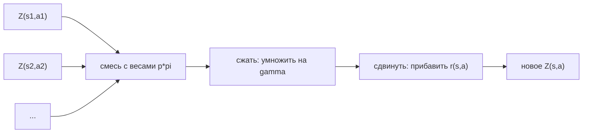
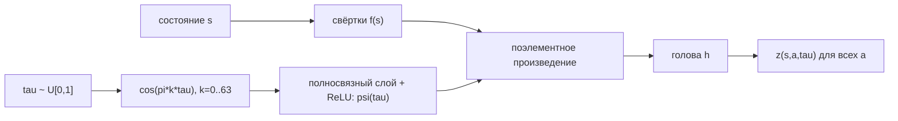

# Вопрос 5. Distributional подход в RL. Алгоритм QR-DQN. Алгоритм Implicit Quantile Networks.

> **Источники:** лекция 5 (`Slides/RL_MIPT_Lecture_5.pdf`), конспект [1] (Иванов, «Reinforcement Learning Textbook») раздел 4.3 «Distributional RL», стр. 100–119. Оригинальные статьи: Bellemare, Dabney, Munos (2017) — C51; Dabney et al. (2018) — QR-DQN; Dabney et al. (2018) — IQN.
> **Пререквизиты:** [Основы: функции ценности](00-osnovy.md#value), [Основы: вероятность, KL](00-osnovy.md#probability), [Основы: матожидание и Монте-Карло](00-osnovy.md#expectation-mc), [Основы: нейросеть как аппроксиматор](00-osnovy.md#nn).
> **Связанные билеты:** [Билет 2](02-bellman-pi-vi.md) — обычное уравнение Беллмана, операторы $\mathcal{T}^\pi, \mathcal{T}^*$ и их сжимаемость в sup-норме (здесь только distributional-версия); [Билет 4](04-dqn.md) — DQN, таргет-сеть, реплей-буфер и все «трюки» (Double, PER, Dueling, Noisy, multi-step), которые здесь используются как данность.

[TOC]

## 1. Зачем это нужно и где стоит в курсе

Всё, что мы делали в value-based методах, сводилось к одному числу: $Q^\pi(s,a)$ — **среднее** суммарной будущей награды. Но суммарная награда — случайная величина: кости бросает среда в переходах $p(s'\mid s,a)$, кости бросает политика при выборе действий, случайной может быть и сама награда. Среднее — лишь одна статистика этого распределения, и довольно бедная.

!!! note Интуиция
    Два маршрута до аэропорта. Первый — метро: ровно 50 минут, всегда. Второй — такси: 30 минут, если нет пробок (вероятность 0.5), и 70 минут, если есть. Среднее время одинаковое — 50 минут. Но если самолёт через 55 минут, вы поедете на метро, а если через 35 — на такси. Функция $Q$ эти два варианта **не различает**, а $Z$ — различает.

Идея distributional RL: учить не среднее будущей награды, а **всё распределение** будущей награды как случайной величины. Что это даёт:

- **Богаче сигнал обучения.** Пример из конспекта: если на картинке орешек — награда $+1$, если тигр — $-1$, если оба — $\pm1$ с вероятностями $0.5$. Модель, предсказывающая среднее, для «тигр+орешек» и для пустой картинки выдаёт одно и то же число $0$ и не имеет стимула их различать. Модель, предсказывающая распределение, различает сразу — и быстрее выучит детекторы тигров и орешков в свёрточных слоях, что потом ускорит и оценку среднего.
- **Устойчивость обучения.** Эмпирически лоссы distributional-алгоритмов ведут себя стабильнее MSE: квантильный лосс ограничивает влияние выбросов, а категориальный вообще превращает регрессию в классификацию.
- **Основа для risk-sensitive RL.** Имея $Z$, можно построить политику, максимизирующую не среднее, а, скажем, CVaR (среднее по худшим $\alpha$ долям исходов) — это Safe RL.

!!! warning Честная оговорка
    Теоретического объяснения превосходства distributional-подхода нет. Более того, мы ниже докажем: в табличном случае средние $\mathbb{E}Z_k$ в distributional-итерации ведут себя **в точности так же**, как $Q_k$ в обычной. То есть весь выигрыш — эффект нейросетевой аппроксимации (representation learning), а не теории.

Почему тогда для жадной политики мы всё равно берём среднее? Потому что целевой функционал RL — это $J(\pi)=\mathbb{E}_{\tau\sim\pi}[R(\tau)]$, матожидание. Оптимальная для него политика жадна именно по $\mathbb{E}Z = Q$. Распределение мы учим как **вспомогательную богатую целевую переменную**; политике из него нужна только первая статистика (кроме случая, когда мы сознательно хотим risk-sensitive агента).

**Место в курсе:** value-based, модификация DQN. В Rainbow DQN distributional-компонента — одна из шести «ортогональных» модификаций наряду с Double, Dueling, Noisy, PER и multi-step ([Билет 4](04-dqn.md)).

## 2. Постановка задачи и обозначения

**Определение (Z-функция).** Для MDP и политики $\pi$ оценочной функцией в distributional-форме называется случайная величина

$$
Z^\pi(s,a) \overset{D}{:=} R(\tau) \Big|_{s_0=s,\ a_0=a},\qquad \tau\sim\pi,
$$

где $R(\tau)=\sum_{t\ge0}\gamma^t r_t$ — суммарная дисконтированная награда траектории ([Основы](00-osnovy.md#value)). Обозначение $\overset{D}{=}$ («равенство по распределению», в конспекте — $\overset{\text{c.d.f.}}{=}$) означает: слева и справа стоят **случайные величины**, и утверждается совпадение их функций распределения.

Для каждой пары $(s,a)$ $Z^\pi(s,a)$ — скалярная случайная величина; удобно работать с её функцией распределения (cumulative distribution function, c.d.f.) $F_{Z^\pi(s,a)}(x):=\mathbb{P}(Z^\pi(s,a)\le x)$, а не с плотностью, потому что распределение часто дискретное или вообще вырожденное. Пространство Z-функций: $\mathcal{S}\times\mathcal{A}\to\mathscr{P}(\mathbb{R})$, где $\mathscr{P}(\mathbb{R})$ — пространство скалярных случайных величин. Связь с привычным: $Q^\pi(s,a)=\mathbb{E}\,Z^\pi(s,a)$. В терминальном состоянии $Z^\pi(s,a)$ вырождена в нуле.

**Три источника случайности** в $Z^\pi(s,a)$: (1) случайность награды $r$, если формализм это допускает; (2) случайность переходов $s'\sim p(\cdot\mid s,a)$ — неподконтрольная агенту *алеаторическая неопределённость* (aleatoric uncertainty); (3) случайность собственных будущих действий $a'\sim\pi(\cdot\mid s')$ — подконтрольная. Всё это **не** эпистемическая неопределённость (наше незнание модели среды) — её distributional RL не моделирует.

!!! example Пример 1 (из лекции)
    $\gamma=0.5$. Из $s_0$ действие $a_0$ ведёт в $s_1$ с вероятностью 0.6 и наградой 1, либо в $s_2$ с вероятностью 0.4 и наградой 0. Из $s_1$: $a_{11}$ ($r=2$) и $a_{12}$ ($r=0$), оба с вероятностью 0.5. Из $s_2$: $a_{21}$ ($r=1$, вероятность 0.25) и $a_{22}$ ($r=0$, вероятность 0.75). Тогда $Z^\pi(s_0,a_0)$ — дискретная величина с 4 исходами: $1+2\gamma=2$ (вер. 0.3), $1$ (вер. 0.3), $\gamma=0.5$ (вер. 0.1), $0$ (вер. 0.3). Среднее $Q^\pi(s_0,a_0)=0.6+0.3+0.05=0.95$ — одно число вместо всей этой таблицы.

## 3. Основная теория

### 3.1. Distributional уравнение Беллмана

В обычном выводе уравнения Беллмана ([Билет 2](02-bellman-pi-vi.md)) мы пользуемся тождеством для reward-to-go любой траектории: $R(\tau)=r+\gamma R(\tau_{1:})$, а потом берём матожидание слева и справа. Но матожидание брать не обязательно — верно совпадение и по распределению. Просто «зачеркнём» $\mathbb{E}$:

**Теорема (уравнение Беллмана в distributional-форме).**

$$
Z^\pi(s,a)\overset{D}{=} r(s,a)+\gamma Z^\pi(s',a'),\qquad s'\sim p(\cdot\mid s,a),\ a'\sim\pi(\cdot\mid s').
$$

Что тут написано словами: слева и справа — два **процесса порождения** одной и той же случайной величины. Можно один раз «бросить кость» $Z^\pi(s,a)$; а можно сначала сэмплировать $s'$, затем $a'$, затем сэмплировать $Z^\pi(s',a')$ и выдать $r(s,a)+\gamma Z^\pi(s',a')$. Эти две процедуры эквивалентны. Критично, что обе величины обусловлены на одну и ту же информацию — на $(s,a)$.

**Определение (distributional Bellman-оператор).** $\mathcal{T}^\pi_D$ действует из пространства Z-функций в него же:

$$
[\mathcal{T}^\pi_D Z](s,a)\overset{D}{:=} r(s,a)+\gamma Z(s',a'),\qquad s'\sim p(\cdot\mid s,a),\ a'\sim\pi(\cdot\mid s').
$$

Три операции над распределением, которые полезно помнить как мантру — **«сжать, сдвинуть, смешать»**:

1. **сжать** носитель в $\gamma$ раз (умножение случайной величины на $\gamma<1$ стягивает распределение к нулю);
2. **сдвинуть** на $r(s,a)$;
3. **смешать** полученные распределения по всем $(s',a')$ с весами $p(s'\mid s,a)\pi(a'\mid s')$.



$Z^\pi$ по определению — неподвижная точка: $Z^\pi=\mathcal{T}^\pi_D Z^\pi$. Хотим метод простой итерации $Z_{k+1}:=\mathcal{T}^\pi_D Z_k$ — и для его сходимости нужна сжимаемость. Но сжимаемость имеет смысл только при заданной метрике, а пространство $\mathscr{P}(\mathbb{R})$ бесконечномерно даже при конечных $\mathcal{S},\mathcal{A}$. **От выбора метрики ответ зависит.**

### 3.2. Метрика Вассерштейна

**Определение (квантильная функция).** Для скалярной случайной величины $X$ с c.d.f. $F_X$: $F_X^{-1}(\omega):=\inf\{x\in\mathbb{R}\mid F_X(x)\ge\omega\}$. Значение $F_X^{-1}(\tau)$ называется $\tau$-квантилем (инфимум — чтобы определение было однозначным при плато у $F_X$).

**Определение (расстояние Вассерштейна, Wasserstein distance).** Для $1\le p<\infty$ и одномерных $X,Y$:

$$
W_p(X,Y):=\left(\int_0^1 \left|F_X^{-1}(\omega)-F_Y^{-1}(\omega)\right|^p d\omega\right)^{1/p},\qquad W_\infty(X,Y):=\sup_{\omega\in[0,1]}\left|F_X^{-1}(\omega)-F_Y^{-1}(\omega)\right|.
$$

То есть это $L_p$-расстояние между **квантильными функциями** (не между c.d.f.! $L_2$-расстояние между c.d.f. — это метрика Крамера, и она не равна $W_2$).

Для $p=1$ верна эквивалентная форма: $W_1(X,Y)=\int_{\mathbb{R}}|F_X(x)-F_Y(x)|\,dx$ — это просто площадь между графиками c.d.f. (как график ни поверни, площадь та же: в одном случае «суммируем» вдоль оси значений, в другом — вдоль оси квантилей). Для $p\ne1$ это неверно: важно, вдоль какой оси мы возводим разность в степень $p$.

!!! note Картинка «сколько земли перенести»
    $W_1$ ещё называют Earth Mover's Distance. Даны две кучи песка одинакового объёма, но насыпанные по-разному. Перенести песчинку массы $m$ на расстояние $x$ стоит «работы» $mx$. $W_1$ — **минимальная суммарная работа**, чтобы превратить первую кучу во вторую. Для дискретных распределений минимальная работа в точности равна площади между c.d.f.

**Определение (максимальная форма).** Для метрики $d$ в $\mathscr{P}(\mathbb{R})$ её максимальная форма в пространстве Z-функций:

$$
\bar d_p(Z_1,Z_2):=\sup_{s\in\mathcal{S},\,a\in\mathcal{A}} W_p\big(Z_1(s,a),Z_2(s,a)\big).
$$

Это действительно метрика (неравенство треугольника переносится покомпонентно плюс свойство супремума суммы).

**Теорема.** $\mathcal{T}^\pi_D$ является $\gamma$-сжатием в $\bar d_p$ для любого $p\in[1,\infty]$.

*Идея доказательства для $p=1$.* Пишем $\bar d_1(\mathcal{T}^\pi_D Z_1,\mathcal{T}^\pi_D Z_2)=\sup_{s,a}\int_{\mathbb{R}}\big|\mathbb{P}(r+\gamma Z_1(s',a')\le x)-\mathbb{P}(r+\gamma Z_2(s',a')\le x)\big|dx$. (1) Сдвиг на $r$ — замена переменной, интеграл не меняет. (2) Замена $\hat x=(x-r)/\gamma$ даёт множитель $\gamma$ перед интегралом (это и есть источник сжатия: масштабирование на $\gamma$ сжимает ось значений). (3) Случайность $s',a'$ убирается формулой полной вероятности: $\mathbb{P}(Z(s',a')\le\hat x)=\int\!\!\int p(s'\mid s,a)\pi(a'\mid s')F_{Z(s',a')}(\hat x)\,ds'da'$. (4) Вносим модуль внутрь и пользуемся «$\mathbb{E}_x f(x)\le\max_x f(x)$»: получаем $\gamma\,\bar d_1(Z_1,Z_2)$. $\blacksquare$

**Следствие (теорема Банаха).** Решение distributional уравнений Беллмана существует, единственно, и метод простой итерации сходится к нему из любого начального приближения — по метрике Вассерштейна.

!!! warning Не всякая метрика подходит
    Для максимальной формы **KL-дивергенции** сжатия нет, и хуже: расстояние может быть $+\infty$ на всех шагах. Пример: MDP с одним состоянием, одним действием, нулевой наградой; истинное $Z^\pi$ вырождено в нуле. Стартуем с $Z_0\equiv1$; тогда $Z_k\equiv\gamma^k$ — вырождено в точке $\gamma^k\ne0$. Носители не пересекаются, значит $\mathrm{KL}=\infty$ для всех $k$, хотя по Вассерштейну $W_1(Z_k,Z^\pi)=\gamma^k\to0$. KL не умеет мерить расстояние между распределениями с несовпадающим носителем (disjoint support).

**Теорема (средние ведут себя как обычно).** Если $\mathbb{E}Z_0=Q_0$, $Q_k:=(\mathcal{T}^\pi)^kQ_0$, $Z_k:=(\mathcal{T}^\pi_D)^kZ_0$, то $Q_k=\mathbb{E}Z_k$ для всех $k$. Доказательство — индукция: $\mathbb{E}[r+\gamma Z_k(s',a')]=r+\gamma\,\mathbb{E}_{s',a'}Q_k(s',a')=[\mathcal{T}^\pi Q_k](s,a)$. Никакого «ускорения» сходимости средних distributional-подход в табличном случае не даёт.

### 3.3. Почему с оператором оптимальности всё сложнее

Хочется определить $Z^*:=Z^{\pi^*}$ и оператор

$$
[\mathcal{T}^*_D Z](s,a)\overset{D}{:=} r(s,a)+\gamma Z\big(s',\operatorname*{argmax}_{a'}\mathbb{E}Z(s',a')\big),\qquad s'\sim p(\cdot\mid s,a).
$$

Три неприятности:

1. **Неединственность.** $Z^*:=Z^{\pi^*}$ определено неоднозначно. Пример: агент выбирает между «получить 0 наверняка» и «получить $\pm1$ с вероятностями 0.5» — обе политики оптимальны (среднее одинаковое), но $Z$-функции разные. Одной оптимальной $Z$-функции просто нет.
2. **Разрывность.** Пусть в $s'$ два действия: одно даёт вырожденную величину $\epsilon$, другое — $\pm1$ с вероятностями 0.5 (среднее 0). При $\epsilon>0$ жадный выбор — первое, результат оператора вырожден; при $\epsilon<0$ — второе, результат имеет два атома $\pm\gamma$. При $\epsilon\to0$ вход меняется непрерывно, выход скачет: $\operatorname*{argmax}$ разрывен.
3. **Нет сжатия.** Сжимающий оператор липшицев, значит непрерывен; непрерывности нет — нет и сжатия. Явный контрпример из лекции: при $\gamma=1$ начальное $Z_0$ отличается от $Z^*$ на $\bar d_1=2\epsilon$, а после одного применения $\mathcal{T}^*_D$ расстояние становится $1$ — **увеличилось**.

**Почему на практике всё равно работает.** Ровно та же индукция, что и для $\mathcal{T}^\pi_D$, показывает: если $\mathbb{E}Z_0=Q_0$, то $\mathbb{E}[(\mathcal{T}^*_D)^kZ_0]=(\mathcal{T}^*)^kQ_0$. Внутренний $\operatorname*{argmax}_{a'}\mathbb{E}Z_k$ — это в точности $\operatorname*{argmax}_{a'}Q_k$. Значит **средние сходятся к $Q^*$** по обычной теореме о сжатии в sup-норме ([Билет 2](02-bellman-pi-vi.md)), и жадная по ним политика сходится к оптимальной. Нестабильно могут вести себя только «хвосты»: процедура придёт к какому-то $\hat Z$ с правильным средним $\mathbb{E}\hat Z=Q^*$, но не обязательно к $Z$ какой-то конкретной оптимальной политики. Для практической цели — выбирать действия — этого достаточно.

## 4. Алгоритмы

### 4.0. Как параметризовать распределение

Хранить «всё распределение на $\mathbb{R}$» нельзя даже в табличном случае. Нужна параметрическая аппроксимация. Хорошая новость: награда скалярна, распределения одномерны, а из ограниченности награды носитель ограничен. Три подхода — это и есть три алгоритма:

| | фиксировано | обучается |
|---|---|---|
| категориальная (C51) | положения атомов $z_i$ | вероятности $p_i$ |
| квантильная (QR-DQN) | вероятности $1/N$ | положения квантилей $\theta_i$ |
| неявная (IQN) | ничего | вся квантильная функция $z(s,a,\tau)$ |

!!! warning Об обозначениях в этом параграфе
    Параметры всех сетей ниже мы, как и в [билете 4](04-dqn.md), обозначаем $\phi$, а параметры таргет-сети — $\bar\phi$ (в конспекте и в статьях это $\theta$ и $\theta^-$). Буква $\theta_i$ здесь занята под другое — это **положение $i$-го квантиля**, выход сети QR-DQN (обозначение оригинальной статьи Dabney et al.), а не параметры политики.

### 4.1. Categorical DQN (C51) — мостик

Зададимся сеткой атомов $V_{\min}=z_0<z_1<\dots<z_{A}=V_{\max}$ (типично равномерная; здесь $A$ — **индекс последнего** атома, так что всего их $A+1$: для C51 это $A=50$ и 51 атом на $[-10,10]$ — отсюда и имя «c51»). Сеть выдаёт для каждой пары $(s,a)$ набор из $A+1$ неотрицательных чисел $p_i(s,a,\phi)$, суммирующихся в единицу (софтмакс), и мы полагаем $\mathbb{P}(Z_\phi(s,a)=z_i)=p_i(s,a,\phi)$.

Проблема: таргет $y(T)\overset{D}{:=}r+\gamma(1-\mathrm{done})\,Z_{\bar\phi}\big(s',\operatorname*{argmax}_{a'}\mathbb{E}Z_{\bar\phi}(s',a')\big)$ (та же конструкция, что и таргет DQN из [билета 4](04-dqn.md), только вместо числа — распределение) после сжатия и сдвига **не попадает** на нашу сетку. Нужен **оператор проекции** $\Pi$: массу каждого «уехавшего» атома $\tilde z$ распределяем между соседними узлами $z_j\le\tilde z\le z_{j+1}$ обратно пропорционально расстояниям, а всё, что вылезло за $[V_{\min},V_{\max}]$, сваливаем в крайний атом. Такая проекция **сохраняет матожидание** ($\frac{z_{j+1}-\tilde z}{z_{j+1}-z_j}\tilde p z_j+\frac{\tilde z-z_j}{z_{j+1}-z_j}\tilde p z_{j+1}=\tilde z\tilde p$), а значит сохраняется связь с обычным Value Iteration.

Дальше — ключевой облом. Теория говорит: минимизировать надо Вассерштейна, но градиенты $W_1$ до **сэмпла** таргета не являются несмещёнными оценками градиента $W_1$ до **полного** таргетного распределения.

*Контрпример.* Пусть с вероятностью 0.5 таргет вырожден в 0, с вероятностью 0.5 — в 1 (полное распределение — $\{0,1\}$ поровну). Пусть модель $Z_q$ принимает $0.4$ с вероятностью $q<0.5$ и $0.8$ с вероятностью $1-q$ (единственный обучаемый параметр — $q$). Тогда $\nabla_q W_1(\text{полное}\,\|\,Z_q)=-0.4$, а $\mathbb{E}_{s'}\nabla_q W_1(\text{сэмпл}\,\|\,Z_q)=\tfrac12(-0.4)+\tfrac12(+0.4)=0$. Не совпадает. $\blacksquare$

Поэтому C51 минимизирует KL: $\mathrm{KL}(\Pi y(T)\,\|\,Z_\phi(s,a))\to\min_\phi$. Её градиент — матожидание **по целевому распределению** ($\nabla_\phi\mathrm{KL}=-\nabla_\phi\mathbb{E}_{z\sim\text{target}}\log\mathbb{P}(Z_\phi=z)$), поэтому Монте-Карло-оценка по сэмплам $s'$ несмещённая. Лосс превращается в обычную кросс-энтропию классификации на $A+1$ «классов»:

$$
\mathrm{Loss}(\phi)=-\frac1B\sum_T\sum_{i=0}^{A}\mathbb{P}(\Pi y(T)=z_i)\log p_i(s,a,\phi).
$$

Цена: мы «потеряли физический смысл классов». KL сравнивает вероятности поузлово и не различает, ушла масса на **соседний** атом $z_{i+1}$ или на противоположный конец сетки — для неё это одна и та же ошибка. Вассерштейн бы различил. Плюс три неудобных гиперпараметра $V_{\min},V_{\max},A$, которые надо угадывать заранее.

### 4.2. QR-DQN: квантильная аппроксимация

Перевернём картинку: зафиксируем **вероятности** и будем учить **положения**. Семейство квантильных распределений $\mathcal{Q}$: равномерные дискретные распределения на $N$ произвольных исходах $\theta_1,\dots,\theta_N$, каждый с вероятностью $1/N$. Плюсы сразу: один гиперпараметр $N$, никаких $V_{\min},V_{\max}$, вырожденные распределения тоже лежат в $\mathcal{Q}$ (все $\theta_i$ совпали).

**Теорема (проекция на $\mathcal{Q}$ по $W_1$ — аналитическая).** Пусть $F$ — c.d.f. целевого распределения. Тогда решение задачи $W_1(\text{target}\,\|\,Z)\to\min_{Z\in\mathcal{Q}}$ — это $\theta_i=F^{-1}(\hat\tau_i)$, где

$$
\hat\tau_i=\frac{\tfrac{i-1}{N}+\tfrac{i}{N}}{2}=\frac{2i-1}{2N},\qquad i=1,\dots,N
$$

— **середины** отрезков квантильной сетки.

*Вывод.* $\int_0^1|F^{-1}(\omega)-U^{-1}(\omega)|d\omega$, где $U^{-1}$ — «лесенка», равная $\theta_i$ на $\omega\in[\frac{i-1}{N},\frac{i}{N})$. Интеграл распадается на $N$ независимых задач $\int_{(i-1)/N}^{i/N}|F^{-1}(\omega)-\theta_i|d\omega\to\min_{\theta_i}$. Дифференцируем по $\theta_i$: на куске, где $F^{-1}(\omega)<\theta_i$, производная $+1$, где больше — $-1$. Приравниваем: $-\big(F(\theta_i)-\frac{i-1}{N}\big)+\big(\frac iN-F(\theta_i)\big)=0\Rightarrow F(\theta_i)=\hat\tau_i$. $\blacksquare$

**Квантильная регрессия.** Осталось научиться находить квантиль по сэмплам. Pinball loss (квантильный лосс):

$$
\rho_\tau(u)=u\big(\tau-\mathbb{I}[u<0]\big),\qquad u=X-c,
$$

где $c$ — наш прогноз, $X$ — сэмпл. Развёрнуто: если недооценили ($X>c$) — штраф $\tau|u|$; если переоценили ($X<c$) — штраф $(1-\tau)|u|$. Асимметричный модуль.

*Почему минимум — $\tau$-квантиль (короткий вывод).* Дифференцируем $\mathbb{E}_X\rho_\tau(X-c)$ по $c$. На событии $X>c$ лосс равен $\tau(X-c)$, производная $-\tau$; на событии $X<c$ лосс равен $(1-\tau)(c-X)$, производная $+(1-\tau)$. Итого $-\tau(1-F(c))+(1-\tau)F(c)=F(c)-\tau$. Приравниваем нулю: $F(c)=\tau$, то есть $c=F^{-1}(\tau)$. $\blacksquare$ (При $\tau=\frac12$ получаем известный факт: минимум MAE — медиана.)

**Quantile Huber loss.** Чистый pinball имеет постоянный по модулю градиент и при больших ошибках даёт резкие шаги. Поэтому берут сглаженную версию:

$$
\rho^\kappa_\tau(u)=\big|\tau-\mathbb{I}[u<0]\big|\cdot\frac{\mathcal{L}_\kappa(u)}{\kappa},\qquad \mathcal{L}_\kappa(u)=\begin{cases}\tfrac12u^2,&|u|\le\kappa\\ \kappa(|u|-\tfrac12\kappa),&|u|>\kappa\end{cases}
$$

с $\kappa=1$ (вариант «QR-DQN-1»; версия с $\kappa=0$ работает заметно хуже).

**Таргет и лосс.** Из перехода $T=(s,a,r,s',\text{done})$ таргет — **все $N$** квантилей таргет-сети, сдвинутые и сжатые:

$$
y_j(T)=r+\gamma(1-\text{done})\,\theta_j\big(s',a^*\big),\qquad a^*=\operatorname*{argmax}_{a'}\frac1N\sum_i\theta_i(s',a',\bar\phi),
$$

и лосс — двойная сумма по всем парам «квантиль прогноза × квантиль таргета»:

$$
\mathrm{Loss}(\phi)=\sum_{i=1}^{N}\frac1N\sum_{j=1}^{N}\rho^\kappa_{\hat\tau_i}\big(y_j(T)-\theta_i(s,a,\phi)\big).
$$

Внутренняя сумма по $j$ — это точное вычисление матожидания по $Z_{\bar\phi}(s',a^*)$ (оно равномерно по $N$ атомам), внешняя — «учим все $N$ интересующих нас квантилей». Таргет, конечно, отцепляется от графа (`detach`).

**Почему QR минимизирует именно $W_1$.** Тонкий момент, на котором ловят. Мы **не** делаем градиентный спуск по $W_1$ (это было бы некорректно — теорема о смещённости выше). Мы делаем градиентный спуск по pinball-лоссу, у которого (а) градиент по сэмплам несмещён, потому что лосс — матожидание по целевому распределению, и (б) минимум по $\theta_i$ — ровно $\hat\tau_i$-квантиль таргета, то есть ровно **проекция таргета на $\mathcal{Q}$ по $W_1$**. Так мы получаем корректный сэмпловый алгоритм, чья неподвижная точка — вассерштейновская проекция шага метода простой итерации.

**Жадное действие** — по среднему квантилей: $\mathbb{E}Z_\phi(s,a)=\frac1N\sum_i\theta_i(s,a,\phi)$.

```text
Алгоритм QR-DQN
Гиперпараметры: N — число квантилей (для Atari ~200), B — размер батча,
  K — период обновления таргет-сети, eps(t) — стратегия исследования,
  kappa = 1, theta_i(s,a,phi) — сеть с N*|A| выходами.
0. Предпосчитать tau_i = (2i-1)/(2N), i = 1..N. Инициализировать phi, положить bar_phi := phi.
На шаге t:
1. С вероятностью eps(t) выбрать a_t случайно, иначе a_t = argmax_a (1/N) sum_i theta_i(s_t,a,phi).
2. Выполнить a_t, пронаблюдать r_t, s_{t+1}, done; положить переход в реплей-буфер.
3. Засэмплировать мини-батч из B переходов (s,a,r,s',done).
4. Выбрать жадное действие таргета: a* = argmax_{a'} (1/N) sum_i theta_i(s',a',bar_phi).
5. Таргеты: y_j = r + gamma*(1-done)*theta_j(s',a*,bar_phi) для всех j = 1..N.   [detach]
6. Лосс: (1/B) sum_T sum_{i=1..N} (1/N) sum_{j=1..N} rho^kappa_{tau_i}( y_j - theta_i(s,a,phi) ).
7. Шаг градиентного спуска по phi.
8. Если t mod K == 0: bar_phi := phi.
```

!!! warning О записи индикатора
    В конспекте и на слайдах лосс записан как $(\tau_i-\mathbb{I}[\theta_i<y_j])(\theta_i-y_j)$, то есть и индикатор, и знак разности «перевёрнуты» относительно оригинальной статьи, где $\rho_\tau(u)=u(\tau-\mathbb{I}[u<0])$ при $u=y_j-\theta_i$. Разница не косметическая: в канонической записи штраф за **недооценку** ($y_j>\theta_i$) равен $\tau|u|$, а за переоценку — $(1-\tau)|u|$; в записи конспекта ровно наоборот. Повторив вывод минимума с обменянными весами, получаем условие $F(\theta_i)=1-\tau_i$, то есть $i$-й выход сходится к $(1-\tau_i)$-квантилю. Спасает симметрия сетки: $1-\hat\tau_i=\hat\tau_{N+1-i}$, поэтому выучивается тот же самый набор квантилей, только пронумерованный в обратном порядке; среднее $\frac1N\sum_i\theta_i$ и, значит, политика не меняются. Но на экзамене безопаснее писать каноническую форму.

### 4.3. IQN: неявные квантили

В QR-DQN сетка квантилей жёсткая: $N$ выходов на действие, $N$ зашито в архитектуру. Идея IQN: подать $\tau$ **на вход** и моделировать квантильную функцию **целиком**:

$$
F^{-1}_{Z_\phi(s,a)}(\tau):=z(s,a,\tau,\phi).
$$

Работает это благодаря базовому факту (inverse transform sampling):

**Теорема.** Если $\tau\sim U[0,1]$, то $F^{-1}(\tau)$ имеет то же распределение, что и $X$. *Доказательство:* $\mathbb{P}(F^{-1}(\tau)<x)=\mathbb{P}(\tau<F(x))=F(x)$. $\blacksquare$

Значит матожидание считается сэмплированием: $Q(s,a)\approx\frac1K\sum_{k=1}^{K}z(s,a,\tau_k,\phi)$, $\tau_k\sim U[0,1]$ (в статье $K=32$).

**Архитектура.** Состояние сжимается основной частью сети в эмбеддинг $f_\phi(s)$ (свёртки DQN). Параллельно число $\tau$ превращается в вектор **косинусным эмбеддингом** $\psi(\tau)$:

$$
\psi_j(\tau)=\mathrm{ReLU}\Big(\sum_{k=0}^{n-1}\cos(\pi k\tau)\,w_{kj}+b_j\Big),\qquad n=64,
$$

то есть $\tau$ описывается $n$ признаками $\cos(\pi k\tau)$ (базис Фурье — чтобы сеть «видела» $\tau$ на разных масштабах разрешения), которые прогоняются через один полносвязный слой. Взаимодействие двух эмбеддингов — **поэлементное произведение** (мультипликативное взаимодействие, дешевле, чем конкатенация с лишними слоями), после чего общая голова $h_\phi$ выдаёт по одному числу на действие:

$$
z(s,a,\tau,\phi):=h_\phi\big(f_\phi(s)\odot\psi(\tau)\big)_a.
$$



**Лосс.** Тот же квантильный, но обе сетки квантилей сэмплируются: $N$ значений $\tau_i$ для прогнозов и $N'$ значений $\tau'_j$ для таргетов.

$$
\mathrm{Loss}(T,\phi)=\frac{1}{N'}\sum_{i=1}^{N}\sum_{j=1}^{N'}\rho^\kappa_{\tau_i}\Big(r+\gamma(1-\text{done})\,z(s',a^*,\tau'_j,\bar\phi)-z(s,a,\tau_i,\phi)\Big),\quad \tau_i,\tau'_j\sim U[0,1].
$$

```text
Алгоритм IQN (отличия от QR-DQN)
1. Выбор действия: a_t = argmax_a (1/K) sum_{k=1..K} z(s_t,a,tau_k,phi), tau_k ~ U[0,1], K=32.
5'. На каждом шаге обучения засэмплировать tau_1..tau_N ~ U[0,1] (прогноз)
    и tau'_1..tau'_{N'} ~ U[0,1] (таргет); типично N = N' = 8.
6'. Лосс — двойная сумма quantile Huber по парам (i,j), веса tau_i берутся у прогнозных квантилей.
Всё остальное (буфер, таргет-сеть, eps-greedy, period K) — как в DQN.
```

**Преимущества IQN:** (1) число квантилей — не архитектурный, а вычислительный параметр: учим на $N=8$, на инференсе усредняем по $K=32$; при $N\to\infty$ аппроксимация стремится к точной; (2) меньше параметров в выходном слое (голова выдаёт $|\mathcal{A}|$ чисел, а не $N\cdot|\mathcal{A}|$); (3) **risk-sensitive политики почти бесплатно**: сэмплируем $\tau$ не равномерно, а через искажающее преобразование $\beta(\tau)$ (distortion risk measure), получая $Q_\beta(s,a)=\mathbb{E}_{\tau\sim U}[z(s,a,\beta(\tau))]$. Например, $\beta(\tau)=\alpha\tau$ даёт CVaR$_\alpha$ (осторожный агент — Safe RL), $\beta(\tau)=\Phi(\Phi^{-1}(\tau)+\eta)$ — преобразование Wang (знак $\eta$ задаёт склонность или избегание риска); есть также CPW и Pow.

### 4.4. Сравнение

| | C51 | QR-DQN | IQN |
|---|---|---|---|
| фиксировано | атомы $z_i$, $V_{\min},V_{\max}$ | вероятности $1/N$ | ничего |
| обучается | вероятности $p_i$ | положения $\theta_i$ | $z(s,a,\tau)$ — вся квантильная функция |
| лосс | кросс-энтропия / KL | quantile Huber (pinball) | quantile Huber с сэмплированными $\tau$ |
| метрика, которую реально минимизируем | KL (теория — про $W_1$) | $W_1$ (через проекцию) | $W_1$ |
| нужна ли проекция | да, $\Pi$ на сетку | нет (аналитическая проекция «встроена» в лосс) | нет |
| выходов сети на действие | $A{+}1$ (софтмакс), для C51 — 51 | $N$ (обычно 200) | 1 (при данном $\tau$) |
| гиперпараметры | $V_{\min},V_{\max},A$ | $N$, $\kappa$ | $N,N',K$, база $n$, $\kappa$ |
| risk-sensitive | нет | нет | да, через $\beta(\tau)$ |

## 5. Пример

**(а) Один шаг distributional Bellman-обновления с двумя квантилями.** $\gamma=0.5$, $r=1$, переход детерминированный. Текущая таргет-сеть даёт $Z_{\bar\phi}(s',a^*)$ с двумя равновероятными атомами $\{0,\ 4\}$ (то есть $\theta_1=0,\theta_2=4$, $\hat\tau_1=0.25,\hat\tau_2=0.75$).

- **Сжать:** умножаем на $\gamma=0.5$ → атомы $\{0,\ 2\}$, вероятности не трогаем.
- **Сдвинуть:** прибавляем $r=1$ → атомы $\{1,\ 3\}$, по $\tfrac12$ каждый. Это и есть таргет $y_1=1,\ y_2=3$.
- Проверка среднего: было $\mathbb{E}Z(s',a^*)=2$; стало $1+0.5\cdot2=2$. Ровно то, что дал бы обычный Q-таргет.

Пусть текущая сеть выдаёт $\theta_1(s,a)=0$, $\theta_2(s,a)=6$. Считаем pinball ($\kappa=0$), $u_{ij}=y_j-\theta_i$:

| $i$ | $\hat\tau_i$ | $\theta_i$ | $u_{i1}=1-\theta_i$ | $\rho$ | $u_{i2}=3-\theta_i$ | $\rho$ |
|---|---|---|---|---|---|---|
| 1 | 0.25 | 0 | $+1$ | $0.25\cdot1=0.25$ | $+3$ | $0.25\cdot3=0.75$ |
| 2 | 0.75 | 6 | $-5$ | $0.25\cdot5=1.25$ | $-3$ | $0.25\cdot3=0.75$ |

$\mathrm{Loss}=\frac12(0.25+0.75+1.25+0.75)=1.5$. Градиенты: $\partial\rho_\tau(y-\theta)/\partial\theta=-(\tau-\mathbb{I}[u<0])$, поэтому по $\theta_1$ (обе ошибки положительные) градиент $\frac12(-0.25-0.25)=-0.25$ — $\theta_1$ **растёт**; по $\theta_2$ (обе отрицательные) градиент $\frac12(+0.25+0.25)=+0.25$ — $\theta_2$ **падает**. Неподвижная точка: $\theta_1=F^{-1}(0.25)=1$, $\theta_2=F^{-1}(0.75)=3$, среднее $2$ — сошлось к правильному $Q$.

**(б) Pinball loss при $\tau=0.25$.** Прогноз $c$, сэмпл $X$. Ошибка «на 1 вниз» ($X=c+1$) стоит $0.25$; ошибка «на 1 вверх» ($X=c-1$) стоит $0.75$. Переоценивать втрое дороже, чем недооценивать, поэтому оптимальный $c$ «прижимается» вниз — ровно до уровня, ниже которого лежит 25% массы. Симметричный MSE, наоборот, штрафует одинаково и даёт среднее.

**(в) Проекция C51 на пальцах.** Сетка $z\in\{0,1,2\}$, таргет — вся масса 1 в точке $1.4$. Проекция: $\frac{2-1.4}{1}=0.6$ уходит в $z=1$, $\frac{1.4-1}{1}=0.4$ — в $z=2$. Среднее: $0.6\cdot1+0.4\cdot2=1.4$ — сохранилось.

## 6. Подводные камни, сравнения, типичные ошибки

!!! warning Нельзя учить квантили через MSE
    Если минимизировать $\sum_i\sum_j(y_j-\theta_i)^2$, то **каждый** $\theta_i$ сойдётся к среднему таргетного распределения — все $N$ выходов схлопнутся в одно число, и распределение выродится. Именно асимметрия pinball-лосса «расталкивает» квантили по оси значений.

!!! warning KL и несовпадающие носители
    KL — не метрика (несимметрична, нет неравенства треугольника) и равна $+\infty$ при непересекающихся носителях. Distributional Bellman-оператор не является сжатием в максимальной форме KL. C51 обходит это только тем, что проецирует таргет на **ту же** сетку атомов, что у прогноза, — иначе лосс был бы бесконечным.

!!! warning Границы $V_{\min},V_{\max}$ в C51
    Всё, что вылезает за границы, сваливается в крайний атом — матожидание при этом смещается. Если награды в среде масштабировать неправильно (или не клиппить), C51 систематически недооценивает. QR-DQN и IQN от этого свободны — их носитель адаптивный.

!!! warning Пересечение квантилей и путаница с overestimation
    Ни QR-DQN, ни IQN не гарантируют монотонности $\theta_1\le\dots\le\theta_N$: сеть выдаёт числа независимо, формально «квантильная функция» может оказаться невалидной. На среднее и политику это почти не влияет, но при risk-sensitive использовании (CVaR) выходы стоит сортировать. Отдельно: distributional **не** лечит overestimation bias — это работа Double DQN ([Билет 4](04-dqn.md)); модификации ортогональны и в Rainbow складываются.

**Когда метод НЕ даёт выигрыша.** В табличном случае — по теореме о совпадении средних, ровно ничего. В средах с почти детерминированной динамикой и наградой выигрыш минимален. При очень малом $N$ (2–4 квантиля) аппроксимация грубая и метод может проиграть DQN.

**Практическая стоимость.** Код отличается от DQN буквально несколькими строками: другая размерность выхода сети и другой лосс. Зато время шага растёт: лосс QR-DQN содержит $N^2$ слагаемых на переход, выходной слой в $N$ раз шире. IQN частично это возвращает: $N=N'=8$ вместо $N=200$.

**Rainbow DQN** объединяет 6 модификаций: Double, Dueling, Noisy, PER, multi-step и distributional (исторически C51, но можно QR-DQN или IQN). Нюансы сочетания: приоритет перехода в PER берётся как значение distributional-лосса $\rho(T)=\mathrm{KL}(y(T)\|Z_\phi(s,a))$ вместо TD-ошибки; Dueling с C51 требует софтмакса поверх «V-поток + центрированный A-поток» по каждому атому. По ablation-исследованию Rainbow самые важные компоненты — PER и multi-step, а dueling и double на медианное качество значимо не влияют ([Билет 4](04-dqn.md)).

## 7. Ответ за 5 минут

1. **Мотивация.** $Q(s,a)=\mathbb{E}Z(s,a)$ — среднее случайной величины. Два маршрута с одинаковым средним временем, но разным риском, для $Q$ неразличимы. Учим всё распределение: богаче сигнал, стабильнее обучение, база для risk-sensitive RL.
2. **Z-функция.** $Z^\pi(s,a)\overset{D}{:=}R(\tau)\mid s_0=s,a_0=a$ — случайная величина; $Q^\pi=\mathbb{E}Z^\pi$. Источники случайности: награда, переходы, политика.
3. **Distributional уравнение Беллмана.** $Z^\pi(s,a)\overset{D}{=}r(s,a)+\gamma Z^\pi(s',a')$ — равенство **по распределению**: два эквивалентных процесса порождения. Оператор $\mathcal{T}^\pi_D$ = «сжать на $\gamma$, сдвинуть на $r$, смешать по $(s',a')$».
4. **Метрика.** $W_p(X,Y)=\big(\int_0^1|F_X^{-1}(\omega)-F_Y^{-1}(\omega)|^pd\omega\big)^{1/p}$; $W_1$ = площадь между c.d.f. = «сколько земли перенести». Максимальная форма $\bar d_p=\sup_{s,a}W_p$.
5. **Теорема.** $\mathcal{T}^\pi_D$ — $\gamma$-сжатие в $\bar d_p$ (замена $\hat x=(x-r)/\gamma$ даёт множитель $\gamma$ + формула полной вероятности по $s',a'$). Банах ⇒ сходимость. В KL сжатия нет (пример с $\gamma^k$).
6. **Оператор оптимальности.** $\mathcal{T}^*_D$ не сжатие: $\operatorname*{argmax}$ по среднему разрывен, $Z^*$ неединственна. Но средние $\mathbb{E}Z_k$ движутся точно как $Q_k$ в обычном VI, поэтому политика всё равно сходится к оптимальной.
7. **C51.** Фиксируем атомы $z_i$ (51 штука на $[-10,10]$), учим вероятности $p_i(s,a,\phi)$; таргет $y(T)=r+\gamma(1-\mathrm{done})Z_{\bar\phi}(s',a^*)$ проецируем оператором $\Pi$ (сохраняет матожидание); лосс — KL, потому что градиент $W_1$ по сэмплам смещён (контрпример). Минус: KL игнорирует расстояние по оси значений.
8. **QR-DQN.** Наоборот: фиксируем вероятности $1/N$, учим положения $\theta_i$. Проекция на $\mathcal{Q}$ по $W_1$ имеет аналитическое решение $\theta_i=F^{-1}(\hat\tau_i)$, $\hat\tau_i=\frac{2i-1}{2N}$.
9. **Pinball loss.** $\rho_\tau(u)=u(\tau-\mathbb{I}[u<0])$; $\frac{d}{dc}\mathbb{E}\rho_\tau(X-c)=F(c)-\tau=0\Rightarrow c=F^{-1}(\tau)$. На практике — quantile Huber с $\kappa=1$. Лосс: $\sum_i\frac1N\sum_j\rho^\kappa_{\hat\tau_i}(y_j-\theta_i)$, $y_j=r+\gamma\theta_j(s',a^*)$, $a^*$ — argmax по среднему квантилей.
10. **Почему это Вассерштейн.** Мы не спускаемся по $W_1$ (это было бы смещено), а спускаемся по pinball, чей минимум = квантиль = $W_1$-проекция. Сэмпловый градиент несмещён.
11. **IQN.** $\tau$ подаётся на вход: $z(s,a,\tau,\phi)=h_\phi(f_\phi(s)\odot\psi(\tau))$, $\psi_j(\tau)=\mathrm{ReLU}(\sum_k\cos(\pi k\tau)w_{kj}+b_j)$, $n=64$. Сэмплируем $N$ прогнозных и $N'$ таргетных $\tau$. Плюсы: любое число квантилей, меньше параметров, risk-sensitive через $\beta(\tau)$ (CVaR, Wang).
12. **Итог.** Distributional — ортогональная модификация DQN, входит в Rainbow; в коде — другая размерность выхода и другой лосс.

## 8. Вероятные допвопросы экзаменатора

**Почему нельзя просто MSE между квантилями?**
Минимум MSE — это среднее, поэтому все $N$ выходов сойдутся к матожиданию таргета и распределение выродится в одну точку. Нужна асимметричная функция потерь ($\rho_\tau$), минимум которой — $\tau$-квантиль, и только она «разводит» выходы по оси значений.

**Зачем Вассерштейн, а не KL?**
Потому что distributional Bellman-оператор — $\gamma$-сжатие в максимальной форме $W_p$, а в KL — нет. KL к тому же равна $+\infty$ при непересекающихся носителях: в примере с $Z_k\equiv\gamma^k$ и истинным $Z^\pi\equiv0$ KL бесконечна на всех шагах, хотя $W_1=\gamma^k\to0$.

**Почему C51 тогда использует KL, если теория про Вассерштейна?**
Потому что градиент $W_1$ до сэмпла таргета — смещённая оценка градиента $W_1$ до полного таргетного распределения (контрпример с $\pm$0.4). А KL — матожидание по целевому распределению, поэтому её сэмпловый градиент несмещён. Это сознательный размен корректной теории на корректную оптимизацию.

**Но QR-DQN же минимизирует Вассерштейна по сэмплам — противоречие?**
Нет. QR-DQN не делает градиентный спуск по $W_1$. Он спускается по pinball-лоссу, который является матожиданием по целевому распределению (значит, несмещён по сэмплам), а его минимум по построению совпадает с $W_1$-проекцией на семейство квантильных распределений. Минимизируем суррогат с тем же оптимумом.

**Чем IQN лучше QR-DQN?**
Число квантилей перестаёт быть архитектурным параметром: сеть выдаёт квантиль для любого поданного $\tau$, поэтому можно учить на $N=8$, а действовать усредняя по $K=32$, и в пределе аппроксимировать распределение сколь угодно точно. Выходной слой в $N$ раз уже. И главное — бесплатно получаются risk-sensitive политики: достаточно сэмплировать $\tau$ из искажённого распределения $\beta(\tau)$ (CVaR, Wang) вместо равномерного.

**Почему оператор оптимальности не сжатие?**
Внутри него стоит $\operatorname*{argmax}_{a'}\mathbb{E}Z(s',a')$ — разрывная операция: при сколь угодно малом изменении $Z$ жадное действие может переключиться, и выход оператора скачком меняется на конечную величину. Сжимающий оператор липшицев, а значит непрерывен; отсутствие непрерывности исключает сжатие. Плюс $Z^*$ неединственна: разные оптимальные политики имеют одинаковое среднее, но разные распределения.

**Как из $Z$ получить политику?**
Жадно по среднему: $\pi(s)=\operatorname*{argmax}_a\mathbb{E}Z(s,a)$, где для C51 это $\sum_i z_ip_i$, для QR-DQN — $\frac1N\sum_i\theta_i$, для IQN — $\frac1K\sum_k z(s,a,\tau_k)$. Брать среднее обязательно, потому что целевой функционал RL $J(\pi)=\mathbb{E}[R(\tau)]$ — матожидание. Если сознательно хотим risk-sensitive агента, берём argmax по искажённому среднему $\mathbb{E}_\tau[z(s,a,\beta(\tau))]$ — но такой агент уже не оптимален для стандартной постановки.

**Даёт ли distributional-подход выигрыш теоретически?**
Нет. В табличном случае доказано: если $\mathbb{E}Z_0=Q_0$, то $\mathbb{E}[(\mathcal{T}_D)^kZ_0]=\mathcal{T}^kQ_0$ для всех $k$ — средние движутся в точности как в обычном Policy/Value Iteration. Эмпирическое превосходство объясняют гипотезой о более информативных градиентах в нейросетевом сеттинге: предсказание хвостов распределения заставляет ранние слои выучивать признаки, которые для предсказания одного лишь среднего «не окупались».
