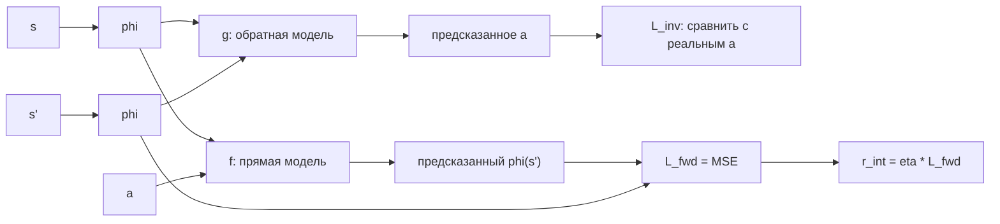

# Вопрос 6. Внутренняя мотивация: дистилляция случайной сети (RND) и внутренний модуль любопытства (ICM).

> **Источники:** лекция 6 (`Slides/RL_MIPT_Lecture_6.pdf`), конспект [1] (Иванов, «Reinforcement Learning Textbook») раздел 8.2 «Внутренняя мотивация», стр. 195–203. Оригинальные статьи: Burda et al., «Exploration by Random Network Distillation» (2018); Pathak et al., «Curiosity-driven Exploration by Self-supervised Prediction» (2017); Burda et al., «Large-Scale Study of Curiosity-Driven Learning» (2018).
> **Пререквизиты:** [Основы: постановка задачи RL](00-osnovy.md#rl-task), [Основы: exploration vs exploitation](00-osnovy.md#exploration), [Основы: нейросеть как аппроксиматор](00-osnovy.md#nn).
> **Связанные билеты:** [Билет 3](03-mc-q-learning.md) — ε-greedy и табличное исследование; [Билет 14](14-bandits.md) — UCB-бонусы и оптимизм в лицо неопределённости, откуда растёт идея «бонуса за новизну»; [Билет 10](10-bias-variance-ppo.md) — PPO, тот самый «базовый алгоритм», к которому прикручивают внутреннюю награду.

[TOC]

## 1. Зачем это нужно и где стоит в курсе

Все разобранные ранее алгоритмы работают за счёт **разницы в сигнале**: градиент по политике, TD-ошибка, максимум по Q — всё требует, чтобы разные траектории приносили разную награду. Теперь представьте Montezuma's Revenge: чтобы получить первое очко, нужно спуститься по лестнице, спрыгнуть на канат, пройти мимо черепа и взять ключ — порядка сотни осмысленных действий подряд. Пока ключ не взят, награда тождественно нулевая, функционал — плато, градиент равен нулю. Такую награду называют **разреженной (sparse reward)**, а предельный случай (награда +1 только в терминальном состоянии, маленький штраф за время) конспект называет **задачей поиска**.

Стандартный ответ на вопрос «как исследовать» — ε-greedy: с вероятностью $\epsilon$ сходить куда попало (см. [Билет 3](03-mc-q-learning.md)). Но случайное блуждание — это диффузия: чтобы случайно выполнить сто «правильных» действий подряд, нужно экспоненциальное по длине цепочки число попыток. Теорема о сходимости Q-learning с ε-greedy формально верна, но требует бесконечного числа посещений каждой пары $(s,a)$; на практике агент за миллиард шагов не покинет первую комнату.

Идея внутренней мотивации взята у людей. Ребёнок не получает внешней награды за то, что тыкает пальцем в кнопки и роняет игрушки со стола, — он играет и строит модель мира: что чем управляется, что куда падает. Эти навыки потом пригодятся под любую внешнюю задачу. Формально: раз среда сигнала не даёт, **придумаем себе сигнал сами** — новый модуль внутри обучающейся системы будет платить агенту за новизну наблюдаемого.

!!! note Место в карте курса
    Это раздел **exploration**. Он ортогонален выбору базового алгоритма: внутренняя награда — просто добавка к $r_t$, а максимизировать сумму можно чем угодно (на практике — PPO, см. [Билет 10](10-bias-variance-ppo.md)). Идейный предок — оптимистичные бонусы UCB из [Билета 14](14-bandits.md), только там бонус считался по числу проб одной ручки, а здесь — по новизне состояния в огромном пространстве.

Почему нельзя просто взять UCB-бонус? В бандитах и табличных MDP работает **count-based** бонус вида $1/\sqrt{N(s)}$, где $N(s)$ — счётчик посещений. Но в Montezuma состояние — это кадр $210\times160$ пикселей: два кадра никогда не совпадают в точности, все счётчики равны единице, бонус постоянен и бесполезен. Нужен способ мерить новизну **обобщающе**: похожие состояния должны получать похожий бонус. Именно это и делают нейросетевые бонусы RND и ICM.

## 2. Постановка задачи и обозначения

Пусть дана среда $(\mathcal{S}, \mathcal{A}, p)$ и **внешняя награда (extrinsic reward)** $r^{ext}(s,a)$ — та, которую хочет заказчик. **Вспомогательной задачей (auxiliary task)** называется MDP $(\mathcal{S}, \mathcal{A}, p, r^{int})$ с той же динамикой, но с **внутренней наградой (intrinsic reward)** $r^{int}$, которую агент придумывает себе сам: она не приходит из среды, её вычисляет отдельный модуль внутри алгоритма.

Агент оптимизирует сумму:

$$
r_t = r^{ext}_t + \beta\, r^{int}_t ,
$$

где $\beta > 0$ — гиперпараметр масштабирования (в конспекте он обозначен $\alpha$; мы пишем $\beta$, чтобы не путать с learning rate). Обозначения $s, a, r, s', \gamma, V^\pi, Q^\pi$ — стандартные, см. [Основы](00-osnovy.md#rl-task).

!!! warning Локальное отступление от общих обозначений
    В этом билете $\phi(s)$ — это **функция эмбеддинга** (фильтр в ICM), а не «параметры критика», как в остальных билетах. Параметры обучаемой сети RND мы обозначим $\psi$, а её саму — $\hat f(s;\psi)$. Ещё одна ловушка: буквой $f$ в § 4.1 обозначена **случайная замороженная target-сеть RND**, а в § 4.2 — **модель прямой динамики ICM**; это разные объекты, просто обе статьи используют одну букву. Экзаменатор в этом месте обычно не придирается, но проговорить стоит.

## 3. Основная теория

### 3.1. Совмещение двух мотиваций

Награду $r = r^{ext} + \beta r^{int}$ можно скормить любому базовому алгоритму «как есть» — он ничего не заметит. Но агенту известны оба слагаемых по отдельности, и это можно использовать. По линейности матожидания:

$$
V^\pi(s) = V^\pi_{ext}(s) + \beta V^\pi_{int}(s), \qquad Q^\pi(s,a) = Q^\pi_{ext}(s,a) + \beta Q^\pi_{int}(s,a).
$$

Доказательство — прямо по определению $V^\pi$ как матожидания суммы дисконтированных наград. Практический вывод: у критика делают **две головы** (two value heads), каждая учится на своём куске награды. Это даёт три бонуса:

1. **Разные $\gamma$.** Таргеты считаются раздельно: $y_{ext} = r^{ext} + \gamma_{ext} V_{ext}(s')$, $y_{int} = r^{int} + \gamma_{int} V_{int}(s')$. В RND берут $\gamma_{ext}$ ближе к единице (внешняя награда далеко в будущем), а $\gamma_{int}$ поменьше — новизна «портится» быстро, планировать её на тысячу шагов вперёд бессмысленно.
2. **Non-episodic внутренняя награда.** При обучении $V_{int}$ флаги `done` из среды **игнорируются**: вся жизнь агента считается одним бесконечным эпизодом. Тогда агент понимает, что после смерти будет сброс в стартовое состояние, из которого снова можно попробовать добраться до интересной области. Классический пример: агент упал в яму, выбраться нельзя; эпизодичная $V_{int}$ оценивает всё как +0 и агент будет тянуть время, а non-episodic — мотивирует поскорее закончить неудачный эпизод и начать новый.
3. **Можно «выключать» мотивацию** по ходу обучения, не переучивая критика заново.

!!! warning Разложение верно только для $V^\pi$, а не для $V^*$
    Максимум суммы не равен сумме максимумов. Пусть в состоянии действие $a_1$ даёт внешнюю $+1$, действие $a_2$ — внутреннюю $+1$, остальное нули. Тогда $V^*_{ext} = V^*_{int} = 1$, но $V^*$ для суммы равна $1$, а не $2$: два действия сразу не выберешь. То же и для распределений $Z^\pi$ в distributional-подходе ([Билет 5](05-distributional.md)): складывать распределения можно, лишь предполагая независимость мотиваций, а они почти всегда скоррелированы.

### 3.2. Нестационарность внутренней награды

Внутренняя награда **по построению нестационарна**: модуль, который её выдаёт, сам обучается, и после каждого обновления одно и то же состояние оценивается иначе. Формально это ломает MDP (функция награды меняется во времени), и у этого два последствия:

- **Хорошее.** Бонус **затухает** по мере обучения — это и есть математическое выражение «привыкания»: то, что агент изучил, перестаёт быть интересным, и он идёт дальше. Без затухания агент навсегда «залипнет» в первой попавшейся области.
- **Плохое.** Старые переходы из реплей-буфера несут **устаревшие** значения бонуса. Поэтому внутреннюю мотивацию по умолчанию сочетают с **on-policy** алгоритмами (PPO/A3C), где данные свежие. Off-policy тоже возможно, но требует пересчёта бонуса в момент сэмплирования из буфера.

Отсюда же практическая деталь из статьи RND: бонус **нормируют на бегущую оценку стандартного отклонения** (running std) внутренних доходностей. Масштаб $\|\hat f - f\|^2$ произволен и меняется по ходу обучения на порядки, так что фиксированный $\beta$ подобрать невозможно; после нормировки бонус «в среднем» константен и $\beta$ настраивается один раз. Цена: затухание исследования перестаёт быть автоматическим — нормировка возвращает бонусу масштаб даже там, где абсолютная ошибка уже мала.

### 3.3. Таксономия исследовательских бонусов

| Семейство | Формула бонуса | Идея | Чем плохо |
|---|---|---|---|
| **Count-based** | $r^{int} = 1/\sqrt{N(h(s))}$ или $1/N(h(s))$ | считаем посещения; $h$ — хэш-«оракул» (в табличном случае $h(s)=s$) | не масштабируется: в непрерывных/пиксельных пространствах все счётчики равны 1; нужно хранить таблицу; все состояния «равноценны», сходство не учитывается |
| **Эпизодичный count-based** | $r^{int}_t = \mathbb{I}[\forall t' < t:\ h(s_t) \neq h(s_{t'})]$ | +1 за первое посещение в эпизоде | награда зависит от истории → формально уже не MDP, а PoMDP; учит «оббегать всю карту» каждый эпизод |
| **Pseudo-counts** | $r^{int} = 1/\sqrt{\hat N(s)}$, где $\hat N$ выведен из плотностной модели | обобщение счётчиков через обучаемую модель плотности $\rho(s)$ | нужна хорошая генеративная модель наблюдений — дорого и хрупко |
| **Prediction-error** (RND, ICM) | $r^{int} = \|\text{предсказание} - \text{факт}\|^2$ | ошибка вспомогательной регрессии как прокси новизны | ошибка растёт не только от новизны, но и от шума среды и от нехватки ёмкости сети |
| **Information gain** (VIME, Houthooft et al. 2016, «Variational Information Maximizing Exploration») | $r^{int} = \mathrm{KL}(p(\theta \mid \mathcal{D}, s,a,s') \,\|\, p(\theta \mid \mathcal{D}))$ | платим за то, **насколько обновилась** модель мира, а не за размер ошибки | концептуально самый правильный ответ (шумный телевизор информации не даёт), но требует байесовской модели динамики — дорого и плохо масштабируется |

Дальше подробно разбираем два представителя prediction-error: **RND** (ошибка на случайной задаче — прокси новизны) и **ICM** (ошибка модели мира — любопытство).

## 4. Алгоритмы

### 4.1. RND: дистилляция случайной сети

**Ключевой трюк.** Возьмём **произвольную** задачу регрессии на состояниях. Известный факт из ML: модель, обученная на выборке, ошибается сильнее на входах, не похожих на обучающие. Значит, ошибка регрессии — приближение **оценки новизны (novelty estimation)**.

Какую задачу взять? Требование одно: таргет должен быть **детерминированной и стационарной** функцией состояния. Если таргет случаен, ошибка MSE в пределе равна дисперсии таргета, и бонус будет мерить шум, а не новизну. Простейший способ гарантировать детерминированность — сделать таргетом выход **случайной фиксированной нейросети**:

- **Target network** $f: \mathcal{S} \to \mathbb{R}^d$ — случайно инициализирована, веса заморожены навсегда, никогда не обучается;
- **Predictor network** $\hat f(\cdot\,;\psi): \mathcal{S} \to \mathbb{R}^d$ — обучается на встреченных состояниях решать задачу **дистилляции (distillation)**:

$$
\mathbb{E}_{s \sim \mathcal{D}} \big\| \hat f(s;\psi) - f(s) \big\|^2_2 \to \min_\psi .
$$

Бонус — та же невязка на новом переходе:

$$
r^{int}(s') = \big\| \hat f(s';\psi) - f(s') \big\|^2_2 .
$$

**Почему это новизна.** Предиктор видел на обучении только посещённые состояния и там уже подогнался; в области, куда агент не заходил, он не знает, что выдаёт $f$, и ошибается. Чем чаще состояние посещалось — тем меньше ошибка. Получается непрерывный, обобщающийся аналог $1/N(s)$.

**Почему это лучше, чем предсказывать следующее состояние.** Таргет $f(s')$ — детерминированная функция входа: никакой стохастики среды в нём нет. Шумный телевизор в RND не страшен — если картинка шума уже встречалась «в среднем», предиктор выучит соответствующий выход $f$; бонус за шум затухает, потому что таргет не случаен. Модель прямой динамики такой роскоши лишена: её таргет $s'$ сам по себе случайная величина.

**Важные практические детали (из статьи):**

- **Нормализация наблюдений.** Случайная сеть чувствительна к масштабу входа. Перед обучением запускают случайного агента, собирают пакет состояний, считают по нему среднее и отклонение, нормируют и клиппируют. Статистики после этого **не меняют**, иначе таргет $f(s)$ станет нестационарным — ровно то, что метод запрещает.
- **Нормализация бонуса** на бегущее std внутренних доходностей (см. §3.2).
- **Две головы критика**, non-episodic $V_{int}$, разные $\gamma$.
- Полезно первые итерации обучать вообще без внешней награды, пока предиктор не выйдет на асимптоту.
- Инициализация target-сети должна давать **разные** ответы на разных состояниях (иначе задача тривиальна и бонус всюду нулевой).

```text
RND + PPO (одна итерация)
 1. Собрать rollout: N шагов политикой pi_theta, сохранив (s, a, r_ext, s').
 2. Нормировать наблюдения бегущими (замороженными) статистиками.
 3. Для каждого s' посчитать r_int = || f_hat(s'; psi) - f(s') ||^2.
 4. Поделить r_int на бегущее std внутренних доходностей.
 5. Посчитать две оценки преимущества (GAE):
       A_ext -- по r_ext, эпизодично, с gamma_ext;
       A_int -- по r_int, БЕЗ учёта done, с gamma_int.
 6. A = c_ext * A_ext + c_int * A_int.
 7. Сделать шаг PPO по theta с преимуществом A; обновить обе головы критика.
 8. Сделать шаг SGD по psi: минимизировать || f_hat(s'; psi) - f(s') ||^2
    (обычно на случайной подвыборке батча, чтобы не выучивать бонус слишком быстро).
```

**Результат.** По утверждению авторов, RND — первый метод, превзошедший **средний человеческий** результат на Montezuma's Revenge **без демонстраций и без доступа к внутреннему состоянию эмулятора**, и время от времени (хотя и нечасто) проходящий первый уровень игры целиком. Важен не столько счёт, сколько факт: разреженная награда, на которой обычный DQN набирал ноль, стала решаемой.

### 4.2. ICM: внутренний модуль любопытства

**Любопытством (curiosity)** называется ошибка **модели мира** агента. Наивная реализация: учим модель прямой динамики $f(s,a) \approx s'$ и берём

$$
r^{int}(s,a,s') = \|f(s,a) - s'\|^2_2 .
$$

Такой агент идёт не туда, где ново, а туда, **где он не понимает, как устроена среда**. Тонкая, но реальная разница: если в ряд стоят тысячи одинаковых дверей с разными номерами, бонус за новизну будет платить за каждую новую дверь, а любопытство быстро выучит «за дверьми ничего нет» и затухнет.

**Почему нельзя предсказывать пиксели.** Четыре причины: (1) генерация картинок дорога; (2) ёмкость сети тратится на выучивание движения всей сцены, включая фон; (3) MSE в пространстве пикселей — плохая метрика «понятности»; (4) главное — среда стохастична, и на любом шумном фоне ошибка **принципиально не снижаема**.

**Решение — обучить правильный эмбеддинг.** Нужен фильтр $\phi: \mathcal{S} \to \mathbb{R}^d$, который (а) выбрасывает нерелевантный шум среды, (б) сохраняет информацию, нужную для решения задачи, (в) даёт небольшое латентное пространство, где дёшево считать MSE. Ключевая идея ICM: такой фильтр получается сам собой, если учить **модель обратной динамики (inverse dynamics model)** — по паре соседних состояний восстанавливать действие между ними:

$$
\mathcal{L}_{inv} = \mathbb{E}_{s,a,s'} \big\| g(\phi(s), \phi(s')) - a \big\|^2_2 \quad \text{(или } -\log g(a \mid \phi(s),\phi(s')) \text{ для дискретных } \mathcal{A}).
$$

Чтобы угадать действие, информация о декоративном мигающем солнышке на фоне не нужна — и фильтр её просто выбросит. Останется описание только тех объектов, **на которые агент влияет**; конспект называет такие представления **контролируемым состоянием (controllable state)**, а $\phi$ — **фильтром (filter)**.

Поверх отфильтрованного представления строим прямую динамику:

$$
\mathcal{L}_{fwd} = \mathbb{E}_{s,a,s'} \big\| f(\phi(s), a) - \phi(s') \big\|^2_2 , \qquad r^{int}(s,a,s') = \eta \big\| f(\phi(s),a) - \phi(s') \big\|^2_2 ,
$$

где $\eta > 0$ — масштабирующий коэффициент. Обучают **обе модели совместно**, одним лоссом:

$$
\mathcal{L}_{ICM} = (1-\lambda)\,\mathcal{L}_{inv} + \lambda\,\mathcal{L}_{fwd},
$$

и суммарно с лоссом базового алгоритма: $\min_{\theta,\phi,f,g} \big[ -J(\pi_\theta) + c \cdot \mathcal{L}_{ICM} \big]$, где $J(\pi_\theta)$ — обычный целевой функционал политики.

!!! tip Зачем градиент от $\mathcal{L}_{fwd}$ течёт в фильтр
    Градиенты нигде не останавливаются, и это осмысленно: прямая модель требует от $\phi$ представлений, которые **легко предсказывать**, а обратная — чтобы в них хватало информации на восстановление действия. Они регуляризуют друг друга. Без $\mathcal{L}_{inv}$ оптимальным решением было бы $\phi(s) \equiv \text{const}$: нулевая ошибка предсказания и нулевой бонус — коллапс.



```text
ICM + базовый on-policy алгоритм (одна итерация)
 1. Собрать rollout (s, a, r_ext, s') политикой pi_theta.
 2. Посчитать phi(s), phi(s').
 3. r_int = eta * || f(phi(s), a) - phi(s') ||^2   (градиент здесь не нужен).
 4. r = r_ext + beta * r_int.
 5. Шаг обучения политики (A3C/PPO) по награде r.
 6. Шаг SGD по (phi, g, f): (1 - lambda) * L_inv + lambda * L_fwd.
```

В оригинальной работе (Pathak et al. 2017) ICM обучался поверх A3C и в Super Mario Bros **вообще без внешней награды**, только на любопытстве, проходил более 30 % первого уровня (дальше мешала яма, требующая специфической последовательности из 15–20 нажатий). В более позднем large-scale исследовании (Burda et al. 2018) агент на чистом любопытстве добирался уже до 11 разных уровней игры.

!!! info Побочный эффект
    Максимизация ошибки модели мира порождает **игровое поведение (emergence of playing behavior)**: агент начинает «играть» с интерактивными объектами — именно потому, что они меняют состояние непредсказуемым для модели образом.

## 5. Пример

Возьмём игрушечный лабиринт: комнаты $A \to B \to C \to D$ в цепочку, награда $+1$ только в $D$, во всех остальных местах ноль. ε-greedy проводит время в $A$ (из $A$ выйти в $B$ надо угадать 5 действий подряд).

Что делает count-based бонус $1/\sqrt{N(s)}$ — и что делает RND-бонус. Числа ниже **условны, это иллюстрация**, а не замер.

| Число посещений комнаты $B$ | $1/\sqrt{N}$ | Ошибка предиктора RND (усл. ед.) | Что происходит |
|---|---|---|---|
| 1 | 1.00 | 0.9 | предиктор ни разу не учился на этих кадрах, ошибается сильно; агент рвётся в $B$ |
| 10 | 0.32 | 0.25 | предиктор подогнался под типичные кадры $B$; бонус упал, но за редкий угол комнаты ещё платит |
| 100 | 0.10 | 0.02 | комната «выучена», бонус практически нулевой; агент переключается на $C$ |

Ключевое отличие от счётчиков: RND платит не за конкретный кадр, а **за область**, и умеет обобщать — если комната $C$ визуально похожа на $B$, бонус за неё сразу будет ниже, чем за принципиально новую $D$. Бонус работает как фронт волны, сдвигающийся вглубь лабиринта: он ведёт агента к $D$, где тот наконец находит внешнюю награду, а затем затухает, и за дело берётся внешняя мотивация.

## 6. Подводные камни, сравнения, типичные ошибки

!!! warning Шумный телевизор (noisy TV)
    **Шумным телевизором** называются принципиально непредсказуемые в силу стохастичности переходов явления. В комнате стоит сломанный телевизор с гауссовским шумом; предсказать следующий кадр шума невозможно, ошибка прямой модели не снижается **никогда**. Агент с наивным curiosity-бонусом садится перед телевизором и смотрит его вечно — это **проблема прокрастинации (procrastination)**: область среды выдаёт высокий и не затухающий сигнал, перебивающий все остальные мотивации.

**Как ICM с этим борется и где ломается.** Обратная модель фильтрует шум, **неподконтрольный** агенту: чтобы угадать действие, знать содержимое телевизора не нужно, и $\phi$ его выбросит. Но если у агента есть **пульт** — действие $\hat a$, переключающее канал на случайный, — обратная модель по факту смены картинки однозначно опознаёт $\hat a$, значит содержимое экрана **обязано** остаться в $\phi(s)$, а предсказать новый канал прямая модель не может. Итог: ICM залипает на пульте. Это концептуальная проблема любопытства вообще, а не баг ICM: вдруг задача и состоит в том, чтобы долистать до сотого канала? Отсюда честный вывод лекции — «управляемые шумные телевизоры придётся оставить».

!!! warning Почему RND устойчивее, но не идеален
    RND не страдает от стохастики среды: его таргет детерминирован. Но у него остаются две другие причины большой ошибки: **нехватка ёмкости** предиктора (он физически не может выучить $f$ всюду, и бонус остаётся ненулевым в сложных областях) и **procedural noise** — если среда генерирует новые уровни процедурно, каждый кадр объективно нов, и бонус не затухает. Плюс RND ничего не знает о действиях агента: он платит за «оказаться там», а не за «понять, как это работает».

!!! warning Ещё три грабли
    **Couch potato.** Если бонус считается по наблюдению, а агент может закрыть глаза (в Atari — уткнуться в стену, где кадр стабилен), то внутренняя награда обнуляется и агент «ложится на диван». Симметрично к прокрастинации: не залипание на шуме, а избегание сложного мира.
    **Забывание.** Предиктор — нейросеть; если агент надолго ушёл из комнаты $B$, предиктор может её «забыть» (catastrophic forgetting), бонус вернётся и агент пойдёт туда снова. Иногда это полезно, чаще — цикличное поведение.
    **Масштаб $\beta$.** Слишком большой — агент забивает на внешнюю награду и вечно исследует; слишком маленький — исследование не пробивает плато, метод вырождается в исходный алгоритм. Поэтому и нужна нормировка бонуса, превращающая $\beta$ в стабильный гиперпараметр.

### Сравнение RND и ICM

| Критерий | RND | ICM |
|---|---|---|
| Что предсказываем | выход **случайной фиксированной** сети $f(s')$ | эмбеддинг следующего состояния $\phi(s')$ |
| Таргет | детерминированный и стационарный по построению | обучаемый, значит **нестационарный** (эмбеддинг «плывёт») |
| Смысл бонуса | новизна состояния (прокси счётчика) | непонятность динамики (любопытство) |
| Нужна ли информация о действии | нет, $r^{int} = r^{int}(s')$ | да, нужны тройки $(s,a,s')$ |
| Нужна ли модель действий | нет | да: обратная модель $g$ обязательна |
| Устойчивость к шуму среды | высокая: неуправляемый и управляемый шум одинаково не мешают (таргет не случаен) | к неуправляемому — да (фильтр $\phi$); к **управляемому** («пульт») — нет |
| Слабое место | ёмкость предиктора, procedural noise, игнорирование действий | управляемый шумный телевизор, нестационарный эмбеддинг, коллапс $\phi$ при слабой $\mathcal{L}_{inv}$ |
| Стоимость | две небольшие сети, один forward+backward на батч | три сети ($\phi$, $f$, $g$), совместное обучение с политикой |
| Сложность реализации | низкая | средняя (баланс $\lambda$, риск коллапса) |

!!! warning Типичные ошибки на экзамене
    — «Target-сеть в RND — это как target-network в DQN». Нет: в DQN таргет-сеть — копия обучаемой, её периодически обновляют; в RND она **случайна и не обучается никогда**, у неё нет «правильного» смысла.
    — «RND решает проблему шумного телевизора полностью». Нет: он на неё не реагирует, но остаётся уязвим к процедурному шуму и ограниченной ёмкости.
    — «Бонус ICM — это ошибка обратной модели». Нет: бонус — ошибка **прямой** модели; обратная нужна только чтобы обучить эмбеддинг. Ошибка обратной модели плоха как бонус: два разных действия часто приводят в одно состояние (упор в стену), и невязка будет высокой вечно.

## 7. Ответ за 5 минут

1. **Проблема.** Разреженная награда (Montezuma's Revenge, «задача поиска»): функционал — плато, градиента нет, ε-greedy случайно не соберёт сотню правильных действий.
2. **Идея.** Придумать себе вспомогательную задачу с **внутренней наградой** $r^{int}$: MDP с той же динамикой, но наградой, генерируемой самим агентом. Аналогия — детское любопытство и игра.
3. **Схема.** $r_t = r^{ext}_t + \beta r^{int}_t$; максимизируем чем угодно, обычно PPO.
4. **Разложение.** $V^\pi = V^\pi_{ext} + V^\pi_{int}$ (для $V^*$ неверно!). Отсюда: две головы критика, разные $\gamma_{ext}, \gamma_{int}$, **non-episodic** $V_{int}$ (агент понимает, что после сброса можно попробовать ещё раз).
5. **Нестационарность** $r^{int}$ — фича (бонус затухает = «привыкание») и баг (нужны on-policy алгоритмы).
6. **Таксономия бонусов:** count-based $1/\sqrt{N(s)}$ и pseudo-counts (не масштабируются на пиксели), prediction-error (RND, ICM), information gain (правильно, но дорого).
7. **RND.** Случайная замороженная $f(s)$ + обучаемый предиктор $\hat f(s;\psi)$; бонус $r^{int} = \|\hat f(s') - f(s')\|^2$. Ошибка велика там, где предиктор не учился ⇒ новизна. Таргет детерминирован ⇒ шум среды не мешает. Детали: нормировка наблюдений (замороженные статистики), нормировка бонуса на бегущее std, две головы, non-episodic.
8. **Любопытство** = ошибка модели мира. Наивно: $\|f(s,a) - s'\|^2$ в пикселях — дорого, шумно, ломается на стохастике.
9. **ICM.** Обратная модель $g(\phi(s),\phi(s')) \approx a$ учит фильтр $\phi$ оставлять только **контролируемое** агентом; прямая модель $f(\phi(s),a) \approx \phi(s')$ даёт бонус $r^{int} = \eta\|f(\phi(s),a) - \phi(s')\|^2$; лосс $(1-\lambda)\mathcal{L}_{inv} + \lambda\mathcal{L}_{fwd}$, градиент течёт всюду, иначе $\phi \equiv \text{const}$.
10. **Noisy TV.** Неуправляемый шум ICM фильтрует; **управляемый** («телевизор с пультом») — нет, агент прокрастинирует. RND к шуму нечувствителен вовсе.
11. **Итог.** RND проще и устойчивее: первым обошёл средний человеческий результат на Montezuma без демонстраций; ICM даёт более «осмысленное» исследование (играет с предметами) и в Mario проходит часть уровня вообще без внешней награды.

## 8. Вероятные допвопросы экзаменатора

**Почему target-сеть в RND случайная и не обучается?**
Нам нужна регрессионная задача с **детерминированным и стационарным** таргетом. Если таргет случаен, MSE-ошибка в пределе равна дисперсии таргета, и бонус будет мерить шум среды. Если таргет меняется по ходу обучения, ошибка отразит его дрейф, а не новизну входа. Замороженная случайная сеть удовлетворяет обоим требованиям и при этом даёт разные ответы на разных состояниях.

**Чем ICM-эмбеддинг лучше сырых пикселей?**
В пикселях модель вынуждена предсказывать весь фон, включая нерелевантный шум, и её ошибка никогда не падает до нуля. Эмбеддинг $\phi$, обученный на задаче восстановления действия, физически не содержит информации о том, что от действий агента не зависит, — фильтр выбрасывает шумный телевизор ещё до того, как прямая модель начнёт работать. Плюс латентное пространство маленькое, MSE в нём дёшев и осмыслен.

**Что будет, если $\beta$ слишком большой?**
Агент перестанет оптимизировать реальную задачу: он будет бесконечно исследовать, игнорируя даже найденную внешнюю награду («вечный турист»). Слишком маленький $\beta$ — бонус тонет в шуме и не помогает пробить плато. Ровно поэтому в RND бонус нормируют на бегущее std: это делает шкалу $r^{int}$ стабильной и позволяет подобрать $\beta$ один раз.

**Почему внутренняя награда non-episodic?**
Чтобы агент не боялся смерти ради исследования. Если $V_{int}$ учить с флагами `done`, терминальное состояние обрывает будущий бонус и агенту «выгодно» тянуть время в безнадёжной ситуации. Игнорируя `done`, агент учитывает, что после сброса он окажется в $s_0$, откуда можно снова пойти к интересной области — и завершает неудачный эпизод побыстрее.

**В чём разница между count-based и prediction-based бонусами?**
Count-based явно хранит статистику посещений и платит $1/\sqrt{N(s)}$; он точен, но не обобщает (нужен хэш-оракул) и не работает в непрерывных/пиксельных пространствах. Prediction-based использует ошибку обучаемой модели как **обобщающий** прокси счётчика: похожие состояния автоматически получают похожий бонус, память не нужна. Цена — ошибка может быть велика и по посторонним причинам (шум, нехватка ёмкости).

**Можно ли использовать RND с off-policy алгоритмом?**
Формально мешает нестационарность: бонус, записанный в буфер вчера, сегодня уже неверен — состояние стало «выученным». Практические рецепты: пересчитывать $r^{int}$ в момент сэмплирования батча из буфера и/или отделять внутреннюю голову критика. Оригинальный RND намеренно построен поверх on-policy PPO; более поздние методы семейства (NGU/Agent57) комбинируют бонус с off-policy обучением, добавляя эпизодическую память.

**Почему ошибку обратной модели не берут в качестве бонуса напрямую?**
Потому что $p(a \mid s, s')$ зависит от текущей политики и часто **принципиально неоднозначна**: если два действия ведут в одно состояние (упор в стену, эквивалентные комбинации кнопок), классификатор будет размазывать вероятности между ними, и ошибка не упадёт до нуля никогда. Это тот же шумный телевизор, только переехавший в пространство действий.
