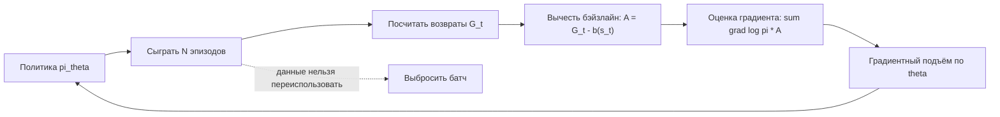

# Вопрос 7. Подход Policy Gradient. Алгоритм REINFORCE и его модификации.

> **Источники:** лекция 7 (`Slides/RL_MIPT_Lecture_7.pdf`, целиком) и начало лекции 8 (`Slides/RL_MIPT_Lecture_8.pdf`, стр. 2–14); конспект [1] (Иванов, «Reinforcement Learning Textbook») § 5.1 «Policy Gradient Theorem», стр. 120–131. Для сверки: Sutton & Barto, гл. 13; Williams (1992); Schulman, «Optimizing Expectations» (2016).
> **Пререквизиты:** [Основы: политика](00-osnovy.md#policy), [функции ценности](00-osnovy.md#value), [вероятность и трюк с логарифмом](00-osnovy.md#probability), [градиентный подъём](00-osnovy.md#gradient), [матожидание и Монте-Карло](00-osnovy.md#expectation-mc), [bias–variance](00-osnovy.md#bias-variance), [on-policy / off-policy](00-osnovy.md#onoff-policy).
> **Связанные билеты:** [Билет 1](01-cem.md) — CEM как безградиентная оптимизация в пространстве политик; [Билет 8](08-a2c-gae.md) — критик, A2C, GAE (продолжение этого билета); [Билет 9](09-trpo.md) — естественный градиент и TRPO; [Билет 10](10-bias-variance-ppo.md) — bias–variance и PPO; [Билет 11](11-dpg-ddpg-td3.md) — детерминированный градиент и reparametrization; [Билет 12](12-sac.md) — энтропийная регуляризация.

[TOC]

## 1. Зачем это нужно и где стоит в курсе

До этого момента мы изучали **value-based** методы: Q-learning, DQN и их родственники. Все они учат ответ на вопрос «сколько стоит»: насколько хороша пара «состояние–действие». Политика при этом получается не напрямую, а как побочный продукт — берём $\arg\max_a Q(s,a)$. Это косвенный путь: чтобы научиться правильно ходить, агент сначала обязан научиться точно оценивать все варианты.

**Policy Gradient** — третий большой подход курса (после динамического программирования и value-based): мы параметризуем саму политику $\pi_\theta(a \mid s)$ нейросетью и напрямую поднимаем градиентом целевой функционал $J(\theta)$ — среднюю награду. Агент учит не «сколько стоит», а «что делать».

!!! note Интуиция
    Бытовая аналогия: «делай чаще то, что привело к успеху». Сыграли партию — посмотрели на итог. Если результат хороший, увеличиваем вероятности всех сделанных ходов; если плохой — уменьшаем. Никаких таблиц ценностей, никакого $\max$ — только «подкрутить вероятности в сторону удачных решений». Именно поэтому Уильямс в 1992 году назвал алгоритм REINFORCE (REward Increment = Nonnegative Factor × Offset Reinforcement × Characteristic Eligibility).

Что даёт прямая оптимизация политики:

| Плюсы | Минусы |
|---|---|
| Непрерывные пространства действий «из коробки»: не нужно брать $\max_a$ по континууму | Огромная дисперсия оценки градиента — главная болезнь метода |
| Естественно выражает **стохастические** политики (нужны в частично наблюдаемых средах и в играх с блефом) | Жёсткий **on-policy** режим: данные нельзя переиспользовать, сэмпл-эффективность низкая |
| Работает даже когда $Q(s,a)$ недифференцируема по $a$ и действия дискретны | Сходимость только к **локальному** оптимуму $J(\theta)$ |
| Гарантии обычной стохастической оптимизации: несмещённая оценка градиента $\Rightarrow$ SGD сходится | Чувствительность к шагу: один плохой шаг может «развалить» политику |
| Не нужно учить сложную $Q^*$ — достаточно (позже) простой $V^\pi$ | Требует эпизодичности среды в базовой версии |

Место в карте курса: это **policy-based** ветвь. Из неё вырастает всё остальное — actor-critic ([билет 8](08-a2c-gae.md)), TRPO ([билет 9](09-trpo.md)), PPO ([билет 10](10-bias-variance-ppo.md)), SAC ([билет 12](12-sac.md)). С [билетом 1](01-cem.md) (CEM) общее — оптимизация в пространстве политик; отличие в том, что CEM работает **без градиента** (эволюционно), а здесь мы честно считаем $\nabla_\theta J$ и потому масштабируемся на сети с миллионами параметров.

## 2. Постановка задачи и обозначения

Пусть задан MDP $(\mathcal{S}, \mathcal{A}, p, r, \gamma)$. Политика параметризована вектором $\theta \in \mathbb{R}^d$ (веса нейросети) и дифференцируема по $\theta$. Два стандартных семейства:

**Дискретные действия — softmax-политика.** Сеть выдаёт логиты $f_\theta(s, a)$ для каждого действия, а вероятность получается нормировкой:

$$\pi_\theta(a \mid s) = \frac{\exp f_\theta(s,a)}{\sum_{a' \in \mathcal{A}} \exp f_\theta(s,a')}$$

**Непрерывные действия — гауссова политика.** Сеть выдаёт среднее $\mu_\theta(s)$ и разброс $\sigma_\theta(s)$ (часто $\sigma$ — отдельный обучаемый параметр, не зависящий от $s$):

$$\pi_\theta(a \mid s) = \mathcal{N}\!\left(a \mid \mu_\theta(s),\, \sigma_\theta^2(s)\right) = \frac{1}{\sqrt{2\pi}\,\sigma_\theta(s)} \exp\left(-\frac{(a - \mu_\theta(s))^2}{2\sigma_\theta^2(s)}\right)$$

Оптимизируем стандартный функционал (см. [Основы, §policy](00-osnovy.md#policy)):

$$J(\theta) := \mathbb{E}_{\tau \sim \pi_\theta} R(\tau) = \mathbb{E}_{\tau \sim \pi_\theta} \sum_{t \ge 0} \gamma^t r_t = V^{\pi_\theta}(s_0) \to \max_\theta$$

Здесь $\tau = (s_0, a_0, r_0, s_1, \dots)$ — траектория; $R(\tau) = \sum_t \gamma^t r_t$ — суммарная дисконтированная награда за эпизод; $G_t = \sum_{\hat t \ge t} \gamma^{\hat t - t} r_{\hat t}$ — reward-to-go, награда «с шага $t$ и до конца».

!!! warning Почему нельзя просто продифференцировать «через среду»
    Хочется написать цепное правило: награда зависит от действия, действие от $\theta$ — и вперёд. Не получится по двум причинам. Во-первых, **динамика $p(s' \mid s, a)$ нам неизвестна**: среда — чёрный ящик, из которого мы умеем только получать сэмплы, у нас нет её аналитического вида. Во-вторых, даже если бы она была известна, $r(s,a)$ и переходы **недифференцируемы по $a$**, когда действия дискретны: сравнить награды за $a=0$ и $a=1$ можно, а «производную по $a$» взять нельзя.

Спасение в том, что мы дифференцируем **не по действиям, а по параметрам распределения над действиями**. Переход к стохастическим политикам — это «релаксация» задачи: дискретный выбор заменяется на непрерывно меняющиеся вероятности, по которым уже можно дифференцировать.

## 3. Основная теория

### 3.1. Трюк с логарифмом (log-derivative trick)

Базовое тождество (см. [Основы, §probability](00-osnovy.md#probability)): для любой параметризованной плотности $p_\theta$

$$\nabla_\theta p_\theta(x) = p_\theta(x) \frac{\nabla_\theta p_\theta(x)}{p_\theta(x)} = p_\theta(x) \nabla_\theta \log p_\theta(x)$$

Зачем он нужен: он превращает «градиент от плотности» обратно в **матожидание по этой же плотности**, а матожидание мы умеем оценивать по Монте-Карло. Технику оценивания градиента через сэмплирование из стохастического узла вычислительного графа и называют **REINFORCE-оценкой** (второе название — score function estimator, поскольку $\nabla_\theta \log p_\theta$ в статистике зовётся score-функцией).

### 3.2. Вывод А: через распределение траекторий

Это самый короткий путь. Политика $\pi_\theta$ порождает распределение на траекториях $p_\theta(\tau)$; $J(\theta) = \int p_\theta(\tau) R(\tau)\, d\tau$.

$$
\begin{aligned}
\nabla_\theta J(\theta) &= \nabla_\theta \int p_\theta(\tau) R(\tau)\, d\tau = \int \nabla_\theta p_\theta(\tau) \, R(\tau)\, d\tau \\
&= \int p_\theta(\tau) \nabla_\theta \log p_\theta(\tau) \, R(\tau)\, d\tau = \mathbb{E}_{\tau \sim \pi_\theta} \left[ \nabla_\theta \log p_\theta(\tau) \, R(\tau) \right]
\end{aligned}
$$

Первый переход — внесение градиента под интеграл (законно при условиях регулярности: награды ограничены, все ряды сходятся абсолютно). Второй — трюк с логарифмом.

Теперь раскроем $\log p_\theta(\tau)$. Вероятность траектории — произведение вероятностей по марковскому свойству:

$$p_\theta(\tau) = p(s_0) \prod_{t \ge 0} \pi_\theta(a_t \mid s_t)\, p(s_{t+1} \mid s_t, a_t)$$

$$\log p_\theta(\tau) = \log p(s_0) + \sum_{t \ge 0} \log \pi_\theta(a_t \mid s_t) + \sum_{t \ge 0} \log p(s_{t+1} \mid s_t, a_t)$$

**Ключевой момент всего билета:** при взятии $\nabla_\theta$ первое и третье слагаемые обнуляются — $p(s_0)$ и $p(s' \mid s, a)$ **не зависят от $\theta$** (среда не меняется от того, как мы настраиваем сеть). Поэтому

$$\nabla_\theta \log p_\theta(\tau) = \sum_{t \ge 0} \nabla_\theta \log \pi_\theta(a_t \mid s_t)$$

и мы получаем формулу, из которой динамика среды исчезла полностью:

$$\boxed{\ \nabla_\theta J(\theta) = \mathbb{E}_{\tau \sim \pi_\theta} \left[ \left(\sum_{t \ge 0} \nabla_\theta \log \pi_\theta(a_t \mid s_t)\right) R(\tau) \right]\ }$$

Всё, что нужно для оценки — уметь **играть** в среде и уметь считать $\nabla_\theta \log \pi_\theta(a\mid s)$ автодиффом. Модель среды не нужна.

### 3.3. Причинность (causality) и reward-to-go

Раскроем $R(\tau)$ и перемножим два ряда:

$$\nabla_\theta J(\theta) = \mathbb{E}_{\tau} \sum_{t \ge 0} \sum_{\hat t \ge 0} \nabla_\theta \log \pi_\theta(a_t \mid s_t)\, \gamma^{\hat t} r_{\hat t}$$

Странность видна сразу: на градиент за решение выбрать $a_t$ влияют награды $r_{\hat t}$ при $\hat t < t$ — то есть награды, полученные **до** принятия решения, на которые оно физически не могло повлиять. (Лекционный пример: агент сто шагов играл блестяще, накопил огромную награду, а на шаге 101 сделал катастрофическую ошибку — но в весе этого решения всё ещё стоит большая сумма прошлых наград, и ошибку мы «не увидим».) Формально эти слагаемые обнуляются.

**Лемма.** Для любого параметризованного распределения: $\mathbb{E}_{a \sim \pi_\theta} \nabla_\theta \log \pi_\theta(a) = 0$.

$$\mathbb{E}_{a \sim \pi_\theta} \nabla_\theta \log \pi_\theta(a) = \int \pi_\theta(a) \frac{\nabla_\theta \pi_\theta(a)}{\pi_\theta(a)}\, da = \nabla_\theta \int \pi_\theta(a)\, da = \nabla_\theta 1 = 0$$

**Принцип причинности.** При $\hat t < t$: $\ \mathbb{E}_{\tau \sim \pi}\, \nabla_\theta \log \pi_\theta(a_t \mid s_t)\, \gamma^{\hat t} r_{\hat t} = 0$.

Доказательство: распишем матожидание по траектории как вложенные матожидания и вынесем «прошлое» наружу. Величина $\gamma^{\hat t} r_{\hat t}$ измерима относительно прошлого, то есть внутри внутреннего матожидания она — константа:

$$\mathbb{E}_{s_0, a_0, \dots, s_{\hat t}, a_{\hat t}} \Big[\gamma^{\hat t} r_{\hat t} \cdot \underbrace{\mathbb{E}_{s_{\hat t + 1}, \dots, s_t, a_t} \nabla_\theta \log \pi_\theta(a_t \mid s_t)}_{= 0 \text{ по лемме}}\Big] = 0$$

Внутреннее матожидание равно нулю, потому что последнее усреднение — это в точности $\mathbb{E}_{a_t \sim \pi_\theta(\cdot \mid s_t)} \nabla_\theta \log \pi_\theta(a_t \mid s_t)$ при фиксированном $s_t$.

Значит, слагаемые с $\hat t < t$ можно **вычеркнуть**: матожидание не изменится (оценка останется несмещённой), а дисперсия Монте-Карло упадёт — мы убрали чистый шум. Осталось аккуратно вынести дисконт: $\sum_{\hat t \ge t} \gamma^{\hat t} r_{\hat t} = \gamma^t \sum_{\hat t \ge t} \gamma^{\hat t - t} r_{\hat t} = \gamma^t G_t$. Итог:

$$\nabla_\theta J(\theta) = \mathbb{E}_{\tau \sim \pi_\theta} \sum_{t \ge 0} \gamma^t\, \nabla_\theta \log \pi_\theta(a_t \mid s_t)\, G_t$$

### 3.4. Вывод Б: рекурсивный, через $V$ и $Q$ (собственно Policy Gradient Theorem)

Второй путь идёт «изнутри»: применяем трюк с логарифмом не к траектории целиком, а к каждому вложенному матожиданию по действию.

**Шаг 1.** Из $V^{\pi_\theta}(s) = \mathbb{E}_{a \sim \pi_\theta} Q^{\pi_\theta}(s,a) = \int \pi_\theta(a\mid s) Q^{\pi_\theta}(s,a)\, da$ по правилу градиента произведения:

$$\nabla_\theta V^{\pi_\theta}(s) = \underbrace{\int \nabla_\theta \pi_\theta(a\mid s) Q^{\pi}(s,a)\, da}_{\text{трюк с логарифмом}} + \int \pi_\theta(a\mid s) \nabla_\theta Q^{\pi_\theta}(s,a)\, da = \mathbb{E}_a\big[\nabla_\theta \log \pi_\theta(a\mid s) Q^\pi(s,a) + \nabla_\theta Q^{\pi_\theta}(s,a)\big]$$

**Шаг 2.** Выразим обратно $\nabla Q$ через $\nabla V$. Здесь всё тривиально: $Q^{\pi_\theta}(s,a) = r(s,a) + \gamma \mathbb{E}_{s'} V^{\pi_\theta}(s')$, а ни $r(s,a)$, ни $p(s'\mid s,a)$ от $\theta$ не зависят, поэтому

$$\nabla_\theta Q^{\pi_\theta}(s,a) = \gamma\, \mathbb{E}_{s' \sim p(\cdot \mid s,a)} \nabla_\theta V^{\pi_\theta}(s')$$

**Шаг 3.** Подставляем:

$$\nabla_\theta V^{\pi_\theta}(s) = \mathbb{E}_a \mathbb{E}_{s'} \big[ \nabla_\theta \log \pi_\theta(a\mid s) Q^\pi(s,a) + \gamma \nabla_\theta V^{\pi_\theta}(s') \big]$$

Это рекурсия «в духе уравнения Беллмана»: градиент $V$ в $s$ выражен через градиент $V$ в следующем состоянии с множителем $\gamma$.

**Шаг 4.** Раскручиваем её в будущее до бесконечности. На каждом уровне добавляется слагаемое $\nabla_\theta \log \pi_\theta(a_t\mid s_t) Q^\pi(s_t,a_t)$ с накопленным множителем $\gamma^t$, а вложенные матожидания $\mathbb{E}_{a_0}\mathbb{E}_{s_1}\mathbb{E}_{a_1}\dots$ собираются в матожидание по траектории. Получаем **Policy Gradient Theorem**:

$$\boxed{\ \nabla_\theta J(\theta) = \mathbb{E}_{\tau \sim \pi_\theta} \sum_{t \ge 0} \gamma^t\, \nabla_\theta \log \pi_\theta(a_t \mid s_t)\, Q^\pi(s_t, a_t)\ }$$

Совпадение с выводом А не случайно: $G_t$ — это несмещённая Монте-Карло оценка $Q^\pi(s_t,a_t)$, а матожидание по «хвосту» траектории всё равно берётся. Формально: вынесем $\mathbb{E}_{s_{t+1},a_{t+1},\dots}$ внутрь, и $\mathbb{E}[G_t \mid s_t, a_t] = Q^\pi(s_t,a_t)$ по определению Q-функции. Математически формы эквивалентны, но их **Монте-Карло оценки ведут себя совершенно по-разному** — это и будет источником всех модификаций.

!!! tip Как не запутаться в нумерации
    В конспекте [1] и на лекции рекурсивный вывод (через $V$ и $Q$, теорема 53 и утверждения 47–49) называется «первым способом», а траекторный (теорема 54) — «вторым». Здесь они переставлены местами: сначала короткий траекторный (вывод А), потом рекурсивный (вывод Б). Порядок изложения — вопрос вкуса; на экзамене достаточно уметь провести оба и сказать, что они дают одну и ту же формулу.

### 3.5. State visitation frequency и расцепление стохастик

В MDP есть два вида случайности: **внешняя** (extrinsic) — заложена в $p(s'\mid s,a)$, агенту неподконтрольна, из неё мы умеем только получать сэмплы; и **внутренняя** (intrinsic) — заложена в $\pi(a\mid s)$, ею мы управляем. Матожидание по траектории плохо тем, что эти два вида чередуются. Хочется переписать функционал так, чтобы вся внешняя стохастика «уехала» в распределение состояний.

**Определение.** *Discounted state visitation distribution*:

$$d^\pi(s) := (1 - \gamma) \sum_{t \ge 0} \gamma^t\, p(s_t = s \mid \pi)$$

Это нормированный «дисконтированный счётчик посещений»: как часто агент со стратегией $\pi$ оказывается в $s$, причём ранние посещения весят больше. Множитель $(1-\gamma)$ обеспечивает нормировку: $\int_\mathcal{S} d^\pi(s)\, ds = (1-\gamma)\sum_t \gamma^t = 1$. Недисконтированный аналог — *state visitation frequency* $\mu^\pi(s) := \lim_{T\to\infty} \frac{1}{T}\sum_{t=0}^{T-1} p(s_t = s\mid \pi)$, то есть стационарное распределение марковской цепи состояний, которую порождает $\pi$.

**Теорема (расцепление).** Для произвольной $f(s,a)$:

$$\mathbb{E}_{\tau \sim \pi} \sum_{t \ge 0} \gamma^t f(s_t, a_t) = \frac{1}{1-\gamma}\, \mathbb{E}_{s \sim d^\pi}\, \mathbb{E}_{a \sim \pi(\cdot\mid s)} f(s,a)$$

Идея доказательства: меняем местами сумму и интеграл, расписываем $p(s_t=s, a_t=a\mid\pi) = p(s_t=s\mid\pi)\pi(a\mid s)$, заносим сумму по $t$ внутрь интеграла по $s$ и узнаём в $\sum_t \gamma^t p(s_t=s\mid\pi)$ определение $d^\pi$ с точностью до $(1-\gamma)$.

Применяя её к $f(s,a) = \nabla_\theta \log \pi_\theta(a\mid s) Q^\pi(s,a)$, получаем компактную форму:

$$\nabla_\theta J(\theta) = \frac{1}{1-\gamma}\, \mathbb{E}_{s \sim d^\pi}\, \mathbb{E}_{a \sim \pi_\theta(\cdot\mid s)} \big[\nabla_\theta \log \pi_\theta(a\mid s)\, Q^\pi(s,a)\big]$$

Теперь нет суммы по времени: есть одно матожидание по парам $(s,a)$. Это принципиально — значит, для оценки градиента **не обязательно доигрывать эпизоды до конца**, достаточно набирать пары $(s,a)$ из взаимодействия. Кстати, тем же приёмом переписывается и сам функционал: $J(\pi) = \frac{1}{1-\gamma}\mathbb{E}_{d^\pi}\mathbb{E}_{\pi} r(s,a)$ — нам не столько важна последовательность решений, сколько **частоты посещения хороших состояний**.

!!! info Связь с reparametrization
    Расцепление, описанное выше, — теоретическое: оно отделяет распределение состояний от распределения действий. Есть и другой, вычислительный способ «расцепить» внутреннюю стохастику — **reparametrization trick**: записать $a = \mu_\theta(s) + \sigma_\theta(s)\varepsilon$, $\varepsilon \sim \mathcal{N}(0,1)$, и дифференцировать не через $\log\pi$, а прямо через $a$. Он применим, только если $Q^\pi(s,a)$ дифференцируема по $a$, зато даёт градиенты на порядок меньшей дисперсии. Подробно — в [билете 11](11-dpg-ddpg-td3.md) (DPG/DDPG) и [билете 12](12-sac.md) (SAC). REINFORCE-оценка универсальна (работает и для дискретных действий), reparametrization — точнее, но уже.

### 3.6. Про множитель $\gamma^t$ и почему его выбрасывают

Из формы с $d^\pi$ видно: $\gamma^t$ в формуле — это **дисконтирование частот посещения состояний**. И это, мягко говоря, странно с точки зрения оптимизации. Слагаемые для состояний после 100-го шага домножаются на $\gamma^{100} \approx 0$, то есть одни части функционала имеют один масштаб, а другие — почти нулевой. Градиентная оптимизация с таким функционалом почти не улучшает политику в далёких от старта состояниях.

Поэтому **на практике во всех Policy Gradient методах множитель $\gamma^t$ выбрасывают**. Это эквивалентно замене $d^\pi(s)$ на недисконтированную $\mu^\pi(s)$:

$$\nabla_\theta J(\theta) \approx \mathbb{E}_{\tau\sim\pi} \sum_{t\ge0} \nabla_\theta \log \pi_\theta(a_t\mid s_t)\, Q^\pi(s_t,a_t)$$

Важно понимать, что дисконтирование при этом **не исчезло** — оно по-прежнему сидит внутри $Q^\pi$ (и внутри $G_t$) и даёт приоритет ближайшей награде. Формально мы оптимизируем уже не совсем $J(\theta)$, а «средневзвешенную по состояниям» версию задачи: оценка становится слегка смещённой, но на практике работает заметно лучше. Оправдание даёт связь с policy improvement (см. ниже).

### 3.7. Физический смысл: взвешенное правдоподобие и policy improvement

Введём **суррогатную функцию** (surrogate objective) — другой функционал, чей градиент в текущей точке совпадает с $\nabla_\theta J$:

$$L_{\tilde\pi}(\theta) := \mathbb{E}_{\tau \sim \tilde\pi} \sum_{t\ge0} \gamma^t \log \pi_\theta(a_t\mid s_t)\, Q^{\tilde\pi}(s_t,a_t)$$

Она зависит от двух политик: оптимизируемой $\pi_\theta$ и «замороженной» $\tilde\pi$, задающей распределение пар $(s,a)$ и веса $Q$. В точке $\tilde\pi \equiv \pi_\theta$ градиент по $\theta$ (только по первой) равен в точности формуле Policy Gradient Theorem — матожидание от $\theta$ уже не зависит, и градиент просто проносится внутрь.

Отсюда **интерпретация**: в текущей точке мы «как бы» максимизируем логарифм правдоподобия пар $(s,a)$, каждой из которых выдан скалярный **вес-«кредит доверия»** $Q^\pi(s,a)$. В supervised learning для готовой выборки $(x,y)$ мы максимизируем $\sum \log p(y\mid x,\theta)$; здесь выборки нет — мы сэмплируем себе «входы» $s$ и «ответы» $a$ сами и каждому такому «примеру» приписываем вес хорошести:

$$\sum_{(s,a)} \log \pi_\theta(a\mid s)\, Q^\pi(s,a) \to \max_\theta$$

Это и есть кросс-энтропия с весами. Именно так PG-лосс и реализуется в коде: `loss = -(logp * weights).mean()`, а дальше автодифф.

**Связь с policy improvement.** Возьмём суррогат в форме с $d^\pi$: $L_{\tilde\pi}(\theta) = \frac{1}{1-\gamma}\mathbb{E}_{s\sim d^{\tilde\pi}} \mathbb{E}_{a\sim\pi_\theta(\cdot\mid s)} Q^{\tilde\pi}(s,a)$. Его градиент в точке $\tilde\pi=\pi_\theta$ тоже совпадает с $\nabla_\theta J$. А выражение $\mathbb{E}_{a\sim\pi_\theta} Q^\pi(s,a) \to \max_\theta$ — это **в чистом виде policy improvement** из [билета 2](02-bellman-pi-vi.md): «сдвинь политику в сторону действий с высоким $Q$». Разница с табличным случаем в двух вещах: (1) улучшение здесь «мягкое», маленьким шагом, а не жадной заменой на $\arg\max$; (2) формула прямо говорит, **в каких состояниях** улучшать важнее — в тех, что часто посещаются, то есть $s \sim d^\pi$. Этот же суррогат, но пересчитанный по данным «замороженной» $\tilde\pi$ через importance sampling, станет отправной точкой TRPO ([билет 9](09-trpo.md)).

### 3.8. Бэйзлайн

Главный источник дисперсии — не Монте-Карло оценка $Q$, а **нецентрированность весов**.

!!! example Почему нецентрированные веса убивают обучение
    Пусть в состоянии $s$ два действия. Сэмплировали $a=0$, кредит $Q^\pi(s,0) = 100$ — толкаем вес $\theta_i$ вверх с силой 100. На следующем шаге в том же $s$ сэмплировали $a=1$ с кредитом $Q^\pi(s,1) = 1000$; поскольку вероятности в сумме дают 1, повышение $\pi(1\mid s)$ требует уменьшать тот же $\theta_i$ — теперь с силой 1000. В среднем мы движемся в правильную сторону (действие 1 лучше), но нас дёргает то туда с силой 100, то сюда с силой 1000. Дисперсия колоссальная. Если бы веса были центрированы (например, $-450$ и $+450$), «плохое» действие явно давилось бы, «хорошее» — поощрялось.

**Утверждение (бэйзлайн не вносит смещения).** Для произвольной функции $b(s): \mathcal{S}\to\mathbb{R}$, **зависящей только от состояния**:

$$\nabla_\theta J(\theta) = \frac{1}{1-\gamma}\mathbb{E}_{s\sim d^\pi}\mathbb{E}_{a\sim\pi_\theta}\big[\nabla_\theta \log \pi_\theta(a\mid s)\,(Q^\pi(s,a) - b(s))\big]$$

Доказательство — добавленное слагаемое тождественно ноль:

$$\mathbb{E}_{a\sim\pi_\theta(\cdot\mid s)}\big[\nabla_\theta\log\pi_\theta(a\mid s)\, b(s)\big] = b(s)\,\mathbb{E}_{a}\nabla_\theta\log\pi_\theta(a\mid s) = b(s)\int \nabla_\theta\pi_\theta(a\mid s)\,da = b(s)\,\nabla_\theta 1 = 0$$

Здесь критично, что $b(s)$ вынеслась за знак матожидания по $a$ **как константа**. Если бы бэйзлайн зависел от действия, $b(s,a)$, вынести его было бы нельзя, и оценка стала бы смещённой.

**Оптимальный бэйзлайн** (минимизирует дисперсию оценки):

$$b^*(s) = \frac{\mathbb{E}_{a}\,\|\nabla_\theta \log \pi_\theta(a\mid s)\|_2^2\, Q^\pi(s,a)}{\mathbb{E}_{a}\,\|\nabla_\theta \log \pi_\theta(a\mid s)\|_2^2}$$

То есть среднее значение $Q$, взвешенное по квадрату нормы градиента лог-правдоподобия («длинные» векторы важнее занулить). Практической ценности мало: считать нормы градиентов для всех действий дорого. Если предположить, что нормы примерно одинаковы, дробь схлопывается в

$$b^*(s) \approx \mathbb{E}_{a\sim\pi}Q^\pi(s,a) = V^\pi(s)$$

Поэтому всюду берут $b(s) := V^\pi(s)$, и вес превращается в **advantage** $A^\pi(s,a) = Q^\pi(s,a) - V^\pi(s)$ — «насколько это действие лучше среднего в этом состоянии»:

$$\nabla_\theta J(\theta) = \frac{1}{1-\gamma}\mathbb{E}_{s\sim d^\pi}\mathbb{E}_{a\sim\pi_\theta}\big[\nabla_\theta \log \pi_\theta(a\mid s)\, A^\pi(s,a)\big]$$

Задача построения хорошей оценки advantage — это в точности **credit assignment**: понять, какие именно решения были удачными.

## 4. Алгоритм REINFORCE и его модификации

### 4.1. Базовый REINFORCE

```text
Гиперпараметры: N — число эпизодов на итерацию; pi(a|s, theta); SGD/Adam-оптимизатор.
0. Инициализировать theta произвольно.
Повторять на каждой итерации k:
  1. Сыграть N полных эпизодов tau_1, ..., tau_N текущей политикой pi_theta.
  2. Для каждого шага t в каждом эпизоде посчитать reward-to-go:
        G_t = sum_{t' >= t} gamma^(t'-t) * r_t'
  3. (модификация) Вычесть бэйзлайн: w_t = G_t - b(s_t); иначе w_t = G_t.
  4. Построить оценку градиента:
        grad = (1/N) * sum_tau sum_t [ gamma^t * grad_theta log pi(a_t | s_t) * w_t ]
        (на практике множитель gamma^t опускают)
  5. Шаг градиентного ПОДЪЁМА: theta <- theta + alpha * grad
     (в коде: минимизируем loss = -(1/N) * sum log pi(a_t|s_t) * w_t)
  6. Выбросить собранные данные (они уже off-policy) и вернуться к шагу 1.
```



**Что происходит и почему.** Шаг 1 нужен, потому что формула градиента — матожидание **по траекториям текущей политики**; отсюда on-policy режим и требование эпизодичности. Шаг 2 заменяет неизвестную $Q^\pi(s_t,a_t)$ её несмещённой Монте-Карло оценкой $G_t$. Шаг 4 — Монте-Карло оценка матожидания (см. [Основы, §expectation-mc](00-osnovy.md#expectation-mc)); она **несмещённая**, поэтому формально все гарантии стохастической оптимизации у нас в кармане. Шаг 6 обязателен: после обновления $\theta$ старые эпизоды порождены уже другой политикой.

**Две беды базового алгоритма.** (1) На один шаг градиента нужно доиграть несколько эпизодов целиком — чудовищная сэмпл-неэффективность. (2) **Колоссальная дисперсия**: на одном шаге градиент указывает в одну сторону, на следующем — в противоположную. Источники: длина эпизода (в $G_t$ суммируются сотни случайных наград), стохастика среды, стохастика политики и, главное, **масштаб и нецентрированность наград**. Несмещённость спасает теорию, но без модификаций в сложных задачах алгоритм не сходится за разумное время.

### 4.2. Таблица модификаций

| Модификация | Какую проблему лечит | Как именно | Цена |
|---|---|---|---|
| **Reward-to-go** (причинность): $R(\tau)\to G_t$ | Дисперсия | Вычёркиваем слагаемые с $\hat t<t$, чьё матожидание равно нулю — чистый шум | Нет (оценка остаётся несмещённой) |
| **Бэйзлайн** $b(s)$, обычно $b = V^\pi(s)$ | Дисперсия (главный источник) | Веса центрируются: $A = Q - V$ колеблется вокруг нуля; плохие действия давятся, хорошие поощряются | $V^\pi$ надо откуда-то взять; если его учат сетью — это уже actor-critic |
| **Нормализация возвратов в батче**: $\hat A \leftarrow (G-\bar G)/(\mathrm{std}(G)+\epsilon)$ | Дисперсия + масштаб наград | Дешёвый «бэйзлайн бедняка»: среднее по батчу вместо $V(s)$, плюс приведение к единичному масштабу | Небольшое смещение (среднее оценено по тем же данным); деление на std меняет эффективный learning rate |
| **Дисконт $\gamma < 1$** внутри $G_t$ | Дисперсия | Обрезает вклад далёкого будущего, где сигнал почти не связан с текущим действием | Смещение: оптимизируем не исходную задачу, а дисконтированную |
| **Выбрасывание множителя $\gamma^t$** снаружи | Плохая обусловленность функционала | $d^\pi \to \mu^\pi$: все состояния входят с сопоставимым весом | Формально смещённая оценка $\nabla J$; на практике почти всегда выигрыш |
| **Энтропийный бонус** $+\beta\,H(\pi_\theta(\cdot\mid s))$, $H = -\sum_a \pi\log\pi$ | Преждевременное схлопывание в детерминированную политику, потеря исследования | В лосс добавляется поощрение за «размазанность» распределения; градиент не даёт вероятностям уйти в 0/1 | Ещё один гиперпараметр $\beta$; слишком большой — политика не учится. Подробно: [билет 12](12-sac.md) |
| **Батч из нескольких эпизодов, параллельные среды** | Дисперсия + коррелированность сэмплов | Усреднение по $N$ независимым траекториям снижает дисперсию в $N$ раз; параллельные среды декоррелируют состояния в мини-батче | Больше вычислений на один шаг обучения |
| **Замена $G_t$ на оценку критика** | Дисперсия + необходимость доигрывать эпизоды | $\Psi(s,a) \approx A^\pi(s,a)$ считается из выученной $V_\phi$ | Смещение; переход к actor-critic — [билет 8](08-a2c-gae.md) |

!!! tip Мостик к билету 8
    Даже со всеми модификациями дисперсия $G_t$ остаётся большой, и эпизоды приходится доигрывать. Следующий шаг — **заменить Монте-Карло возврат оценкой критика**: $\Psi(s_t,a_t) = r_t + \gamma V_\phi(s_{t+1}) - V_\phi(s_t)$ или её $N$-шаговый/GAE-вариант; это разменивает дисперсию на смещение и даёт A2C ([билет 8](08-a2c-gae.md), [билет 10](10-bias-variance-ppo.md)).

## 5. Пример: один шаг REINFORCE в CartPole

Среда CartPole: два действия — толкнуть тележку влево ($a_L$) или вправо ($a_R$). Политика — softmax над двумя логитами $z = (z_L, z_R)$, которые выдаёт сеть. Пусть в состоянии $s$ сеть выдала $z = (0.406,\ 0)$, тогда

$$\pi(a_L\mid s) = \frac{e^{0.406}}{e^{0.406}+e^{0}} = \frac{1.5}{2.5} = 0.6, \qquad \pi(a_R\mid s) = 0.4$$

Агент сэмплировал $a_R$ (с вероятностью 0.4). Эпизод доигран, reward-to-go с этого шага получился $G_t = 12$ (шест продержался ещё 12 шагов). Критика нет, но у нас есть бэйзлайн — среднее по батчу $b = 10$. Тогда вес примера $\hat A = 12 - 10 = +2$.

Градиент лог-правдоподобия softmax по логитам считается устно: $\dfrac{\partial \log\pi(a\mid s)}{\partial z_{a'}} = \mathbb{I}[a'=a] - \pi(a'\mid s)$. Для $a = a_R$:

$$\nabla_z \log \pi(a_R\mid s) = (0 - 0.6,\ 1 - 0.4) = (-0.6,\ +0.6)$$

Умножаем на вес $\hat A = +2$ и делаем шаг подъёма с $\alpha = 0.1$:

$$\Delta z = 0.1 \cdot 2 \cdot (-0.6,\ +0.6) = (-0.12,\ +0.12), \qquad z^{\text{new}} = (0.286,\ 0.12)$$

Новые вероятности: $\pi^{\text{new}}(a_L\mid s) = 0.541$, $\pi^{\text{new}}(a_R\mid s) = 0.459$. Вероятность выбранного действия выросла с 0.40 до 0.46 — ровно то, что обещала интуиция «делай чаще то, что привело к успеху». Знак решил бэйзлайн: если бы $G_t = 8 < b = 10$, вес был бы $-2$, и вероятность $a_R$ **упала** бы до 0.34.

!!! example Что было бы без бэйзлайна
    С весом $G_t = 12$ (вместо $\hat A = 2$) шаг был бы в 6 раз больше: $\Delta z = (-0.72, +0.72)$, и $\pi(a_R\mid s)$ прыгнула бы с 0.40 сразу до 0.74. А на следующей итерации, если в том же состоянии сэмплируется $a_L$ с $G_t = 11$ (тоже положительным!), вероятность так же резко улетит обратно. Без центрирования **все** действия поощряются, различаются лишь силой поощрения — и политику болтает. Тот же эффект виден и на двуруком бандите: без бэйзлайна оба логита толкаются вверх, и сигнал «какая ручка лучше» тонет в общем сдвиге.

## 6. Подводные камни, сравнения, типичные ошибки

!!! warning Жёсткий on-policy: данные одноразовые
    Формула градиента — матожидание по траекториям **текущей** политики. Как только мы сделали шаг по $\theta$, собранный батч устарел: он больше не является выборкой из $p_{\theta}(\tau)$. Реплей-буфер, как в DQN, использовать нельзя. Отсюда низкая сэмпл-эффективность. Частичное лекарство — importance sampling, позволяющий сделать несколько шагов по одному батчу: это путь к TRPO и PPO ([билеты 9](09-trpo.md) и [10](10-bias-variance-ppo.md)).

!!! warning Один большой шаг может разрушить политику
    В supervised learning плохой шаг портит предсказания, но данные остаются те же. В RL плохой шаг меняет **распределение собираемых данных**: политика скатывается в плохую область, начинает собирать плохие траектории, и вернуться уже неоткуда — обучение «умирает». Отсюда две линии защиты: маленький learning rate (грубо) и ограничение шага в пространстве распределений через KL-дивергенцию — естественный градиент и TRPO ([билет 9](09-trpo.md)).

!!! warning Частые ошибки на экзамене
    Забыть знак: мы делаем градиентный **подъём** по $J$, значит лосс для автодиффа — с минусом. Взять бэйзлайн, зависящий от действия, $b(s,a)$ — это вносит смещение. Написать $\nabla_\theta \log \pi_\theta(a\mid s)$, но забыть, что усреднение идёт по $a\sim\pi_\theta$ — без этого лемма $\mathbb{E}\nabla\log\pi = 0$ неверна. Перепутать $G_t$ (reward-to-go, с шага $t$) и $R(\tau)$ (за весь эпизод, с шага 0). Сказать, что «выбросили $\gamma$» — выбрасывают внешний множитель $\gamma^t$, а не дисконт внутри возврата.

**Сравнение с соседними методами.**

| | CEM ([билет 1](01-cem.md)) | Q-learning / DQN ([билеты 3](03-mc-q-learning.md), [4](04-dqn.md)) | REINFORCE |
|---|---|---|---|
| Что учим | Распределение над параметрами политики | $Q^*(s,a)$ | $\pi_\theta(a\mid s)$ напрямую |
| Использует градиент по $\theta$ | Нет (эволюционный отбор элиты) | Да, но градиент по лоссу регрессии | Да, градиент по $J(\theta)$ |
| Режим | On-policy | Off-policy, реплей-буфер | Жёсткий on-policy |
| Непрерывные действия | Легко | Тяжело ($\max_a$ по континууму) | Легко (гауссова политика) |
| Масштабируемость по числу параметров | Плохая (шум в пространстве $\theta$) | Хорошая | Хорошая |
| Смещение оценки | — | Смещение из-за бутстрэпа и $\max$ | Несмещённая (в базовой форме) |
| Дисперсия | Умеренная, но нужно много эпизодов | Низкая | Очень высокая |

**Когда PG не работает.** Очень длинные эпизоды с разреженной наградой (дисперсия $G_t$ растёт с горизонтом, сигнал тонет); когда доступно мало взаимодействий со средой (on-policy режим расточителен); когда нужна максимальная сэмпл-эффективность на реальном железе — там уместнее off-policy подходы ([билет 11](11-dpg-ddpg-td3.md)).

## 7. Ответ за 5 минут

1. **Идея.** Value-based учит «сколько стоит», policy-based — «что делать»: параметризуем $\pi_\theta(a\mid s)$ и напрямую поднимаем $J(\theta) = \mathbb{E}_{\tau\sim\pi_\theta}R(\tau)$ градиентом.
2. **Проблема.** Дифференцировать «через среду» нельзя: $p(s'\mid s,a)$ неизвестна и недифференцируема по дискретным $a$. Решение — дифференцировать по параметрам **распределения** над действиями.
3. **Инструмент.** Log-derivative trick: $\nabla_\theta p_\theta = p_\theta \nabla_\theta \log p_\theta$ — превращает градиент в матожидание, которое оцениваем по Монте-Карло.
4. **Вывод А (траекторный).** $\nabla J = \mathbb{E}_\tau[\nabla\log p_\theta(\tau) R(\tau)]$; $\log p_\theta(\tau)$ распадается на суммы, и градиенты $\log p(s'\mid s,a)$, $\log p(s_0)$ **обнуляются — динамика от $\theta$ не зависит**. Итог: $\nabla J = \mathbb{E}_\tau[\sum_t \nabla\log\pi_\theta(a_t\mid s_t) R(\tau)]$.
5. **Причинность.** $\mathbb{E}_{a\sim\pi_\theta}\nabla\log\pi_\theta(a) = 0$ $\Rightarrow$ слагаемые с наградами из прошлого ($\hat t < t$) зануляются; заменяем $R(\tau)$ на reward-to-go $G_t$ — несмещённо, дисперсия меньше.
6. **Вывод Б (рекурсивный).** $\nabla V^\pi(s) = \mathbb{E}_a[\nabla\log\pi\, Q^\pi + \nabla Q^\pi]$, $\nabla Q^\pi = \gamma\mathbb{E}_{s'}\nabla V^\pi$; раскручиваем рекурсию $\Rightarrow$ **Policy Gradient Theorem**: $\nabla J = \mathbb{E}_\tau \sum_t \gamma^t \nabla\log\pi_\theta(a_t\mid s_t) Q^\pi(s_t,a_t)$.
7. **Форма с $d^\pi$.** $d^\pi(s) = (1-\gamma)\sum_t \gamma^t p(s_t = s\mid\pi)$; тогда $\nabla J = \frac{1}{1-\gamma}\mathbb{E}_{s\sim d^\pi}\mathbb{E}_{a\sim\pi}[\nabla\log\pi_\theta\, Q^\pi]$. Множитель $\gamma^t$ = дисконтирование частот посещения; на практике его выбрасывают ($d^\pi \to \mu^\pi$), получая слегка смещённую, но лучше обусловленную задачу.
8. **Физический смысл.** Через суррогатную функцию: градиент = градиент **взвешенного лог-правдоподобия**, кросс-энтропия с весами $Q^\pi(s,a)$. Плюс: это в точности policy improvement, выполняемый мягко и в часто посещаемых состояниях.
9. **REINFORCE.** Играем $N$ эпизодов $\to$ считаем $G_t$ $\to$ шаг по $\frac{1}{N}\sum_\tau\sum_t \nabla\log\pi(a_t\mid s_t) G_t$. Несмещённо, но: нужны полные эпизоды, on-policy, **колоссальная дисперсия**.
10. **Модификации.** Reward-to-go; бэйзлайн $b(s)$ (не вносит смещения, т.к. $\mathbb{E}_a\nabla\log\pi\cdot b(s) = b(s)\nabla_\theta 1 = 0$), оптимальный $\approx V^\pi$ $\Rightarrow$ вес = advantage $A^\pi$; нормализация возвратов в батче; дисконт; энтропийный бонус $\beta H(\pi)$; батчи и параллельные среды.
11. **Что дальше.** Дисперсия всё ещё велика и эпизоды приходится доигрывать $\Rightarrow$ заменяем $G_t$ оценкой критика — A2C и GAE ([билет 8](08-a2c-gae.md)); ограничиваем размер шага — TRPO/PPO ([билеты 9](09-trpo.md), [10](10-bias-variance-ppo.md)).

## 8. Вероятные допвопросы экзаменатора

**Почему в формуле градиента нет производной динамики среды?**
Потому что $\log p_\theta(\tau)$ распадается в сумму $\log p(s_0) + \sum_t \log\pi_\theta(a_t\mid s_t) + \sum_t \log p(s_{t+1}\mid s_t,a_t)$, и при взятии $\nabla_\theta$ выживает только средняя сумма: переходы и начальное распределение от параметров политики не зависят. Именно это делает метод model-free — достаточно уметь играть в среде.

**Почему бэйзлайн не вносит смещения, и почему нельзя брать $b(s,a)$?**
Добавка равна $\mathbb{E}_a[\nabla\log\pi_\theta(a\mid s)\,b(s)] = b(s)\int\nabla_\theta\pi_\theta(a\mid s)\,da = b(s)\nabla_\theta 1 = 0$. Ключевой шаг — вынести $b(s)$ за матожидание по $a$ как константу. Если бэйзлайн зависит от действия, вынести его нельзя, интеграл не сворачивается в $\nabla_\theta 1$, и оценка становится смещённой.

**Что такое $d^\pi$ и зачем оно?**
Discounted state visitation distribution $d^\pi(s) = (1-\gamma)\sum_t \gamma^t p(s_t = s\mid\pi)$ — нормированный дисконтированный счётчик посещений состояний. Он позволяет переписать матожидание по траекториям как одно матожидание по парам $(s,a)$, то есть «расцепить» внешнюю и внутреннюю стохастику и не доигрывать эпизоды до конца. Плюс он говорит, что улучшать политику важнее в часто посещаемых состояниях.

**Почему REINFORCE строго on-policy?**
Формула градиента — матожидание по траекториям текущей политики $\pi_\theta$, и $\nabla\log\pi_\theta$ считается для действий, сэмплированных именно из $\pi_\theta$. Данные, собранные старой политикой, дают сэмплы из другого распределения; без поправки (importance sampling) оценка становится неверной. Отсюда невозможность реплей-буфера.

**Чем score function (REINFORCE) отличается от reparametrization?**
Score function дифференцирует **плотность**: $\nabla_\theta \mathbb{E}_{a\sim\pi_\theta} f(a) = \mathbb{E}_a[\nabla\log\pi_\theta(a) f(a)]$ — универсально, работает для дискретных $a$ и недифференцируемых $f$, но дисперсия высокая. Reparametrization дифференцирует **сэмпл**: $a = \mu_\theta + \sigma_\theta\varepsilon$, $\nabla_\theta \mathbb{E} f(a) = \mathbb{E}_\varepsilon \nabla_\theta f(\mu_\theta + \sigma_\theta\varepsilon)$ — требует дифференцируемости $f$ по $a$ (то есть модели $Q$), зато дисперсия сильно ниже. См. [билет 11](11-dpg-ddpg-td3.md).

**Что будет, если убрать reward-to-go и оставить $R(\tau)$?**
Оценка останется несмещённой (матожидание то же), но дисперсия вырастет: в вес каждого действия попадут награды, полученные **до** него, — величина, на которую это действие повлиять не могло, то есть чистый шум. Практически алгоритм станет заметно медленнее сходиться.

**Зачем энтропийный бонус?**
Softmax-политика склонна быстро схлопываться в почти детерминированную: одно действие получает вероятность, близкую к 1, градиенты $\nabla\log\pi$ для остальных исчезают, исследование прекращается, и агент застревает в первом же найденном локальном оптимуме. Слагаемое $+\beta H(\pi_\theta(\cdot\mid s))$ в лоссе штрафует за вырождение распределения. Полностью эта идея развивается в maximum entropy RL ([билет 12](12-sac.md)).

**Почему на практике выбрасывают $\gamma^t$, и что это ломает?**
$\gamma^t$ означает дисконтирование частот посещения: вклад состояний после сотого шага домножается на $\gamma^{100}\approx 0$, и градиент почти не улучшает политику вдали от старта. Выбрасывание заменяет $d^\pi$ на $\mu^\pi$ и делает оценку формально смещённой — мы оптимизируем не ровно $J(\theta)$, а взвешенную по посещаемым состояниям версию задачи. Оправдание: градиент по сути есть policy improvement, а он корректен при любом разумном распределении состояний.
