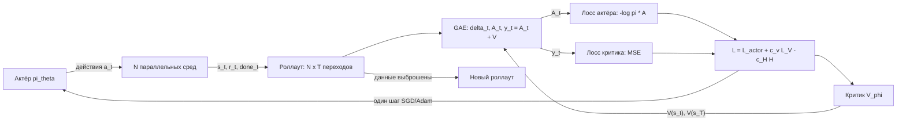

# Вопрос 8. Подход Policy Gradient. Алгоритм A2C и его модификации, оценка GAE.

> **Источники:** лекция 8 (`Slides/RL_MIPT_Lecture_8.pdf`), конспект [1] (Иванов, «Reinforcement Learning Textbook») раздел 5.2 «Схемы Актёр-критик», стр. 131–137 (плюс 5.1.8 «Бэйзлайн», стр. 129–130). Для сверки: Mnih et al., 2016 (A3C); Schulman et al., 2016 (GAE); Sutton & Barto, гл. 13.5–13.6.
> **Пререквизиты:** [Основы: функции ценности](00-osnovy.md#value), [Основы: bias–variance](00-osnovy.md#bias-variance), [Основы: нейросеть как аппроксиматор](00-osnovy.md#nn), [Основы: градиентный подъём](00-osnovy.md#gradient), [Основы: on-policy vs off-policy](00-osnovy.md#onoff-policy).
> **Связанные билеты:** [Билет 7](07-reinforce.md) — policy gradient theorem, REINFORCE, бэйзлайн (вся теория градиента берётся оттуда); [Билет 3](03-mc-q-learning.md) — TD(λ) и λ-return в табличном виде, откуда GAE «списана»; [Билет 9](09-trpo.md) и [Билет 10](10-bias-variance-ppo.md) — TRPO/PPO, продолжение линии on-policy алгоритмов; [Билет 4](04-dqn.md) — DQN как противоположный полюс; [Билет 12](12-sac.md) — энтропийная регуляризация «по-взрослому».

[TOC]

## 1. Зачем это нужно и где стоит в курсе

REINFORCE (билет 7) — честный, но крайне неудобный алгоритм. Чтобы сделать **один** шаг градиентного подъёма, он требует доиграть несколько эпизодов до конца: только тогда становится известен return $G_t = \sum_{k \ge 0} \gamma^k r_{t+k}$, который и служит «кредитом» для каждого действия. Хуже того, этот кредит — одна-единственная реализация случайной величины, которая складывается из всей случайности среды и всей случайности политики на десятках шагов вперёд. Дисперсия оценки градиента получается колоссальной, и на сколько-нибудь сложной задаче алгоритм просто не сходится за разумное время.

Идея актёр-критик (actor-critic) лечит обе болезни сразу: заведём **вторую нейросеть**, которая будет оценивать, насколько хорошо мы сыграли, — прямо сейчас, не дожидаясь конца эпизода. Сеть-политику $\pi_\theta(a \mid s)$ называют **актёром (actor)**, сеть-оценщика $V_\phi(s)$ — **критиком (critic)**.

!!! note Интуиция
    Спортсмен (актёр) делает движение. Он не знает, сколько медалей принесёт именно этот бросок через три года. Но рядом стоит тренер (критик), который видел тысячи бросков и говорит сразу: «это было лучше среднего» или «хуже среднего». Спортсмену не нужно ждать чемпионата — он корректирует технику после каждого движения. Тренер при этом сам учится: он сверяет свои прогнозы с тем, что реально произошло, и уточняет их.

Место в карте курса: A2C — это **гибрид** двух семейств. От policy-based подхода он берёт явную параметризованную политику (значит, умеет непрерывные действия и стохастические политики), от value-based — обученную функцию ценности, которая берёт на себя «заглядывание в будущее». DQN (билет 4) и REINFORCE (билет 7) — два крайних полюса: первый целиком опирается на критика (политика = жадная по $Q$), второй целиком на актёра. A2C стоит посередине и позволяет **плавно регулировать**, насколько сильно мы опираемся на критика, — этим регулятором и будет параметр $\lambda$ в оценке GAE.

## 2. Постановка задачи и обозначения

Всё происходит в MDP $(\mathcal{S}, \mathcal{A}, p, r, \gamma)$; максимизируем $J(\pi) = \mathbb{E}_{\tau \sim \pi} \sum_{t \ge 0} \gamma^t r_t$. Из билета 7 нам нужен только итоговый результат.

**Теорема о градиенте политики с бэйзлайном** (билет 7, утв. 58–59). Для любой функции $b(s)$, зависящей только от состояния,

$$
\nabla_\theta J(\pi) = \frac{1}{1-\gamma}\,\mathbb{E}_{s \sim d^\pi}\,\mathbb{E}_{a \sim \pi_\theta(a \mid s)} \nabla_\theta \log \pi_\theta(a \mid s)\,\big(Q^\pi(s,a) - b(s)\big),
$$

где $d^\pi(s) = (1-\gamma)\sum_t \gamma^t p(s_t = s \mid \pi)$ — дисконтированное распределение посещения состояний. Вычитание $b(s)$ не меняет матожидания (градиент логарифма правдоподобия в среднем равен нулю), но меняет дисперсию. Оптимальный при упрощающем предположении бэйзлайн — $b(s) = V^\pi(s)$, и тогда «кредит» превращается в **advantage-функцию** $A^\pi(s,a) = Q^\pi(s,a) - V^\pi(s)$:

$$
\nabla_\theta J(\pi) \;=\; \frac{1}{1-\gamma}\,\mathbb{E}_{s \sim d^\pi} \mathbb{E}_{a \sim \pi} \nabla_\theta \log \pi_\theta(a \mid s)\, A^\pi(s,a).
$$

Словами: увеличивай вероятность действий, которые оказались **лучше среднего** в данном состоянии, и уменьшай вероятность тех, что хуже среднего. Вся оставшаяся работа — научиться оценивать $A^\pi(s,a)$ по собранным данным. Эту оценку обозначим $\Psi(s,a) \approx A^\pi(s,a)$ (в литературе также $\hat A_t$):

$$
\nabla_\theta J(\pi) \approx \frac{1}{1-\gamma}\,\mathbb{E}_{s \sim d^\pi} \mathbb{E}_{a \sim \pi}\, \nabla_\theta \log \pi_\theta(a \mid s)\, \Psi(s,a).
$$

Обозначения: $\theta$ — параметры актёра, $\phi$ — параметры критика, $V_\phi(s)$ — выход критика, $T$ (в конспекте $N$) — длина роллаута, $N$ (в конспекте $M$) — число параллельных сред, $\lambda \in [0,1]$ — параметр GAE.

## 3. Основная теория

### 3.1. Почему критик учит $V$, а не $Q$

Казалось бы, кредит — это $Q$, значит и учить надо $Q_\phi(s,a)$. Но так делать не стоит по трём причинам.

1. **Вырождение.** Если подставить в формулу градиента выход сети $Q_\phi$, то градиент $\nabla_\theta \log \pi_\theta(a \mid s) Q_\phi(s,a)$ потащит политику в $\operatorname*{argmax}_a Q_\phi(s,a)$. Качество актёра выродится в качество критика — ровно то, от чего мы уходили в DQN.
2. **$V$ проще.** V-функции не нужно различать действия: достаточно понимать, какие области пространства состояний хорошие, а какие плохие. Это заметно более лёгкая задача регрессии.
3. **$Q$ выражается через $V$ и одну награду.** Из уравнения Беллмана $Q^\pi(s,a) = r(s,a) + \gamma\,\mathbb{E}_{s'} V^\pi(s') \approx r(s,a) + \gamma V_\phi(s')$. Значит, имея только критика $V_\phi$, мы получаем и бэйзлайн, и оценку $Q$.

Учить напрямую сеть $A_\phi(s,a)$ тоже неудобно: advantage — не произвольная функция (она обязана удовлетворять $\mathbb{E}_{a \sim \pi} A^\pi(s,a) = 0$), и для неё нельзя записать уравнение Беллмана, не привлекая $V$.

!!! warning Смещение — цена за критика
    Как только в оценку кредита замешивается нейросеть $V_\phi$, оценка градиента становится **смещённой**, и формальные гарантии сходимости стохастической оптимизации теряются. Оправдание: формула градиента — это по сути policy improvement, а из теории Generalized Policy Iteration известно, что для улучшения политики не нужна идеальная $Q^\pi$ — достаточно аппроксимации, которая параллельным процессом движется к правильной. Все actor-critic методы живут на этой надежде.

### 3.2. Варианты оценки advantage и bias-variance trade-off

Заменяем в формуле градиента честный $A^\pi$ на одну из оценок.

**(а) Монте-Карло с бэйзлайном:** $\Psi = G_t - V_\phi(s_t)$, где $G_t$ — реальный reward-to-go. Смещения **нет**: $G_t$ — несмещённая оценка $Q^\pi$, а бэйзлайн $V_\phi(s_t)$ может быть какой угодно функцией состояния — он не портит матожидание, каким бы кривым ни был критик. Дисперсия высокая: $G_t$ — сумма многих случайных наград.

**(б) Одношаговая (TD(0)) оценка:** $\Psi = r_t + \gamma V_\phi(s_{t+1}) - V_\phi(s_t) =: \delta_t$ — это **временная разность (temporal difference, TD-error)**. Дисперсия низкая (случайны только $r_t$ и один переход), смещение большое: весь хвост траектории оценён неточной сетью $V_\phi$.

**(в) $n$-шаговая оценка** (промежуточный вариант):

$$
\Psi^{(n)}(s_t,a_t) := \sum_{k=0}^{n-1} \gamma^k r_{t+k} + \gamma^n V_\phi(s_{t+n}) - V_\phi(s_t).
$$

| $\Psi(s,a)$ | Дисперсия | Смещение | Откуда что |
| --- | --- | --- | --- |
| $G_t - V_\phi(s_t)$ (MC, $n = \infty$) | высокая | нет | вся сумма наград случайна; критик только в бэйзлайне |
| $\Psi^{(n)}$, умеренное $n$ | средняя | среднее | $n$ случайных наград + «хвост» от критика |
| $\delta_t = r_t + \gamma V_\phi(s_{t+1}) - V_\phi(s_t)$ | низкая | большое | одна награда; весь хвост — неточный $V_\phi$ |

Механика проста и её стоит проговорить на экзамене одной фразой: **дисперсия растёт от длины суммы реальных наград, смещение — от доли, которую в оценке занимает неточный критик.** Чем больше $n$, тем больше настоящего сигнала среды и меньше опоры на сеть.

У $n$-шаговой оценки есть и практическое следствие: чтобы заглянуть на $n$ шагов вперёд, надо это будущее иметь. Значит, из каждой среды нужно собирать не один переход, а целый фрагмент траектории (роллаут). Для последних пар в роллауте длинная оценка недоступна — для пары $(s_{T-1}, a_{T-1})$ возможна только одношаговая. Оценку, где для каждого $t$ берётся максимальное доступное заглядывание, называют **оценкой максимальной длины (max trace)**: для $Q$-функции $y^{\text{MaxTrace}}(s_t,a_t) = \sum_{\hat t = t}^{T-1} \gamma^{\hat t - t} r_{\hat t} + \gamma^{T-t} V_\phi(s_T)$, а для advantage — соответственно $\Psi^{\text{MaxTrace}}(s_t,a_t) = y^{\text{MaxTrace}}(s_t,a_t) - V_\phi(s_t)$.

### 3.3. GAE: вывод и свойства

Выбирать одно конкретное $n$ — грубо. Как и в TD(λ) (билет 3), лучше **заансамблировать** оценки всех длин с экспоненциально убывающими весами.

**Определение (GAE, Generalized Advantage Estimation, Schulman et al., 2016).** Оценка длины $n$ берётся с весом $\lambda^{n-1}$, нормировка $(1-\lambda)$:

$$
\hat A^{\mathrm{GAE}(\gamma,\lambda)}_t := (1-\lambda) \sum_{n \ge 1} \lambda^{n-1} \Psi^{(n)}(s_t,a_t).
$$

**Вывод компактной формы.** Заметим, что $n$-шаговая оценка — это просто сумма TD-ошибок (телескопирование):

$$
\sum_{l=0}^{n-1} \gamma^l \delta_{t+l} = \sum_{l=0}^{n-1} \gamma^l\big(r_{t+l} + \gamma V_\phi(s_{t+l+1}) - V_\phi(s_{t+l})\big) = \sum_{l=0}^{n-1} \gamma^l r_{t+l} + \gamma^n V_\phi(s_{t+n}) - V_\phi(s_t) = \Psi^{(n)}_t,
$$

потому что все промежуточные $\gamma^{l+1} V_\phi(s_{t+l+1})$ и $-\gamma^{l+1}V_\phi(s_{t+l+1})$ взаимно сокращаются. Подставим это в определение и поменяем порядок суммирования: слагаемое $\gamma^l \delta_{t+l}$ входит во все $\Psi^{(n)}$ с $n \ge l+1$, поэтому

$$
\hat A^{\mathrm{GAE}}_t = (1-\lambda)\sum_{l \ge 0} \gamma^l \delta_{t+l} \sum_{n \ge l+1}\lambda^{n-1} = (1-\lambda)\sum_{l \ge 0} \gamma^l \delta_{t+l}\,\frac{\lambda^{l}}{1-\lambda},
$$

и окончательно — та самая формула, которую надо помнить наизусть:

$$
\boxed{\;\hat A^{\mathrm{GAE}(\gamma,\lambda)}_t = \sum_{l \ge 0} (\gamma\lambda)^l\, \delta_{t+l}\;}
$$

Словами: **GAE — это дисконтированная сумма будущих TD-ошибок с дисконтом $\gamma\lambda$.** Она считается ровно как обычный return, только «наградой за шаг» выступает $\delta_t$.

**Крайние случаи.**

- $\lambda = 0$: $\hat A_t = \delta_t$ — одношаговая оценка. Минимальная дисперсия, максимальное смещение.
- $\lambda = 1$: $\hat A_t = \sum_{l \ge 0} \gamma^l \delta_{t+l} = G_t - V_\phi(s_t)$ — Монте-Карло минус бэйзлайн. Здесь важная тонкость: эта оценка **несмещена независимо от того, насколько плох критик** — потому что $V_\phi$ входит в неё только как бэйзлайн, а бэйзлайном может быть любая функция состояния. Плохой критик при $\lambda=1$ лишь хуже сбивает дисперсию, но не портит направление градиента. Дисперсия при этом максимальная.
- Промежуточные $\lambda$ интерполируют. Типичные значения — $0.9$–$0.99$, дефолт $0.95$. Геометрическая прогрессия затухает быстро, так что даже $\lambda = 0.9$ заметно предпочитает короткие оценки.

**Роль $\gamma$.** В GAE $\gamma$ работает **дважды**: как дисконт задачи (внутри $\delta_t$) и как второй регулятор смещения-дисперсии (вместе с $\lambda$ в множителе $(\gamma\lambda)^l$). Уменьшение $\gamma$ обрезает горизонт и снижает дисперсию, но меняет саму оптимизируемую задачу; уменьшение $\lambda$ снижает дисперсию, не трогая постановку. Поэтому $\gamma$ выбирают по задаче (какой горизонт нам вообще интересен), а $\lambda$ крутят как гиперпараметр обучения.

**Практический выбор.** Если награда **разреженная** — $\lambda$ ближе к 1 (нужно донести редкий сигнал далеко назад). Если награда плотная и информативная — можно и $0.9$, и вовсе одношаговые обновления (в последнем случае off-policy value-based методы, скорее всего, будут эффективнее).

### 3.4. Рекурсивный расчёт и обрезка роллаута

Считать бесконечную сумму мы не можем: роллаут имеет конечную длину $T$. Практическая формула — обрезанная GAE:

$$
\hat A^{\mathrm{GAE}}_t = \sum_{l=0}^{T-1-t} (\gamma\lambda)^l \delta_{t+l},
$$

что эквивалентно ансамблю первых доступных оценок, где веса «пропавших» слишком длинных оценок переложены на самую длинную доступную:
$\hat A_t = (1-\lambda)\sum_{n=1}^{M-1}\lambda^{n-1}\Psi^{(n)}_t + \lambda^{M-1}\Psi^{(M)}_t$, где $M = T - t$. В такой обрезанной оценке $\lambda = 1$ даёт ровно оценку максимальной длины, $\lambda = 0$ — по-прежнему одношаговую.

Считать её удобно **одним проходом с конца роллаута**:

```text
Вход: r[0..T-1], V[0..T], done[0..T-1], gamma, lambda
1. A[T] := 0
2. для t = T-1, T-2, ..., 0:
3.     delta := r[t] + gamma * V[t+1] * (1 - done[t]) - V[t]
4.     A[t]  := delta + gamma * lambda * (1 - done[t]) * A[t+1]
5. Возврат: A[0..T-1]; таргеты критика y[t] := A[t] + V[t]
```

Здесь `done[t] = 1`, если переход на шаге $t$ привёл в терминальное состояние.

!!! warning Типичная ошибка реализации — граница роллаута
    Два разных «конца» надо различать строго.
    **(1) Эпизод закончился** (`done = 1`): после терминального состояния наград нет, $V(s_{\text{terminal}}) = 0$ **по определению**. Поэтому $\delta_t = r_t - V_\phi(s_t)$, и след GAE обнуляется: $\hat A_t = \delta_t$.
    **(2) Роллаут оборвался, а эпизод нет** (собрали $T$ шагов и остановились): нужно **бутстрапнуть** через критика, $\delta_{T-1} = r_{T-1} + \gamma V_\phi(s_T) - V_\phi(s_{T-1})$, и оборвать след на этом.
    Классическая ошибка — поставить ноль вместо $V_\phi(s_T)$ на границе незакончившегося эпизода. Тогда агент «думает», что мир каждые $T$ шагов кончается, и учится максимизировать награду на горизонте $T$. Вторая классическая ошибка — забыть занулить след на реальном `done` внутри батча: advantage тогда «протекает» из следующего эпизода в предыдущий.
    Отдельный случай — **truncation по таймауту** (среда обрывает эпизод по лимиту шагов). Формально это не терминал, и корректно бутстрапить через $V_\phi(s_T)$, хотя многие реализации по недосмотру считают это терминалом.

### 3.5. Обучение критика

Критик учится обычной регрессией: строим таргет $y_t$ и минимизируем MSE

$$
\mathcal{L}_V(\phi) = \frac{1}{NT}\sum_{t} \big(y_t - V_\phi(s_t)\big)^2 .
$$

Варианты таргета — те же три (и это не совпадение):

- **MC-return:** $y_t = G_t$. Несмещённый ground truth, но шумный и требует полных эпизодов.
- **TD-таргет:** $y_t = r_t + \gamma V_\phi(s_{t+1})$, или $n$-шаговый $y_t = \sum_{k<n}\gamma^k r_{t+k} + \gamma^n V_\phi(s_{t+n})$.
- **λ-return:** $y_t = \hat A^{\mathrm{GAE}}_t + V_\phi(s_t)$ — просто «снимаем бэйзлайн» с GAE, ведь $Q = A + V$. Это самый частый выбор (PPO делает ровно так).

Красивое наблюдение: если advantage оценён как $\Psi = y - V_\phi(s)$, то **то же самое $y$ является таргетом для критика**. Одна величина обслуживает и актёра, и критика, и bias-variance trade-off у них разрешается согласованно. Утверждение из конспекта: таргет $\hat A^{\mathrm{GAE}}_t + V_\phi(s_t)$ — несмещённая оценка правой части «ансамбля» уравнений Беллмана $V = (1-\lambda)\sum_{n\ge1}\lambda^{n-1}[\mathcal{B}^n V]$, где $\mathcal{B}$ — оператор Беллмана для $V$.

!!! warning Stop-gradient обязателен
    Таргет $y_t$ сам содержит $V_\phi$ (в бутстрапе) — но при вычислении лосса он считается **константой** (`.detach()`, «игнорируя зависимость от $\phi$»). Иначе градиент потечёт в обе стороны, и вместо решения уравнения Беллмана методом простой итерации мы будем минимизировать какой-то другой функционал (сеть выучится делать $V$ маленькими и «согласованными с собой»). То же касается advantage в лоссе актёра: $\hat A_t$ — числовой вес, градиент по $\theta$ через него не идёт.

**Общая сеть или две?** Если состояния — картинки, актёру и критику нужны одни и те же признаки. Логично объединить **экстрактор признаков (feature extractor / shared backbone)** и сделать две головы. Плюс — быстрее обучение, меньше параметров; минус — лоссы приходится масштабировать коэффициентом $c_v$, чтобы одна голова не забивала градиентами другую (типично $c_v \approx 0.5$). Для векторных состояний (MuJoCo, CartPole) чаще берут **две раздельные сети** — тогда конфликта градиентов нет и можно ставить разные learning rate (критику обычно больший).

## 4. Алгоритм A2C

**Advantage Actor-Critic (A2C)** — синхронная схема: $N$ параллельных сред, роллаут длины $T$, один градиентный шаг, данные выбрасываются.

Важная оговорка про источник: в конспекте [1] (стр. 136, алгоритм 20) A2C описан с **оценкой максимальной длины** — именно потому, что роллауты там короткие и «ансамбль бедный». Это ровно частный случай приведённой ниже схемы при $\lambda = 1$ в обрезанной GAE (см. §3.4). Ниже дан общий вариант с произвольным $\lambda$: именно он используется на практике и переходит без изменений в TRPO и PPO ([билеты 9](09-trpo.md), [10](10-bias-variance-ppo.md)).



```text
Гиперпараметры: N — число параллельных сред, T — длина роллаута,
    gamma, lambda, c_v — вес лосса критика, c_H — вес энтропии, lr.
0. Инициализировать theta, phi (ортогональная инициализация).
На каждой итерации:
1. В каждой из N сред собрать роллаут длины T текущей политикой pi_theta:
       s_0, a_0, r_0, s_1, ..., s_T  (среды не сбрасываются, идут дальше)
2. Прогнать критика: V(s_0), ..., V(s_T) для всех сред.
3. Посчитать delta_t и GAE-advantage A_t обратным проходом (см. 3.4),
   аккуратно обработав done_t и бутстрап V(s_T); детачить A_t и y_t.
4. Таргеты критика: y_t := A_t + V_phi(s_t).
5. (опц.) Нормировать advantage по батчу: A := (A - mean)/(std + 1e-8).
6. Посчитать суммарный лосс по всем N*T переходам:
       L(theta,phi) = -(1/NT) sum_t log pi_theta(a_t|s_t) * A_t
                      + c_v * (1/NT) sum_t (y_t - V_phi(s_t))^2
                      - c_H * (1/NT) sum_t H(pi_theta(.|s_t))
7. Один шаг оптимизатора по (theta, phi) с обрезкой нормы градиента.
8. Данные выбросить, вернуться к шагу 1.
```

Суммарный лосс (знаки: актёрский член со знаком минус, потому что оптимизатор минимизирует, а $J$ мы максимизируем):

$$
\mathcal{L}(\theta,\phi) = -\frac{1}{NT}\sum_{t}\log \pi_\theta(a_t \mid s_t)\,\hat A_t \;+\; c_v\,\mathcal{L}_V(\phi)\;-\;c_H\,\frac{1}{NT}\sum_t H\big(\pi_\theta(\cdot \mid s_t)\big),
$$

где $H(\pi) = -\sum_a \pi(a\mid s)\log\pi(a \mid s)$ — энтропия политики в состоянии.

**Почему алгоритм строго on-policy.** Формула градиента требует $a \sim \pi_\theta(\cdot \mid s)$ **текущей** версии политики, а $n$-шаговые оценки требуют, чтобы весь фрагмент траектории был порождён текущей политикой. После одного шага оптимизации $\theta$ изменилось — собранные данные больше не соответствуют $\pi_\theta$ и выбрасываются. Отсюда главный минус: **низкая sample efficiency**.

!!! example Цена on-policy на пальцах
    Вы играете в платформер, всё время падаете в первую яму, награда 0. Вдруг случайно перепрыгнули и получили +1. DQN сохранит этот бесценный переход в буфере и будет переигрывать его сотни раз. A2C сделает один маленький шаг по весам и **выбросит** данные — придётся ждать, пока прыжок случайно повторится.

**Зачем параллельные среды.** Пары $(s,a)$ внутри одного роллаута сильно скоррелированы; независимые роллауты из $N$ сред декоррелируют мини-батч — это **замена реплей-буфера** в on-policy режиме. Типично $N = 8\text{–}64$, $T = 5\text{–}128$ ($T=5$ в оригинальном A3C, $T=128$ в PPO-Atari). Длинные роллауты невыгодны: мини-батч раздувается, а используется всего для одного шага.

### A3C, A2C и модификации

**A3C (Asynchronous Advantage Actor-Critic, Mnih et al., 2016)** — исторически первый. $K$ воркеров-потоков, у каждого своя копия среды и своя локальная копия весов. Воркер играет $T \approx 5$ шагов, считает градиент локально и **асинхронно** применяет его к глобальным весам в стиле Hogwild! (без блокировок, «кто успел — тот и записал»), затем синхронизирует локальную копию. Асинхронность была нужна, чтобы обучаться на CPU без GPU: разные воркеры в разные моменты находятся в разных местах среды, что само по себе декоррелирует обновления.

**A2C** — синхронный вариант (популяризован OpenAI Baselines): ждём все $N$ сред, склеиваем один большой батч, делаем один шаг. Практика показала, что A2C **не хуже** A3C по качеству, а часто лучше: (1) асинхронность вносит «устаревшие» градиенты (воркер считал градиент по весам, которых уже нет) — это лишний шум, а не полезная стохастика; (2) синхронный батч — это один большой матричный прогон, который GPU переваривает во много раз эффективнее, чем $K$ мелких асинхронных. То есть асинхронность была не фичей, а обходным путём под доступное железо.

| Модификация | Какую проблему лечит | Как именно | Цена |
| --- | --- | --- | --- |
| Энтропийный бонус $-c_H H(\pi)$ | преждевременное схлопывание политики в детерминированную, гибель exploration | добавляем в лосс член, награждающий высокую энтропию; для softmax и гауссианы считается аналитически и дифференцируется | смещает оптимум (учим не совсем ту задачу); нужен подбор $c_H \sim 0.01$ |
| Нормализация advantage | масштаб $\hat A$ плавает между итерациями, эффективный learning rate нестабилен | $\hat A \leftarrow (\hat A - \bar{\hat A})/(\mathrm{std}(\hat A)+\varepsilon)$ по мини-батчу | формально вносит небольшое смещение (среднее и std считаются по тем же данным) |
| Обрезка градиентов (gradient clipping) | «взрывы» градиента, один плохой батч убивает политику | обрезать глобальную норму градиента до $\approx 0.5$ | при слишком жёсткой обрезке обучение замедляется |
| Параллельные среды | корреляция данных внутри роллаута (буфера-то нет) | $N$ независимых сред → один батч | линейный рост вычислений |
| Общий backbone vs раздельные сети | дублирование признаков на картинках / конфликт градиентов на векторах | shared feature extractor + две головы, или две независимые сети | нужен $c_v$; при shared — риск, что одна голова забьёт другую |
| Раздельные learning rate | критик и актёр учатся с разной скоростью | разные lr / разное число шагов критика | +1 гиперпараметр (невозможно при shared backbone) |
| Ортогональная инициализация | PG-методы очень чувствительны к инициализации | ортогональные веса, малый gain на последнем слое политики | — |
| Нормализация наблюдений/наград | разный масштаб входов и наград | бегущее среднее/дисперсия | при нормализации наград слегка меняется задача |

Дальнейшие модификации по этой линии: **ACER** (Actor-Critic with Experience Replay, Wang et al., 2017) — попытка сделать actor-critic off-policy через усечённую importance sampling с коррекцией смещения и оценку Retrace; **ACKTR** (Wu et al., 2017) — A2C с натуральным градиентом, аппроксимированным Kronecker-факторизацией (K-FAC). Главная же линия развития — ограничение размера шага политики: TRPO ([билет 9](09-trpo.md)) и PPO ([билет 10](10-bias-variance-ppo.md)), которые к A2C-скелету добавляют trust region / клиппинг и за счёт этого позволяют делать несколько эпох по одним данным.

## 5. Пример: считаем GAE руками

Роллаут длины $T = 3$, эпизод **не закончился** (на $s_3$ бутстрапим критиком). $\gamma = 0.9$, $\lambda = 0.5$, $\gamma\lambda = 0.45$.

| $t$ | $r_t$ | $V_\phi(s_t)$ |
| --- | --- | --- |
| 0 | 0 | 0.5 |
| 1 | 0 | 0.6 |
| 2 | 1 | 0.8 |
| 3 | — | 1.0 (бутстрап) |

**Шаг 1. TD-ошибки** $\delta_t = r_t + \gamma V(s_{t+1}) - V(s_t)$:

$$
\begin{aligned}
\delta_0 &= 0 + 0.9\cdot 0.6 - 0.5 = 0.54 - 0.5 = 0.04,\\
\delta_1 &= 0 + 0.9\cdot 0.8 - 0.6 = 0.72 - 0.6 = 0.12,\\
\delta_2 &= 1 + 0.9\cdot 1.0 - 0.8 = 1.90 - 0.8 = 1.10.
\end{aligned}
$$

**Шаг 2. GAE обратным проходом**, $\hat A_t = \delta_t + \gamma\lambda \hat A_{t+1}$, $\hat A_3 = 0$:

$$
\begin{aligned}
\hat A_2 &= 1.10,\\
\hat A_1 &= 0.12 + 0.45 \cdot 1.10 = 0.12 + 0.495 = 0.615,\\
\hat A_0 &= 0.04 + 0.45 \cdot 0.615 = 0.04 + 0.277 = 0.317.
\end{aligned}
$$

Таргеты критика: $y_t = \hat A_t + V_\phi(s_t)$, т.е. $y_0 = 0.817$, $y_1 = 1.215$, $y_2 = 1.90$.

**Что было бы при других $\lambda$:**

| $t$ | $\lambda = 0$ (это $\delta_t$) | $\lambda = 0.5$ | $\lambda = 1$ (max trace) |
| --- | --- | --- | --- |
| 0 | 0.04 | 0.317 | 1.039 |
| 1 | 0.12 | 0.615 | 1.11 |
| 2 | 1.10 | 1.10 | 1.10 |

Проверка $\lambda = 1$ «в лоб», без рекурсии: $\hat A_0 = r_0 + \gamma r_1 + \gamma^2 r_2 + \gamma^3 V(s_3) - V(s_0) = 0 + 0 + 0.81 + 0.729 - 0.5 = 1.039$ ✓.

**Что здесь видно.** Реальная награда пришла на шаге 2. При $\lambda = 0$ шаг 0 получает кредит $0.04$ — почти ноль: сигнал не дошёл, актёр практически не узнает, что первое действие вело к награде (всё зависит от того, насколько точно критик уже разложил ценность по состояниям). При $\lambda = 1$ кредит шага 0 — $1.039$: награда «протянулась» назад целиком, но вместе с ней протянулся и весь шум эпизода. $\lambda = 0.5$ — компромисс. Для последней пары $\hat A_2$ одинаково при всех $\lambda$: дальше роллаута смотреть всё равно некуда.

Если бы на шаге 2 эпизод **завершился** (`done = 1`), то $V(s_3) = 0$ и $\delta_2 = 1 + 0 - 0.8 = 0.2$ — вся картина сдвинулась бы вниз.

## 6. Подводные камни, сравнения, типичные ошибки

| | REINFORCE | A2C | DQN |
| --- | --- | --- | --- |
| Режим | on-policy | on-policy | off-policy, реплей-буфер |
| Что учим | только политику $\pi_\theta$ | политику $\pi_\theta$ + критика $V_\phi$ | только $Q_\phi$ (политика жадная) |
| Дисперсия оценки | очень высокая | регулируется $\lambda$ | низкая, зато накапливается смещение/переоценка |
| Смещение | нет (при точном MC) | есть при $\lambda < 1$ | есть всегда (бутстрап + max) |
| Sample efficiency | очень низкая | низкая (данные выбрасываются) | высокая (переиспользование буфера) |
| Непрерывные действия | да, естественно | да, естественно | нет (нужен $\max_a$) — отсюда DDPG/TD3 |
| Нужен ли полный эпизод | да | нет | нет |

!!! warning Когда A2C работает плохо
    (1) **Дорогие среды** — sample efficiency низкая, каждый переход используется один раз; если шаг симуляции стоит дорого, off-policy методы выигрывают.
    (2) **Крайне разреженная награда** — даже при $\lambda = 1$ сигнал нужно сначала случайно найти, и без буфера редкая удача пропадает (см. пример с ямой). Лечится внутренней мотивацией ([билет 6](06-intrinsic-motivation.md)).
    (3) **Слишком большой шаг по $\theta$** — один неудачный шаг может схлопнуть политику; данных, чтобы «откатиться», нет, они уже выброшены. Именно это лечат TRPO/PPO.

!!! warning Частые ошибки реализации
    — Забыт stop-gradient на advantage/таргете (градиент течёт через критика в лосс актёра).
    — Не занулён след GAE на `done`, или ноль вместо $V_\phi(s_T)$ на границе незакончившегося роллаута.
    — Дисбаланс $c_v$: критик «съедает» общий backbone, политика перестаёт учиться (или наоборот).
    — Слишком большой $c_H$: энтропийный бонус перевешивает награду, политика остаётся равномерной навсегда.
    — Несколько шагов оптимизации по одному батчу: A2C этого не допускает (данные становятся off-policy) — для этого и нужен PPO с клиппингом.
    — Забыта обрезка градиентов: одна аномальная награда разрушает обучение.

## 7. Ответ за 5 минут

1. **Проблема REINFORCE:** нужен полный эпизод и дисперсия оценки градиента огромна.
2. **Формула, из которой всё растёт** (билет 7): $\nabla_\theta J = \mathbb{E}\big[\nabla_\theta \log \pi_\theta(a \mid s)\, A^\pi(s,a)\big]$; бэйзлайн $V^\pi$ не вносит смещения, но снижает дисперсию.
3. **Критик:** вторая сеть $V_\phi(s) \approx V^\pi(s)$; учить $V$, а не $Q$ — проще, и $Q \approx r + \gamma V_\phi(s')$.
4. **Оценки advantage:** MC $G_t - V_\phi$ (нет смещения, высокая дисперсия); TD(0) $\delta_t = r_t + \gamma V_\phi(s_{t+1}) - V_\phi(s_t)$ (низкая дисперсия, большое смещение); $n$-шаговая — посередине. Дисперсия от длины суммы наград, смещение от доли критика.
5. **GAE:** $\hat A_t^{\mathrm{GAE}(\gamma,\lambda)} = \sum_{l\ge0}(\gamma\lambda)^l \delta_{t+l}$ — экспоненциально взвешенный ансамбль $n$-шаговых оценок (аналог λ-return из TD(λ)). Вывод: $\Psi^{(n)} = \sum_{l<n}\gamma^l\delta_{t+l}$ (телескопирование), смена порядка суммирования.
6. **Крайние случаи:** $\lambda=0$ → TD, $\lambda=1$ → MC минус бэйзлайн (несмещённо при **любом** критике). Дефолт $0.95$.
7. **Счёт:** обратный проход $\hat A_t = \delta_t + \gamma\lambda(1-\text{done}_t)\hat A_{t+1}$; на границе роллаута бутстрап $V_\phi(s_T)$, на терминале — ноль.
8. **Критик учится** на таргете $y_t = \hat A_t + V_\phi(s_t)$ (λ-return) по MSE, таргет детачится.
9. **A2C:** $N$ параллельных сред, роллаут $T$, посчитать GAE, лосс $\mathcal{L} = -\frac{1}{NT}\sum\log\pi_\theta \hat A + c_v\mathcal{L}_V - c_H H(\pi)$, **один** шаг, данные выбросить.
10. **On-policy:** данные нельзя переиспользовать; параллельные среды заменяют буфер для декорреляции.
11. **A3C vs A2C:** асинхронные Hogwild-обновления глобальных весов против синхронного батча; на GPU синхронный вариант не хуже и проще.
12. **Модификации:** энтропийный бонус, нормализация advantage, gradient clipping, shared backbone, ортогональная инициализация; дальше — ACER/ACKTR и, главное, TRPO/PPO.

## 8. Вероятные допвопросы экзаменатора

**Почему критик не вносит смещения при $\lambda = 1$?**
Потому что при $\lambda=1$ оценка равна $G_t - V_\phi(s_t)$, и $V_\phi$ входит туда **только как бэйзлайн**. По теореме о бэйзлайне вычитание любой функции состояния не меняет матожидания градиента. При $\lambda<1$ критик попадает ещё и в бутстрап ($\gamma^n V_\phi(s_{t+n})$ как оценка хвоста) — вот это уже смещает.

**Зачем энтропийный бонус?**
Чтобы политика не схлопнулась преждевременно в детерминированную. В policy gradient exploration обеспечивается только стохастичностью $\pi_\theta$; если распределение стало острым до того, как агент нашёл хорошие действия, он застрянет — градиент перестанет «пробовать» альтернативы. Член $-c_H H(\pi)$ штрафует за низкую энтропию и удерживает разброс. Строгая версия этой идеи — Maximum Entropy RL и SAC ([билет 12](12-sac.md)).

**В чём разница A2C и A3C?**
A3C: $K$ воркеров асинхронно считают градиенты по своим данным и без блокировок применяют их к глобальным весам (Hogwild). A2C: те же воркеры **синхронизируются**, батчи склеиваются, делается один общий шаг. Математика одна и та же; A2C эффективнее на GPU и не страдает от устаревших градиентов.

**Почему A2C нельзя обучать на реплей-буфере?**
Формула градиента требует, чтобы действия сэмплировались из **текущей** политики $\pi_\theta$ и чтобы траектория-хвост тоже был порождён ею. Данные из буфера порождены старой политикой; без коррекции importance sampling оценка градиента будет смещена в неизвестную сторону. Коррекция же по длинным траекториям даёт произведение отношений вероятностей — величину с чудовищной дисперсией. Именно эту проблему аккуратно решают ACER (усечённый IS с коррекцией) и PPO (клиппинг при небольшом отклонении политик).

**Что будет при слишком большом $\lambda$ (близком к 1)?**
Оценка advantage становится почти монте-карловской: смещение уходит, но дисперсия градиента взлетает, обучение шумит и требует много данных. Плюс критик почти перестаёт использоваться для распространения сигнала — мы теряем главное преимущество actor-critic. При слишком маленьком $\lambda$ обратная беда: оценки почти одношаговые, и качество актёра полностью упирается в качество критика; если критик плох, сигнал о далёкой награде вообще не дойдёт.

**Как считать GAE, если роллаут оборвался посреди эпизода?**
Обрезать сумму на конце роллаута и **бутстрапнуть** последнюю TD-ошибку через критика: $\delta_{T-1} = r_{T-1} + \gamma V_\phi(s_T) - V_\phi(s_{T-1})$, след дальше не продолжать. Это эквивалентно ансамблю доступных $n$-шаговых оценок, где веса «недостающих» длинных переложены на самую длинную доступную. Ставить $V_\phi(s_T) = 0$ можно **только** если $s_T$ действительно терминальное.

**Почему учат $V$, а не $Q$, если кредитом является $Q$?**
Во-первых, $Q^\pi(s,a) \approx r + \gamma V_\phi(s')$ — одного сэмпла награды и перехода достаточно. Во-вторых, подстановка сетевого $Q_\phi$ в формулу градиента толкала бы политику в $\operatorname*{argmax}_a Q_\phi$, и качество актёра выродилось бы в качество критика. В-третьих, $V$ — объективно более лёгкая задача: не нужно различать действия.

**Почему A2C считается смещённым методом и почему это допустимо?**
Как только $V_\phi$ участвует в бутстрапе, оценка градиента смещена, и формальные гарантии сходимости теряются. Оправдание: формула градиента — это направление policy improvement, а из Generalized Policy Iteration известно, что улучшать политику можно и по приближённой оценочной функции, лишь бы она параллельно двигалась к правильной.

**Чем A2C лучше DQN и чем хуже?**
Лучше: работает с непрерывными действиями, даёт стохастическую политику, позволяет управлять bias-variance через $\lambda$, не страдает от накапливающейся ошибки бутстрапа так сильно (при больших $\lambda$ сигнал приходит прямо из среды). Хуже: on-policy, то есть заметно менее sample efficient; чувствителен к размеру шага и гиперпараметрам.
