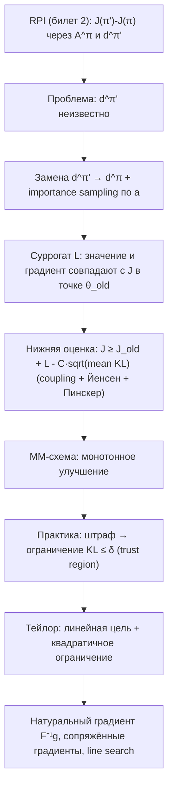
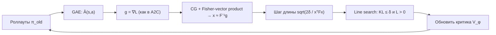

# Вопрос 9. Метод Trust-Region Policy Optimization (TRPO), его теоретическое обоснование.

> **Источники:** лекция 9 (`Slides/RL_MIPT_Lecture_9.pdf`), конспект [1] (Иванов, «Reinforcement Learning Textbook») разделы 5.3.1 «Суррогатная функция» (стр. 138–140), 5.3.2 «Нижняя оценка» (стр. 140–142), 5.3.3 «TRPO» (стр. 142–144), приложение A.1 «Натуральный градиент» (стр. 226–228); сверка — Schulman et al., «Trust Region Policy Optimization» (2015), Kakade & Langford (2002), Kakade, «A Natural Policy Gradient» (2001), J. Achiam, «Spinning Up» (заметки по TRPO).
> **Пререквизиты:** [Основы: политика и $J(\pi)$](00-osnovy.md#policy), [Функции ценности](00-osnovy.md#value), [Вероятность и KL-дивергенция](00-osnovy.md#probability), [Градиентный подъём](00-osnovy.md#gradient).
> **Связанные билеты:** [Билет 2](02-bellman-pi-vi.md) — там доказана Relative Performance Identity, на которой всё стоит; [Билет 7](07-reinforce.md) — сама теорема о policy gradient и REINFORCE; [Билет 8](08-a2c-gae.md) — A2C и GAE-оценка advantage, которую TRPO использует как «сырьё»; [Билет 10](10-bias-variance-ppo.md) — PPO, дешёвый наследник TRPO.

[TOC]

## 1. Зачем это нужно и где стоит в курсе

Policy gradient ([билет 7](07-reinforce.md)) даёт направление, но ничего не говорит о **длине шага**. А в RL длина шага — вопрос жизни и смерти, и по двум причинам сразу.

Первая: **маленький шаг в $\theta$ — не обязательно маленький шаг в поведении**. Мы оптимизируем не абстрактный вектор чисел, а распределение $\pi_\theta(a\mid s)$, и связь между ними произвольная. Классический пример: гауссова политика $\mathcal{N}(\mu, \sigma^2)$. Распределения $\mathcal{N}(0, 10)$ и $\mathcal{N}(1, 10)$ практически неотличимы, а $\mathcal{N}(0, 0.01)$ и $\mathcal{N}(1, 0.01)$ не пересекаются вообще — хотя в обоих случаях параметры разошлись ровно на единицу. Евклидово расстояние в пространстве параметров ничего не знает о том, насколько изменилось поведение агента.

Вторая: **одна плохая итерация ломает всё обучение**. В supervised learning слишком большой шаг просто увеличит лосс — данные никуда не делись, следующий шаг всё поправит. В on-policy RL данные собирает сама политика: сломали $\pi$ — начали собирать мусорные роллауты — критик учится на мусоре — политика ломается дальше. Это «скатывание с обрыва», и обратной дороги обычно нет; а каждый батч оплачен дорогими взаимодействиями со средой и переиспользован быть не может.

!!! note Интуиция — «регион доверия»
    Вы идёте в тумане по горной тропе с фонариком. Фонарик освещает три метра вперёд — это ваша **модель** местности. В этих трёх метрах можно смело идти в сторону подъёма. За ними модель ничего не говорит, и уверенный шаг на десять метров вперёд — это шаг в пропасть. Регион доверия (trust region) — это ровно «не дальше, чем светит фонарик». TRPO добавляет к этому одну важную деталь: мерить расстояние он будет не в метрах по земле (параметры $\theta$), а в том, насколько изменилось само поведение (KL-дивергенция между политиками).

Хочется большего: **гарантии монотонного улучшения** — чтобы каждая итерация доказуемо не ухудшала $J(\pi)$. TRPO — первый практический алгоритм, выведенный именно из такой гарантии. Место в карте курса: **on-policy actor-critic**, «тяжёлая артиллерия» линии REINFORCE → A2C → **TRPO** → PPO ([Основы, §Карта методов](00-osnovy.md#taxonomy)).

## 2. Постановка задачи и обозначения

Оптимизируем $J(\pi_\theta) = \mathbb{E}_{\tau\sim\pi_\theta}\sum_{t\ge0}\gamma^t r_t$ по параметрам $\theta$ политики. Обозначения стандартные ([Основы, §MDP](00-osnovy.md#mdp)); дополнительно нужны:

- $\pi_{old} = \pi_{\theta_{old}}$ — политика, которой собраны данные (в TRPO это версия политики на начало текущей итерации);
- $d^{\pi}(s) := (1-\gamma)\sum_{t\ge0}\gamma^t \Pr(s_t = s\mid \pi)$ — **дисконтированное распределение посещения состояний** (нормированная частота, с которой $\pi$ бывает в $s$). Из него мы умеем только **сэмплировать** (просто играя в среде), но не умеем считать значения $d^\pi(s)$ — это ключевое ограничение всего дальнейшего;
- $A^{\pi}(s,a) = Q^\pi(s,a) - V^\pi(s)$ — advantage ([Основы, §Функции ценности](00-osnovy.md#value));
- $\mathrm{KL}(p\,\|\,q)$ — дивергенция Кульбака–Лейблера ([Основы, §Вероятность](00-osnovy.md#probability)); расстояния между политиками вводятся ниже;
- $\epsilon := \max_{s,a}|A^{\pi_{old}}(s,a)|$ — в этом билете буква $\epsilon$ означает **именно это** (не $\epsilon$-жадность и не клиппинг PPO);
- $\delta$ — радиус региона доверия (гиперпараметр, аналог learning rate), $g$ — градиент суррогата, $F$ — матрица Фишера.

Два способа померить, насколько политики разошлись — средний по состояниям и худший по состояниям:

$$\overline{\mathrm{KL}}(\theta_{old}, \theta) := \mathbb{E}_{s\sim d^{\pi_{old}}}\,\mathrm{KL}\big(\pi_{old}(\cdot\mid s)\,\big\|\,\pi_\theta(\cdot\mid s)\big), \qquad \mathrm{KL}^{\max} := \max_{s\in\mathcal{S}}\,\mathrm{KL}\big(\pi_{old}(\cdot\mid s)\,\big\|\,\pi_\theta(\cdot\mid s)\big)$$

## 3. Основная теория

### 3.1. Точка отсчёта: RPI

**Теорема (Relative Performance Identity, RPI).** Для любых двух политик $\pi$ и $\pi'$:

$$J(\pi') - J(\pi) = \frac{1}{1-\gamma}\,\mathbb{E}_{s\sim d^{\pi'}}\,\mathbb{E}_{a\sim\pi'(a\mid s)}\, A^{\pi}(s,a)$$

Доказательство (телескопирующая сумма с потенциалом $V^\pi$) — в [билете 2, §3.3](02-bellman-pi-vi.md). Смысл: разность качеств двух политик точно выражается через **advantage старой** политики, усреднённый по траекториям **новой**. Это тождество, а не приближение.

Почему это ровно то, что нужно: свежего критика $A^{\pi_\theta}$ у нас нет (для него пришлось бы собирать данные новой политикой — чего мы и избегаем), а **несвежий** $A^{\pi_{old}}$ есть, он обучен на уже собранных роллаутах и оценивается GAE ([билет 8](08-a2c-gae.md)). RPI позволяет подставить его законно.

### 3.2. Суррогатная функция

В правой части RPI два матожидания, и оба берутся по **новой**, ещё не существующей политике. С внутренним справляемся честно — **importance sampling** (выборка по значимости) по действиям: в одном и том же состоянии $s$ мы знаем обе плотности $\pi_\theta(a\mid s)$ и $\pi_{old}(a\mid s)$, поэтому

$$\mathbb{E}_{a\sim\pi_\theta(a\mid s)} A^{\pi_{old}}(s,a) = \mathbb{E}_{a\sim\pi_{old}(a\mid s)}\left[\frac{\pi_\theta(a\mid s)}{\pi_{old}(a\mid s)} A^{\pi_{old}}(s,a)\right]$$

Это точное равенство (домножили и поделили на $\pi_{old}$), и коррекция здесь всего за **один шаг** — отношение плотностей не перемножается вдоль траектории, поэтому не взрывается, как в off-policy оценках вроде Retrace.

А вот с внешним матожиданием по $d^{\pi_\theta}$ так не выйдет: мы не умеем вычислять значения $d^{\pi}(s)$, только сэмплировать из них, и importance-вес $d^{\pi_\theta}(s)/d^{\pi_{old}}(s)$ посчитать нечем. Приходится просто **заменить** $d^{\pi_\theta}$ на $d^{\pi_{old}}$ — это и есть единственное место, где мы жертвуем точностью.

**Определение (суррогатная функция).**

$$L_{\pi_{old}}(\theta) := \frac{1}{1-\gamma}\,\mathbb{E}_{s\sim d^{\pi_{old}}}\,\mathbb{E}_{a\sim\pi_{old}(a\mid s)}\left[\frac{\pi_\theta(a\mid s)}{\pi_{old}(a\mid s)} A^{\pi_{old}}(s,a)\right]$$

Оба матожидания теперь берутся по старой политике — значит, $L$ оценивается по уже собранным роллаутам, причём её можно считать **в любой точке $\theta$**, не обращаясь к среде. Это окажется критически важным для line search. На практике общий множитель $\frac{1}{1-\gamma}$ всюду опускают (он не зависит от $\theta$ и на аргмаксимум не влияет), а состояния берут из недисконтированных частот $\mu^{\pi_{old}}$ — те же оговорки, что в [билете 7, §3.6](07-reinforce.md); поэтому на батче суррогат считают просто как $\hat L = \frac1B\sum_i \rho_i \hat A_i$, $\rho_i = \pi_\theta(a_i\mid s_i)/\pi_{old}(a_i\mid s_i)$. Ровно в этом виде он появится и в PPO ([билет 10](10-bias-variance-ppo.md)).

**Два свойства, ради которых всё затевалось.**

1. *Совпадение значений.* $L_{\pi_{old}}(\theta_{old}) = 0$. Действительно, при $\theta=\theta_{old}$ дробь равна единице, остаётся $\frac{1}{1-\gamma}\mathbb{E}_{s}\mathbb{E}_{a\sim\pi_{old}}A^{\pi_{old}}(s,a) = 0$, так как $\mathbb{E}_{a\sim\pi}A^\pi(s,a)=0$ в каждом состоянии. То есть $J(\pi_{old}) + L_{\pi_{old}}(\theta)$ в точке $\theta_{old}$ в точности равно $J(\pi_{old})$ (в других обозначениях это пишут как $L_\pi(\pi) = J(\pi)$).

2. *Совпадение градиентов.* $\nabla_\theta L_{\pi_{old}}(\theta)\big|_{\theta=\theta_{old}} = \nabla_\theta J(\pi_\theta)\big|_{\theta=\theta_{old}}$. Проверяется в одну строку:

$$\nabla_\theta L_{\pi_{old}}(\theta)\Big|_{\theta_{old}} = \frac{1}{1-\gamma}\mathbb{E}_{s\sim d^{\pi_{old}}}\mathbb{E}_{a\sim\pi_{old}}\frac{\nabla_\theta \pi_\theta(a\mid s)|_{\theta_{old}}}{\pi_{old}(a\mid s)}A^{\pi_{old}}(s,a) = \frac{1}{1-\gamma}\mathbb{E}_{s\sim d^{\pi_{old}}}\mathbb{E}_{a\sim\pi_{old}}\nabla_\theta\log\pi_\theta(a\mid s)\big|_{\theta_{old}}A^{\pi_{old}}(s,a)$$

где мы узнали «трюк с логарифмом» $\nabla p = p\nabla\log p$, а справа получилась ровно формула policy gradient / A2C.

Вывод: **суррогат — локальная аппроксимация первого порядка** настоящего функционала. В точке $\theta_{old}$ у них совпадают и значение, и градиент; расходиться они начинают со второго порядка. Заметим попутно: максимизация $L$ без всяких ограничений даёт жадную политику $\pi_\theta(s) = \operatorname*{argmax}_a A^{\pi_{old}}(s,a)$ — то есть суррогат честно «просит» провести policy improvement старой политики, но в состояниях из $d^{\pi_{old}}$.

### 3.3. Нижняя оценка

Насколько велика ошибка от подмены $d^{\pi_\theta}\to d^{\pi_{old}}$? Интуиция: если политики близки, то и траектории близки, и распределения посещений близки. Это формализуется. Ниже — формулировка из конспекта [1] (теоремы 59–61, стр. 140–142); историческая версия из самой статьи TRPO чуть грубее, её разберём сразу после.

**Теорема 59 (насколько суррогат врёт).** Обозначим $\epsilon = \max_{s,a}|A^{\pi_{old}}(s,a)|$. Тогда

$$\big|\,J(\pi_\theta) - J(\pi_{old}) - L_{\pi_{old}}(\theta)\,\big| \;\le\; C\,\sqrt{\overline{\mathrm{KL}}(\theta_{old},\theta)}, \qquad C = \frac{\sqrt{2}\,\gamma\,\epsilon}{(1-\gamma)^2}$$

Словами: ошибка суррогата стремится к нулю вместе с расхождением политик. Принципиально, что справа стоит **средняя** KL — ровно та величина, которую мы умеем оценивать по батчу, — и корень из неё.

**Теорема 60 (performance lower bound).** Раскрывая модуль в нужную сторону:

$$J(\pi_\theta) \;\ge\; J(\pi_{old}) + L_{\pi_{old}}(\theta) - C\,\sqrt{\overline{\mathrm{KL}}(\theta_{old},\theta)}$$

Правая часть — функция от $\theta$, которую мы **умеем считать по уже собранным данным**, и она никогда не превышает истинного качества новой политики. Это и есть «модель», которую будет максимизировать TRPO.

*Идея доказательства (coupling).* Обозначим $\alpha_s := \mathrm{TV}\big(\pi_{old}(\cdot\mid s),\pi_\theta(\cdot\mid s)\big)$ — расстояние по вариации между политиками в состоянии $s$, и $\alpha := \max_s \alpha_s$. По определению TV существует **связка** (coupling): пару $(a, a')$ можно сэмплировать так, что $a\sim\pi_{old}$, $a'\sim\pi_\theta$ и $\Pr(a\ne a')\le\alpha_s$. Запустим обе политики в среде синхронно с такой связкой: пока действия совпадают, совпадают и траектории, и вклад такого куска в $J(\pi_\theta)-J(\pi_{old})$ в точности равен соответствующему куску суррогата. Разница возникает только на разошедшихся траекториях, и она мала по двум причинам сразу:

- вероятность разойтись хотя бы раз за первые $t$ шагов не превосходит $1-(1-\alpha)^t \le t\alpha$;
- вклад одного шага сам по себе мал. Обозначив $\bar A(s) := \mathbb{E}_{a\sim\pi_\theta}A^{\pi_{old}}(s,a)$ и вспомнив, что $\mathbb{E}_{a\sim\pi_{old}}A^{\pi_{old}}(s,a) = 0$, получаем $\bar A(s) = \sum_a\big(\pi_\theta(a\mid s)-\pi_{old}(a\mid s)\big)A^{\pi_{old}}(s,a)$, откуда $|\bar A(s)|\le 2\alpha_s\epsilon$. Разница вкладов на одном шаге ограничена величиной $2\max_s|\bar A(s)| \le 4\alpha\epsilon$ — то есть **тоже пропорциональна $\alpha$**.

Суммируя по $t$ с весами $\gamma^t$ (ряд $\sum_t t\gamma^t = \gamma/(1-\gamma)^2$), получаем оценку через расстояние по вариации:

$$\big|\,J(\pi_\theta) - J(\pi_{old}) - L_{\pi_{old}}(\theta)\,\big| \;\le\; \frac{4\epsilon\gamma}{(1-\gamma)^2}\,\alpha^2$$

Дальше — переход от TV к KL, и тут есть два варианта аккуратности.

1. **Грубо** (так делает статья TRPO): по **неравенству Пинскера** $\mathrm{TV}\le\sqrt{\mathrm{KL}/2}$, значит $\alpha^2 \le \mathrm{KL}^{\max}/2 \le \mathrm{KL}^{\max}$, и получается оценка через максимум KL с константой $C = \frac{4\epsilon\gamma}{(1-\gamma)^2}$.
2. **Аккуратно** (конспект, со ссылкой на Constrained Policy Optimization, Achiam et al., 2017): провести то же рассуждение, не огрубляя $\alpha_s$ до максимума, а оставив усреднение по состояниям (оба множителя выше зависят от $s$, и аккуратный учёт этого меняет вид оценки; детали — в статье CPO). Тогда ошибка ограничена $\frac{2\epsilon\gamma}{(1-\gamma)^2}\,\mathbb{E}_{s\sim d^{\pi_{old}}}\alpha_s$, а по неравенству Йенсена и тому же Пинскеру $\mathbb{E}_s\alpha_s \le \sqrt{\mathbb{E}_s\,\mathrm{KL}_s/2} = \sqrt{\overline{\mathrm{KL}}/2}$. Итого $C = \frac{2\epsilon\gamma}{(1-\gamma)^2}\cdot\frac{1}{\sqrt2} = \frac{\sqrt2\,\epsilon\gamma}{(1-\gamma)^2}$ — ровно константа из теоремы 59. $\blacksquare$

**Теорема 61: MM-схема (minorize–maximize) и монотонность.** Рассмотрим итерацию

$$\theta_{k+1} := \operatorname*{argmax}_\theta \Big[ L_{\pi_{\theta_k}}(\theta) - C\,\sqrt{\overline{\mathrm{KL}}(\theta_k,\theta)}\Big]$$

Тогда $J(\pi_{\theta_{k+1}}) \ge J(\pi_{\theta_k})$ — **гарантированно, на каждом шаге**. Доказательство в три строки: в точке $\theta=\theta_k$ оба слагаемых равны нулю ($L$ — по свойству 1 выше, $\overline{\mathrm{KL}}$ — как дивергенция между одинаковыми распределениями), значит максимум выражения $\ge 0$; но это выражение — нижняя оценка на $J(\pi_\theta)-J(\pi_{\theta_k})$, следовательно и сама разность $\ge0$. $\blacksquare$

Это классическая схема **миноризации-максимизации**: сначала строим нижнюю оценку, касающуюся функционала в текущей точке (minorization), затем максимизируем её вместо недоступного функционала (maximization), и повторяем.

!!! info Историческая версия (Schulman et al., 2015; идея восходит к Kakade & Langford, 2002)
    В оригинальной статье TRPO нижняя оценка записана через **максимум** KL по состояниям и **без корня**:
    $J(\pi_\theta) \ge J(\pi_{old}) + L_{\pi_{old}}(\theta) - C\cdot\mathrm{KL}^{\max}(\pi_{old}\,\|\,\pi_\theta)$, где $C = \frac{4\epsilon\gamma}{(1-\gamma)^2}$, $\epsilon = \max_{s,a}|A^{\pi_{old}}(s,a)|$ — это ровно пункт 1 разбора выше.
    Беда в том, что $\mathrm{KL}^{\max}$ посчитать нельзя (максимум по всем состояниям), и в статье его **эвристически** заменяли на среднее по $s\sim d^{\pi_{old}}$. Уточнённая оценка (теорема 59) этот переход **обосновывает** и заодно указывает, что из KL надо брать корень. На структуру алгоритма ни то, ни другое не влияет: и там, и там остаётся «максимизируй суррогат, не отходя далеко в смысле KL». На экзамене основной считаем версию конспекта, а классическую упоминаем как историческую.

!!! warning Честно о константе $C$
    Пользы от буквального применения MM-схемы мало. Во-первых, $\epsilon=\max_{s,a}|A|$ мы не знаем (оценить сверху как $2r_{\max}/(1-\gamma)$ — значит получить совсем астрономию). Во-вторых, даже точное значение $C$ огромно: в знаменателе стоит $(1-\gamma)^2$, при $\gamma=0.99$ это множитель $10^4$. Штраф с таким $C$ означал бы шаги настолько микроскопические, что обучение не сдвинется с места. Оценка верна для **произвольного** MDP и **любой** пары политик — отсюда и грубость. Теория здесь даёт не рецепт, а **обоснование формы** алгоритма.

### 3.4. От теории к алгоритму: три замены

TRPO берёт из теории форму и делает три практических подмены (вторая нужна, только если отталкиваться от исторической версии оценки).

| Замена | Было (теория) | Стало (практика) | Почему |
|---|---|---|---|
| (а) Штраф → ограничение | $L - C\sqrt{\overline{\mathrm{KL}}}$ | $\max L$ при $\overline{\mathrm{KL}}\le\delta$ | $C$ неизвестна и огромна; $\delta$ — один понятный гиперпараметр со смыслом «насколько разрешаем поменять поведение». Корень при этом исчезает бесплатно: $\sqrt{\overline{\mathrm{KL}}}\le\sqrt{\delta}$ и $\overline{\mathrm{KL}}\le\delta$ — одно и то же ограничение |
| (б) $\max_s$ → среднее | $\mathrm{KL}^{\max}$ | $\overline{\mathrm{KL}} = \mathbb{E}_{s\sim d^{\pi_{old}}}\mathrm{KL}$ | нужна, только если отталкиваться от исторической оценки: максимум по всем состояниям посчитать невозможно, а среднее — обычная Монте-Карло оценка по батчу. В версии конспекта (теорема 59) средняя KL стоит с самого начала, и эта замена не нужна |
| (в) Истинный $A$ → оценка | $A^{\pi_{old}}(s,a)$ | GAE-оценка $\hat A$ от критика $V_\phi$ | истинный advantage недоступен; см. [билет 8](08-a2c-gae.md) |

Итоговая задача, решаемая на каждой итерации TRPO:

$$\begin{cases} L_{\pi_{old}}(\theta) \to \max\limits_\theta \\ \overline{\mathrm{KL}}(\theta_{old},\theta) \le \delta\end{cases}$$

Словами: *максимизируй суррогат, но не уходи от старой политики дальше, чем на $\delta$ в смысле KL*. Суррогат — модель функционала, ограничение — регион доверия к этой модели.



### 3.5. Решение задачи: линеаризация и натуральный градиент

Задача с ограничением в общем виде нерешаема аналитически. Раскладываем в ряд Тейлора вокруг $\theta_{old}$, обозначив $d := \theta - \theta_{old}$:

- **цель** — до первого порядка: $L_{\theta_{old}}(\theta) \approx g^\top d$, где $g := \nabla_\theta L_{\theta_{old}}(\theta)\big|_{\theta_{old}}$. Нулевой член равен нулю (свойство 1), а $g$, как мы показали в §3.2, — **это в точности градиент A2C**;
- **ограничение** — до второго порядка: $\overline{\mathrm{KL}}(\theta_{old},\theta)\approx \tfrac12 d^\top F d$, где $F := \nabla^2_\theta \overline{\mathrm{KL}}\big|_{\theta_{old}}$.

**Почему у ограничения нулевой линейный член.** $\overline{\mathrm{KL}}(\theta_{old},\theta)$ как функция от $\theta$ неотрицательна и обращается в ноль при $\theta=\theta_{old}$, то есть достигает там **глобального минимума**. В точке гладкого глобального минимума градиент равен нулю: $\nabla_\theta\overline{\mathrm{KL}}\big|_{\theta_{old}} = 0$. Поэтому первый нетривиальный член — второго порядка, и приближать надо до гессиана.

**Матрица Фишера.** Гессиан KL — это в точности информационная матрица Фишера (Fisher information matrix) политики:

$$F = \mathbb{E}_{s\sim d^{\pi_{old}}}\mathbb{E}_{a\sim\pi_{old}}\Big[\nabla_\theta\log\pi_\theta(a\mid s)\,\nabla_\theta\log\pi_\theta(a\mid s)^\top\Big]\Big|_{\theta_{old}} = -\,\mathbb{E}\big[\nabla^2_\theta\log\pi_\theta(a\mid s)\big]$$

*Почему.* $\mathrm{KL}(q_{\theta_{old}}\|q_\theta) = \mathrm{const}(\theta) - \mathbb{E}_{q_{\theta_{old}}}\log q_\theta(x)$, поэтому $\nabla^2_\theta\mathrm{KL}\big|_{\theta_{old}} = -\mathbb{E}\nabla^2_\theta\log q_\theta$ — это и есть определение $F$. Равенство двух форм (через гессиан и через внешнее произведение градиентов) получается дифференцированием тождества $\int q\,dx = 1$ дважды. Из второй формы видно, что $F$ симметрична и положительно полуопределена.

**Решение.** Задача $\{g^\top d\to\max,\ \tfrac12 d^\top F d\le\delta\}$ решается через лагранжиан
$\mathcal{L}(\lambda,d) = -g^\top d + \lambda(\tfrac12 d^\top F d - \delta)$. Из $\nabla_d\mathcal{L} = -g + \lambda F d = 0$ получаем $d = \tfrac1\lambda F^{-1}g$. Цель линейна, поэтому оптимум лежит **на границе**: подставляем $d$ в $\tfrac12 d^\top F d = \delta$, получаем $\tfrac{1}{2\lambda^2}g^\top F^{-1}g = \delta$, откуда $\lambda = \sqrt{g^\top F^{-1}g/(2\delta)}$. Итого:

$$\boxed{\;\theta = \theta_{old} + \sqrt{\frac{2\delta}{g^\top F^{-1}g}}\;F^{-1}g\;}$$

**Натуральный градиент.** Вектор $\tilde\nabla := F^{-1}g$ называется **натуральным градиентом** (natural gradient, Amari; в RL — Kakade, 2001). Обычный градиентный спуск — это решение той же задачи, но с евклидовым регионом доверия $\|d\|_2^2\le\alpha$; натуральный — с регионом доверия, заданным KL-дивергенцией. Смысл: мы делаем шаг фиксированной длины **в пространстве распределений**, а не в пространстве параметров. Ключевое свойство — **инвариантность к параметризации**: если то же семейство распределений записать в других координатах $\nu=\nu(\theta)$ с якобианом $J$, то $F_\nu = J^{-1}F_\theta J^{-\top}$ и $\tilde\nabla_\nu = J^{-1}\tilde\nabla_\theta$ — направления натурального градиента описывают **одно и то же изменение распределения**. Обычный градиент таким свойством не обладает: перемасштабируйте параметр вдвое, и SGD с тем же learning rate пойдёт совсем в другую сторону (числовой пример — §5).

### 3.6. Почему $F$ нельзя обращать: сопряжённые градиенты и Fisher-vector product

У нейросетевой политики $h = \dim\theta$ — сотни тысяч или миллионы. Матрица $F$ размера $h\times h$ не поместится в память (уже при $h=10^6$ это $10^{12}$ чисел), про обращение за $O(h^3)$ говорить нечего.

Спасает то, что нужна не матрица, а **решение системы** $Fd = g$. **Метод сопряжённых градиентов** (conjugate gradient, CG) решает СЛАУ с симметричной положительно определённой матрицей итеративно, и на каждой итерации ему нужно только уметь умножать $F$ на произвольный вектор $h$. В TRPO делают порядка 10 итераций CG — до сходимости не доводят, приближения хватает.

**Fisher-vector product через двойное автодифференцирование.** Вместо построения $F$ считают:
1. скаляр $\mathrm{kl} := \overline{\mathrm{KL}}(\theta_{old},\theta)$ на батче, как обычный лосс;
2. первый обратный проход: вектор $f := \nabla_\theta\,\mathrm{kl}$, **не отрывая его от вычислительного графа**;
3. скалярное произведение $\langle f, h\rangle$ с нужным вектором $h$ (для автодиффа $h$ — константа);
4. второй обратный проход: $\nabla_\theta\langle f,h\rangle = (\nabla^2_\theta\,\mathrm{kl})\,h = Fh$.

Два backward-прохода вместо матрицы $h\times h$. На практике к $F$ ещё добавляют регуляризацию $F + \eta I$ ($\eta\sim10^{-2}\ldots10^{-1}$) — гессиан оценивается по конечному батчу и может оказаться вырожденным.

### 3.7. Line search: зачем, если ответ уже получен аналитически

Полученная формула — решение **аппроксимированной** задачи: приближали дважды (сначала $J\to L$, затем $L$ и $\overline{\mathrm{KL}}$ — многочленами), плюс CG остановили раньше сходимости. Поэтому реальное $\overline{\mathrm{KL}}$ после шага может оказаться больше $\delta$, а суррогат — вообще упасть.

Здесь выстреливает свойство суррогата: **его значение можно посчитать в любой точке $\theta$ по уже собранным данным**, не обращаясь к среде (проверить настоящее $J(\pi_\theta)$ было бы невозможно — пришлось бы играть эпизоды на каждую пробу). Поэтому делают **backtracking line search**: берут полный шаг $d^* = \sqrt{2\delta/(g^\top F^{-1}g)}\,F^{-1}g$ и пробуют $\theta_{old} + \beta^j d^*$, $j = 0,1,2,\dots$ (обычно $\beta=0.5$), пока одновременно не выполнятся два условия:

- $\overline{\mathrm{KL}}(\theta_{old}, \theta) \le \delta$ — мы правда внутри региона доверия;
- $\hat L_{\theta_{old}}(\theta) > 0$ — суррогат, оценённый по батчу, действительно вырос.

Первое подошедшее $j$ принимается; если за ~10 попыток ничего не нашлось — шаг пропускается ($\theta$ не меняется). Это дешёвая страховка от катастрофического обновления: цена — несколько forward-проходов по батчу.

## 4. Алгоритм

```text
TRPO (одна итерация)
Дано: политика π_θ, критик V_φ, радиус δ, коэффициент backtracking β=0.5,
      число итераций CG = 10, максимум попыток line search J_max = 10

 1. Собрать большой батч роллаутов текущей политикой π_θ (~1000–100000 переходов).
    Зафиксировать θ_old := θ, π_old := π_θ, сохранить логарифмы log π_old(a|s).
 2. Посчитать advantage-оценки Â(s,a) по GAE (билет 8), используя критика V_φ.
    Нормировать: Â ← (Â − mean Â) / std Â.
 3. Суррогат на батче: L̂(θ) = mean_i [ π_θ(a_i|s_i)/π_old(a_i|s_i) · Â_i ].
    Градиент: g := ∇_θ L̂(θ)|_{θ_old}   (это ровно градиент A2C).
 4. Определить функцию FVP(h) = ∇_θ ⟨∇_θ KL̄(θ_old, θ)|_{θ_old}, h⟩ + η·h
    (два обратных прохода по графу, матрица F явно не строится).
 5. x := CG(FVP, g, 10 итераций)          # приближённо x ≈ F⁻¹ g
 6. Полный шаг: d* := sqrt( 2δ / (xᵀ · FVP(x)) ) · x
 7. Line search: для j = 0,1,...,J_max:
        θ_try := θ_old + β^j · d*
        если KL̄(θ_old, θ_try) ≤ δ  И  L̂(θ_try) > 0:
            θ := θ_try; выйти из цикла
    иначе (ни одно j не подошло): θ := θ_old  # шаг пропущен
 8. Обучить критика: несколько эпох градиентного спуска по φ
    на лоссе mean (V_φ(s_i) − Ĝ_i)², где Ĝ_i — таргеты (GAE + V_старый).
 9. Выбросить батч, перейти к шагу 1.
```



**Что происходит и почему.** Батч берут **большим**: гессиан KL по маленькому батчу оценивается отвратительно, а шаг здесь один-единственный (в отличие от PPO, где по датасету проходят несколько эпох). Нормировка advantage меняет масштаб $g$, но не направление, а фактический размер шага всё равно задаёт $\delta$. Критика обучают **отдельной сетью** — общие с актором слои несовместимы с тем, что шаг актора считается через гессиан KL по «голове» политики.

## 5. Пример: один состояние, два действия

Возьмём вырожденный MDP: одно состояние $s$, два действия $a_1, a_2$, softmax-политика с **одним** параметром:

$$\pi_\theta(a_1) = \sigma(\theta) = \frac{e^\theta}{1+e^\theta},\qquad \pi_\theta(a_2) = 1-\sigma(\theta)$$

Пусть $\theta_{old} = 0$, то есть $\pi_{old} = (0.5,\ 0.5)$, и advantage оказались $A(a_1) = +1$, $A(a_2) = -1$ (проверка: $\mathbb{E}_{\pi_{old}}A = 0.5\cdot1 + 0.5\cdot(-1) = 0$ ✓).

**Суррогат** (множитель $\tfrac1{1-\gamma}$ опустим, он ни на что не влияет), обозначим $p:=\sigma(\theta)$:

$$L(\theta) = 0.5\cdot\frac{p}{0.5}\cdot(+1) + 0.5\cdot\frac{1-p}{0.5}\cdot(-1) = 2p - 1$$

$L(0) = 0$ ✓. **Градиент:** $g = \frac{dL}{d\theta} = 2\sigma(1-\sigma)$, при $\theta=0$ это $g = 2\cdot0.25 = 0.5$.

**Матрица Фишера** (здесь это скаляр): $\frac{d}{d\theta}\log\pi(a_1) = 1-\sigma$, $\frac{d}{d\theta}\log\pi(a_2) = -\sigma$, поэтому

$$F = \sigma(1-\sigma)^2 + (1-\sigma)\sigma^2 = \sigma(1-\sigma) = 0.25$$

**Натуральный градиент:** $F^{-1}g = 0.5/0.25 = 2$ — вчетверо длиннее обычного. **Шаг TRPO** при $\delta = 0.02$: $g^\top F^{-1}g = 0.5\cdot2 = 1$, коэффициент $\sqrt{2\cdot0.02/1} = 0.2$, итого

$$\Delta\theta = 0.2\cdot 2 = 0.4,\qquad \theta_{new} = 0.4,\qquad \pi_{new} = (\sigma(0.4),\,1-\sigma(0.4)) \approx (0.599,\ 0.401)$$

Проверим KL: $0.5\log\frac{0.5}{0.599} + 0.5\log\frac{0.5}{0.401} \approx 0.5\cdot(-0.180) + 0.5\cdot(0.220) = 0.0198 \approx \delta$ ✓ — квадратичное приближение сработало почти точно (потому что шаг мал).

!!! example Почему натуральный градиент лучше: смена параметризации
    Перепараметризуем: $\theta = 3\theta'$, то есть теперь настраиваем $\theta'$, а политика та же самая. Тогда $g' = 3g = 1.5$, $F' = 9F = 2.25$.
    **Натуральный градиент:** $F'^{-1}g' = 1.5/2.25 = 2/3$; при этом $g'^\top F'^{-1} g' = 1.5\cdot\tfrac23 = 1$ — то же самое число! Шаг: $\Delta\theta' = 0.2\cdot\tfrac23 \approx 0.133$, что в исходных координатах даёт $\Delta\theta = 3\cdot0.133 = 0.4$ — **ровно тот же самый шаг в пространстве политик**.
    **Обычный градиент** с тем же learning rate $\alpha$: было $\Delta\theta = \alpha\cdot0.5$, стало $\Delta\theta' = \alpha\cdot1.5$, то есть в исходных координатах $\Delta\theta = 3\cdot\alpha\cdot1.5 = 4.5\alpha$ — в **девять раз** больше. Безобидная смена масштаба параметра сделала шаг SGD в 9 раз длиннее; натуральный градиент этого просто не заметил.

## 6. Подводные камни, сравнения, типичные ошибки

| Метод | Что ограничивает шаг | Порядок | Стоимость шага | Гарантии |
|---|---|---|---|---|
| Vanilla PG / A2C | $\|\Delta\theta\|_2 \le \alpha$ (learning rate) — евклид в параметрах | 1-й | 1 backward | нет; только асимптотика SGD |
| Natural PG (Kakade, 2001) | $\overline{\mathrm{KL}}\le\delta$ через $F$, шаг фиксированной длины | ~2-й | CG + $\sim$20 backward | инвариантность к параметризации |
| **TRPO** | то же + **проверка** реальной KL и роста суррогата (line search) | ~2-й | CG + backtracking | монотонное улучшение (в теории; на практике — эмпирическое) |
| PPO ([билет 10](10-bias-variance-ppo.md)) | клиппинг $\rho\in[1-\epsilon,1+\epsilon]$ — «мягкий» trust region поточечно | 1-й | 1 backward | нет формальных; работает |

!!! warning Второй порядок дорог и хрупок
    CG с Fisher-vector product — это $\sim$10 двойных обратных проходов на **один** шаг оптимизации. Плюс нужен большой батч, иначе оценка $F$ шумная и CG уводит не туда. В сумме TRPO заметно медленнее A2C/PPO по wall-clock на одну итерацию.

!!! warning Несовместимость с типичной архитектурой
    Общие слои актора и критика скрестить не получится: шаг актора считается через гессиан KL-дивергенции политики, а лосс критика в эту конструкцию не встраивается. Нужны две отдельные сети (дороже по памяти и вычислениям, хуже с переносом признаков). По той же причине плохо дружат **dropout** и любые стохастические слои (KL и её гессиан начинают зависеть от случайной маски), а также **batch normalization** — статистики меняются между проходами line search, и проверка «KL ≤ δ» теряет смысл.

!!! warning Остаётся on-policy
    TRPO не научился переиспользовать данные: после одного шага мы уже на границе региона доверия, нижнюю оценку надо перестраивать заново, то есть собирать новые роллауты. Батч выбрасывается после **одного** обновления актора. TRPO делает шаги реже, но каждый — «максимально длинный из безопасных»; sample efficiency всё равно низкая.

!!! warning Чувствительность к $\delta$
    Слишком маленький $\delta$ — обучение ползёт; слишком большой — line search будет постоянно откатываться (шаги пропускаются) либо всё-таки проскочит и политика деградирует. Типичные значения $\delta\in[10^{-3}, 10^{-2}]$. Заметьте: $\delta$ — гиперпараметр, поэтому **формальная гарантия монотонности здесь уже потеряна** (она была для схемы со штрафом $C\sqrt{\overline{\mathrm{KL}}}$ и точной константой $C$).

!!! warning Частые ошибки на экзамене
    (1) «TRPO оптимизирует KL» — нет, KL это **ограничение**, оптимизируется суррогат. (2) Путать $\pi_{old}$ в знаменателе importance-веса с реплей-буфером: данные свежие, «старая» политика — версия на начало текущей итерации. (3) Забывать, что гарантия монотонности доказана для **точных** $A^\pi$ и точного максимума, а на практике всё оценено по сэмплам.

## 7. Ответ за 5 минут

1. **Проблема.** Policy gradient даёт направление, но не длину шага. Маленький шаг в $\theta$ может быть огромным шагом в поведении (гауссиана с малой $\sigma$); одна плохая итерация губит on-policy обучение — данные собирает сама сломанная политика.
2. **RPI** ([билет 2](02-bellman-pi-vi.md)): $J(\pi')-J(\pi)=\frac{1}{1-\gamma}\mathbb{E}_{s\sim d^{\pi'}}\mathbb{E}_{a\sim\pi'}A^\pi(s,a)$ — разность качеств через **старый** advantage.
3. **Проблема $d^{\pi'}$**: из него можно только сэмплировать. Матожидание по действиям чиним importance sampling, по состояниям — просто подменяем $d^{\pi'}\to d^{\pi}$.
4. **Суррогат:** $L_\pi(\pi')=\frac{1}{1-\gamma}\mathbb{E}_{s\sim d^\pi}\mathbb{E}_{a\sim\pi}\big[\frac{\pi'(a|s)}{\pi(a|s)}A^\pi(s,a)\big]$. Свойства: $L_\pi(\pi)=0$ и $\nabla L|_{\theta_{old}} = \nabla J|_{\theta_{old}}$ — локальная аппроксимация первого порядка.
5. **Нижняя оценка** (конспект, теоремы 59–60): $J(\pi')\ge J(\pi)+L_\pi(\pi') - C\sqrt{\overline{\mathrm{KL}}}$, $C=\frac{\sqrt2\,\epsilon\gamma}{(1-\gamma)^2}$, $\epsilon=\max_{s,a}|A^\pi|$. Идея: coupling двух политик; и вероятность разойтись, и вклад одного шага пропорциональны TV, отсюда $\mathrm{TV}^2$; затем TV $\le\sqrt{\mathrm{KL}/2}$ (Пинскер) плюс Йенсен. В исходной статье TRPO — более грубый вариант $C\cdot\mathrm{KL}^{\max}$ с $C=\frac{4\epsilon\gamma}{(1-\gamma)^2}$.
6. **MM-схема** (теорема 61): максимизируя нижнюю оценку, гарантированно не ухудшаем $J$ (в текущей точке оценка равна нулю ⟹ её максимум $\ge0$). Но $C$ гигантская (в знаменателе $(1-\gamma)^2$) — шаги были бы микроскопическими.
7. **TRPO:** штраф → ограничение (корень при этом уходит), $A^\pi\to$ GAE-оценка $\hat A$. Задача: $\max_\theta L$ при $\overline{\mathrm{KL}}\le\delta$.
8. **Решение:** Тейлор — цель линейно ($g^\top d$), ограничение квадратично ($\tfrac12 d^\top F d$, линейный член нулевой, т.к. KL минимальна в $\theta_{old}$); $F$ — матрица Фишера = гессиан KL. Ответ: $d=\sqrt{\frac{2\delta}{g^\top F^{-1}g}}F^{-1}g$ (через лагранжиан, оптимум на границе).
9. **$F^{-1}g$ — натуральный градиент:** шаг в пространстве распределений, инвариантен к параметризации.
10. **Вычислительно:** $F$ не строим — сопряжённые градиенты решают $Fd=g$, нужен лишь $Fh$ через двойное автодифференцирование.
11. **Line search:** аппроксимации неточны, поэтому backtracking по $\beta^j$, пока не выполнятся $\overline{\mathrm{KL}}\le\delta$ и $\hat L>0$. Суррогат считается на старых данных — это можно позволить.
12. **Итог:** робастно и почти всегда лучше A2C, но дорого и сложно; PPO заменяет жёсткий регион доверия клиппингом.

## 8. Вероятные допвопросы экзаменатора

**Почему $d^{\pi'}$ можно заменить на $d^\pi$?**
Строго говоря — нельзя, это и есть источник ошибки. Оправдание в том, что ошибка **контролируется**: теорема о нижней оценке говорит, что она не превосходит $C\cdot\mathrm{KL}$. Пока политики близки в смысле KL, близки и распределения посещений, так что подмена законна «в пределах региона доверия».

**Откуда берётся importance sampling по действиям, но не по состояниям?**
Потому что по действиям мы знаем обе плотности в явном виде: $\pi_{old}(a\mid s)$ сохранили при сборе, $\pi_\theta(a\mid s)$ считаем сетью. А $d^{\pi}(s)$ не вычисляется ни для одной из политик — это сложная функция всей динамики среды; мы можем только играть и получать сэмплы из неё.

**Почему KL, а не евклидово расстояние в $\theta$?**
Потому что нас интересует изменение **поведения**, а не чисел в памяти. Евклидово расстояние зависит от произвольной параметризации: перемасштабируйте слой вдвое — расстояния изменятся, а политика нет. KL измеряет различие самих распределений и потому от параметризации не зависит (см. §5: смена $\theta=3\theta'$ ломает SGD и не трогает натуральный градиент).

**Что такое матрица Фишера и почему она — гессиан KL?**
$F := \mathbb{E}_{q_\theta}\big[\nabla\log q_\theta \nabla\log q_\theta^\top\big] = -\mathbb{E}\nabla^2\log q_\theta$. Гессиан: $\mathrm{KL}(q_{\theta_0}\|q_\theta) = \mathrm{const}(\theta) - \mathbb{E}_{q_{\theta_0}}\log q_\theta(x)$, второй дифференциал по $\theta$ в точке $\theta_0$ даёт ровно $-\mathbb{E}\nabla^2\log q_\theta = F$. Геометрически $F$ — риманова метрика на пространстве распределений, локально индуцированная KL.

**Зачем line search, если задача решена аналитически?**
Аналитически решена **аппроксимированная** задача: суррогат вместо $J$, Тейлор вместо суррогата, и CG остановлен раньше сходимости. Поэтому реальная KL может превысить $\delta$, а суррогат — не вырасти. Line search — прямая проверка обоих условий на данных, которая ничего не стоит (суррогат и KL считаются по уже собранному батчу, без обращения к среде).

**Почему на практике не используют константу $C$ из теоремы?**
Она содержит $\max_{s,a}|A^{\pi}|$ (неизвестен) и множитель $\frac{\gamma}{(1-\gamma)^2}$ — при $\gamma=0.99$ это $\sim10^4$ (это верно для обеих версий: и $\frac{\sqrt2\epsilon\gamma}{(1-\gamma)^2}$ из конспекта, и $\frac{4\epsilon\gamma}{(1-\gamma)^2}$ из статьи). Штраф с таким весом делал бы шаги настолько крошечными, что обучение остановилось бы. Оценка верна для любого MDP и любой пары политик, отсюда её грубость. Вместо $C$ вводят один интерпретируемый гиперпараметр $\delta$ — ценой формальных гарантий.

**В чём смысл слова «trust region»?**
Методы оптимизации строят в текущей точке локальную **модель** функции. Trust region — та окрестность, в которой модели можно доверять; внутри неё модель максимизируют, за её пределы не выходят. Альтернатива (line search) — искать вдоль луча из текущей точки. TRPO — trust-region метод, где модель — суррогат, а регион доверия задан KL-дивергенцией; «подсказка» о форме региона пришла из второго слагаемого нижней оценки: чем больше KL, тем меньше суррогату можно верить.

**Чем TRPO отличается от просто natural policy gradient?**
Natural PG — это тот же шаг $F^{-1}g$, но без явной постановки задачи с ограничением, без адаптивного вычисления длины шага из $\delta$ и, главное, без line search с проверкой реальной KL и роста суррогата. TRPO — это NPG плюс теоретическое обоснование (нижняя оценка) плюс страховочная проверка.

**Что мешает сделать несколько шагов по одному батчу?**
После первого шага мы уже на границе региона доверия — суррогат дальше не аппроксимирует $J$, нижнюю оценку надо перестраивать в новой точке, а для этого нужны новые данные. Попытка оптимизировать суррогат «до упора» на фиксированном батче приводит к переобучению под сэмплы: политика схлопывается в argmax по **оценкам** advantage. Как из этого выкрутиться дёшево — тема PPO, [билет 10](10-bias-variance-ppo.md).

---

**Куда дальше.** Главная претензия к TRPO — не качество (он практически всегда лучше A2C), а **сложность**: сопряжённые градиенты, двойное автодифференцирование, backtracking, невозможность скрестить актора и критика. Это плохо ложится на привычный пайплайн «датасет → минибатчи → лосс → Adam». PPO ([билет 10](10-bias-variance-ppo.md)) отталкивается от той же нижней оценки, но вместо жёсткого региона доверия обрезает (клиппирует) importance-вес $\rho = \frac{\pi_\theta(a|s)}{\pi_{old}(a|s)}$ в коридор $[1-\epsilon, 1+\epsilon]$: как только политика в конкретной паре $(s,a)$ ушла слишком далеко, градиент по ней зануляется. Получается «мягкий trust region» первого порядка — почти то же качество за стоимость обычного SGD.
