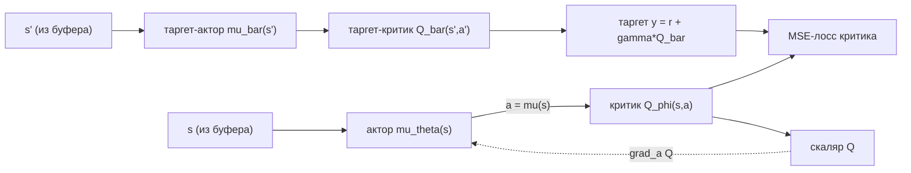

# Вопрос 11. Детерминированный градиент по политике. Off-policy алгоритмы для задач непрерывного управления: DDPG, Twin Delayed DDPG (TD3).

> **Источники:** лекция 11 (`Slides/RL_MIPT_Lecture_11.pdf`), конспект [1] (Иванов, «Reinforcement Learning Textbook») § 6.1 «DDPG» (стр. 150–157): 6.1.1 вывод из Deep Q-learning, 6.1.2 вывод из Policy Gradient, 6.1.3 связь между схемами, 6.1.4 шум Орнштейна — Уленбека, 6.1.5 DDPG, 6.1.6 TD3, 6.1.7 обучение стохастичных политик. Для сверки — Silver et al. (2014) «Deterministic Policy Gradient Algorithms», Lillicrap et al. (2016) «Continuous control with deep RL» (DDPG), Fujimoto et al. (2018) «Addressing Function Approximation Error in Actor-Critic Methods» (TD3), OpenAI Spinning Up.
> **Пререквизиты:** [Основы: политика](00-osnovy.md#policy), [градиентный спуск](00-osnovy.md#gradient), [on-policy vs off-policy и реплей-буфер](00-osnovy.md#onoff-policy), [exploration](00-osnovy.md#exploration), [вероятность и плотности](00-osnovy.md#probability), [нейросеть как аппроксиматор](00-osnovy.md#nn).
> **Связанные билеты:** [Билет 4](04-dqn.md) — DQN, таргет-сети, реплей-буфер, overestimation и Double DQN (здесь только напоминание); [Билет 7](07-reinforce.md) — стохастический policy gradient, REINFORCE, трюк с логарифмом; [Билет 12](12-sac.md) — Soft Actor-Critic, который стоит ровно на reparametrization trick и tanh-сжатии из раздела 4.4 этого билета.

[TOC]

## 1. Зачем это нужно и где стоит в курсе

Есть класс задач, где действие — не «влево/вправо/прыжок», а **вектор вещественных чисел**: крутящие моменты в суставах робота, угол поворота руля и нажатие педали, тяга двигателей квадрокоптера. Формально $\mathcal{A} \subseteq [-1,1]^A$, где $A$ — размерность действия. Все value-based методы ([билет 4](04-dqn.md)) здесь ломаются об одну строчку: $\max_a Q(s,a)$ — континуум не перебрать.

Вариантов три, и первые два плохи. **Дискретизация**: разбить каждую из $A$ координат на $k$ значений — получаем $k^A$ действий (для 8 суставов и $k=10$ это $10^8$), проклятие размерности, да и соседние действия не «знают», что они соседние. **Стохастический policy gradient** ([билет 7](07-reinforce.md), [8](08-a2c-gae.md), [10](10-bias-variance-ppo.md)): работает, но on-policy — данные после каждого обновления выбрасываются, а дисперсия оценки высока. Остаётся третий: **пусть отдельная нейросеть учится выдавать $\arg\max_a Q(s,a)$**. Эта сеть и есть детерминированная политика $\mu_\theta(s)$: состояние на входе, конкретное действие (а не распределение) на выходе.

!!! note Интуиция
    Критик $Q_\phi(s,a)$ — «оценщик», который по позе и по предлагаемому движению говорит, насколько движение хорошо. Перебрать все движения нельзя, но оценщик — нейросеть, а значит дифференцируем: спросим у него «куда чуть-чуть подвинуть действие, чтобы оценка выросла?» — это $\nabla_a Q_\phi(s,a)$ — и толкнём актора туда. Актор учится не «повторять хорошие действия из прошлого» (как REINFORCE), а **ползти вверх по ландшафту критика**. Ровно как в GAN: критик выучивает функцию потерь для генератора-актора.

Место в карте курса: это **actor-critic**, но особого сорта — off-policy и с детерминированным актором. По свойствам DDPG ближе к DQN, чем к A2C/PPO: реплей-буфер, таргет-сети, TD-таргеты, те же болезни (переоценка) и те же лекарства.

## 2. Постановка задачи и обозначения

Обычный MDP ([Основы, §MDP](00-osnovy.md#mdp)), но пространство действий непрерывно: $\mathcal{A} \subseteq [-1,1]^A$. Обозначения (следуем [Основам, §notation](00-osnovy.md#notation)):

- $\mu_\theta(s) \in \mathcal{A}$ — **детерминированная политика** (актор) с параметрами $\theta$; $\mu_{\bar\theta}$ — её таргет-копия;
- $Q_\phi(s,a)$ — критик с параметрами $\phi$; $Q_{\bar\phi}$ — таргет-критик; в TD3 их два: $Q_{\phi_1}, Q_{\phi_2}$;
- $\mathcal{D}$ — реплей-буфер переходов $T = (s,a,r,s',\mathrm{done})$;
- $\nabla_a Q_\phi(s,a) \in \mathbb{R}^{A}$ — градиент критика **по действию** (по входу сети, не по весам);
- $\nabla_\theta \mu_\theta(s) \in \mathbb{R}^{A \times d}$ — якобиан актора по параметрам ($d = \dim\theta$): строка $i$ — градиент $i$-й координаты действия по всем параметрам. Поэтому ниже всюду пишется $\nabla_\theta\mu_\theta(s)^\top\,\nabla_a Q$: это $(d\times A)\cdot(A\times 1) = d$, то есть вектор той же размерности, что и $\theta$, как и положено градиенту. (У Silver et al. якобиан определён «наоборот», как $d\times A$, и транспонирование не пишется — формула от этого не меняется.);
- $d^\mu(s)$ — дисконтированное распределение посещаемости состояний при политике $\mu$;
- $\tau \in (0,1]$ — коэффициент мягкого обновления таргет-сетей (в конспекте он обозначен $\beta$); не путать с траекторией $\tau$ из [Основ](00-osnovy.md#trajectory) — в этом билете траектории отдельной буквой не понадобятся.

Ключевое предположение: $Q^\pi(s,a)$ **дифференцируема по $a$**. Для настоящей $Q$-функции это содержательное требование, но приближаем-то мы её нейросетью, а та дифференцируема по входу всегда — на практике предположение бесплатное.

Цель та же: $J(\mu_\theta) = \mathbb{E}[\sum_t \gamma^t r_t] \to \max_\theta$.

## 3. Основная теория

### 3.1. Вывод первый: из Deep Q-learning («актор как аппроксиматор argmax»)

Напомню [билет 4](04-dqn.md): DQN учит $Q_\phi(s,a)$ регрессией на таргеты $y = r + \gamma \max_{a'} Q_{\bar\phi}(s',a')$ по данным из реплей-буфера $\mathcal{D}$; таргет-сеть $\bar\phi$ нужна, чтобы цель регрессии не «убегала» каждый шаг.

В непрерывном случае архитектура вынужденно другая: действие подаётся **на вход** вместе с состоянием, на выходе скаляр $Q_\phi(s,a)$. Тогда $\arg\max_a$ формально искать можно — градиентным подъёмом по входу, $a_{k+1} = a_k + \alpha \nabla_a Q_\phi(s,a)\big|_{a=a_k}$ — но такая внутренняя оптимизация несколько раз за шаг непозволительно дорога.

Дальше — универсальный приём глубинного обучения: **дорого считать — аппроксимируем нейросетью**. Заводим сеть $\mu_\theta(s)$, добиваясь $\mu_\theta(s) \approx \arg\max_a Q_\phi(s,a)$. Как обучать, видно прямо из определения argmax:

$$
\mathbb{E}_{s \sim \mathcal{D}}\, Q_\phi(s, \mu_\theta(s)) \to \max_\theta .
$$

Словами: подкручиваем веса актора так, чтобы выдаваемое им действие получало у критика оценку повыше. Градиент берётся по chain rule — обратное распространение идёт из скаляра $Q$ через **вход-действие** критика и дальше в веса актора:

$$
\nabla_\theta \mathbb{E}_s\, Q_\phi(s,\mu_\theta(s)) = \mathbb{E}_s\Big[\nabla_\theta \mu_\theta(s)^\top\, \nabla_a Q_\phi(s,a)\big|_{a=\mu_\theta(s)}\Big].
$$

Весь остальной DQN не меняется: везде, где нужен был $\max_a Q_\phi(s,a)$, подставляем $Q_\phi(s,\mu_\theta(s))$; везде, где нужен был $\arg\max$ — подставляем $\mu_\theta(s)$. Таргет становится

$$
y(T) = r + \gamma (1-\mathrm{done})\, Q_{\bar\phi}\big(s', \mu_{\bar\theta}(s')\big),
$$

где $\mu_{\bar\theta}$ — таргет-копия актора (она нужна, потому что «аргмакс» таргет-критика — это тоже отдельная функция, и её версия должна быть согласована с $\bar\phi$). Конспект замечает: использовать вместо $\mu_{\bar\theta}$ свежего актора $\mu_\theta$ не смертельно — это фактически моделирует Double-оценку (см. [билет 4](04-dqn.md)).

Получился алгоритм, который называется **DDPG (Deep Deterministic Policy Gradient)**. И тут законный вопрос: а причём здесь policy gradient? Ответ — во втором выводе.

### 3.2. Вывод второй: Deterministic Policy Gradient Theorem

В [билете 7](07-reinforce.md) мы «релаксировали» задачу: перешли к стохастическим политикам, чтобы $J(\pi_\theta)$ стала дифференцируемой по $\theta$, и получили $\nabla_\theta J = \mathbb{E}[\nabla_\theta \log \pi_\theta(a\mid s)\, Q^\pi(s,a)]$. Но если действия непрерывны, такая релаксация **не обязательна**: сдвиг параметров $\theta$ плавно сдвигает само действие $\mu_\theta(s)$, и $J$ дифференцируема напрямую.

**Теорема (Deterministic Policy Gradient; Silver et al. 2014, конспект — теорема 63).** Если $Q^\mu(s,a)$ дифференцируема по $a$, а $\mu_\theta(s)$ — по $\theta$, то

$$
\nabla_\theta J(\mu_\theta) = \frac{1}{1-\gamma}\, \mathbb{E}_{s \sim d^{\mu_\theta}}\Big[ \nabla_\theta \mu_\theta(s)^\top\, \nabla_a Q^{\mu_\theta}(s,a)\big|_{a=\mu_\theta(s)} \Big].
$$

**Идея доказательства (5 строк).** Стартуем с $\nabla_\theta V^{\mu_\theta}(s) = \nabla_\theta Q^{\mu_\theta}(s, \mu_\theta(s))$ — в детерминированном случае матожидание по действиям исчезает. При сдвиге $\theta$ меняется и действие, и сама оценочная функция, поэтому производная сложной функции даёт два слагаемых:

$$
\nabla_\theta V^{\mu_\theta}(s) = \underbrace{\nabla_\theta \mu_\theta(s)^\top \nabla_a Q^{\mu}(s,a)\big|_{a=\mu_\theta(s)}}_{\text{подвинули действие}} + \underbrace{\nabla_\theta Q^{\mu_\theta}(s,a)\big|_{a=\mu_\theta(s)}}_{\text{поменялась оценка политики}} .
$$

Второе слагаемое по QV-уравнению равно $\gamma\, \mathbb{E}_{s'} \nabla_\theta V^{\mu_\theta}(s')$ — то есть та же самая величина на шаг вперёд. Разворачивая рекурсию, получаем сумму по траектории $\sum_{t\ge 0}\gamma^t \nabla_\theta\mu_\theta(s_t)^\top\nabla_a Q^\mu(s_t,a)|_{a=\mu_\theta(s_t)}$, а она по теореме об эквивалентной форме матожидания по траекториям сворачивается в матожидание по $d^{\mu_\theta}(s)$ с множителем $\frac{1}{1-\gamma}$. $\blacksquare$

Есть и второй, «предельный» взгляд (это отдельный результат Silver et al. 2014): возьмём стохастическую политику $\pi_{\theta,\sigma}(a\mid s) = \mathcal{N}(\mu_\theta(s), \sigma^2 I)$ и устремим $\sigma \to 0$. Тогда обычный стохастический policy gradient **сходится к формуле DPG**. То есть детерминированный градиент — не какой-то отдельный зверь, а вырожденный случай знакомой теоремы; и заодно понятно, почему формулы так похожи по смыслу («двигай политику туда, где $Q$ больше»), но выглядят по-разному.

### 3.3. Почему две схемы — одно и то же (конспект 6.1.3)

Конспект формулирует это как теорему 64 с доказательством «методом пристального взгляда»: суррогатная функция из DPG,

$$
L(\theta) = \mathbb{E}_{s}\, Q_\phi(s, \mu_\theta(s)) \to \max_\theta ,
$$

**буквально совпадает** с тем, что мы выписали в разделе 3.1, обучая «аппроксиматор аргмаксимума». Содержательное объяснение: обе дороги привели к **Policy Iteration** ([билет 2](02-bellman-pi-vi.md)). Мы параллельно крутим два процесса: **policy evaluation** — учим $Q_\phi \approx Q^\mu$ по TD-таргетам; **policy improvement** — двигаем $\mu_\theta(s)$ в сторону $\arg\max_a Q_\phi(s,a)$. Разница только в том, что улучшение политики делается не «в лоб» (взять argmax), а маленьким градиентным шагом по её параметрам. Иными словами, DQN для непрерывных действий и policy gradient для детерминированных политик — это один алгоритм, описанный с двух сторон; ещё одно свидетельство близости value-based и policy-based подходов.

### 3.4. Почему метод off-policy

В формуле DPG нет ни $\log \mu_\theta$, ни отношения правдоподобий $\frac{\pi_\theta(a\mid s)}{\pi_{\text{old}}(a\mid s)}$ — а это ровно те две вещи, которые в стохастическом PG заставляют данные быть свежими. Причины:

- **Нет $\log\mu$**, потому что нет матожидания по действиям: действие одно, $a = \mu_\theta(s)$. Трюк с логарифмом $\nabla p = p\nabla\log p$ ([Основы, §probability](00-osnovy.md#probability)) нужен, чтобы продифференцировать *распределение*, из которого сэмплируют; здесь дифференцируется само *действие*. Градиент проходит «сквозь» действие в критика (это же и есть вырожденный reparametrization trick, см. 4.4).
- **Нет importance sampling**, потому что осталось матожидание **только по состояниям**. Формально брать надо $s \sim d^{\mu_\theta}$, и подмена его буфером делает формулу не настоящим градиентом $J$. Но по теореме о policy improvement ([билет 2](02-bellman-pi-vi.md)) **в каком бы состоянии мы ни улучшили политику, функционал не ухудшится**: значит, направление — всё ещё направление улучшения, просто не наискорейшего. Мы сознательно меняем «честный» policy gradient на Policy Iteration и получаем право брать состояния откуда угодно, включая старый буфер.

Цена названа в конспекте прямо: качество политики упирается в качество критика ($\nabla_a Q_\phi$ должен приближать $\nabla_a Q^\mu$ — это сильнее, чем «значения близки»), обойтись $V$-функцией или многошаговыми оценками нельзя, преимущества on-policy теряются.

### 3.5. Exploration: шум Орнштейна — Уленбека

Детерминированная политика не исследует вообще: в одном и том же состоянии она всегда выдаёт одно и то же действие. Как и в DQN, нужен внешний механизм ([Основы, §exploration](00-osnovy.md#exploration)), но $\varepsilon$-greedy бессмысленно — «случайное действие» из континуума это просто шум. Поэтому шум **добавляют к действию**:

$$
a_t = \mu_\theta(s_t) + \varepsilon_t, \qquad \varepsilon_t \sim \mathcal{N}(0, \sigma^2 I).
$$

$\sigma$ — гиперпараметр, его обычно затухают к нулю по ходу обучения. Проблема такого шума — он независим во времени.

!!! example Пример 88 из конспекта
    Действие — угол поворота руля, шаг среды — доля секунды. Независимый шум означает «рандомно подёргиваться несколько раз в секунду»: в среднем машина едет туда же, куда ехала, исследования не происходит. Хочется **сместить траекторию**: решили повернуть правее — удерживаем это смещение и дальше. Значит, шум должен быть скоррелирован во времени.

**Шум Орнштейна — Уленбека (Ornstein–Uhlenbeck)** — дискретизация одноимённого случайного процесса; в начале эпизода $\varepsilon_0 = 0$, дальше рекурсивно:

$$
\varepsilon_{t+1} = \alpha\,\varepsilon_t + \hat\varepsilon, \qquad \hat\varepsilon \sim \mathcal{N}(0,\sigma^2 I), \quad \alpha \le 1 .
$$

Здесь $\alpha$ — коэффициент затухания шума, а **не** learning rate (в этом билете learning rate тоже по традиции обозначен $\alpha$ — различайте по контексту). Это накопительный шум, «прибиваемый» коэффициентом $\alpha$ обратно к нулю (mean-reverting). При $\alpha=0$ это обычный независимый гауссов шум, при $\alpha\to1$ — почти случайное блуждание. Плюс: параметры можно не затухать — даже околооптимальная политика с таким шумом исследует **разумные альтернативы**, а не случайные дёрганья.

!!! tip Практический совет
    В оригинальном DDPG (Lillicrap et al.) использовали OU-шум, но авторы TD3 и Spinning Up показали, что на стандартных бенчмарках **обычный гауссов шум не хуже**, а гиперпараметров у него на один меньше. Поэтому сейчас по умолчанию берут $\mathcal{N}(0,\sigma^2)$, а OU надо знать как идею «коррелированного во времени исследования».

## 4. Алгоритмы

### 4.1. DDPG

Четыре сети: актор $\mu_\theta$, критик $Q_\phi$ и две их таргет-копии $\mu_{\bar\theta}, Q_{\bar\phi}$. Таргет-копии обновляются **мягко** (soft update, экспоненциальное сглаживание) — в отличие от DQN, где веса копировались раз в $K$ шагов целиком:

$$
\bar\phi \leftarrow \tau\phi + (1-\tau)\bar\phi, \qquad \bar\theta \leftarrow \tau\theta + (1-\tau)\bar\theta, \qquad \tau \approx 0.005 .
$$

Две функции потерь (на мини-батче из буфера):

$$
\mathcal{L}_{\text{critic}}(\phi) = \frac{1}{B}\sum_T \Big( Q_\phi(s,a) - \underbrace{\big[r + \gamma(1-\mathrm{done})\,Q_{\bar\phi}(s',\mu_{\bar\theta}(s'))\big]}_{y(T),\ \text{градиент не идёт}} \Big)^2 ,
$$

$$
\mathcal{L}_{\text{actor}}(\theta) = -\frac{1}{B}\sum_{s} Q_\phi\big(s, \mu_\theta(s)\big) .
$$

Второй лосс — это и есть DPG: минус перед $Q$ превращает подъём в спуск. **Важно:** при шаге по $\theta$ веса критика $\phi$ заморожены, градиент проходит через критика только транзитом, к входу-действию.



Пунктир — обратный проход: скаляр $Q$ дифференцируется по действию, и эта производная становится «сигналом ошибки» на выходе актора.

```text
Алгоритм DDPG
Гиперпараметры: B (батч), tau (soft update), sigma, alpha (шум),
                lr актора и критика, K (период обновления таргетов).
 0. Инициализировать theta, phi случайно; bar_theta := theta, bar_phi := phi;
    шум eps := 0; буфер D пуст; наблюдать s_0.
 На каждом шаге t:
 1. Обновить шум: eps <- alpha*eps + hat_eps, hat_eps ~ N(0, sigma^2 I).
 2. Выбрать действие a_t := clip( mu_theta(s_t) + eps, -1, 1 ).
 3. Сделать шаг в среде, получить r_t, s_{t+1}, done_{t+1}.
 4. Положить (s_t, a_t, r_t, s_{t+1}, done_{t+1}) в буфер D.
 5. Засэмплировать мини-батч из B переходов T = (s,a,r,s',done) из D.
 6. Посчитать таргеты:  y(T) := r + gamma*(1-done)*Q_bar_phi( s', mu_bar_theta(s') ).
 7. Шаг градиентного спуска по phi:  (1/B) * sum_T ( Q_phi(s,a) - y(T) )^2  -> min.
 8. Шаг градиентного подъёма по theta: (1/B) * sum_s Q_phi( s, mu_theta(s) ) -> max
    (веса phi заморожены).
 9. Если t mod K == 0, мягко обновить таргеты:
       bar_phi   <- tau*phi   + (1-tau)*bar_phi
       bar_theta <- tau*theta + (1-tau)*bar_theta
```

!!! tip Практические детали (Lillicrap et al.)
    Batch normalization или нормировка наблюдений (координаты сред различаются на порядки); **learning rate актора меньше**, чем у критика ($10^{-4}$ против $10^{-3}$) — актор не должен убегать вперёд полуобученного критика; масштабирование наград, иначе $Q$ уезжает; tanh на выходе актора плюс клиппинг действия после добавления шума; первые тысячи шагов — случайные действия, чтобы наполнить буфер.

Когда DDPG хорош: конспект отмечает, что в локомоции он бывает **эффективнее PPO по числу взаимодействий со средой** — там награда плотная, сигнал не отложен (упал — сразу штраф), $Q$ по действию не похожа на плато, и переиспользование буфера окупается.

### 4.2. Что в DDPG ломается

!!! warning Adversarial exploitation критика
    Главная болезнь — **переоценка (overestimation)**, унаследованная от DQN ([билет 4](04-dqn.md)). В формулах вроде бы нет оператора $\max$, но он там есть неявно: актор целенаправленно ищет действия с высоким $Q_\phi$, то есть **ищет там, где ошибка аппроксимации положительна**. Поэтому $Q_\phi(s,\mu_\theta(s))$ почти всегда завышает настоящий $\max_a Q^\mu(s,a)$. Дальше это завышение попадает в таргет, критик обучается на завышенную цель, актор эксплуатирует новое завышение — цепная реакция, $Q$ уезжает в бесконечность, политика деградирует.

Отдельный механизм той же болезни: в непрерывном пространстве у неидеальной нейросети бывают **узкие всплески** $Q_\phi$ — тонкие «иглы» в одном-двух направлениях действия. Актор находит такую иглу и садится на неё, хотя настоящая $Q^\mu$ там ничем не выделяется.

Плюс два сопутствующих недуга. **Хрупкость**: схема GAN-подобна — критик учит функцию потерь для актора, и поломка одного мгновенно портит второго; конспект называет DDPG «пожалуй, одним из самых нестабильных алгоритмов RL» (низкая воспроизводимость, высокая чувствительность к seed и гиперпараметрам). **Дисперсия таргетов**: одношаговый таргет опирается на выход собственной сети, и его шум идёт и в критика, и — через $\nabla_a Q$ — в актора.

### 4.3. TD3 = DDPG + три костыля

TD3 (Twin Delayed DDPG) — набор из трёх эвристик поверх DDPG. Никакой новой теории, но стабильность вырастает радикально.

| Проблема | Приём | Как именно | Цена |
|---|---|---|---|
| Переоценка: актор «взламывает» критика, завышение накапливается | **Clipped Double Q-learning** (twin) | Два независимых критика $Q_{\phi_1}, Q_{\phi_2}$ учатся на **общий** таргет $y = r+\gamma(1-\mathrm{done})\min_{i}Q_{\bar\phi_i}(s',\tilde a)$ | Вдвое больше вычислений; сдвиг в сторону **недо**оценки |
| Актор учится по шумному, не успевшему сойтись критику; их «гонка» раскачивает систему | **Delayed policy updates** | Актор и все три таргет-сети обновляются раз в $d$ шагов критика (авторы берут $d=2$) | Актор учится вдвое медленнее по числу шагов |
| Узкие всплески $Q_\phi$ по действию, на которые садится актор | **Target policy smoothing** | В таргете действие зашумляется: $\tilde a = \mu_{\bar\theta}(s') + \mathrm{clip}(\varepsilon,-c,c)$, $\varepsilon\sim\mathcal{N}(0,\hat\sigma^2 I)$ | Небольшое смещение; ещё два гиперпараметра $\hat\sigma, c$ |

**Почему min, а не среднее.** Одиночный критик, максимизируемый актором, систематически завышает: $\mathbb{E}[\max_a \hat Q] \ge \max_a \mathbb{E}[\hat Q]$ (неравенство Йенсена, тот же механизм, что в Q-learning). Минимум двух **независимо обученных** оценок даёт смещение **вниз**, и асимметрия здесь принципиальна: занижение не самоусиливается — недооценённое действие актор просто не выберет, ошибка останется локальной; переоценённое он выберет обязательно, и завышение пойдёт в таргет и размножится. Среднее же смещения не убирает (максимум по действиям всё равно выуживает положительные выбросы), оно только снижает дисперсию.

**Почему сглаживание таргета — регуляризация.** Интуиция авторов: похожие действия должны иметь похожую ценность. Подмешивая маленький шум в действие внутри таргета, мы обучаем критика на $\mathbb{E}_\varepsilon Q_{\bar\phi}(s',\mu_{\bar\theta}(s')+\varepsilon)$ — версию, усреднённую по окрестности; узкая игла после такого усреднения исчезает, и садиться актору некуда. Клиппинг $\mathrm{clip}(\cdot,-c,c)$ держит шум маленьким: **это не exploration**, большое отклонение испортило бы таргет.

```text
Алгоритм TD3
Гиперпараметры: B, tau, d (задержка актора), sigma/alpha (шум для exploration),
                hat_sigma и c (шум сглаживания таргета).
 0. Инициализировать phi_1, phi_2, theta; bar_phi_i := phi_i, bar_theta := theta;
    буфер D; наблюдать s_0.
 На каждом шаге t:
 1-5. Как в DDPG: шум -> a_t := clip(mu_theta(s_t)+eps, -1, 1) -> шаг в среде ->
      положить переход в D -> засэмплировать батч из B переходов.
 6. Сгладить таргет-действие:
      eps' ~ clip( N(0, hat_sigma^2 I), -c, c )
      tilde_a := clip( mu_bar_theta(s') + eps', -1, 1 )
 7. Общий таргет для обоих критиков (минимум из двух):
      y(T) := r + gamma*(1-done) * min_{i in {1,2}} Q_bar_phi_i( s', tilde_a )
 8. Шаг спуска по phi_1 и по phi_2 (каждый на свой MSE к одному и тому же y).
 9. Если t mod d == 0:
      9a. Шаг подъёма по theta:  (1/B) * sum_s Q_phi_1( s, mu_theta(s) ) -> max
      9b. Мягко обновить все три таргета:
            bar_phi_i <- tau*phi_i + (1-tau)*bar_phi_i,  i = 1,2
            bar_theta <- tau*theta + (1-tau)*bar_theta
```

Два замечания. Первое: **актор один на двух критиков** (он же «аргмакс» для обоих), а таргет-сети заводят для каждого критика отдельно. Второе: в шаге 9a актор оптимизирует только $Q_{\phi_1}$ — так в оригинальной статье. Логика: актор «не видит» второго критика, и там, где он взломал первого, у второго завышение и занижение равновероятны, так что $\min$ в таргете взлом срежет. Альтернатива — максимизировать $\min_i Q_{\phi_i}(s,\mu_\theta(s))$, как в SAC; работают оба.

### 4.4. Обучение стохастичных политик: reparametrization trick и tanh

Мост к [билету 12](12-sac.md). Все три костыля TD3 лечат следствия **детерминированности** политики: нет естественного исследования, актор взламывает критика. Обязательно ли в off-policy режиме учить детерминированную политику? Нет.

!!! info Определение (reparametrization trick)
    Для параметризации $\pi_\theta(a\mid s)$ применим **репараметризационный трюк**, если сэмплирование $a \sim \pi_\theta(a\mid s)$ эквивалентно сэмплированию шума $\varepsilon \sim p(\varepsilon)$ из распределения, **не зависящего от параметров**, и детерминированного преобразования $a = f_\theta(s,\varepsilon)$.

Каноничный пример — гауссова политика $\pi_\theta(a\mid s) = \mathcal{N}(\mu_\theta(s), \sigma_\theta(s)^2 I)$:

$$
a = \mu_\theta(s) + \sigma_\theta(s) \odot \varepsilon, \qquad \varepsilon \sim \mathcal{N}(0, I),
$$

где $\odot$ — покоординатное умножение. Детерминированная политика — вырожденный случай: шум «пустой», $f_\theta(s,\varepsilon)=\mu_\theta(s)$.

Ценность трюка в том, что **вся зависимость от $\theta$ переехала внутрь детерминированной функции**, и градиент можно вносить под матожидание:

$$
\nabla_\theta \mathbb{E}_{a\sim\pi_\theta} Q_\phi(s,a) = \mathbb{E}_{\varepsilon \sim p(\varepsilon)} \nabla_\theta Q_\phi\big(s, f_\theta(s,\varepsilon)\big) = \mathbb{E}_\varepsilon\Big[\nabla_\theta f_\theta(s,\varepsilon)^\top \nabla_a Q_\phi(s,a)\big|_{a=f_\theta(s,\varepsilon)}\Big].
$$

Это буквальное обобщение DPG (теорема 65 конспекта; доказательство повторяет теорему 63): актор учится по градиентам критика, только в действие дополнительно впрыскивается шум, чью величину он тоже контролирует. Функционал — $\mathbb{E}_{s\sim\mathcal{D}}\,\mathbb{E}_{a\sim\pi_\theta(a\mid s)}Q_\phi(s,a) \to \max_\theta$.

Сравним два способа продифференцировать матожидание:

| | Score-function (REINFORCE, log-derivative) | Reparametrization (pathwise) |
|---|---|---|
| Формула | $\mathbb{E}_a[\nabla_\theta\log\pi_\theta(a\mid s)\,(Q(s,a)-b(s))]$ | $\mathbb{E}_\varepsilon[\nabla_\theta f_\theta(s,\varepsilon)^\top\nabla_a Q(s,a)]$ |
| Что требуется | уметь считать $\log\pi_\theta(a\mid s)$ | уметь представить сэмпл как $f_\theta(s,\varepsilon)$ |
| Нужен ли $\nabla_a Q$ | нет, $Q$ — чёрный ящик (годится и для дискретных $a$) | да, критик обязан быть дифференцируем по действию |
| Дисперсия | высокая, нужен бэйзлайн $b(s)$ | заметно ниже: используется больше информации ($\nabla_a Q$, а не только значение) |
| Когда применимо | всегда | гауссианы, tanh-гауссианы и т.п.; **не** для смеси гауссиан, дискретных действий |

Поэтому для «богатых» параметризаций — например, смеси гауссиан, которая лечит унимодальность (объезжая дерево, критик хвалит и «слева», и «справа», а одна гауссиана усредняет их в «врезаться») — приходится возвращаться к REINFORCE с бэйзлайном $b(s)=V_\phi(s)=\mathbb{E}_{a\sim\pi_\theta}Q_\phi(s,a)$.

**Диапазон и tanh-сжатие.** Действия должны лежать в $[-1,1]^A$. У детерминированной политики это решал tanh на последнем слое; для гауссианы так просто нельзя — придётся пересчитать плотность. Объявляем $a = \tanh(u)$, где $u \sim \mathcal{N}(\mu_\theta(s), \sigma_\theta(s)^2 I)$, и применяем формулу замены переменной:

$$
\log\pi_\theta(a\mid s) = \log \mathcal{N}(u \mid \mu_\theta(s), \sigma_\theta(s)^2 I) - \log\big|\det \nabla_u g(u)\big|, \qquad g = \tanh .
$$

Вывод в четыре строки: (1) преобразование поэлементное, значит якобиан $\nabla_u \tanh(u)$ — **диагональная** матрица; (2) определитель диагональной матрицы — произведение диагонали: $\det\nabla_u g = \prod_{i=1}^{A}\frac{d}{du_i}\tanh(u_i)$; (3) производная гиперболического тангенса $\tanh' = 1-\tanh^2$, поэтому $\det\nabla_u g = \prod_i (1-\tanh^2(u_i))$; (4) все сомножители положительны (так как $|\tanh(u_i)| \le 1$), модуль не нужен, логарифм произведения — сумма логарифмов. Итого:

$$
\log\pi_\theta(a\mid s) = \log\mathcal{N}(u\mid\mu_\theta(s),\sigma_\theta(s)^2 I) - \sum_{i=1}^{A}\log\big(1-\tanh^2(u_i)\big).
$$

Смысл поправки: tanh **сжимает** пространство у краёв, поэтому плотность там **растёт**; вычитаемое $\log(1-\tanh^2 u_i)$ отрицательно (так как $1-\tanh^2 < 1$), значит $\log\pi$ увеличивается — всё сходится. Без этой поправки любая формула, где нужна энтропия или $\log\pi$, будет считать неправду. Ровно эта конструкция — tanh-гауссова политика плюс поправка — используется в **SAC** ([билет 12](12-sac.md)), где $\log\pi$ входит в функционал явно, как энтропийный бонус.

## 5. Пример

**Часть 1: как работает DPG-шаг.** Одномерное действие, одно состояние. Критик выучил $Q(s,a) = -(a-2)^2$ (оптимум $a^*=2$), актор тривиален: $\mu_\theta(s)=\theta$, learning rate $\alpha=0.1$, старт $\theta_0=0$.

Градиент критика по действию: $\nabla_a Q = -2(a-2)$. Якобиан актора: $\nabla_\theta\mu_\theta = 1$. Значит

$$
\nabla_\theta J = \nabla_\theta\mu_\theta \cdot \nabla_a Q\big|_{a=\theta} = -2(\theta-2) = 2(2-\theta).
$$

В точке $\theta_0=0$: $\nabla_\theta J = 4$, шаг $\theta_1 = 0 + 0.1\cdot 4 = 0.4$. Дальше $\theta_2 = 0.4 + 0.1\cdot 2(2-0.4) = 0.72$, $\theta_3 = 0.976$, … Рекуррента $\theta_{k+1} = 0.8\,\theta_k + 0.4$ сходится к $\theta=2$ геометрически. Никакого перебора действий — актор просто **скатывается вверх по критику**. Обратите внимание: если бы критик ошибся и выучил $Q(s,a)=-(a-3)^2$, актор так же уверенно уехал бы в $\theta=3$. Актор ровно настолько хорош, насколько хорош $\nabla_a Q$.

**Часть 2: откуда берётся переоценка и что делает $\min$.** Пусть в состоянии $s'$ истинные ценности трёх кандидатных действий одинаковы: $Q^\mu(s',a_1)=Q^\mu(s',a_2)=Q^\mu(s',a_3)=0$. Критики обучены не идеально; пусть их ошибки такие:

| действие | $Q_{\phi_1}$ | $Q_{\phi_2}$ | среднее | минимум |
|---|---|---|---|---|
| $a_1$ | $+0.5$ | $-0.4$ | $+0.05$ | $-0.4$ |
| $a_2$ | $-0.3$ | $+0.6$ | $+0.15$ | $-0.3$ |
| $a_3$ | $+0.2$ | $-0.1$ | $+0.05$ | $-0.1$ |

Актор ищет максимум. **Один критик** ($Q_{\phi_1}$): выберет $a_1$, оценка $+0.5$ при истинных $0$ — **завышение на 0.5**, и именно оно уйдёт в таргет. **Среднее двух**: выберет $a_2$, оценка $+0.15$ — завышение меньше, но оно осталось: усреднение убирает разброс, а не смещение, ведь максимум по действиям всё равно выуживает положительные выбросы. **Минимум двух (TD3)**: по каждому действию берём $\min$, получаем $(-0.4,-0.3,-0.1)$, максимум из них $= -0.1$ — **занижение на 0.1**. И это хорошо: заниженная оценка не размножается по цепочке таргетов, тогда как завышенная — размножается.

## 6. Подводные камни, сравнения, типичные ошибки

!!! warning Типичная ошибка на экзамене
    «DDPG — это policy gradient, значит он on-policy». Нет. Название историческое; по механике это DQN с обученным аргмаксом. В формуле DPG матожидание берётся только по **состояниям**, и заменять их распределение на распределение буфера законно (точнее — обосновано теоремой о policy improvement, а не тем, что градиент остаётся честным).

!!! warning Про градиенты
    $\nabla_a Q_\phi$ — это градиент **по входу** сети, а не по весам. При шаге актора веса критика заморожены (в коде: не передавать $\phi$ в оптимизатор актора / `detach`). Симметрично, при шаге критика таргет $y(T)$ **отцепляется** от графа — иначе получится не TD-регрессия, а минимизация чего-то бессмысленного.

!!! warning Когда DDPG/TD3 не работают
    Разреженная и сильно отложенная награда (одношаговые таргеты ползут по цепочке медленно); мультимодальная $Q$ по действию (детерминированный актор обязан выбрать одну моду и может застрять в плохой); плато в $Q(s,\cdot)$ — тогда $\nabla_a Q \approx 0$ и актору некуда двигаться; дискретные действия (градиента по действию просто нет — там DQN). Плюс общая хрупкость: обязательно несколько seed'ов, иначе выводы о качестве недостоверны.

Сравнение методов для непрерывного управления:

| | DQN | DDPG | TD3 | SAC | PPO |
|---|---|---|---|---|---|
| Непрерывные действия | нет | да | да | да | да |
| On/off-policy | off | off | off | off | on |
| Политика | неявная (argmax) | детерминированная | детерминированная | стохастическая (tanh-гаусс) | стохастическая |
| Число критиков | 1 + таргет-копия (в Double DQN она же вторая оценка) | 1 | 2, таргет $=\min$ | 2, таргет $=\min$ | 1 (это $V$, не $Q$) |
| Exploration | $\varepsilon$-greedy | шум в действие (OU/гаусс) | шум в действие | из энтропии политики | из стохастичности политики |
| Градиент актора | — | DPG через $\nabla_a Q$ | DPG через $\nabla_a Q$ | reparam через $\nabla_a Q$ | score-function (log-prob) |
| Sample efficiency | высокая | высокая | высокая | высокая | низкая |
| Устойчивость | средняя | **низкая** | хорошая | хорошая | хорошая |

Таблица читается как история: DDPG принёс off-policy в непрерывное управление, но вышел хрупким; TD3 залечил три конкретные болезни эвристиками; SAC ([билет 12](12-sac.md)) убрал корень — заменил детерминированного актора стохастическим с энтропийным бонусом, сохранив twin-критиков; PPO ([билет 10](10-bias-variance-ppo.md)) остаётся надёжным on-policy запасным вариантом.

## 7. Ответ за 5 минут

1. **Задача.** Непрерывные действия $\mathcal{A}\subseteq[-1,1]^A$: $\max_a Q(s,a)$ не перебрать, дискретизация — $k^A$ вариантов, on-policy PG неэффективен по данным.
2. **Идея.** Аппроксимировать аргмаксимум нейросетью: $\mu_\theta(s)\approx\arg\max_a Q_\phi(s,a)$, обучая её как $\mathbb{E}_s Q_\phi(s,\mu_\theta(s))\to\max_\theta$.
3. **Градиент по chain rule:** $\nabla_\theta J = \mathbb{E}_s[\nabla_\theta\mu_\theta(s)^\top\nabla_a Q_\phi(s,a)|_{a=\mu_\theta(s)}]$.
4. **Теорема DPG (Silver 2014):** $\nabla_\theta J(\mu_\theta)=\frac{1}{1-\gamma}\mathbb{E}_{d^{\mu_\theta}}[\nabla_\theta\mu_\theta(s)^\top\nabla_a Q^\mu(s,a)|_{a=\mu_\theta(s)}]$; доказывается раскруткой $\nabla_\theta V = \nabla_\theta Q(s,\mu_\theta(s))$ на два слагаемых и рекурсией. Это предел стохастического PG при $\sigma\to0$.
5. **Две схемы совпадают** (конспект 6.1.3): обе дают Policy Iteration — evaluation критика + improvement актора. Отсюда право брать $s$ из буфера: по теореме о policy improvement улучшение в любом состоянии не портит $J$.
6. **Off-policy** потому, что нет $\log\mu$ (нечего дифференцировать — действие одно) и нет importance sampling (матожидание только по состояниям).
7. **Exploration:** $a_t=\mu_\theta(s_t)+\varepsilon_t$; OU-шум $\varepsilon_{t+1}=\alpha\varepsilon_t+\mathcal{N}(0,\sigma^2 I)$ коррелирован во времени (смещаем траекторию, а не дёргаемся); на практике гауссов не хуже.
8. **DDPG:** 4 сети, soft update $\bar\phi\leftarrow\tau\phi+(1-\tau)\bar\phi$; критик — MSE к $r+\gamma Q_{\bar\phi}(s',\mu_{\bar\theta}(s'))$; актор — $-Q_\phi(s,\mu_\theta(s))$.
9. **Болезнь:** актор эксплуатирует ошибки критика (неявный $\max$), переоценка + узкие всплески $Q$; схема как GAN — крайне нестабильна.
10. **TD3, три лекарства:** (a) twin + $\min(Q_{\bar\phi_1},Q_{\bar\phi_2})$ в таргете — смещение вниз безопаснее смещения вверх; (b) delayed updates — актор и таргеты раз в $d=2$ шага; (c) target smoothing $\tilde a=\mu_{\bar\theta}(s')+\mathrm{clip}(\varepsilon,-c,c)$ — сглаживает $Q$ по действиям.
11. **Стохастический актор:** reparametrization trick $a=\mu_\theta(s)+\sigma_\theta(s)\odot\varepsilon$ — градиент проходит сквозь сэмпл, дисперсия ниже, чем у score-function; tanh-сжатие требует поправки $\log\pi = \log\mathcal{N}(u) - \sum_i\log(1-\tanh^2 u_i)$.
12. **Вывод:** DDPG = DQN для непрерывных действий; TD3 = DDPG + 3 эвристики; SAC = следующий шаг, где детерминированность заменена энтропией.

## 8. Вероятные допвопросы экзаменатора

**Почему DDPG off-policy, а REINFORCE нет?**
В REINFORCE градиент — матожидание **по траекториям текущей политики**, и подмена распределения требует importance sampling с произведением отношений плотностей по всему эпизоду (дисперсия взрывается). В DPG матожидание осталось только по состояниям, а по действиям его нет вовсе; состояния же можно брать из любого распределения, потому что мы фактически делаем policy improvement, а он не ухудшает политику независимо от того, в каких состояниях проведён.

**Почему в формуле DPG нет $\log\mu_\theta$?**
Трюк с логарифмом нужен, чтобы продифференцировать плотность, по которой берут сэмпл. Здесь плотности нет: действие — детерминированная дифференцируемая функция параметров, и градиент проходит прямо через неё в критика (pathwise-производная). Формально это вырожденный reparametrization trick с «пустым» шумом.

**Зачем два критика, а не один с меньшим learning rate?**
Меньший lr борется с дисперсией и скоростью, а проблема — в **смещении**: максимизация по действиям систематически выуживает положительные ошибки аппроксимации. Сколь угодно медленно обучаемый одиночный критик всё равно будет взломан актором. Нужны две **независимые** оценки, чьи ошибки не скоррелированы, чтобы $\min$ срезал взлом одной из них.

**Почему $\min$, а не среднее двух критиков?**
Среднее снижает разброс, но не убирает смещение: максимум по действиям всё равно выбирает действие с положительной суммарной ошибкой. $\min$ даёт смещение вниз, а оно безопасно: недооценённое действие актор просто не выберет, и ошибка останется локальной; переоценённое — актор выберет обязательно, и завышение попадёт в таргет и размножится по цепочке.

**Зачем шум на таргет-действие, если exploration и так есть?**
Это не exploration, а регуляризация. Идея: близкие действия должны иметь близкую ценность. Обучая критика на $\mathbb{E}_\varepsilon Q_{\bar\phi}(s',\mu_{\bar\theta}(s')+\varepsilon)$, мы сглаживаем $Q$ по действию и уничтожаем узкие всплески, на которые садится актор. Поэтому шум маленький и обрезан по модулю ($\mathrm{clip}(\varepsilon,-c,c)$), иначе таргет сместится по существу.

**Чем OU-шум лучше гауссова?**
Он коррелирован во времени ($\varepsilon_{t+1}=\alpha\varepsilon_t+\mathcal{N}(0,\sigma^2 I)$), то есть даёт «направленное» исследование: смещение руля сохраняется несколько шагов и реально меняет траекторию, тогда как независимый шум при мелком шаге среды просто усредняется в ноль. Плюс параметры можно не затухать. На практике, впрочем, авторы TD3 показали, что обычный гауссов шум работает не хуже, и сейчас чаще берут его.

**Почему tanh требует поправки в плотности?**
Потому что $a=\tanh(u)$ — замена переменной, а плотность при замене умножается на обратный якобиан: $\pi_\theta(a\mid s) = \mathcal{N}(u\mid\mu_\theta(s),\sigma_\theta(s)^2 I)\,\cdot\,|\det\nabla_u g|^{-1}$. Для поэлементного tanh якобиан диагонален, $\det = \prod_i(1-\tanh^2 u_i) > 0$, отсюда $\log\pi_\theta(a\mid s)=\log\mathcal{N}(u\mid\mu_\theta(s),\sigma_\theta(s)^2 I)-\sum_i\log(1-\tanh^2 u_i)$. Если поправку не учесть, любая величина, зависящая от $\log\pi$ (энтропия в SAC, importance-ratio в PPO), будет посчитана неверно.

**Можно ли обойтись $V$-функцией и многошаговыми оценками, как в A2C?**
Нет. Актору нужен именно $\nabla_a Q(s,a)$ — производная по действию, а у $V(s)$ действия в аргументах нет. По той же причине качество политики жёстко упирается в качество критика: нужна не просто близость значений $Q_\phi \approx Q^\mu$, а близость их **градиентов по действию**, что заметно более сильное требование.
