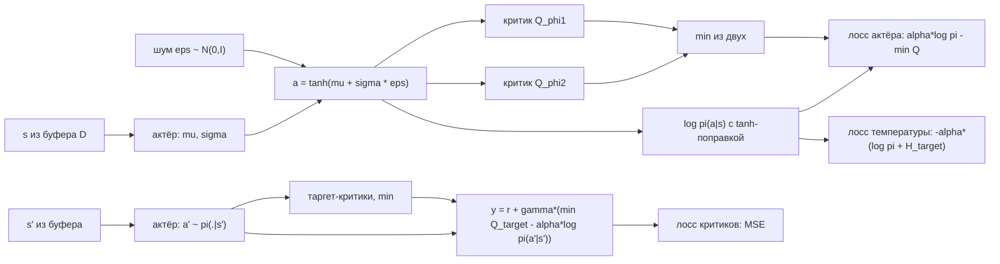

# Вопрос 12. Обучение с подкреплением с добавлением энтропии. Алгоритм Soft Actor-Critic.

> **Источники:** лекция 12 (`Slides/RL_MIPT_Lecture_12.pdf`), конспект [1] (Иванов, «Reinforcement Learning Textbook») §6.2 «Soft Actor-Critic» (стр. 158–165): 6.2.1 Maximum Entropy RL, 6.2.2 Soft Policy Evaluation, 6.2.3 Soft Policy Improvement, 6.2.4 SAC, 6.2.5 аналоги других алгоритмов. Оригинальные статьи: Haarnoja et al. 2017 (Soft Q-learning), Haarnoja et al. 2018 (SAC, v1), Haarnoja et al. 2019 («SAC: Algorithms and Applications», v2 с автонастройкой температуры), Levine 2018 (control as inference); OpenAI Spinning Up.
> **Пререквизиты:** [Основы: энтропия и KL-дивергенция](00-osnovy.md#probability), [функции ценности](00-osnovy.md#value), [политика](00-osnovy.md#policy), [on-policy vs off-policy и реплей-буфер](00-osnovy.md#onoff-policy), [exploration](00-osnovy.md#exploration).
> **Связанные билеты:** [Билет 2](02-bellman-pi-vi.md) — уравнения Беллмана, сжимающие операторы, Policy/Value Iteration (здесь — их soft-версии); [Билет 11](11-dpg-ddpg-td3.md) — DDPG/TD3, репараметризационный трюк, tanh-squashing и поправка к плотности, twin-оценка; [Билет 8](08-a2c-gae.md) и [Билет 10](10-bias-variance-ppo.md) — энтропийный бонус в A2C/PPO как эвристика; [Билет 13](13-imitation-irl.md) — Maximum Entropy IRL.

[TOC]

## 1. Зачем это нужно и где стоит в курсе

Место в карте курса: **actor-critic, off-policy, непрерывное управление**. SAC — прямой сосед DDPG/TD3 из [билета 11](11-dpg-ddpg-td3.md), но получен не набором эвристик, а сменой самой постановки задачи.

Начнём с боли, из которой SAC вырос. В DDPG актёр приближает $\arg\max_a Q_\phi(s,a)$, то есть **детерминированную** стратегию. Если в том же off-policy режиме учить стохастическую гауссову политику, она схлопнется: $\sigma_\theta(s)\to0$, градиенты взрываются, исследование прекращается. В on-policy методах ([билет 8](08-a2c-gae.md)) это лечат эвристикой — энтропийным бонусом в лоссе актора. Но это костыль: коэффициент подбирается на глаз, а теория policy gradient про него ничего не знает.

Идея Maximum Entropy RL: вместо того чтобы бороться с вырождением стратегии заплатками, **переопределим задачу так, чтобы оптимальная стратегия сама была стохастичной**. Будем требовать не просто максимальной награды, а «самой случайной из почти-оптимальных» стратегий. Тогда стохастичность — не побочный эффект, а часть целевого функционала, и всё, что мы делаем, снова обосновано теоремами.

!!! note Интуиция: два маршрута
    Вы ездите на работу и знаете два примерно равных по времени маршрута. Обычный RL, найдя маршрут на секунду быстрее, будет ездить только по нему — всегда. Если завтра там перекроют улицу, агент окажется в ситуации, про которую он ничего не знает. MaxEnt RL держит оба маршрута «в голове» с сопоставимыми вероятностями и переключается почти безболезненно. Это одновременно и **exploration** (агент продолжает пробовать), и **робастность** (несколько одинаково хороших способов вместо одного хрупкого).

Классический пример из конспекта (пример 95): два коридора, награда в обоих растёт одинаково, но первый упирается в тупик на $+100$, а второй ведёт к $+110$. Обычный агент, случайно углубившись в первый коридор, получает положительное подкрепление и туда и «залипает» — типичный локальный максимум. Энтропийный бонус заставляет его в начале эпизода честно бросать монетку между коридорами, и второй коридор рано или поздно будет исследован.

Напомню определение (подробнее — [Основы, §Вероятность](00-osnovy.md#probability)): **энтропия (entropy)** распределения $\pi(\cdot\mid s)$ — это

$$
H(\pi(\cdot\mid s)) := -\mathbb{E}_{a\sim\pi(a\mid s)}\log \pi(a\mid s).
$$

Чем энтропия больше, тем распределение «менее вырождено»: у детерминированной стратегии на дискретном множестве $H=0$ (минимум), у равномерной — максимум $\log|\mathcal{A}|$.

## 2. Постановка задачи и обозначения

**Определение (Maximum Entropy RL).** Максимизируется функционал

$$
J_{soft}(\pi) := \mathbb{E}_{\tau\sim\pi}\sum_{t\ge 0}\gamma^t\big[\,r_t + \alpha\, H(\pi(\cdot\mid s_t))\,\big] \;\to\;\max_\pi ,
$$

где $\alpha > 0$ — гиперпараметр, называемый **температурой (temperature)**. Внимание: в этом билете $\alpha$ — *не* learning rate (как в остальном курсе), а именно температура; шаг обучения будем обозначать $\eta$.

Поскольку матожидание по действиям уже входит в матожидание по траекториям, эквивалентная запись — просто модификация награды:

$$
J_{soft}(\pi) = \mathbb{E}_{\tau\sim\pi}\sum_{t\ge0}\gamma^t\big[r_t - \alpha\log\pi(a_t\mid s_t)\big], \qquad r_{soft}(s,a) := r(s,a) - \alpha\log\pi(a\mid s).
$$

Температура задаёт «обменный курс» между наградой и случайностью: при $\alpha\to0$ получаем обычный RL, при $\alpha\to\infty$ награда игнорируется и оптимальна равномерная стратегия. Отметим сразу следствие: **оптимальной детерминированной стратегии может не существовать** — в MDP с нулевой наградой оптимальна стратегия максимальной энтропии. Это ровно то, чего мы добивались.

**Договорённость о моменте начисления бонуса.** Формула $r_{soft}$ неудобна тем, что награда стала зависеть от самой стратегии, чего формализм MDP не предполагает. Договоримся (как в [1]): агент, *приходя* в нетерминальное состояние $s$, получает бонус $\alpha H(\pi(\cdot\mid s))$, затем сэмплирует $a$, получает $r(s,a)$ и наблюдает $s'$. Тогда **мягкие (soft) оценочные функции** $Q^\pi_{soft}, V^\pi_{soft}$ связаны так:

$$
Q^\pi_{soft}(s,a) = r(s,a) + \gamma\,\mathbb{E}_{s'}V^\pi_{soft}(s'),
$$

$$
V^\pi_{soft}(s) = \mathbb{E}_{a\sim\pi(a\mid s)}\big[Q^\pi_{soft}(s,a) - \alpha\log\pi(a\mid s)\big] = \mathbb{E}_{a\sim\pi}Q^\pi_{soft}(s,a) + \alpha H(\pi(\cdot\mid s)).
$$

*Вывод в три строки.* $V^\pi_{soft}(s)$ — это ожидаемая дисконтированная сумма всех будущих наград и бонусов, начиная с прихода в $s$. Первым слагаемым идёт бонус $\alpha H(\pi(\cdot\mid s))$ за само состояние $s$; всё остальное — это то, что накопится после выбора $a$, то есть $\mathbb{E}_a Q^\pi_{soft}(s,a)$. А $Q^\pi_{soft}(s,a)$ считается уже *после* выбора $a$, поэтому бонус в $s$ в неё не входит, и она равна текущей награде плюс дисконтированное $V^\pi_{soft}(s')$. Подстановка одного в другое даёт **мягкие уравнения Беллмана**:

$$
Q^\pi_{soft}(s,a) = r(s,a) + \gamma\,\mathbb{E}_{s'}\mathbb{E}_{a'\sim\pi}\big[Q^\pi_{soft}(s',a') - \alpha\log\pi(a'\mid s')\big].
$$

!!! warning Где именно стоит энтропия
    В $Q_{soft}(s,a)$ бонус за состояние $s$ **не входит** — он «уже получен». Практически это означает: в таргете критика мы вычитаем $\alpha\log\pi(a'\mid s')$ на *следующем* шаге, а не на текущем. Перепутать — типичная ошибка реализации (и любимый вопрос на экзамене).

## 3. Основная теория

### 3.1. Оптимальная стратегия — больцмановская

Ключевое утверждение всей теории: если зафиксировать состояние и решить «одношаговую» задачу

$$
\mathbb{E}_{a\sim\pi}\big[Q(s,a)\big] + \alpha H(\pi(\cdot\mid s)) \;=\; \sum_a \pi(a\mid s)\big[Q(s,a) - \alpha\log\pi(a\mid s)\big] \;\to\;\max_{\pi(\cdot\mid s)},
$$

то ответ выписывается явно. Составим лагранжиан с ограничением нормировки $\sum_a\pi(a\mid s)=1$:

$$
\mathcal{L} = \sum_a \pi(a\mid s)\big[Q(s,a) - \alpha\log\pi(a\mid s)\big] + \lambda\Big(\sum_a\pi(a\mid s) - 1\Big).
$$

Производная по $\pi(a\mid s)$: $\;Q(s,a) - \alpha\log\pi(a\mid s) - \alpha + \lambda = 0$, откуда $\log\pi(a\mid s) = \big(Q(s,a)+\lambda-\alpha\big)/\alpha$, то есть

$$
\pi^*(a\mid s) = \frac{\exp\big(Q(s,a)/\alpha\big)}{Z(s)},\qquad Z(s) := \sum_a \exp\big(Q(s,a)/\alpha\big)\;\;\Big(\text{или }\textstyle\int_\mathcal{A}\!\dots da\Big).
$$

Это **больцмановская (softmax) стратегия** — та самая, что встречалась как способ исследования. Итог: в Maximum Entropy RL «жадная» стратегия — это не $\arg\max$, а softmax по $Q/\alpha$.

Подставив оптимум обратно, получаем значение функционала. Так как $\log\pi^* = Q/\alpha - \log Z$, то $Q - \alpha\log\pi^* = \alpha\log Z$ — константа по $a$, и

$$
V^*_{soft}(s) = \alpha\log\sum_a\exp\big(Q^*_{soft}(s,a)/\alpha\big) \quad\text{— soft-max, он же log-sum-exp.}
$$

**Почему это «мягкий максимум».** Обозначим $Q_{\max}=\max_a Q(s,a)$. Тогда $\alpha\log\sum_a e^{Q_a/\alpha} = Q_{\max} + \alpha\log\sum_a e^{(Q_a-Q_{\max})/\alpha}$, а сумма под логарифмом лежит между $1$ и $|\mathcal{A}|$. Значит,

$$
Q_{\max}\;\le\;\alpha\log\sum_a e^{Q_a/\alpha}\;\le\;Q_{\max} + \alpha\log|\mathcal{A}|,
$$

и при $\alpha\to0$ обе границы сходятся: log-sum-exp $\to\max$, а больцмановская стратегия $\to$ жадная. То есть обычный RL — предельный случай, ровно как и обещано.

### 3.2. Мягкие операторы Беллмана и сжимаемость

Определения и техника здесь те же, что в [билете 2](02-bellman-pi-vi.md); меняется только вид оператора.

**Оператор оценивания** $\mathcal{B}^\pi_{soft}$ — правая часть мягкого уравнения Беллмана. Он сжимающий с коэффициентом $\gamma$ в метрике $\rho(V_1,V_2)=\max_s|V_1(s)-V_2(s)|$. *Идея доказательства:* при вычитании $[\mathcal{B}_{soft}V_1](s) - [\mathcal{B}_{soft}V_2](s)$ и награда $r$, и энтропийный член $-\alpha\log\pi$ одинаковы для обеих функций и **сокращаются**; остаётся $\gamma|\mathbb{E}_a\mathbb{E}_{s'}[V_1(s')-V_2(s')]|\le\gamma\rho(V_1,V_2)$. То есть энтропия ничего не ломает: она входит как «добавка к награде», а не как что-то, зависящее от $V$.

**Оператор оптимальности** $\mathcal{B}^*_{soft}$: $\;[\mathcal{B}^*_{soft}Q](s,a) = r(s,a) + \gamma\mathbb{E}_{s'}\,\alpha\log\int_\mathcal{A}\exp(Q(s',a')/\alpha)\,da'$. Он тоже $\gamma$-сжимающий. *Идея:* нужно лишь заметить, что log-sum-exp — «нерасширяющая» операция: если $\rho(Q_1,Q_2)\le\varepsilon$, то $Q_1\le Q_2+\varepsilon$ поточечно, значит $\alpha\log\int e^{Q_1/\alpha}\le\alpha\log\int e^{(Q_2+\varepsilon)/\alpha} = \varepsilon + \alpha\log\int e^{Q_2/\alpha}$, и симметрично снизу. Дальше — как обычно: множитель $\gamma$ снаружи.

Следствия по теореме Банаха: у обоих уравнений **единственное** решение, и метод простой итерации сходится к нему из любого начального приближения. Отсюда: **Soft Policy Evaluation** — итерации $Q\leftarrow\mathcal{B}^\pi_{soft}Q$ сходятся к $Q^\pi_{soft}$; **Soft Value Iteration** — итерации $Q\leftarrow\mathcal{B}^*_{soft}Q$ сходятся к $Q^*_{soft}$. Дополнительно: если $\pi\propto\exp(Q^\pi_{soft}/\alpha)$, то $Q^\pi_{soft}$ удовлетворяет мягкому уравнению оптимальности, а значит (по единственности) совпадает с $Q^*_{soft}$ — то есть такая $\pi$ оптимальна. Обратите внимание: оптимальная стратегия в MaxEnt RL **единственна** (в обычном RL их может быть много).

### 3.3. Теорема Soft Policy Improvement

**Теорема.** Пусть стратегии $\pi_1,\pi_2$ таковы, что для всех $s\in\mathcal{S}$

$$
\mathbb{E}_{a\sim\pi_2(a\mid s)}\big[Q^{\pi_1}_{soft}(s,a)\big] + \alpha H(\pi_2(\cdot\mid s)) \;\ge\; V^{\pi_1}_{soft}(s),
$$

тогда $V^{\pi_2}_{soft}(s)\ge V^{\pi_1}_{soft}(s)$ для всех $s$ (а если где-то неравенство строгое, то и улучшение строгое).

*Идея доказательства (как в обычном случае, [билет 2](02-bellman-pi-vi.md)).* Раскрываем $Q^{\pi_1}_{soft}$ через уравнение связи: $V^{\pi_1}_{soft}(s)\le \mathbb{E}_{\pi_2}[r + \alpha H(\pi_2(\cdot\mid s)) + \gamma\mathbb{E}_{s'}V^{\pi_1}_{soft}(s')]$. Внутри снова стоит $V^{\pi_1}_{soft}$, к которому применимо то же неравенство — подставляем рекурсивно. Раскручивая цепочку, получаем справа ровно $\mathbb{E}_{\tau\sim\pi_2}\sum_t\gamma^t[r_t+\alpha H(\pi_2(\cdot\mid s_t))] = V^{\pi_2}_{soft}(s)$.

**Как построить такую $\pi_2$.** Достаточно в каждом состоянии максимизировать левую часть — а это ровно задача из §3.1, ответ которой больцмановская стратегия. Полезнее её переписать через KL-дивергенцию:

$$
\pi_{new}(\cdot\mid s) \;=\; \arg\min_{\pi'}\;\mathrm{KL}\Big(\pi'(\cdot\mid s)\;\Big\|\;\frac{\exp\big(Q^{\pi_{old}}_{soft}(s,\cdot)/\alpha\big)}{Z(s)}\Big).
$$

*Почему это то же самое (3 строки).* $\mathrm{KL} = \mathbb{E}_{a\sim\pi'}[\log\pi'(a\mid s) - Q(s,a)/\alpha + \log Z(s)]$. Первое слагаемое — минус энтропия, второе — минус $\mathbb{E}Q/\alpha$, третье от $\pi'$ не зависит. Домножив на $-\alpha$, получаем в точности $\mathbb{E}_{\pi'}Q + \alpha H(\pi')$ плюс константа. Минимум KL достигается на совпадении распределений — отсюда и вид больцмановской стратегии.

Эта форма важна практически: если $\pi_\theta$ — ограниченное семейство (гауссианы), больцмановское распределение в него может не попадать, и мы берём **ближайшую по KL** стратегию семейства. Теорема улучшения всё ещё работает: $\pi_{old}$ лежит в семействе, значит найденный минимум KL даёт значение функционала не хуже, чем у $\pi_{old}$.

**Soft Policy Iteration** — чередование Soft Policy Evaluation и Soft Policy Improvement — в табличном случае сходится к $\pi^*$ и $Q^*_{soft}$: последовательность $Q^{\pi_k}_{soft}$ монотонно не убывает и ограничена сверху (при ограниченных $r$ и $H$), значит сходится; в пределе policy improvement ничего не меняет, то есть выполнено мягкое уравнение оптимальности.

## 4. Алгоритм: Soft Actor-Critic

### 4.1. Что из чего получается

Дальше в §4.1–4.2 и §4.4 изложена **современная версия, SAC v2** (Haarnoja et al. 2019): без отдельной $V$-сети и с автонастройкой $\alpha$. Версия из конспекта (**SAC v1**, алгоритм 24) разобрана отдельно в §4.3 — формулы там другие, и путать их не нужно.

SAC — это Soft Policy Iteration, в котором обе стадии заменены на несколько шагов градиентного спуска по нейросетям, а данные берутся из реплей-буфера. Схема off-policy: в таргете критика единственное, что должно приходить «из правды», — это $s'\sim p(\cdot\mid s,a)$, поэтому старые переходы годятся.

Сети: актёр $\pi_\theta(a\mid s) = \tanh\!\big(\mathcal{N}(\mu_\theta(s),\sigma_\theta(s)^2 I)\big)$ и два критика $Q_{\phi_1}, Q_{\phi_2}$ со своими таргет-копиями $\bar\phi_1,\bar\phi_2$.

**Лосс критика (Soft Policy Evaluation).** Для перехода $T=(s,a,r,s',\mathrm{done})$ из буфера сэмплируем $a'\sim\pi_\theta(\cdot\mid s')$ **текущей** стратегией (не из буфера!) и строим

$$
y(T) := r + \gamma(1-\mathrm{done})\Big[\min_{i=1,2}Q_{\bar\phi_i}(s',a') - \alpha\log\pi_\theta(a'\mid s')\Big],\qquad
\mathcal{L}(\phi_j) = \mathbb{E}_{T\sim\mathcal{D}}\big(Q_{\phi_j}(s,a) - y(T)\big)^2 .
$$

Два критика и $\min$ в таргете — **clipped double**-оценка, ровно та же, что в TD3 ([билет 11](11-dpg-ddpg-td3.md)): она гасит систематическое завышение $Q$ при бутстрэппинге. Член $-\alpha\log\pi_\theta(a'\mid s')$ — **несмещённая одно-сэмпловая оценка энтропийного бонуса** в $s'$ (если энтропия семейства берётся аналитически, лучше подставить её — меньше дисперсия).

**Лосс актора (Soft Policy Improvement).**

$$
\mathcal{L}(\theta) = \mathbb{E}_{s\sim\mathcal{D},\,\varepsilon\sim\mathcal{N}(0,I)}\Big[\alpha\log\pi_\theta(a_\theta(s,\varepsilon)\mid s) - \min_{i=1,2}Q_{\phi_i}\big(s, a_\theta(s,\varepsilon)\big)\Big],\qquad a_\theta(s,\varepsilon) = \tanh\big(\mu_\theta(s) + \sigma_\theta(s)\odot\varepsilon\big).
$$

*Откуда он берётся (3 строки).* По §3.3 мы минимизируем $\mathrm{KL}(\pi_\theta(\cdot\mid s)\,\|\,\exp(Q_\phi(s,\cdot)/\alpha)/Z(s))$. Раскрыв KL, получаем $\mathbb{E}_{a\sim\pi_\theta}[\log\pi_\theta(a\mid s) - Q_\phi(s,a)/\alpha] + \log Z(s)$. Константа $\log Z(s)$ от $\theta$ не зависит и выбрасывается (это и есть причина, по которой нам не нужно уметь считать неберущийся интеграл $Z$), остаётся домножить на $\alpha$ — и это формула выше.

**Почему репараметризация, а не score function.** Матожидание по $a\sim\pi_\theta$ зависит от $\theta$, и градиент можно взять двумя способами. REINFORCE-оценка $\nabla_\theta = \mathbb{E}_a \nabla_\theta\log\pi_\theta(a\mid s)\,[Q_\phi - \alpha\log\pi_\theta - b(s)]$ верна всегда, но имеет **высокую дисперсию**: она вообще не использует того, что $Q_\phi$ дифференцируема по $a$, и «узнаёт» о форме $Q$ только через значения в сэмплах, а в непрерывном $\mathcal{A}$ размерности 10–20 этого мало. Репараметризация $a=\tanh(\mu_\theta+\sigma_\theta\odot\varepsilon)$ выносит случайность в независимый от $\theta$ шум $\varepsilon$ и пропускает градиент **прямо через критика**: $\nabla_\theta Q_\phi(s,a_\theta) = \nabla_a Q_\phi\cdot\nabla_\theta a_\theta$ — то есть мы буквально видим, в какую сторону двигать действие. Дисперсия падает на порядки. Цена: семейство должно быть репараметризуемым (гауссиана — да, смесь гауссиан — нет; для смеси придётся вернуться к REINFORCE с бэйзлайном $b(s)=V_\phi(s)$).

Поправка на $\tanh$ (плотность после обратимого преобразования: $\log\pi_\theta(a\mid s) = \log\mathcal{N}(u\mid\mu_\theta,\sigma_\theta^2) - \sum_i\log(1-\tanh^2 u_i)$, где $u$ — «сырой» гауссов сэмпл) разбирается в [билете 11](11-dpg-ddpg-td3.md); здесь важно лишь помнить, что **без неё $\log\pi$ в обоих лоссах будет неверным**.

**Soft update таргетов:** $\bar\phi_i\leftarrow(1-\beta)\bar\phi_i + \beta\phi_i$ с $\beta\sim0{.}005$ на каждом шаге (Поляк-усреднение).

### 4.2. Автоматическая настройка температуры (SAC v2)

Температура — главный недостаток метода: «хорошее» $\alpha$ зависит от масштаба наград и меняется по ходу обучения (в начале нужна большая стохастичность, в конце — маленькая). Решение из Haarnoja et al. 2019 — поставить задачу с ограничением:

$$
\max_\pi\ \mathbb{E}\sum_t \gamma^t r_t\quad\text{при условии}\quad \mathbb{E}_{(s,a)\sim\pi}\big[-\log\pi(a\mid s)\big]\ \ge\ \bar H,
$$

то есть «максимум награды среди стратегий со средней энтропией не ниже целевой $\bar H$». Переходя к двойственной задаче, получаем, что $\alpha$ — множитель Лагранжа при этом ограничении, и его можно **обучать градиентно** вместе с остальными сетями, минимизируя

$$
J(\alpha) = \mathbb{E}_{s\sim\mathcal{D},\,a\sim\pi_\theta}\big[-\alpha\log\pi_\theta(a\mid s) - \alpha\bar H\big],\qquad
\nabla_\alpha J = \mathbb{E}\big[-\log\pi_\theta(a\mid s)\big] - \bar H = \widehat H_{\text{тек}} - \bar H .
$$

Интуиция: если текущая энтропия **ниже** целевой, градиент отрицателен, шаг спуска **увеличивает** $\alpha$ — стратегию подталкивают быть более случайной; если энтропия выше целевой, $\alpha$ падает и агент жаднее эксплуатирует награду. Учат обычно $\log\alpha$, чтобы держать положительность. Эвристика для цели: $\bar H = -\dim\mathcal{A}$ («единица энтропии на измерение действия»). Это убирает самый капризный гиперпараметр.

### 4.3. Версия с V-сетью: SAC v1 (алгоритм 24 конспекта)

Именно эту версию излагает конспект, поэтому разберём её отдельно и полностью — на экзамене спросят, скорее всего, её.

**Сети.** Актёр $\pi_\theta$ (в конспекте — просто гауссиана $\mathcal{N}(\mu_\theta(s),\sigma_\theta(s)^2I)$), **две** Q-сети $Q_{\phi_1},Q_{\phi_2}$ и **третья** сеть $V_\psi(s)\approx V^\pi_{soft}(s)$. Таргет-копия здесь заводится **только для $V$** — это $V_{\bar\psi}$; у Q-сетей таргет-копий нет (в v2 наоборот: нет $V$, а таргет-копии есть у обеих $Q$).

**Таргеты.** Для перехода $T=(s,a,r,s',\mathrm{done})$ из буфера сэмплируем $a_\pi\sim\pi_\theta(\cdot\mid s)$ (из **того же** состояния $s$, что в переходе, и **текущей** стратегией — не из буфера!) и строим две несмещённые оценки правых частей уравнений связи:

$$
y_V(T) := \min_{i=1,2} Q_{\phi_i}(s, a_\pi) - \alpha\log\pi_\theta(a_\pi\mid s),
\qquad
y_Q(T) := r + \gamma(1-\mathrm{done})\,V_{\bar\psi}(s') .
$$

Первая — это уравнение $V_{soft}(s)=\mathbb{E}_{a\sim\pi}[Q_{soft}(s,a)-\alpha\log\pi]$, где матожидание заменено одним сэмплом, а $Q$ взята как $\min$ из двух (twin-оценка, как в TD3 — иначе завышение просочилось бы в $V$). Вторая — это уравнение $Q_{soft}(s,a)=r+\gamma\mathbb{E}_{s'}V_{soft}(s')$.

**Три лосса** (все — обычная MSE-регрессия, таргеты детачим):

$$
\mathcal{L}(\psi)=\tfrac1B\textstyle\sum_T\big(V_\psi(s)-y_V(T)\big)^2,
\qquad
\mathcal{L}(\phi_j)=\tfrac1B\textstyle\sum_T\big(Q_{\phi_j}(s,a)-y_Q(T)\big)^2,\ \ j=1,2 .
$$

!!! warning Опечатка в конспекте
    В алгоритме 24 лосс V-сети напечатан как $\big(V_\psi(s')-y_V(T)\big)^2$, со штрихом. Это опечатка: таргет $y_V$ построен по состоянию $s$ и действию $a_\pi$, сэмплированному из $s$, поэтому регрессия должна идти на $V_\psi(s)$. В оригинальной статье (Haarnoja et al. 2018) стоит именно $V_\psi(s)$.

**Лосс актёра** — тот же soft policy improvement, но $Q$ берётся как $\min$ из двух, а энтропия гауссианы считается **аналитически** (это снижает дисперсию по сравнению с одно-сэмпловой оценкой):

$$
\mathbb{E}_{s\sim\mathcal{D}}\,\mathbb{E}_{\varepsilon\sim\mathcal{N}(0,I)}\Big[\min_{i=1,2}Q_{\phi_i}\big(s,\mu_\theta(s)+\sigma_\theta(s)\odot\varepsilon\big) + \alpha\sum_{i=1}^{A}\log\sigma_i(s,\theta)\Big]\ \to\ \max_\theta ,
$$

так как для гауссианы $H(\mathcal{N}(\mu,\sigma^2I))=\sum_i\log\sigma_i + \mathrm{const}$, а константа на $\arg\max$ не влияет. Если бы актёр был смесью гауссиан, репараметризация и аналитическая энтропия стали бы недоступны и пришлось бы брать REINFORCE с бэйзлайном $b(s)=V_\psi(s)$.

**Обновление таргета:** $\bar\psi\leftarrow(1-\beta)\bar\psi+\beta\psi$ на каждом шаге. Порядок шагов в алгоритме 24: собрать переход → батч из буфера → шаг актёра → посчитать $y_V,y_Q$ → шаги по $\psi,\phi_1,\phi_2$ → сгладить $\bar\psi$.

!!! tip Sanity check
    При $\alpha\to0$ энтропийные члены исчезают, и получается ровно DDPG с twin-трюком и стохастическим актёром — полезная проверка, что формулы выписаны без ошибок.

**Почему в v2 V-сеть убрали.** $V_{soft}$ **однозначно выражается** через $Q_{soft}$ и $\pi$ уравнением связи, то есть это избыточная сущность: её ввели ради снижения дисперсии (сеть аппроксимирует матожидание $\mathbb{E}_{a'}$, которое иначе оценивается одним сэмплом). В v2 эту одно-сэмпловую и при этом несмещённую оценку подставляют прямо в таргет критика — минус одна сеть, один лосс и один набор гиперпараметров, а роль стабилизатора берут на себя таргет-копии обеих Q-сетей. Качество при этом не падает.

### 4.4. Псевдокод (SAC v2)

```text
Гиперпараметры: B — размер батча, γ — дисконт, β — коэффициент Поляка (~0.005),
  H̄ = -dim(A) — целевая энтропия, η — learning rate.
Сети: актёр π_θ (гауссиана + tanh), критики Q_φ1, Q_φ2, обучаемый log α.

 0. Инициализировать θ, φ1, φ2, log α; таргеты φ̄1 := φ1, φ̄2 := φ2; буфер D := ∅
 1. Наблюдать s_0; повторять на каждом шаге t:
 2.   выбрать a_t ~ π_θ(·|s_t)  (на этапе обучения — сэмпл, не среднее)
 3.   сделать шаг, наблюдать r_t, s_{t+1}, done_{t+1}
 4.   положить (s_t, a_t, r_t, s_{t+1}, done_{t+1}) в D
 5.   засэмплировать мини-батч из B переходов T = (s, a, r, s', done) из D
       -- обновление критиков --
 6.   для каждого T: a' ~ π_θ(·|s'), запомнить log π_θ(a'|s')  (с tanh-поправкой)
 7.   y(T) := r + γ(1-done)[ min_i Q_φ̄i(s', a') - α log π_θ(a'|s') ]   (stop-gradient)
 8.   шаг спуска по φ1, φ2 для Loss(φ_j) = (1/B) Σ_T ( Q_φj(s,a) - y(T) )²
       -- обновление актёра --
 9.   для каждого s из батча: ε ~ N(0, I);  ã := tanh( μ_θ(s) + σ_θ(s) ⊙ ε )
10.   шаг спуска по θ для Loss(θ) = (1/B) Σ_s [ α log π_θ(ã|s) - min_i Q_φi(s, ã) ]
       (градиент течёт в θ и через log π, и через критика — через ã)
       -- обновление температуры --
11.   шаг спуска по log α для J(α) = (1/B) Σ_s [ -α ( log π_θ(ã|s) + H̄ ) ]  (ã детачим)
       -- мягкое обновление таргетов --
12.   φ̄_i := (1-β) φ̄_i + β φ_i,  i = 1,2
13. На тесте использовать детерминированное действие a := tanh(μ_θ(s)).
```



### 4.5. Аналоги других алгоритмов

**Soft Q-learning / soft DQN.** Если $\mathcal{A}$ дискретно, отдельный актёр не нужен: стратегия полагается больцмановской по текущему критику, а таргет строится через log-sum-exp — это Soft Value Iteration:

$$
y(T) := r + \gamma\,\alpha\log\sum_{a'}\exp\big(Q_{\bar\phi}(s',a')/\alpha\big).
$$

По сути это «учёт больцмановского исследования внутри оценочной функции»: критик оценивает не жадную политику, а ту, которой мы реально будем действовать. В непрерывном $\mathcal{A}$ интеграл не берётся (Haarnoja 2017 оценивает его сэмплированием) — и попытка приблизить больцмановское распределение отдельной сетью-актёром как раз и даёт SAC.

**Дискретный SAC** — одна формула: вместо сэмплирования суммируем по всем действиям, так как $\pi_\theta(\cdot\mid s)$ — softmax-вектор:

$$
\mathcal{L}(\theta) = \mathbb{E}_{s\sim\mathcal{D}}\sum_a \pi_\theta(a\mid s)\Big[\alpha\log\pi_\theta(a\mid s) - \min_i Q_{\phi_i}(s,a)\Big],
$$

и так же точно берётся $\mathbb{E}_{a'}$ в таргете критика. Репараметризация не нужна — оценки становятся точными, а не Монте-Карло.

**Soft Policy Gradient.** Аналог теоремы о policy gradient:

$$
\nabla_\theta J_{soft}(\theta) = \frac{1}{1-\gamma}\,\mathbb{E}_{s\sim d^{\pi_\theta}}\mathbb{E}_{a\sim\pi_\theta}\big[\nabla_\theta\log\pi_\theta(a\mid s)\,Q^{\pi_\theta}_{soft}(s,a)\big] + \alpha\nabla_\theta H(\pi_\theta(\cdot\mid s)).
$$

Именно это выражение «объясняет» энтропийную добавку в A2C/PPO — но не полностью: здесь $Q_{soft}$ учитывает будущие энтропийные бонусы, а в обычных policy gradient алгоритмах $Q$ остаётся обычной, поэтому бонус там так и остаётся эвристикой.

!!! info Связь с вероятностным выводом
    MaxEnt RL — это в точности вариационный вывод в графической модели «control as inference» (Levine 2018): к MDP добавляют бинарные переменные «оптимальности» $O_t$ с $p(O_t=1\mid s_t,a_t)\propto\exp(r(s_t,a_t)/\alpha)$ и ищут апостериорное $p(\tau\mid O_{0:T}=1)$. Вариационная нижняя оценка (ELBO) на его лог-правдоподобие совпадает с $J_{soft}$, а $V^*_{soft}=\alpha\log Z$ оказывается лог-нормировочной константой («backward message»). Это объясняет, почему всюду выскакивают softmax и log-sum-exp. Родственный сюжет — Maximum Entropy IRL, где тем же распределением $p(\tau)\propto\exp(R(\tau))$ моделируют поведение эксперта; см. [билет 13](13-imitation-irl.md).

## 5. Пример: одно состояние, два действия

Пусть есть единственное состояние и два действия с $Q_{soft}=(1,\,0)$. Считаем больцмановскую стратегию $\pi(a)\propto\exp(Q_a/\alpha)$ и $V_{soft}=\alpha\log\sum_a\exp(Q_a/\alpha)$.

| $\alpha$ | $\pi(a_1)$ | $\pi(a_2)$ | $H(\pi)$ | $\mathbb{E}_\pi Q$ | $V_{soft}=\mathbb{E}Q+\alpha H$ |
|---|---|---|---|---|---|
| $1$ | $e/(e+1)=0{.}731$ | $0{.}269$ | $0{.}582$ | $0{.}731$ | $\log(e+1)=1{.}313$ |
| $0{.}1$ | $e^{10}/(e^{10}+1)=0{.}99995$ | $0{.}0000454$ | $0{.}0005$ | $0{.}99995$ | $0{.}1\log(e^{10}+1)=1{.}00000$ |
| $10$ | $e^{0.1}/(e^{0.1}+1)=0{.}525$ | $0{.}475$ | $0{.}6919$ | $0{.}525$ | $10\log(e^{0.1}+1)=7{.}444$ |

Что видно. При $\alpha=1$ агент выбирает худшее действие в 27% случаев — «плата» за исследование, но и $V_{soft}=1{.}313$ заметно выше чистой награды $1$: энтропия сама по себе засчитывается как ценность. При $\alpha=0{.}1$ стратегия практически детерминированна, а $V_{soft}\to 1 = \max_a Q$ — это и есть предел log-sum-exp $\to\max$. При $\alpha=10$ стратегия почти равномерная ($H\to\log 2=0{.}693$), и различие в награде $\Delta Q=1$ уже почти не влияет на выбор — награда «утонула» в бонусе.

Мораль: $\alpha$ сравнивается не с чем-то абсолютным, а с **разбросом значений $Q$**. «Правильная» температура — та, при которой $\Delta Q/\alpha$ порядка единицы.

## 6. Подводные камни и сравнения

!!! warning Масштаб наград эквивалентен $1/\alpha$
    Домножить все награды на $c$ — то же самое, что поделить $\alpha$ на $c$ (в $J_{soft}$ выносится общий множитель). Поэтому температура — это замаскированный **reward scaling**, и в SAC v1 её реально подбирали под каждую среду (в статье фигурирует именно «reward scale»). Отсюда два следствия: (а) нормировка наград и автонастройка $\alpha$ решают одну и ту же проблему; (б) сравнивать значения $\alpha$ между разными средами бессмысленно.

!!! warning Неверная целевая энтропия — вырождение
    Слишком низкая $\bar H$: $\alpha$ уходит в ноль, $\sigma_\theta\to0$, возвращаются все болезни DDPG (схлопывание, взрыв градиентов, нулевое исследование). Слишком высокая: агент навсегда остаётся шумным и не выходит на нормальную награду, а $Q$ учится «под шум». Эвристика $\bar H=-\dim\mathcal{A}$ — разумная отправная точка, но для задач с сильно разномасштабными измерениями действия её иногда правят.

!!! warning Энтропия в $Q$ ≠ энтропийный бонус в A2C
    В A2C/PPO ([билеты 8](08-a2c-gae.md), [10](10-bias-variance-ppo.md)) слагаемое $+\lambda_H H(\pi_\theta(\cdot\mid s))$ добавляется **только в лосс актора**, здесь и сейчас: критик о нём ничего не знает, и агент не получает никакой ценности за то, что в *будущем* окажется в состояниях с богатым выбором. В SAC энтропия — **часть награды**, она входит в таргет критика и потому распространяется назад по времени через уравнение Беллмана. Практическое отличие: SAC умеет предпочесть маршрут, ведущий в «просторную» часть пространства состояний; A2C с бонусом — нет.

Ещё грабли: на тесте используем среднее $\tanh(\mu_\theta(s))$, а не сэмпл; $\log\sigma_\theta$ клиппируем в $[-20,2]$, иначе `log_prob` даёт NaN; $a'$ в таргете критика обязано сэмплироваться **текущей** стратегией, иначе оценивается не та политика.

**Сравнение соседей.**

| | DDPG | TD3 | SAC | PPO |
|---|---|---|---|---|
| Политика | детерминированная $\mu_\theta(s)$ | детерминированная | **стохастическая** (гауссиана + tanh) | стохастическая |
| Энтропия | нет | нет | **часть функционала**, входит в $Q_{soft}$ | эвристический бонус в лоссе актора |
| Exploration | внешний шум $\mathcal{N}$/OU, добавляется руками | шум + сглаживание таргета | встроен в политику, адаптивен по состоянию | из самой стохастичности политики |
| Overestimation | не лечится | twin + $\min$ | twin + $\min$ | нет бутстрэппинга — не проблема |
| Устойчивость к гиперпараметрам | низкая (печально известна) | средняя | **высокая** (особенно с автонастройкой $\alpha$) | высокая |
| Режим | off-policy | off-policy | off-policy | on-policy |
| Sample efficiency | высокая | высокая | высокая | низкая |

Консенсуса «TD3 против SAC» нет: оба заметно лучше DDPG, на разных задачах выигрывает то один, то другой. Недостаток TD3 — «костыльность» эвристик (задержка актёра, сглаживание таргета), недостаток SAC — температура (снят в v2).

## 7. Ответ за 5 минут

1. **Проблема.** Off-policy обучение стохастической политики схлопывает её в детерминированную ($\sigma\to0$, взрыв градиентов, нет исследования). Энтропийный бонус в лоссе — эвристика. Хочется постановку, в которой оптимальная стратегия стохастична *по определению*.
2. **Maximum Entropy RL:** $J_{soft}(\pi)=\mathbb{E}\sum_t\gamma^t[r_t+\alpha H(\pi(\cdot\mid s_t))]$, $\alpha$ — температура; при $\alpha\to0$ — обычный RL. Эквивалентно замене награды на $r-\alpha\log\pi(a\mid s)$.
3. **Soft-функции:** $Q_{soft}(s,a)=r+\gamma\mathbb{E}_{s'}V_{soft}(s')$, $V_{soft}(s)=\mathbb{E}_{a\sim\pi}[Q_{soft}-\alpha\log\pi]$ (бонус за $s$ входит в $V$, но не в $Q$).
4. **Оптимальная стратегия — больцмановская:** максимизация $\mathbb{E}_a[Q-\alpha\log\pi]$ при $\sum\pi=1$ через лагранжиан даёт $\pi^*\propto\exp(Q^*_{soft}/\alpha)$, а значение равно $V^*_{soft}=\alpha\log\sum_a\exp(Q^*/\alpha)$ — log-sum-exp, «мягкий максимум»: он зажат между $Q_{\max}$ и $Q_{\max}+\alpha\log|\mathcal{A}|$, при $\alpha\to0$ это $\max$. Жадность = softmax, а не argmax.
5. **Сжимаемость.** В операторе оценивания энтропия сокращается при вычитании двух $V$ → $\gamma$-сжатие; в операторе оптимальности log-sum-exp нерасширяющий → тоже $\gamma$-сжатие. Отсюда Soft Policy Evaluation и Soft Value Iteration сходятся (Банах).
6. **Soft Policy Improvement:** если $\mathbb{E}_{\pi_2}Q^{\pi_1}_{soft}+\alpha H(\pi_2)\ge V^{\pi_1}_{soft}$ всюду, то $\pi_2\succeq\pi_1$ (рекурсивная подстановка неравенства). Такую $\pi_2$ даёт $\arg\min_{\pi'}\mathrm{KL}(\pi'\,\|\,e^{Q/\alpha}/Z)$ — то же самое с точностью до $\log Z=\mathrm{const}(\theta)$.
7. **SAC = soft policy iteration нейросетями, off-policy, буфер.** Актёр $\tanh$-гауссиана, два критика с $\min$ в таргете (как TD3), Поляк-обновление таргетов.
8. **Лоссы.** Критик: $\big(Q_\phi(s,a)-(r+\gamma[\min_iQ_{\bar\phi_i}(s',a')-\alpha\log\pi_\theta(a'\mid s')])\big)^2$, $a'\sim\pi_\theta(\cdot\mid s')$. Актёр: $\mathbb{E}[\alpha\log\pi_\theta(a\mid s)-\min_iQ_{\phi_i}(s,a)]$, $a=\tanh(\mu_\theta+\sigma_\theta\odot\varepsilon)$ — это KL из п.6.
9. **Репараметризация,** а не REINFORCE: градиент течёт через критика ($\nabla_aQ\cdot\nabla_\theta a$), дисперсия на порядки меньше. Плюс поправка на $\tanh$ в $\log\pi$ (билет 11).
10. **Автонастройка $\alpha$ (v2):** ограничение $\mathbb{E}H\ge\bar H$ → двойственная задача → $J(\alpha)=\mathbb{E}[-\alpha\log\pi-\alpha\bar H]$; $\alpha$ растёт, когда энтропия ниже целевой; $\bar H=-\dim\mathcal{A}$. В v2 также убрали отдельную V-сеть — она избыточна.
11. **Аналоги:** soft Q-learning/DQN (таргет $r+\gamma\alpha\log\sum\exp(Q/\alpha)$, дискретные действия), дискретный SAC (суммирование по действиям вместо сэмплирования), soft policy gradient (объясняет энтропийный бонус), control as inference.
12. **Отличие от A2C:** там энтропия только в лоссе актора, здесь — в награде и потому в $Q$, распространяется по Беллману.

## 8. Вероятные допвопросы экзаменатора

**Чем энтропия в SAC отличается от энтропийного бонуса в A2C?** В A2C бонус $+\lambda_H H(\pi_\theta(\cdot\mid s))$ стоит только в лоссе актора и действует «здесь и сейчас»; критик учит обычную $Q$ и о бонусе не знает. В SAC энтропия — часть награды, она входит в таргет критика и распространяется назад по времени. Следствие: SAC ценит *будущую* свободу выбора, A2C — только текущую.

**Почему оптимальная стратегия — больцмановская?** Потому что максимизация $\mathbb{E}_{a\sim\pi}[Q(s,a)] + \alpha H(\pi)$ при ограничении нормировки — стандартная задача с лагранжианом, и её решение $\pi\propto\exp(Q/\alpha)$. Эквивалентно: это выражение с точностью до константы равно $-\alpha\,\mathrm{KL}(\pi\,\|\,e^{Q/\alpha}/Z)$, а KL минимальна (равна нулю) на совпадающих распределениях.

**Почему SAC off-policy, хотя политика стохастическая и в лоссах фигурирует $\log\pi$?** Потому что важности сэмплирования (importance sampling) нигде не требуется. Из буфера берутся только $(s,a,r,s')$, а единственное, что обязано приходить из истинного распределения, — $s'\sim p(\cdot\mid s,a)$; динамика стационарна, так что любой старый переход годится. Все места, где нужна текущая политика ($a'$ в таргете, $a$ в лоссе актора), не берутся из буфера, а **пересэмплируются** $\pi_\theta$ прямо сейчас.

**Зачем два критика?** Из-за overestimation bias: $\mathbb{E}\max\ge\max\mathbb{E}$, поэтому бутстрэппинг через оптимистическую оценку систематически завышает $Q$, и ошибка накапливается. $\min$ из двух независимо инициализированных сетей даёт пессимистичную оценку, которая эту накачку гасит. Идея взята из TD3 ([билет 11](11-dpg-ddpg-td3.md)), а в SAC она особенно уместна, потому что актёр буквально оптимизирует $Q_\phi$ и охотно «взламывает» её ошибки.

**Что будет при $\alpha=0$?** Получится DDPG со стохастическим актёром и twin-критиком: log-sum-exp вырождается в $\max$, больцмановская стратегия — в жадную, лосс актора становится $-\min_i Q_{\phi_i}(s,a_\theta)$. Численно это плохо: ничто не удерживает $\sigma_\theta$ от схода в ноль, и возвращаются все проблемы, из-за которых SAC и придумали. Это удобный sanity check формул, но не рабочий режим.

**Почему нужна репараметризация, а не score function?** Обе оценки градиента несмещённые, но REINFORCE-оценка $\nabla_\theta\log\pi_\theta\cdot[Q-\alpha\log\pi-b]$ не пользуется дифференцируемостью критика по действию и в непрерывном многомерном $\mathcal{A}$ имеет огромную дисперсию. Репараметризация $a=\tanh(\mu_\theta+\sigma_\theta\odot\varepsilon)$ пускает градиент прямо через $Q_\phi$: мы узнаём не только «стало лучше или хуже», но и *направление*, в котором нужно двигать действие.

**Как выбирают целевую энтропию $\bar H$?** Стандартная эвристика — $\bar H=-\dim\mathcal{A}$, то есть «единица энтропии на измерение действия»; для непрерывных распределений энтропия может быть отрицательной, так что отрицательное значение цели — норма. Выше цель — больше исследования и хуже финальная награда, ниже — риск вырождения. Важно, что сама $\alpha$ при этом уже не подбирается: её ведёт двойственная задача.

**Почему в SAC v2 убрали V-сеть?** $V_{soft}$ однозначно выражается через $Q_{soft}$ и $\pi$ уравнением связи, значит отдельная сеть — избыточная сущность. Одно-сэмпловая оценка $\min_iQ_{\bar\phi_i}(s',a')-\alpha\log\pi(a'\mid s')$ несмещена и подставляется прямо в таргет критика; за стабильность отвечают таргет-копии Q-сетей. В v1 V-сеть заводили ради снижения дисперсии, но выигрыш оказался не стоящим лишнего лосса и лишних гиперпараметров.
