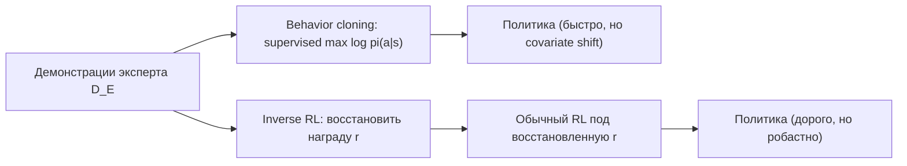
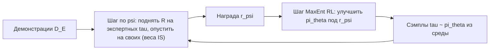

# Вопрос 13. Имитационное обучение и обратное обучение с подкреплением. Схема Guided Cost Learning. Генеративно-состязательное имитационное обучение (GAIL).

> **Источники:** лекция 13 (`Slides/RL_MIPT_Lecture_13.pdf`, стр. 1–29), конспект [1] (Иванов, «Reinforcement Learning Textbook») раздел 8.1 «Имитационное обучение», стр. 189–195. Для сверки: Ross et al., «A Reduction of Imitation Learning and Structured Prediction to No-Regret Online Learning» (2011, DAgger); Ng & Russell, «Algorithms for Inverse Reinforcement Learning» (2000); Abbeel & Ng (2004); Ziebart et al., «Maximum Entropy Inverse Reinforcement Learning» (2008); Finn, Levine, Abbeel, «Guided Cost Learning» (2016); Ho & Ermon, «Generative Adversarial Imitation Learning» (2016); Finn et al., «A Connection between GANs, Inverse RL, and Energy-Based Models» (2016); Torabi et al., «Generative Adversarial Imitation from Observation» (2018).
> **Пререквизиты:** [Основы: постановка задачи RL](00-osnovy.md#rl-task), [Основы: траектория и return](00-osnovy.md#trajectory), [Основы: политика](00-osnovy.md#policy), [Основы: правдоподобие, энтропия, KL](00-osnovy.md#probability).
> **Связанные билеты:** [Билет 12](12-sac.md) — Maximum Entropy RL, soft-политика Больцмана, энтропийный бонус (весь фундамент под MaxEnt IRL); [Билет 9](09-trpo.md) и [Билет 10](10-bias-variance-ppo.md) — TRPO/PPO, тот самый внутренний RL-шаг в GCL и GAIL; [Билет 1](01-cem.md) — кросс-энтропийный метод как «имитация собственных элитных траекторий».

[TOC]

## 1. Зачем это нужно и где стоит в курсе

Всё, что мы делали до сих пор, опиралось на функцию награды $r(s,a)$: её кто-то задал, а мы её максимизируем. Но в реальных задачах награда — самое слабое звено. Как формулой описать «хорошее вождение»? Нужно сложить скорость, безопасность, комфорт пассажира, соблюдение разметки — и любой перекос в коэффициентах даст агента, который либо стоит на месте (безопасно!), либо режет повороты. А вот **показать** легко: посадить живого водителя за руль и записать телеметрию; взять руку робота и несколько раз перелить воду из стакана в стакан самому.

Отсюда **имитационное обучение (imitation learning)**: учиться не по награде, а по демонстрациям эксперта. Есть два принципиально разных пути.

- **Копировать действия.** Раз у нас есть пары «состояние → что сделал эксперт», это обычное обучение с учителем: классификация (дискретные действия) или регрессия (непрерывные). Это **клонирование поведения (behavioral cloning, BC)**.
- **Восстановить цель.** Понять, *чего эксперт хотел* — то есть восстановить функцию награды, — а затем обучить под неё политику всем арсеналом RL. Это **обратное обучение с подкреплением (inverse reinforcement learning, IRL)**.

!!! note Бытовая аналогия
    Ученик смотрит, как мастер точит деталь. Первый путь: запомнить движения рук и повторять их покадрово. Пока деталь и станок те же — сработает; чуть заготовка съехала — и ученик продолжает махать руками в пустоту, потому что такого кадра он не видел. Второй путь: понять, что мастер хочет получить гладкую поверхность заданного диаметра. Тогда при съехавшей заготовке ученик сам сообразит, что делать. Награда — это более компактное и более переносимое описание задачи, чем список движений.

Второй путь дороже, но принципиально сильнее ещё по одной причине. В разных частях пространства состояний **цена ошибки разная**: на прямой пустой дороге неважно, держаться левее или правее полосы, а при разъезде на узком мосту ошибка фатальна. Обучение с учителем этого не знает — оно штрафует все ошибки одинаково, по частоте. Функция награды как обучающий сигнал **информативнее**: она сама расставляет, что важно.

В карте курса ([Основы](00-osnovy.md#taxonomy)) это ветвь **imitation**. Родственная идея уже встречалась: кросс-энтропийный метод ([Билет 1](01-cem.md)) — это имитация собственных элитных траекторий, то есть BC, где «экспертом» служит сам агент в лучшие свои моменты.



## 2. Постановка задачи и обозначения

Дан MDP **без функции награды**: $(\mathcal S, \mathcal A, p, \gamma)$, где $p(s'\mid s,a)$ — динамика (нам, как правило, тоже неизвестная, но со средой можно взаимодействовать). Награда $r(s,a)$ **существует, но не дана**.

Дан датасет демонстраций $\mathcal D_E=\{\tau_1,\dots,\tau_N\}$, где $\tau_i=(s_0,a_0,s_1,a_1,\dots)$ — траектория, порождённая **экспертной политикой** $\pi_E$ (в конспекте $\pi^*$), которую мы считаем оптимальной или около-оптимальной. Наград в датасете нет.

**Цель:** обучить $\pi_\theta$ так, чтобы $J(\pi_\theta)$ по *истинной* (неизвестной) награде был не хуже $J(\pi_E)$.

Для упрощения формул всюду далее $\gamma=1$ и $R(\tau)=\sum_t r(s_t,a_t)$ (как в конспекте); дисконт при желании вставляется механически.

!!! warning Обозначения: где конспект и этот файл расходятся
    В конспекте параметры нейросети-награды обозначены $\theta$, а регуляризатор в теореме о GAIL — буквой $\psi(r)$. У нас $\theta$ всюду занято параметрами политики, поэтому: $\pi_\theta$ — политика, $r_\psi$ и $R_\psi(\tau)=\sum_{t}r_\psi(s_t,a_t)$ — обучаемая награда, $D_w$ — дискриминатор с параметрами $w$, а регуляризатор награды пишем как $\Omega(r)$. На экзамене достаточно один раз проговорить, что какая буква значит.

## 3. Основная теория

### 3.1. Клонирование поведения и почему оно ломается

**Определение.** *Клонированием поведения* называется обучение политики воспроизводить действия эксперта максимизацией логарифма правдоподобия по демонстрациям:

$$
\sum_{\tau\in\mathcal D_E}\ \sum_{(s,a)\in\tau}\log \pi_\theta(a\mid s)\ \to\ \max_\theta .
$$

Это в точности максимум правдоподобия ([Основы](00-osnovy.md#probability)): для дискретных действий — кросс-энтропийный лосс классификатора, для непрерывных с гауссовой политикой — MSE. Награда в обучении не участвует вообще.

Проблема в том, что мы имеем дело с **последовательным** принятием решений, а supervised learning об этом не знает. Обучающая выборка распределена по состояниям, которые посещал **эксперт**; а работать политика будет на состояниях, которые посещает **она сама**. Как только она чуть-чуть отклонится (а это неизбежно: аппроксимация неточна, среда стохастична), она попадёт туда, где эксперта не было; там предсказание — экстраполяция, то есть произвол, ошибка растёт, отклонение усиливается. Расхождение обучающего и тестового распределений называют **covariate shift**, а накопление ошибки — **compounding errors**.

!!! note Откуда берётся $O(\epsilon T^2)$
    Пусть политика ошибается с вероятностью не более $\epsilon$ в каждом состоянии из экспертного распределения, а горизонт равен $T$ (награда за шаг ограничена). Одна ошибка может сбить агента с экспертного распределения навсегда, и тогда на всех оставшихся шагах гарантий нет — потеря до $O(T)$ награды. Ожидаемое число ошибок за эпизод — порядка $\epsilon T$, цена каждой — до $O(T)$; перемножая, получаем $\epsilon T\cdot O(T)=O(\epsilon T^2)$. Квадрат, а не $\epsilon T$, как было бы в обычной классификации, потому что ошибка не только стоит награды сама по себе, но и **портит распределение входов** для всех будущих шагов. Аккуратная версия этого рассуждения — Ross & Bagnell (2010); DAgger (Ross et al., 2011) доводит границу до линейной $O(\epsilon T)$.

**DAgger (Dataset Aggregation, Ross et al. 2011)** чинит ровно это: раз беда в том, что обучающие состояния приходят из распределения эксперта, будем обучаться на состояниях **нашей** политики. Запускаем текущую политику в среде, собираем посещённые ею состояния, просим эксперта разметить их (сказать, что он сделал бы здесь), агрегируем со старым датасетом, переобучаемся, повторяем. Результат: граница $O(\epsilon T)$ вместо $O(\epsilon T^2)$ — линейная по горизонту.

Цена — нужен **интерактивный эксперт-разметчик**, доступный онлайн, а не просто запись его траекторий; человек-водитель не станет размечать миллион кадров. Иногда выкручиваются: в примере с квадрокоптером человек надел шлем с тремя камерами (влево/вперёд/вправо) и прошёл по центру лесной тропинки — для левой камеры правильный ответ «вправо», для правой «влево»; разметка получилась бесплатно.

!!! tip Когда BC достаточно
    (1) Демонстраций много и они покрывают состояния, куда может занести политику. (2) Горизонт короткий. (3) Можно добирать данные в «опасных» областях. (4) BC используется как **инициализация**: предобучить $\pi_\theta$ клонированием и дальше дообучать обычным RL (для off-policy методов достаточно докинуть экспертные траектории в реплей-буфер).

### 3.2. Inverse RL: восстановить награду

**Определение.** *Задачей обратного обучения с подкреплением* называется задача по набору траекторий $\mathcal D_E$ оптимального агента восстановить функцию награды, которую он максимизирует.

Задача **некорректно поставлена (ill-posed)** в двух смыслах.

1. **Неединственность.** Одно и то же поведение объясняется бесконечным числом наград. Тривиальный пример: $r\equiv 0$ — при ней **любая** политика оптимальна, в том числе экспертная. Масштабирование на положительную константу и потенциальный шейпинг $r'(s,a,s')=r+\gamma\Phi(s')-\Phi(s)$ тоже не меняют оптимальной политики.
2. **Недоопределённость данными.** Одна траектория говорит мало. В клеточном мире, где эксперт прошёл в зелёную клетку: за зелёную, видимо, положительная награда; через красную он прошёл, хотя мог обойти, — значит штраф за неё если и есть, то маленький; синие клетки обходил — там ноль или штраф; а про жёлтые сказать нельзя почти ничего, через них пришлось бы идти в любом случае.
3. **Эксперт не идеален.** Люди не ходят по комнате строго по прямой, а ходы шахматного мастера не абсолютная истина.

Значит, нужен **принцип отбора**: правило, выбирающее одну награду из множества согласованных с данными.

**Feature matching (Abbeel & Ng, 2004)** — первый такой принцип. Ограничим класс: $r(s,a)=w^\top\phi(s,a)$, где $\phi$ — заданный вектор признаков (близость к обочине, скорость, …). Тогда $J(\pi)=w^\top \mu(\pi)$, где $\mu(\pi):=\mathbb E_{\tau\sim\pi}\sum_t\gamma^t\phi(s_t,a_t)$ — **ожидание признаков (feature expectations)**. Если подобрать политику так, что $\|\mu(\pi)-\mu(\pi_E)\|_2\le\epsilon$, то при $\|w\|_1\le1$ разница ценностей тоже не больше $\epsilon$ — **при любых** весах $w$: достаточно совпасть по признакам, и мы гарантированно не хуже эксперта. Но и это неоднозначно: политик с одинаковым $\mu$ много.

### 3.3. MaxEnt IRL: принцип максимальной энтропии

Ziebart et al. (2008) снимают оставшуюся неоднозначность так: **среди всех распределений над траекториями, согласованных с наблюдаемыми признаками, выберем распределение максимальной энтропии** — самое «неопределённое», не добавляющее лишних предположений. Стандартный результат теории информации: такое распределение экспоненциально по линейной комбинации признаков, то есть

$$
p(\tau\mid \pi_E)\ \propto\ e^{R(\tau)}\prod_{t\ge0}p(s_{t+1}\mid s_t,a_t).
$$

Словами: эксперт стохастичен, и вероятность породить траекторию растёт экспоненциально с её суммарной наградой; множитель с динамикой — просто вероятность того, что среда «согласится» на такую траекторию, он от награды не зависит. Плохие траектории не запрещены, а экспоненциально маловероятны — это и делает модель устойчивой к неидеальности эксперта.

!!! info Связь с билетом 12
    Это ровно та же конструкция, что в Maximum Entropy RL ([Билет 12](12-sac.md)), где оптимальная soft-политика имеет вид больцмановской $\pi^*(a\mid s)\propto\exp(Q^*_{\text{soft}}(s,a)/\alpha)$. Согласование по температуре: в этом билете всюду $\alpha=1$ (как и в конспекте), поэтому пишем $p(\tau)\propto e^{R(\tau)}$, а не $e^{R(\tau)/\alpha}$ — температура поглощена масштабом самой восстанавливаемой награды $r_\psi$, ведь мы её и подбираем. Конспект доказывает эквивалентность прямо: задача $\mathrm{KL}\big(p(\tau\mid\pi)\,\|\,p(\tau\mid\pi_E)\big)\to\min_\pi$ после сокращения логарифмов вероятностей переходов превращается в $\mathbb E_{\tau\sim\pi}\sum_t[r_t-\log\pi(a_t\mid s_t)]\to\max_\pi$ — это в точности MaxEnt RL. Оговорка: ноль в этой KL не всегда достижим (в стохастической среде политика не может произвольно перекраивать вероятности траекторий), так что строго «оптимальная MaxEnt-политика порождает (8.2)» неверно — но как модель экспертного поведения предположение разумно.

**Обучение награды по максимуму правдоподобия.** Параметризуем награду нейросетью $r_\psi(s,a)$, $R_\psi(\tau)=\sum_{(s,a)\in\tau}r_\psi(s,a)$. Тогда

$$
p_\psi(\tau)=\frac{e^{R_\psi(\tau)}\prod_t p(s_{t+1}\mid s_t,a_t)}{Z(\psi)},\qquad
Z(\psi)=\int_\tau e^{R_\psi(\tau)}\prod_t p(s_{t+1}\mid s_t,a_t)\,d\tau .
$$

$Z(\psi)$ — **нормировочная константа (partition function)**; важно, что она зависит от $\psi$. Логарифм правдоподобия одной экспертной траектории:

$$
\log p_\psi(\tau_E)=R_\psi(\tau_E)+\underbrace{\textstyle\sum_t\log p(s_{t+1}\mid s_t,a_t)}_{\text{не зависит от }\psi}-\log Z(\psi).
$$

Дифференцируем нормировку (это ключевые 4 строки, их стоит уметь воспроизвести):

$$
\begin{aligned}
\nabla_\psi\log Z(\psi)&=\frac{1}{Z(\psi)}\nabla_\psi Z(\psi)
=\frac{1}{Z(\psi)}\int_\tau \nabla_\psi e^{R_\psi(\tau)}\prod_t p\,d\tau\\
&=\frac{1}{Z(\psi)}\int_\tau e^{R_\psi(\tau)}\prod_t p\;\nabla_\psi R_\psi(\tau)\,d\tau
=\mathbb E_{\tau\sim p_\psi}\big[\nabla_\psi R_\psi(\tau)\big].
\end{aligned}
$$

Отсюда итоговый градиент правдоподобия:

$$
\nabla_\psi \mathcal L(\psi)=\mathbb E_{\tau\sim \mathcal D_E}\big[\nabla_\psi R_\psi(\tau)\big]-\mathbb E_{\tau\sim p_\psi}\big[\nabla_\psi R_\psi(\tau)\big].
$$

**Что говорит эта формула.** Поднимай награду там, где ходил эксперт (первое слагаемое), и опускай её всюду, где ходит модель при текущей награде (второе). В точке равновесия два распределения совпадают, градиент ноль. Если награда линейна по признакам, $R_\psi=w^\top\sum_t\phi$, условие нулевого градиента — это буквально **совпадение ожиданий признаков**: MaxEnt IRL = feature matching + принцип максимальной энтропии.

**Где загвоздка.** Второе матожидание берётся по $p_\psi$ — распределению траекторий, порождаемому *оптимальной при текущей награде* политикой. Чтобы его посчитать, надо либо просуммировать по всем траекториям (возможно только в маленьких табличных MDP с известной динамикой — так и делал Ziebart, через soft value iteration), либо **решить полную RL-задачу на каждом шаге по $\psi$**. Это чудовищно дорого.

### 3.4. Guided Cost Learning

Finn, Levine, Abbeel (2016) предлагают два лечения сразу.

**Лечение 1: оценивать $Z$ сэмплированием по значимости.** Пусть $q(\tau)=\prod_t \pi_\theta(a_t\mid s_t)p(s_{t+1}\mid s_t,a_t)$ — распределение траекторий текущей (какой угодно) политики. Тогда

$$
\mathbb E_{\tau\sim p_\psi}\big[\nabla_\psi R_\psi(\tau)\big]
\approx \frac{1}{\sum_j w_j}\sum_{j} w_j\,\nabla_\psi R_\psi(\tau_j),
\qquad
w_j=\frac{e^{R_\psi(\tau_j)}}{q(\tau_j)},\quad \tau_j\sim q .
$$

Это **самонормированный importance sampling**: нормировка $\sum_j w_j$ заодно оценивает и саму $Z$ (поэтому её не надо знать явно). Приятный факт: в отношении $e^{R_\psi}/q$ произведения вероятностей переходов **сокращаются**, так что $w_j=e^{R_\psi(\tau_j)}/\prod_t\pi_\theta(a_t\mid s_t)$ — модель среды не нужна.

**Лечение 2: не решать RL до конца, а чередовать шаги.** IS-оценка тем точнее, чем ближе $q$ к $p_\psi$ (иначе веса $w_j$ вырождаются: один сэмпл забирает почти весь вес, дисперсия взрывается). Поэтому между шагами по $\psi$ делаем **несколько шагов RL** по политике $\pi_\theta$ под текущей наградой $r_\psi$ — в MaxEnt-постановке, то есть с энтропийным бонусом ([Билет 12](12-sac.md)). Политика подтягивается к $p_\psi$, IS-веса становятся приличными, и цикл повторяется.



В пределе, если восстановленная награда стала истинной, «псевдо-эксперт» $\pi_\theta$ сойдётся к настоящему эксперту, два матожидания в градиенте сравняются, обучение награды остановится. На выходе мы получаем **и награду, и политику сразу**.

!!! tip Про название
    В оригинальной статье учат не reward, а **cost** $c_\psi=-r_\psi$, и $p(\tau)\propto e^{-c_\psi(\tau)}$; «guided» — потому что внутренним RL там был Guided Policy Search. Знаки в формулах от этого переворачиваются, суть та же.

Плюсы GCL: награда — произвольная нейросеть (не линейная по ручным признакам); модель среды не нужна; оценки сэмпловые. Минусы: две связанные нестационарные оптимизации, тяжёлые по дисперсии IS-веса (на практике сэмплируют из **смеси** траекторий политики и демонстраций, чтобы веса не вырождались), очень много взаимодействий со средой.

### 3.5. GAN за один абзац

**Генеративно-состязательная сеть (GAN, Goodfellow et al. 2014)** — способ научиться генерировать сэмплы из распределения $p_{\text{data}}$, не выписывая его плотность. Есть **генератор** $G$, превращающий шум $z$ в объект $G(z)$ (его распределение обозначим $p_g$), и **дискриминатор** $D(x)\in(0,1)$ — обычный бинарный классификатор, который пытается отличить настоящие объекты от сгенерированных. Они играют в минимакс:

$$
\min_G\max_D\ \mathbb E_{x\sim p_{\text{data}}}\log D(x)+\mathbb E_{z}\log\big(1-D(G(z))\big).
$$

При фиксированном $G$ оптимальный дискриминатор равен $D^*(x)=\dfrac{p_{\text{data}}(x)}{p_{\text{data}}(x)+p_g(x)}$ — то есть апостериорной вероятности «это настоящий объект». Подставив $D^*$ обратно, получаем, что генератор минимизирует **дивергенцию Йенсена–Шеннона** $\mathrm{JS}(p_{\text{data}}\|p_g)$ (с точностью до константы $-\log 4$). Смысл: дискриминатор — это **обучаемая мера непохожести двух распределений**, и градиент от неё мы даём генератору.

### 3.6. GAIL: occupancy measure и минимакс

Ho & Ermon (2016) заметили, что чередование двух шагов в GCL — это и есть игра двух игроков, и её нужно переписать в правильных переменных.

**Определение.** *Occupancy measure* (мера занятости) политики $\pi$:

$$
\rho_\pi(s,a):=\pi(a\mid s)\,d_\pi(s),
$$

где $d_\pi(s)=\sum_{t\ge0}\gamma^t P(s_t=s\mid\pi)$ — (ненормированные) частоты посещения состояний. Это «сколько времени политика проводит в паре $(s,a)$»; любое матожидание вдоль траектории переписывается через неё: $\mathbb E_{\tau\sim\pi}\sum_t f(s_t,a_t)=\mathbb E_{\rho_\pi}[f(s,a)]$.

**Ключевой факт: соответствие «политика ↔ occupancy measure» взаимно однозначно** — по $\rho$ восстанавливается единственная политика $\pi(a\mid s)=\rho(s,a)\big/\int_{\mathcal A}\rho(s,a')\,da'$. Значит, **поиск политики = поиск occupancy measure**, и задачу можно ставить прямо в терминах $\rho$.

Оптимизация награды в GCL, переписанная в этих обозначениях, даёт седловую задачу

$$
\min_{r}\ \max_{\rho_\pi}\ \Big\{\mathbb E_{\rho_\pi}[r(s,a)]-\mathbb E_{\rho_E}[r(s,a)]+\tilde H(\rho_\pi)\Big\},
$$

где $\tilde H(\rho_\pi)=\mathbb E_{\rho_\pi}[-\log\pi(a\mid s)]$ — суммарный энтропийный бонус, тоже выразимый через $\rho_\pi$. Внутри функционал **линеен по $r$**: это скалярное произведение $\langle \rho_\pi-\rho_E,\ r\rangle$. Поэтому единственная возможная седловая точка — $\rho_\pi\equiv\rho_E$: если хоть в одной паре $(s,a)$ разность ненулевая, награда уедет в $\pm\infty$ в соответствующую сторону.

!!! note Главная мысль билета
    Имитационное обучение — это **не** матчинг политик, а матчинг occupancy measures (эквивалентно — распределений траекторий $p(\tau\mid\pi)$ и $p(\tau\mid\pi_E)$). BC пытается в каждом состоянии по отдельности сделать $\pi_\theta(\cdot\mid s)\approx\pi_E(\cdot\mid s)$, а нам нужно **с той же частотой попадать в те же состояния**: выбор действий в одной области пространства состояний меняет посещаемость совсем других областей, и supervised-лосс этого не видит, а $\rho$ видит.

**Регуляризация и переход к дискриминатору.** Так как IRL некорректна, добавим штраф на награду $\Omega(r)$ (в конспекте — $\psi(r)$):

$$
\min_{r}\ \max_{\rho_\pi}\ \Big\{\Omega(r)+\mathbb E_{\rho_\pi}[r]-\mathbb E_{\rho_E}[r]+\tilde H(\rho_\pi)\Big\}.
$$

**Теорема (выбор GA-регуляризатора).** Возьмём

$$
\Omega(r):=\mathbb E_{\rho_E}\big[\,r(s,a)-\log\big(1-e^{-r(s,a)}\big)\big]
$$

(со штрафом $+\infty$ при $r\le0$). Тогда после замены переменных $D(s,a):=e^{-r(s,a)}\in(0,1)$, то есть $r=-\log D$, задача принимает вид

$$
\min_{D}\ \max_{\pi}\ \Big\{-\mathbb E_{\rho_E}\log\big(1-D(s,a)\big)-\mathbb E_{\rho_\pi}\log D(s,a)+\tilde H(\rho_\pi)\Big\}.
$$

*Проверка в одну строку.* $\Omega(r)-\mathbb E_{\rho_E}[r]=-\mathbb E_{\rho_E}\log(1-e^{-r})=-\mathbb E_{\rho_E}\log(1-D)$, а $\mathbb E_{\rho_\pi}[r]=-\mathbb E_{\rho_\pi}\log D$; сложив, получаем ровно формулу выше.

!!! warning Опечатка в конспекте
    В формуле (8.16) конспекта перед $\log(1-e^{-r})$ стоит «$+$». Это опечатка: его же собственное доказательство даёт (8.17) только со знаком «$-$», а с плюсом штраф уходил бы в $-\infty$ при $r\to0^{+}$ и регуляризатором быть перестал бы. У Ho & Ermon тот же регуляризатор записан в переменных **стоимости** $c=-r$ как $\mathbb E_{\rho_E}[-c-\log(1-e^{c})]$ — это в точности наша формула.

Это в точности обучение GAN, где «настоящие объекты» — пары $(s,a)$ эксперта, «подделки» — пары текущей политики, а роль генератора играет политика. Обратите внимание: по сравнению с §3.5 роль $D$ здесь **зеркальна** — теперь $D$ оценивает вероятность «это подделка (агент)», поэтому $\log D$ и $\log(1-D)$ в формуле поменялись местами. Разворачивая по частям:

- **Шаг дискриминатора** (при фиксированной $\pi$): $\mathbb E_{\rho_E}\log(1-D)+\mathbb E_{\rho_\pi}\log D\to\max_D$ — обычная бинарная классификация. В этой записи $D(s,a)$ — оценка вероятности, что пара порождена **агентом**; на экспертных парах оптимальный $D\to0$.
- **Шаг политики** (при фиксированном $D$): $\mathbb E_{\tau\sim\pi}\sum_t\big[-\log D(s_t,a_t)+H(\pi(\cdot\mid s_t))\big]\to\max_\pi$. То есть $r(s,a)=-\log D(s,a)$ — **это и есть награда за шаг**, плюс энтропийный бонус. Внутренний RL-шаг делают TRPO или PPO ([Билет 9](09-trpo.md), [Билет 10](10-bias-variance-ppo.md)).

Награда $-\log D$ велика там, где дискриминатор считает пару экспертной, и мала там, где он легко опознаёт агента. Генератор здесь необычный: он порождает не независимые сэмплы, а **цепочки** — его действия влияют на то, какие состояния он увидит дальше. Поэтому протолкнуть градиент через генератор нельзя, и вместо этого применяется RL.

!!! warning Знаки и соглашения — любимое место для придирок
    Три эквивалентные записи награды: (а) конспект и статья Ho & Ermon: $D$ = «вероятность агента», $r=-\log D$; (б) частая инженерная запись: $D$ = «вероятность эксперта», тогда $r=-\log(1-D)$ или $r=\log D$; (в) логит $r=\log D-\log(1-D)$, который лучше ведёт себя при почти идеальном дискриминаторе. **Правило проверки:** награда должна быть **больше** на тех парах, которые дискриминатор считает экспертными. Плюс смещение по знаку: при $r>0$ агенту выгодно тянуть эпизод (survival bias), при $r<0$ — быстрее его закончить; на задачах вроде Hopper это заметно влияет на результат.

**Теорема Ho–Ermon (без доказательства).** Пусть $\mathrm{IRL}_\Omega(\pi_E)$ — решение регуляризованной задачи IRL, а $\mathrm{RL}$ — решение RL под полученной наградой. Тогда

$$
\mathrm{RL}\circ \mathrm{IRL}_\Omega(\pi_E)=\operatorname*{argmin}_{\pi}\ -\lambda H(\pi)+\Omega^{*}\big(\rho_\pi-\rho_E\big),
$$

где $\Omega^{*}$ — сопряжённая по Фенхелю к $\Omega$. Для GA-регуляризатора выше $\Omega^{*}(\rho_\pi-\rho_E)=2\,\mathrm{JS}(\rho_\pi\,\|\,\rho_E)-\log4$. Словами: **«восстановить награду с регуляризатором $\Omega$ и решить под неё RL» = «минимизировать расстояние между occupancy measures»**, для GAIL — JS-дивергенцию (с энтропийной регуляризацией); при $\Omega\equiv$ индикатор линейного класса наград получается старый apprenticeship learning. Поэтому GAIL — это **IRL без явного восстановления награды**: дискриминатор — не переносимая награда, а «мгновенное» направление, куда двигать occupancy measure; после сходимости он вырождается в $\approx1/2$.

### 3.7. GAN ↔ IRL ↔ GCL и что рядом

Finn et al. (2016, «A Connection between GANs, IRL and EBMs») закрывают круг с другой стороны: возьмём GAN на траекториях и ограничим дискриминатор **специальным видом**

$$
D(\tau)=\frac{\tfrac1Z e^{R_\psi(\tau)}}{\tfrac1Z e^{R_\psi(\tau)}+q(\tau)} ,
$$

где $q$ — плотность траекторий текущей политики-генератора (мы её знаем, это произведение $\pi_\theta(a_t\mid s_t)$). Это буквально форма оптимального дискриминатора $p_{\text{data}}/(p_{\text{data}}+p_g)$, в которой «плотность данных» смоделирована энергетически, через награду. Тогда градиент дискриминаторного лосса по $\psi$ **совпадает с градиентом MaxEnt IRL**, а градиент генератора — с шагом MaxEnt RL: такой GAN эквивалентен Guided Cost Learning. То есть GCL и GAIL — два конца одной конструкции: GCL держит $R_\psi$ явно и платит IS-весами, GAIL растворяет награду в дискриминаторе и платит тем, что награду потом не унести.

**AIRL** (Fu et al., 2018) — развитие идеи: $D=\frac{e^{f_\psi(s,a,s')}}{e^{f_\psi}+\pi_\theta}$ с $f_\psi=g_\psi(s)+\gamma h(s')-h(s)$, что убирает шейпинговую неоднозначность и даёт **переносимую** награду $g_\psi(s)$.

**GAIfO** (Torabi et al., 2018) — имитация **по наблюдениям**: часто демонстрации не содержат действий (покадровая анимация сальто; видео человека). Тогда дискриминатор различает не пары $(s,a)$, а пары $(s,s')$:

$$
\min_D\max_\pi\ \Big\{-\mathbb E_{\nu_E}\log(1-D(s,s'))-\mathbb E_{\nu_\pi}\log D(s,s')+\mathbb E_{d_\pi}H(\pi(\cdot\mid s))\Big\},
$$

где $\nu_\pi(s,s'):=d_\pi(s)\int_{\mathcal A}p(s'\mid s,a)\pi(a\mid s)\,da$ — occupancy measure на переходах. Пара $(s,s')$ несёт информацию о совершённом действии (что именно изменилось), поэтому работает лучше, чем дискриминатор просто на состояниях $D(s)$.

## 4. Алгоритмы

**Behavior cloning + DAgger.**

```text
Вход: эксперт pi_E (интерактивный), число итераций K
1.  D <- набор демонстраций эксперта
2.  Обучить pi_1 = argmax_theta sum_{(s,a) in D} log pi_theta(a|s)
3.  для i = 1..K:
4.      собрать траектории, действуя по смеси beta_i*pi_E + (1-beta_i)*pi_i
          (beta_1 = 1, дальше beta_i -> 0)
5.      D_i <- {(s, pi_E(s)) : s — состояния, посещённые на шаге 4}
6.      D <- D + D_i                         # агрегация датасетов
7.      pi_{i+1} <- обучить supervised на всём D
8.  вернуть лучшую pi_i по валидации
```

**Guided Cost Learning.**

```text
Вход: демонстрации D_E; награда r_psi; политика pi_theta
1.  повторять:
2.      собрать траектории {tau_j} ~ pi_theta в среде
3.      веса w_j = exp(R_psi(tau_j)) / prod_t pi_theta(a_t|s_t)   # динамика сократилась
4.      grad_psi = mean_{tau in D_E} grad R_psi(tau)
                   - (1/sum_j w_j) * sum_j w_j * grad R_psi(tau_j)
5.      psi <- psi + alpha * grad_psi                            # шаг по награде
6.      сделать несколько шагов MaxEnt RL для pi_theta под наградой r_psi
7.  вернуть r_psi и pi_theta
```

**GAIL.**

```text
Вход: демонстрации D_E; политика pi_theta; дискриминатор D_w
1.  (опционально) предобучить pi_theta клонированием поведения на D_E
2.  повторять:
3.      собрать батч траекторий tau ~ pi_theta в среде
4.      шаг по w: максимизировать
             E_{(s,a) ~ tau}   [log D_w(s,a)]
           + E_{(s,a) ~ D_E}   [log (1 - D_w(s,a))]
        (бинарная классификация: агент — класс "1", эксперт — класс "0")
5.      разметить собранные переходы наградой r_t = -log D_w(s_t, a_t)
6.      посчитать преимущества (GAE) и сделать шаг TRPO/PPO по theta
        с энтропийным бонусом
7.  вернуть pi_theta
```


**Что происходит на каждом шаге.** Дискриминатор — это «критик стиля»: он смотрит на пару «состояние-действие» и говорит, насколько она похожа на экспертную. Политика получает от него плотную награду (на каждом шаге, а не в конце эпизода!) и обычным policy gradient идёт туда, где её путают с экспертом. Дальше дискриминатор дообучается на новых данных и снова учится различать — планка поднимается. Равновесие: $D\equiv1/2$, дискриминатор не может отличить, $\rho_\pi=\rho_E$.

## 5. Пример: GridWorld 3×3

Мир $3\times3$, клетки $(\text{строка},\text{столбец})$, старт $(0,0)$, цель — правый нижний угол $(2,2)$. Эксперт всегда идёт «вниз, вниз, вправо, вправо» — то есть по левому столбцу до низа, потом по нижней строке. Демонстраций 20 штук, все одинаковые. Наград нам не дали.

**Что сделает BC.** Обучающая выборка покрывает 5 клеток: $(0,0),(1,0),(2,0),(2,1),(2,2)$; в них классификатор выучит правильные действия почти идеально. Но пусть среда чуть стохастична: с вероятностью 0.1 действие «вниз» проскальзывает вправо, и агент из $(0,0)$ попадает в $(0,1)$. Этой клетки в обучающей выборке **не было**, нейросеть выдаст что-то по экстраполяции — скажем, «вниз» с вероятностью 0.5 и «вверх» с 0.4. Агент уходит в $(0,2)$ и дальше блуждает: чем дальше от экспертной зоны, тем беспорядочнее предсказания, вернуться некому. Один сбой на первом шаге — и все оставшиеся $T-1$ шагов потеряны: вот $O(\epsilon T^2)$ на пальцах.

**Что сделает GAIL.** Дискриминатор видит пары «клетка + действие» от эксперта и от агента и после нескольких итераций выучивает примерно так (числа условные, но правильного порядка):

| Пара $(s,a)$ | $D_w(s,a)$ | $r=-\log D_w$ |
|---|---|---|
| $((1,0),\ \text{вниз})$ — экспертная | 0.1 | 2.30 |
| $((2,1),\ \text{вправо})$ — экспертная | 0.15 | 1.90 |
| $((2,0),\ \text{вверх})$ — та же клетка, не то действие | 0.5 | 0.69 |
| $((0,1),\ \text{вверх})$ — агент забрёл не туда | 0.9 | 0.11 |

Разница в награде между «экспертной» и «чужой» парой — порядка $2.2$ за шаг. RL под такой наградой сам построит **градиент, притягивающий обратно к экспертным клеткам**: из $(0,1)$ выгодно идти влево-вниз, потому что там начинаются пары с высокой наградой, — хотя эксперт в $(0,1)$ никогда не был и ничего для неё не размечал. Это и есть преимущество перед BC: награда обобщается на невиданные состояния, список движений — нет. По мере обучения агент чаще попадает на экспертный путь, все $D$ ползут к 0.5, награды выравниваются — процесс останавливается.

## 6. Подводные камни, сравнения, типичные ошибки

| Метод | Нужен ли эксперт онлайн | Восстанавливается ли награда | Нужна ли модель среды | Взаимодействий со средой | Устойчивость к covariate shift |
|---|---|---|---|---|---|
| Behavior cloning | нет, только запись | нет | нет | **ноль** | плохая, $O(\epsilon T^2)$ |
| DAgger | **да**, интерактивная разметка | нет | нет | умеренно (роллауты) | хорошая, $O(\epsilon T)$ |
| MaxEnt IRL (Ziebart) | нет | **да, явно** | **да** (табличный soft-VI) | ноль, но полное решение MDP на каждом шаге | хорошая |
| Guided Cost Learning | нет | **да, явно** (нейросеть) | нет | много | хорошая |
| GAIL | нет | нет (только неявно, через $D$) | нет | **очень много** (on-policy) | хорошая |

!!! warning Типичная ошибка 1: «GAIL восстанавливает награду»
    Нет. Дискриминатор — не награда задачи, а мера непохожести на эксперта в текущий момент обучения. Он нестационарен и после сходимости вырождается в $\approx1/2$. Забрать $-\log D$ и обучать под ним агента в другой среде — бессмысленно. Переносимую награду дают GCL (частично) и AIRL (специально спроектирован под это).

!!! warning Типичная ошибка 2: имитационное обучение = матчинг политик
    Матчить надо occupancy measure. Поэтому BC и GAIL — качественно разные вещи, а не «одно и то же с разными лоссами»: BC минимизирует KL между политиками **на экспертном распределении состояний**, GAIL — JS между распределениями посещений, куда входит и динамика среды.

!!! warning Типичная ошибка 3: путаница со знаком награды
    $r=-\log D$ при «$D$ = вероятность агента» положительна, при «$D$ = вероятность эксперта» знак надо перевернуть. Проверяйте правилом «на экспертных парах награда больше» и помните про survival bias.

!!! warning Когда не работает
    **BC** — демонстраций мало, горизонт длинный, среда стохастична. **IRL/GCL** — динамика сложная, сэмплов мало: IS-веса вырождаются, две вложенные оптимизации расходятся. **GAIL** — взаимодействие со средой дорогое: внутри честный on-policy RL, нужны миллионы шагов (зато по **числу демонстраций** GAIL крайне экономен — хватает десятков траекторий, это его главный практический козырь). Плюс общая для GAN-подобных схем нестабильность: слишком сильный дискриминатор уходит в насыщение и градиент исчезает, слишком слабый — даёт бессмысленную награду. Наконец, все методы предполагают хорошего эксперта: посредственного эксперта GAIL добросовестно воспроизведёт, превзойти его нечем — для этого нужна настоящая награда.

## 7. Ответ за 5 минут

1. **Мотивация.** Награду задать трудно (вождение, манипуляция), показать легко. Дан датасет демонстраций $\mathcal D_E$, награда неизвестна, цель — политика не хуже эксперта.
2. **Behavior cloning.** $\sum_{\mathcal D_E}\log\pi_\theta(a\mid s)\to\max_\theta$ — обычный supervised learning.
3. **Проблема BC.** Covariate shift: обучались на состояниях эксперта, работаем на своих. Ошибки накапливаются, $O(\epsilon T^2)$ против $O(\epsilon T)$ в обычной классификации. **DAgger**: гонять свою политику, просить эксперта разметить посещённые состояния, агрегировать датасет; чинит до $O(\epsilon T)$, но требует интерактивного эксперта.
4. **IRL.** Восстановить награду по демонстрациям. Задача некорректна: $r\equiv0$ объясняет всё, плюс шейпинг и масштаб. Нужен принцип отбора. Простейший — feature matching (совпадение ожиданий признаков, Abbeel–Ng).
5. **MaxEnt IRL.** Принцип максимальной энтропии даёт $p(\tau)\propto e^{R(\tau)}\prod_t p(s_{t+1}\mid s_t,a_t)$ — то же, что MaxEnt RL из билета 12. Учим $r_\psi$ по максимуму правдоподобия.
6. **Градиент.** $\nabla_\psi\mathcal L=\mathbb E_{\tau\sim\mathcal D_E}\nabla_\psi R_\psi-\mathbb E_{\tau\sim p_\psi}\nabla_\psi R_\psi$; вывод — через $\nabla\log Z=\frac1Z\nabla Z=\mathbb E_{p_\psi}\nabla R_\psi$. Смысл: поднять награду на экспертных парах, опустить на своих. Беда: второе матожидание требует решить RL-задачу целиком.
7. **Guided Cost Learning.** Оцениваем его importance sampling из текущей политики: $w_j=e^{R_\psi(\tau_j)}/\prod_t\pi_\theta(a_t\mid s_t)$ (динамика сокращается), и **чередуем**: шаг по награде ↔ несколько шагов MaxEnt RL по политике, чтобы сэмплы были ближе к $p_\psi$ и веса не вырождались.
8. **Occupancy measure.** $\rho_\pi(s,a)=\pi(a\mid s)d_\pi(s)$; соответствие с политикой взаимно однозначно. Задача имитации — матчинг $\rho_\pi$ и $\rho_E$, а не политик. Седловая задача $\min_r\max_{\rho_\pi}\{\mathbb E_{\rho_\pi}r-\mathbb E_{\rho_E}r+\tilde H\}$ линейна по $r$, единственная седловая точка — $\rho_\pi=\rho_E$.
9. **GAIL.** Добавляем регуляризатор $\Omega(r)$; при специальном выборе $\Omega$ и замене $D=e^{-r}$ получается GAN: $\min_D\max_\pi\{-\mathbb E_{\rho_E}\log(1-D)-\mathbb E_{\rho_\pi}\log D+\tilde H\}$. Дискриминатор — бинарный классификатор «эксперт/агент», политика максимизирует $r=-\log D$ плюс энтропию, шаг делается TRPO/PPO.
10. **Теорема Ho–Ermon.** $\mathrm{RL}\circ\mathrm{IRL}_\Omega(\pi_E)=\operatorname*{argmin}_\pi -\lambda H(\pi)+\Omega^*(\rho_\pi-\rho_E)$; для GA-регуляризатора это минимизация $\mathrm{JS}(\rho_\pi\|\rho_E)$. Поэтому GAIL — IRL без явной награды.
11. **Связи.** Дискриминатор вида $D=\frac{\frac1Z e^{R_\psi}}{\frac1Z e^{R_\psi}+q}$ делает GAN эквивалентным GCL (Finn 2016); AIRL добавляет шейпинг-инвариантность и даёт переносимую награду; GAIfO имитирует по наблюдениям через дискриминатор на парах $(s,s')$.
12. **Итог.** BC — дёшево и хрупко; DAgger — надёжнее, но нужен живой эксперт; GCL — восстанавливает награду, но нестабилен; GAIL — экономен по демонстрациям, расточителен по взаимодействиям со средой, награду не возвращает.

## 8. Вероятные допвопросы экзаменатора

**Почему BC страдает от compounding errors, а обычный классификатор — нет?**
Потому что в классификации распределение входов фиксировано, а здесь ошибка меняет состояние и, значит, распределение будущих входов. Один промах уводит в область без обучающих данных, где предсказания произвольны; потеря не $\epsilon T$, а $O(\epsilon T^2)$.

**Почему задача IRL плохо поставлена, и как это чинят?**
Одно поведение объясняется бесконечно многими наградами: $r\equiv0$, любое положительное масштабирование, потенциальный шейпинг $r+\gamma\Phi(s')-\Phi(s)$. Чинят дополнительным принципом: feature matching, максимум энтропии, явный регуляризатор $\Omega(r)$ в постановке Ho–Ermon.

**Зачем в IRL нужна максимальная энтропия?**
Во-первых, она однозначно снимает неопределённость выбора распределения над траекториями (берём то, что не добавляет от себя лишних предположений). Во-вторых, она моделирует **неидеального** эксперта: плохие траектории не запрещены, а лишь экспоненциально маловероятны. В-третьих, она делает задачу гладкой и превращает IRL в честный максимум правдоподобия.

**Что такое occupancy measure и зачем оно?**
$\rho_\pi(s,a)=\pi(a\mid s)d_\pi(s)$ — сколько времени политика проводит в паре $(s,a)$. Соответствие с политикой взаимно однозначно, поэтому поиск политики = поиск $\rho$. Это правильная переменная для имитации: цель — совпасть с экспертом по **частотам посещений**, а не поштучно по действиям.

**GAIL восстанавливает функцию награды?**
Нет. $-\log D$ — не награда задачи, а сиюминутный сигнал «двигай $\rho_\pi$ к $\rho_E$»; он нестационарен и в равновесии вырождается ($D\to1/2$). Явную переносимую награду дают GCL и особенно AIRL.

**Какой знак у награды в GAIL?**
Зависит от того, что предсказывает $D$. В записи конспекта и статьи $D$ — вероятность «это агент», награда $r=-\log D$ (на экспертных парах $D$ мал, награда велика). Если $D$ — вероятность «это эксперт», то $r=-\log(1-D)$ или $\log D$. Универсальное правило: награда больше там, где пара похожа на экспертную.

**В чём разница GCL и GAIL?**
GCL хранит награду явно, как нейросеть $r_\psi$, и оценивает нормировку $Z$ через importance sampling (веса шумные). GAIL прячет награду внутрь дискриминатора, работает в переменных occupancy measure и минимизирует JS-дивергенцию. По сути это одна конструкция с двух сторон: GAN с дискриминатором специального вида $D=\frac{\frac1Z e^{R_\psi}}{\frac1Z e^{R_\psi}+q}$ эквивалентен GCL.

**Почему в GAIL внутри нужен on-policy RL (TRPO/PPO), а не DQN/DDPG?**
Награда $-\log D_w$ меняется на каждой итерации: старые переходы в реплей-буфере размечены **устаревшим** дискриминатором, обучаться на них — учиться на неправильных таргетах. Кроме того, сама цель определена через $\rho_\pi$ **текущей** политики. Off-policy варианты существуют (DAC, Kostrikov et al. 2019), но требуют переразметки буфера дискриминатором и аккуратной обработки абсорбирующих состояний.
