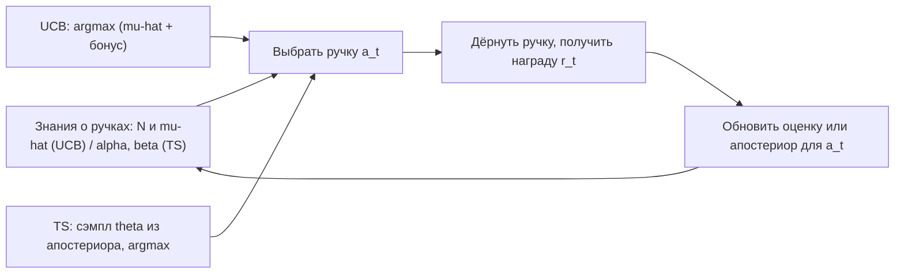

# Вопрос 14. Задача многоруких бандитов, UCB-бандиты, алгоритм сэмплирования по Томпсону.

> **Источники:** лекция 14 (`Slides/RL_MIPT_Lecture_14.pdf`, стр. 1–19), конспект [1] (Иванов, «Reinforcement Learning Textbook») разделы 7.1.1–7.1.6, стр. 166–172 (плюс §7.2, стр. 173–176 — обзорно). Для сверки констант и оценок: Sutton & Barto, гл. 2; Lattimore & Szepesvári, «Bandit Algorithms».
> **Пререквизиты:** [Основы: exploration vs exploitation](00-osnovy.md#exploration), [Основы: матожидание и Монте-Карло](00-osnovy.md#expectation-mc), [Основы: вероятность, KL](00-osnovy.md#probability), [Основы: MDP](00-osnovy.md#mdp).
> **Связанные билеты:** [Билет 3](03-mc-q-learning.md) — ε-greedy внутри Q-learning; [Билет 6](06-intrinsic-motivation.md) — RND и ICM как «бонусы за новизну» в больших MDP; [Билет 15](15-mcts.md) — UCT = UCB внутри дерева поиска; [Билет 16](16-lqr-ilqr-mbrl.md) — модели мира и model-based RL.

[TOC]

## 1. Зачем это нужно и где стоит в курсе

Представьте игровой зал: в ряд стоят $K$ автоматов («одноруких бандитов»). В каждый можно бросить монетку, дёрнуть за ручку — и автомат с какой-то фиксированной, но **неизвестной** вероятностью выдаст приз. Вы видите только исход своей игры. Вопрос: как за конечное число монеток заработать как можно больше? Если автомат A трижды выдал приз, а автомат B — ни разу, значит ли это, что A лучше? Или A просто повезло, а с B сыграно слишком мало партий?

Это и есть **задача многоруких бандитов (multi-armed bandit)**. Бытовых примеров масса: выбор ресторана на обед (ходить в проверенный или попробовать новый?), A/B-тестирование интерфейсов, выбор рекламного баннера, подбор дозировки в клинических испытаниях. Везде одна структура: несколько вариантов, шумный отклик, каждая «проба» стоит денег.

Формально это **RL без состояний**: MDP, в котором состояние ровно одно (эпизод кончается после первого шага). Из-за этого исчезают почти все сложности полноценного RL — нет динамики $p(s'\mid s,a)$, нет кредитного присваивания во времени, нет дисконтирования, Q-функция не зависит от стратегии. Остаётся ровно одна проблема — **дилемма exploration–exploitation** ([Основы](00-osnovy.md#exploration)) в дистиллированном виде. Поэтому бандиты — единственный уголок курса, где эту дилемму удаётся разобрать **строго**: есть точная нижняя оценка на качество любого алгоритма и есть алгоритмы, которые её достигают.

В карте курса бандиты стоят на стыке двух ветвей. С одной стороны — **exploration**: отсюда растут бонусы за новизну и count-based методы, превращающиеся в больших MDP в RND/ICM ([Билет 6](06-intrinsic-motivation.md)) и в UCT внутри MCTS ([Билет 15](15-mcts.md)). С другой — сэмплирование Томпсона по сути **model-based**: мы учим модель среды (распределение наград), поэтому в конспекте бандиты открывают главу «Model-based» ([Билет 16](16-lqr-ilqr-mbrl.md)).

!!! info Связь с другими темами
    В лекции 14 после бандитов вводились **обучаемые модели окружения** (конспект §7.2, стр. 173–176): планирование при известной динамике, модель прямой динамики $p_\theta(s'\mid s,a)$ и $r_\psi(s,a)$, обучаемые регрессией по переходам, «сновидения» (dreaming) — обучение на воображаемых траекториях, и общий model-based цикл «собрать данные → дообучить модель → перепланировать». Всё это относится к [Билету 16](16-lqr-ilqr-mbrl.md). Там же на лекции разбирались статьи об оптимизме в MDP — это доклады, не программа билета.

## 2. Постановка задачи и обозначения

**Определение.** Многорукий бандит — набор из $K$ распределений на вещественной прямой $p(r \mid a)$, $a \in \{1,\dots,K\}$ («ручки», «автоматы»). На шаге $t = 1,\dots,T$ агент выбирает ручку $a_t$ и получает награду $r_t \sim p(r \mid a_t)$, независимо от прошлого. Больше ничего не происходит.

Обозначения (для единообразия с [Основами](00-osnovy.md#notation) держим в голове, что $\mu_k$ — это в точности Q-функция ручки $k$):

- $\mu_k := \mathbb{E}_{p(r\mid a=k)}[r] = Q(k)$ — истинное среднее награды ручки $k$, **неизвестно**;
- $\mu^* := \max_k \mu_k = V^*$ — среднее лучшей ручки; $k^*$ — её номер;
- $\Delta_k := \mu^* - \mu_k \ge 0$ — **зазор (gap)**, сколько мы теряем в среднем за одно дёрганье ручки $k$;
- $N_k(t)$ — счётчик: сколько раз ручка $k$ была выбрана за первые $t$ шагов, $\sum_k N_k(t) = t$;
- $\hat\mu_k$ — текущая Монте-Карло оценка $\mu_k$ (выборочное среднее наград, полученных с ручки $k$).

Качество алгоритма меряют **регретом (regret, «сожалением»)** — насколько мы отстали от того, кто с самого начала знал лучшую ручку:

$$
R_T \;=\; T\mu^* - \mathbb{E}\Big[\sum_{t=1}^{T} r_t\Big] \;=\; \sum_{k=1}^{K} \Delta_k \,\mathbb{E}[N_k(T)].
$$

Второе равенство элементарно: каждое дёрганье ручки $k$ добавляет к отставанию в среднем ровно $\Delta_k$, осталось сгруппировать слагаемые по ручкам. Матожидание берётся и по случайности наград, и по случайности алгоритма. Цель — **минимизировать $R_T$**, то есть быстрее перестать тратить пробы на ручки с большим $\Delta_k$.

Заметьте: минимизировать регрет и «найти лучшую ручку» — не одно и то же. Регрет штрафует за каждую пробу по дороге, поэтому исследование должно быть не просто конечным, а **экономным**.

Родственные постановки, чтобы не путаться на экзамене:

- **Стохастические бандиты** (наш случай): награды i.i.d. из фиксированных распределений $p(r\mid a)$.
- **Контекстные бандиты**: перед выбором показывают признаки $x_t$, и среднее зависит от них — $\mathbb{E}[r \mid x_t, a]$; это почти RL, но действие не влияет на будущие контексты.
- **Adversarial (враждебные) бандиты**: награды выбирает противник, знающий ваш алгоритм; распределений нет, и алгоритмы там другие (EXP3, рандомизация обязательна).
- **Нестационарные бандиты**: $p(r\mid a)$ «плывут» со временем — тогда $\varepsilon$ нельзя занулять, а среднее считают экспоненциальным сглаживанием $\hat\mu_{a} \leftarrow \hat\mu_a + \alpha(r - \hat\mu_a)$ с константным $\alpha$ вместо шага $1/N_a$.

## 3. Основная теория

### 3.1. Как вообще оценивать ручки и почему наивные стратегии плохи

Единственный способ узнать $\mu_k$ — Монте-Карло ([Основы](00-osnovy.md#expectation-mc)): усреднить полученные с этой ручки награды. Удобна инкрементальная форма, она же «обучение со скоростью $1/N$»:

$$
\hat\mu_{a_t} \;\leftarrow\; \hat\mu_{a_t} + \frac{1}{N_{a_t}(t)}\big(r_t - \hat\mu_{a_t}\big).
$$

Дальше весь вопрос — **как выбирать**, зная $\hat\mu_k$ и $N_k$.

**Тривиальная верхняя граница.** У любого алгоритма $R_T \le C\,T$, где $C = \max_k \Delta_k$: хуже, чем всегда дёргать худшую ручку, не сделаешь. Линейный регрет — это «дно»; цель — **сублинейный** рост, ведь тогда $R_T/T \to 0$ и агент асимптотически ведёт себя как всезнающий.

**Жадная стратегия** ($a_t = \operatorname*{argmax}_k \hat\mu_k$) даёт линейный регрет: с некоторой ненулевой вероятностью $q > 0$ хорошая ручка на первых пробах невезуче выдаст нули, её оценка упадёт ниже оценки плохой, и жадный агент **никогда больше её не попробует** — счётчик замёрзнет, оценка не исправится. В среднем регрете появляется слагаемое $T q \Delta_k$, то есть $R_T \ge CT$ с $C = q\Delta_k > 0$.

**$\varepsilon$-greedy** с константным $\varepsilon$ чинит застревание, но регрет всё равно линейный: на каждом шаге с вероятностью $\varepsilon/K$ мы **намеренно** тянем конкретную плохую ручку — вклад $T\cdot\frac{\varepsilon}{K}\Delta_k$. Проблема не в том, что мы исследуем, а в том, что исследуем **равномерно и вечно**: ручка, про которую всё понятно, получает столько же внимания, сколько спорная.

**Explore-then-commit (ETC)**: сначала $m$ раз дёрнуть каждую ручку, потом навсегда зафиксировать лучшую. Это лучше (при удачном $m$ — $R_T = O(T^{2/3})$ в худшем случае), но $m$ надо угадывать заранее, зная $T$ и зазоры, а при слишком маленьком $m$ алгоритм «коммитится» не туда и получает линейный регрет. Вывод: исследование должно быть **адаптивным** — направленным туда, где неопределённость реально велика.

### 3.2. Нижняя оценка Лаи–Роббинса: предел мечтаний

Насколько хорошо вообще можно? Интуиция: если $p(r\mid k)$ и $p(r\mid k^*)$ похожи, различить их по сэмплам трудно — нужно много проб; но тогда и $\Delta_k$ мал, и ошибка не дорога. И наоборот: дорогая ошибка означает сильно различающиеся распределения, а их легко распознать. Баланс этих эффектов и даёт точную границу.

**Теорема (Лаи, Роббинс, 1985).** Для любого «разумного» (consistent) алгоритма

$$
\liminf_{T\to\infty} \frac{R_T}{\ln T} \;\ge\; \sum_{k:\,\Delta_k>0} \frac{\Delta_k}{\mathrm{KL}\big(p(r\mid k)\,\|\,p(r\mid k^*)\big)}.
$$

Что это говорит. Во-первых, **быстрее логарифма регрет не убывает**: $R_T = \Omega(\ln T)$ — дань исследованию платить придётся всегда. Во-вторых, константа имеет прозрачный смысл: вклад ручки пропорционален её неоптимальности $\Delta_k$ (числитель) и обратно пропорционален различимости её распределения от оптимального, измеренной KL-дивергенцией ([Основы](00-osnovy.md#probability)) (знаменатель). Похожие ручки — маленький KL — большой вклад в регрет.

!!! warning Как записывать теорему
    В конспекте (теорема 77) она записана без предельного перехода: $\mathbb{E}\,R_T \ge \ln T \sum_{a\ne a^*}\frac{V^*-Q(a)}{\mathrm{KL}(p(r\mid a)\,\|\,p(r\mid a^*))}$. Это та же оценка, но строго она верна лишь асимптотически — поэтому в оригинале (и выше) стоит $\liminf_{T\to\infty} R_T/\ln T$. Порядок аргументов KL тоже важен: **первым** идёт распределение неоптимальной ручки, вторым — оптимальной ($\mathrm{KL}$ не симметрична).

**Определение.** Алгоритм называют **асимптотически оптимальным**, если его средний регрет растёт логарифмически (в сильной версии — с той же константой, что в границе Лаи–Роббинса).

Терминология, которую любят спрашивать: оценка вида $O\!\big(\sum_k \ln T/\Delta_k\big)$ называется **gap-dependent** (зависит от зазоров, хороша при больших $\Delta_k$), а оценка вида $O(\sqrt{KT\ln T})$ — **gap-free / minimax** (справедлива для любой задачи, включая ту, где $\Delta_k$ крошечные). Противоречия нет: при $\Delta_k \to 0$ первая оценка взрывается, зато регрет и так ограничен $T\Delta_k$; минимум двух выражений даёт $\sqrt{T}$.

### 3.3. Оптимизм перед лицом неопределённости и UCB1

**Принцип оптимизма (optimism in the face of uncertainty).** Ищем алгоритм вида

$$
a_t = \operatorname*{argmax}_k \big[\hat\mu_k + U_k(t)\big],
$$

где $U_k(t) > 0$ — **бонус за исследование (exploration bonus)**, тем больший, чем меньше мы знаем о ручке $k$.

!!! note Интуиция: пещера у дороги
    Вы идёте мимо пещеры, в которую никогда не заходили, и ваша оценка «зайти внутрь» ниже оценки «идти дальше». Если алгоритм **занижает** неизвестное, вы никогда туда не зайдёте и не узнаете, что там. Значит, неизвестное надо **завышать**: чем больше неопределённость, тем сильнее завышение. Тогда либо вы найдёте сокровище, либо потратите пару проб и убедитесь, что там пусто — и бонус схлопнется сам. Ошибочный оптимизм лечится опытом, ошибочный пессимизм — нет.

Как выбрать $U_k$? Построить **доверительный интервал** для $\mu_k$ и взять его верхнюю границу (отсюда название — Upper Confidence Bound). Инструмент — неравенство концентрации.

**Теорема (неравенство Хёфдинга).** Пусть $X_1,\dots,X_n$ — i.i.d. выборка из распределения на $[0,1]$ со средним $\mu$, и $\hat\mu = \frac1n\sum_i X_i$. Тогда для любого $u > 0$

$$
\mathbb{P}(\mu \ge \hat\mu + u) \;\le\; e^{-2nu^2}.
$$

(Ограниченность наград отрезком $[0,1]$ — рабочее предположение, оно принято и в конспекте; для наград из $[a,b]$ оценка становится $\mathbb{P}(\mu \ge \hat\mu + u) \le \exp\!\big(-2nu^2/(b-a)^2\big)$, то есть ширина интервала растёт пропорционально размаху $b-a$.)

**Вывод ширины интервала.** Хотим, чтобы правая часть равнялась заданному уровню риска $\delta$: $e^{-2 N_k u^2} = \delta$. Логарифмируем: $-2N_k u^2 = \ln\delta$, откуда

$$
U_k = \sqrt{\frac{-\ln\delta}{2N_k}} = \sqrt{\frac{\ln(1/\delta)}{2N_k}} .
$$

Значит, с вероятностью $1-\delta$ верно $\mu_k \le \hat\mu_k + U_k$. Осталось выбрать $\delta$. Риск должен падать со временем (иначе за $T$ шагов накопится слишком много «плохих событий»), поэтому берут $\delta = t^{-c}$; при $c=4$ получаем $U_k = \sqrt{4\ln t/(2N_k)} = \sqrt{2\ln t/N_k}$ — ровно константа классического **UCB1** (Auer, Cesa-Bianchi, Fischer, 2002):

$$
a_t \;=\; \operatorname*{argmax}_k \left[\hat\mu_k + \sqrt{\frac{2\ln t}{N_k(t)}}\,\right].
$$

В общем виде пишут $\hat\mu_k + c\sqrt{\ln t / N_k}$, где $c>0$ — гиперпараметр силы исследования.

**Как читать формулу.** Знаменатель $N_k$ сжимает интервал к эмпирическому среднему: чем чаще дёргали ручку, тем меньше бонус. Числитель $\ln t$ растёт: если ручку долго не трогали, её $N_k$ стоит на месте, а $\ln t$ ползёт вверх — рано или поздно бонус перевесит, и алгоритм её перепроверит. То есть UCB **никогда не бросает** ручку навсегда, но возвращается к ней всё реже (логарифмически часто) — это и даёт логарифмический регрет.

**Идея доказательства оценки регрета** (5 строк). Работаем на «хорошем событии», когда все доверительные интервалы верны (его вероятность $\ge 1 - O(t^{-2})$, вклад «плохих» событий в регрет — константа). Тогда индекс оптимальной ручки не меньше $\mu^*$. Значит, если алгоритм выбрал плохую ручку $k$, то её индекс тоже $\ge \mu^*$: $\hat\mu_k + U_k \ge \mu^*$. Но на хорошем событии $\hat\mu_k \le \mu_k + U_k$, откуда $\mu_k + 2U_k \ge \mu^*$, то есть $2\sqrt{2\ln T/N_k} \ge \Delta_k$. Разрешая относительно $N_k$: ручку $k$ невозможно выбрать больше чем $N_k \le 8\ln T/\Delta_k^2$ раз. Подставляем в $R_T = \sum_k \Delta_k \mathbb{E}[N_k(T)]$:

$$
R_T \;\le\; \sum_{k:\,\Delta_k>0} \frac{8\ln T}{\Delta_k} \;+\; \Big(1 + \frac{\pi^2}{3}\Big)\sum_{k=1}^{K} \Delta_k .
$$

Это в точности теорема 1 из статьи Auer, Cesa-Bianchi, Fischer (2002): первое слагаемое — логарифмическая «плата за исследование», второе — константа (не зависит от $T$), набежавшая от тех редких шагов, когда доверительные интервалы всё-таки нарушились; $\pi^2/3 = \sum_{n\ge1} 2n^{-2}$ приходит из суммирования вероятностей $O(t^{-4})$ этих «плохих событий». Это gap-dependent оценка — логарифм, то есть UCB1 асимптотически оптимален по порядку (с не идеальной константой; её доводят до границы Лаи–Роббинса варианты KL-UCB и MOSS). Оптимизируя по «плохим» зазорам, получаем gap-free оценку $R_T = O(\sqrt{KT\ln T})$.

!!! warning Роль константы $c$
    $c$ слишком мал — алгоритм почти жадный и может застрять (гарантии Хёфдинга перестают выполняться); $c$ слишком велик — алгоритм вырождается в равномерный перебор. Теоретическое $c = \sqrt{2}$ (для наград в $[0,1]$) на практике часто слишком «исследовательское»: если реальный разброс наград мал, Хёфдинг переоценивает неопределённость, и помогают варианты с эмпирической дисперсией (UCB-V, UCB-Tuned).

### 3.4. Байесовский взгляд и сэмплирование Томпсона

UCB моделирует только среднее награды. Байесовский подход моделирует **всё распределение** — и тем самым делает шаг в сторону model-based RL: для бандита «модель среды» и есть набор $p(r\mid a)$.

Пусть $p(r\mid a)$ лежит в параметрическом семействе: у ручки $a$ есть параметр $\theta_a$, награда генерируется как $r \sim p(r\mid\theta_a)$, истинные $\theta_a$ неизвестны. Вместо точечной оценки максимума правдоподобия зададим **априорное распределение (prior)** $p(\theta_a)$ — сюда можно вложить и внешние знания, — а после каждого наблюдения $r_t$ обновим его по формуле Байеса до **апостериорного (posterior)**:

$$
p(\theta_a) \;\leftarrow\; p(\theta_a \mid r_t) \;\propto\; p(r_t\mid\theta_a)\, p(\theta_a).
$$

Теперь ценность ручки $\hat Q(a) = \mathbb{E}_{p(r\mid\theta_a)}[r]$ сама является **случайной величиной**, потому что случаен $\theta_a$. Ширина её распределения — это и есть честно посчитанная неопределённость (аналог доверительного интервала UCB, но не оценка сверху, а полное распределение).

**Probability matching и Thompson sampling.** Идея: выбирать ручку **ровно с той вероятностью, с которой она оптимальна по текущим знаниям**:

$$
\pi(a) \;:=\; \mathbb{P}\Big(\mathbb{E}_{p(r\mid\theta_a)}[r] = \max_{\hat a}\ \mathbb{E}_{p(r\mid\theta_{\hat a})}[r]\Big).
$$

Считать такие вероятности явно трудно, зато **сэмплировать из этого распределения тривиально** — отсюда и название. Процедура (Thompson, 1933): на каждом шаге для каждой ручки взять один сэмпл $\tilde\theta_a \sim p(\theta_a)$, посчитать $\tilde\mu_a = \mathbb{E}_{p(r\mid\tilde\theta_a)}[r]$ и сыграть $a_t = \operatorname*{argmax}_a \tilde\mu_a$. Вероятность, что победит ручка $a$, в точности равна вероятности того, что она оптимальна.

**Beta–Bernoulli бандит** — канонический случай. Пусть автомат выдаёт 0 или 1: $p(r\mid a) = \mathrm{Bernoulli}(r\mid\theta_a) = \theta_a^{\,r}(1-\theta_a)^{1-r}$. Возьмём бета-прайор $p(\theta_a) = \mathrm{Beta}(\theta_a\mid\alpha_a,\beta_a) \propto \theta_a^{\alpha_a-1}(1-\theta_a)^{\beta_a-1}$ (обычно $\alpha=\beta=1$, то есть равномерное распределение на $[0,1]$). По Байесу:

$$
p(\theta_a\mid r) \;\propto\; \underbrace{\theta_a^{\,r}(1-\theta_a)^{1-r}}_{p(r\mid\theta_a)}\cdot \underbrace{\theta_a^{\alpha_a-1}(1-\theta_a)^{\beta_a-1}}_{p(\theta_a)} \;\propto\; \mathrm{Beta}(\theta_a\mid \alpha_a + r,\ \beta_a + 1 - r).
$$

Бета — **сопряжённое (conjugate)** семейство к Бернулли: апостериор остаётся бета-распределением, а обновление сводится к двум счётчикам — $\alpha_a$ считает успехи, $\beta_a$ — неудачи:

$$
\alpha_a \leftarrow \alpha_a + \#\{\text{успехи}\},\qquad \beta_a \leftarrow \beta_a + \#\{\text{неудачи}\}.
$$

Среднее апостериора $\mathbb{E}[\theta_a] = \alpha_a/(\alpha_a+\beta_a)$ — это доля успехов, то есть та же Монте-Карло оценка (в точности она при прайоре $\alpha=\beta=0$; при стандартном $\alpha=\beta=1$ — со сглаживанием Лапласа, что на первых шагах даже полезнее). Осторожно с буквами: здесь $\alpha_a,\beta_a$ — параметры бета-распределения, а не learning rate из [Основ](00-osnovy.md#notation). Новое здесь — **дисперсия** порядка $1/(\alpha_a+\beta_a)$: она падает с числом проб. Часто дёрганная ручка даёт сэмплы почти равные своей оценке; редко дёрганная — широкие, и иногда её сэмпл случайно перебивает лидера, что и заставляет её исследовать.

**Гауссовский случай** (кратко): если $r \sim \mathcal{N}(\mu_a, \sigma^2)$ с известной $\sigma$, сопряжённый прайор — нормальный, и апостериор тоже нормальный; при неинформативном прайоре он равен $\mathcal{N}\big(\hat\mu_a,\ \sigma^2/N_a\big)$. Тогда TS = «взять $\tilde\mu_a = \hat\mu_a + \sigma\xi_a/\sqrt{N_a}$, $\xi_a\sim\mathcal{N}(0,1)$, и взять argmax» — видно родство с UCB: та же ширина $\propto 1/\sqrt{N_a}$, только вместо детерминированного сдвига вверх случайный.

**Что известно про регрет TS.** Thompson sampling был предложен раньше всех (1933) как эвристика, а теория подоспела почти через век: Agrawal & Goyal (2012, 2013) доказали логарифмический регрет и gap-free оценку $O(\sqrt{KT\ln T})$; Kaufmann, Korda, Munos (2012) показали, что для бернуллиевских наград TS **асимптотически оптимален по Лаи–Роббинсу**, то есть достигает границы с правильной константой. На практике TS обычно обгоняет UCB1 при умеренных $T$, так как не платит за консервативность Хёфдинга.

### 3.5. Обобщение на табличные MDP (7.1.6)

Теория бандитов подсказывает, как «правильно» разрешать exploration–exploitation, но напрямую на большие MDP не переносится: неопределённость касается не одного числа, а всей динамики, и награда приходит с задержкой.

**Оптимизм в MDP.** UCB-счётчики переносят эвристически: к награде (или к Q-функции) добавляют бонус, убывающий с числом посещений пары:

$$
\tilde r(s,a) = r(s,a) + c\sqrt{\frac{\ln t}{N(s,a)}} \quad\text{или}\quad \tilde Q(s,a) = Q(s,a) + \frac{c}{\sqrt{N(s,a)}}.
$$

Это **count-based exploration**; на нём построены алгоритмы с доказанными оценками регрета для табличных MDP (UCRL2, UCBVI). В больших пространствах честный счётчик $N(s,a)$ невозможен, и его заменяют суррогатом «новизны»: псевдосчётчиками из плотностной модели, ошибкой предсказания случайной сети (RND) или ошибкой модели динамики (ICM) — см. [Билет 6](06-intrinsic-motivation.md). В MCTS тот же UCB работает внутри дерева под именем UCT ([Билет 15](15-mcts.md)).

**Posterior sampling (аналог TS для MDP).** Для табличного MDP заводим байесовские модели награды $p(r\mid\theta_{s,a})$ и переходов $p(s'\mid\varphi_{s,a})$ и обновляем прайоры по встреченным переходам. Перед эпизодом **сэмплируем целое MDP**: $\theta_{s,a}\sim p(\theta_{s,a})$, $\varphi_{s,a}\sim p(\varphi_{s,a})$; в нём находим оптимальную политику динамическим программированием (Value Iteration, [Билет 2](02-bellman-pi-vi.md)) и играем ею весь эпизод — политика выбирается с той вероятностью, с которой она оптимальна по текущим знаниям. Пример из конспекта — Online Shortest Path: агент каждый день едет на работу по графу со случайными временами проезда рёбер, сэмплирует времена из апостериоров, ищет кратчайший путь в сэмплированном графе и едет по нему, попутно уточняя модель.

## 4. Алгоритмы



**Алгоритм 1. UCB1**

```text
Вход: K ручек, горизонт T, константа c (классика: c = sqrt(2))
1. Инициализация: для каждой ручки k положить N_k := 0, mu_k := 0
2. Для t = 1..K: дёрнуть ручку t один раз, записать награду,
   положить N_t := 1, mu_t := r          # чтобы бонус был определён
3. Для t = K+1 .. T:
   3.1 для каждой ручки k вычислить индекс
       I_k := mu_k + c * sqrt( ln(t) / N_k )
   3.2 a := argmax_k I_k                 # ничьи разрешаются произвольно
   3.3 сыграть a, получить r
   3.4 N_a := N_a + 1
   3.5 mu_a := mu_a + (r - mu_a) / N_a   # инкрементальное среднее
```

Шаг 3.1 строит верхнюю границу доверительного интервала; шаг 3.2 реализует оптимизм — играем в мир, **лучше всего совместимый с данными**. Если ручка действительно хороша, мы её эксплуатируем; если оптимизм ошибочен, данные быстро сдуют оценку. Шаг 3.5 — Монте-Карло со скоростью $1/N$ (в нестационарном случае заменяется на константное $\alpha$).

**Алгоритм 2. Thompson sampling, Beta–Bernoulli**

```text
Вход: K ручек, параметры прайора alpha0, beta0 (обычно 1, 1)
1. Для каждой ручки k: alpha_k := alpha0, beta_k := beta0
2. Для t = 1 .. T:
   2.1 для каждой ручки k сэмплировать theta_k ~ Beta(alpha_k, beta_k)
   2.2 a := argmax_k theta_k
   2.3 сыграть a, получить r из {0, 1}
   2.4 если r = 1: alpha_a := alpha_a + 1
       иначе:      beta_a  := beta_a  + 1
```

Весь exploration спрятан в шаге 2.1: разброс сэмпла пропорционален неопределённости. Гиперпараметров исследования нет вовсе — только прайор, влияющий лишь на первые шаги. Для вещественных наград шаги 2.1 и 2.4 заменяются на сэмплирование и обновление в соответствующем сопряжённом семействе (нормально-гамма для гауссовых наград).

**Сравнение стратегий**

| Метод | Регрет | Гиперпараметры | Детерминирован? | Delayed feedback / batch |
|---|---|---|---|---|
| Жадная | $\Theta(T)$ — линейный | нет | да | застревает ещё сильнее |
| $\varepsilon$-greedy, $\varepsilon = \mathrm{const}$ | $\Theta(T)$ — линейный | $\varepsilon$ (чувствителен) | нет | работает, но неэффективно |
| $\varepsilon$-greedy, $\varepsilon_t \sim 1/t$ | $O(K\ln T/\Delta^2)$ при удачной настройке | $\varepsilon_0$, расписание | нет | хрупко к настройке |
| ETC | $O(T^{2/3})$ (minimax) | длина фазы $m$, нужен $T$ | да | естественно ложится на батчи |
| UCB1 | $O(\sum_k \ln T/\Delta_k)$, gap-free $O(\sqrt{KT\ln T})$ | $c$ (мягко) | да | плохо: без обновления $N$ весь батч уйдёт на одну ручку |
| Thompson sampling | тот же порядок; для Бернулли оптимален по Лаи–Роббинсу | прайор (мягко) | нет | хорошо: рандомизация сама «размазывает» батч |

## 5. Пример

Три бернуллиевские ручки с истинными (агенту неизвестными) $\mu = (0.3,\ 0.5,\ 0.7)$, награды $\{0,1\}$.

**UCB1, $c=\sqrt2$.** Шаги 1–3 — инициализация, по одной пробе на ручку. Пусть не повезло: $r=(0, 1, 0)$, лучшая третья ручка выдала ноль. Состояние: $\hat\mu = (0,\ 1,\ 0)$, $N=(1,1,1)$.

*Шаг $t=4$:* бонус $\sqrt{2\ln 4/1} = \sqrt{2\cdot1.386} = 1.665$ у всех. Индексы: $I_1 = 1.665$, $I_2 = 2.665$, $I_3 = 1.665$. Выбираем ручку 2. Пусть $r=1$: $\hat\mu_2 = 1$, $N_2 = 2$.

*Шаг $t=5$:* $2\ln 5 = 3.219$. $I_1 = 0 + \sqrt{3.219} = 1.794$; $I_2 = 1 + \sqrt{3.219/2} = 1 + 1.269 = 2.269$; $I_3 = 1.794$. Снова ручка 2. Пусть $r=0$: $\hat\mu_2 = 2/3 = 0.667$, $N_2 = 3$.

*Шаг $t=6$:* $2\ln 6 = 3.584$. $I_1 = \sqrt{3.584} = 1.893$; $I_2 = 0.667 + \sqrt{3.584/3} = 0.667 + 1.093 = 1.760$; $I_3 = 1.893$. Теперь выигрывают ручки 1 и 3 — их бонус не сжимался, пока рос $\ln t$. Алгоритм вернётся к третьей (реально лучшей) ручке и исправит невезучий старт — это и делает $\ln t$ в числителе.

**Thompson sampling.** Прайоры $\mathrm{Beta}(1,1)$ у всех, апостериорные средние $= 1/2$.

*Шаг 1:* сэмплы $\tilde\theta = (0.62,\ 0.31,\ 0.55)$ → играем ручку 1, получаем $r=0$ → $\mathrm{Beta}(1,2)$, апостериорное среднее $1/3$.

*Шаг 2:* сэмплы $\tilde\theta = (0.29,\ 0.71,\ 0.48)$ → играем ручку 2, получаем $r=1$ → $\mathrm{Beta}(2,1)$, среднее $2/3$.

Ручка 1 проиграла на шаге 2 не потому, что её «запретили», а потому что её распределение сместилось влево — но хвост у $\mathrm{Beta}(1,2)$ широкий, и через несколько шагов она может снова выиграть сэмплирование. Это плавный, самонастраивающийся exploration без единого гиперпараметра.

## 6. Подводные камни, сравнения, типичные ошибки

!!! warning Регрет считается относительно оракула, а не относительно «максимальной награды»
    $R_T = T\mu^* - \mathbb{E}\sum r_t$: вычитается средняя награда **лучшей ручки**, а не максимум по реализациям. На конкретной реализации регрет может оказаться отрицательным из-за везения; смысл имеет только матожидание.

!!! warning Бонус UCB не определён при $N_k=0$
    Формально $\sqrt{\ln t/0} = \infty$, поэтому UCB1 начинается с обязательного круга: каждую ручку дёрнуть хотя бы раз. На экзамене это любят спрашивать — «а что на первом шаге?».

!!! warning Хёфдинг требует ограниченных наград
    Вывод $U_k = \sqrt{2\ln t/N_k}$ опирается на $r\in[0,1]$. Для наград другого масштаба константу нужно пересчитывать — иначе бонус либо утонет в шуме, либо задавит эксплуатацию. Практическое следствие: **награды перед UCB нормируют**.

!!! warning UCB и батчи/задержки
    UCB детерминирован: если нужно выдать сразу 1000 показов баннера, не получив обратной связи, он выберет одну и ту же ручку 1000 раз — счётчики-то не обновились. TS даёт 1000 независимых сэмплов и распределяет показы пропорционально вероятности быть лучшим. Это одна из главных причин, почему в индустрии (реклама, рекомендации) чаще стоит TS.

!!! warning Бандитские гарантии не переносятся на глубокий RL «как есть»
    В больших MDP нет счётчиков $N(s,a)$, награда отсрочена, а оценка Q смещена из-за бутстрэпа и аппроксимации. Оптимизм там становится эвристикой (бонусы новизны, шумные сети в [Билете 4](04-dqn.md), RND/ICM в [Билете 6](06-intrinsic-motivation.md)); гарантий Лаи–Роббинса никто не даёт.

!!! warning Нестационарность ломает всё
    И UCB, и TS предполагают фиксированные $p(r\mid a)$. Если распределения плывут, счётчики «замораживают» устаревшее знание: бонус мал, апостериор узкий, агент не заметит, что мир изменился. Лечение — забывание: скользящее окно, дисконтирование счётчиков (discounted UCB), «размывание» апостериора, константный шаг $\alpha$ вместо $1/N$.

## 7. Ответ за 5 минут

1. **Постановка.** $K$ ручек, при выборе $a_t$ приходит $r_t \sim p(r\mid a_t)$; эпизод длиной один шаг, состояний нет. $\mu_k = \mathbb{E}[r\mid k] = Q(k)$, $\mu^* = \max_k\mu_k = V^*$, $\Delta_k = \mu^*-\mu_k$.
2. **Критерий.** Регрет $R_T = T\mu^* - \mathbb{E}\sum_t r_t = \sum_k \Delta_k\mathbb{E}[N_k(T)]$; хотим **сублинейный** рост.
3. **Оценка ручек** — Монте-Карло: $\hat\mu_a \leftarrow \hat\mu_a + \frac1{N_a}(r-\hat\mu_a)$.
4. **Наивное плохо.** Жадность застревает ($R_T = \Theta(T)$), $\varepsilon$-greedy исследует вечно и равномерно — тоже $\Theta(T)$ (вклад $T\frac{\varepsilon}{K}\Delta_k$), ETC требует знать горизонт.
5. **Нижняя граница Лаи–Роббинса:** $\liminf R_T/\ln T \ge \sum_{k:\Delta_k>0}\Delta_k/\mathrm{KL}(p(r\mid k)\|p(r\mid k^*))$. Логарифм — предел мечтаний; алгоритм с $O(\ln T)$ называют асимптотически оптимальным.
6. **Принцип оптимизма:** $a_t = \operatorname*{argmax}_k[\hat\mu_k + U_k]$, бонус тем больше, чем меньше знаем; ошибочный оптимизм лечится опытом, пессимизм — нет.
7. **Откуда бонус.** Хёфдинг: $\mathbb{P}(\mu \ge \hat\mu + u)\le e^{-2nu^2}$; приравняли к $\delta$ → $U = \sqrt{\ln(1/\delta)/(2N)}$; взяли $\delta = t^{-4}$ → **UCB1**: $a_t = \operatorname*{argmax}_k[\hat\mu_k + \sqrt{2\ln t/N_k}]$.
8. **Гарантии UCB1:** $N_k \le 8\ln T/\Delta_k^2$ ⟹ $R_T = O(\sum_k \ln T/\Delta_k)$ (gap-dependent) и $O(\sqrt{KT\ln T})$ (gap-free).
9. **Байесовский взгляд:** прайор $p(\theta_a)$, апостериор $p(\theta_a\mid r)\propto p(r\mid\theta_a)p(\theta_a)$; ценность ручки становится случайной величиной.
10. **Thompson sampling** (probability matching): сэмплируем $\tilde\theta_a$ из апостериора, играем argmax — ручка выбирается с вероятностью того, что она оптимальна. Beta–Bernoulli: $\mathrm{Beta}(\alpha+\text{успехи},\ \beta+\text{неудачи})$, среднее $\alpha/(\alpha+\beta)$. Асимптотически оптимален (Kaufmann et al. 2012; Agrawal & Goyal).
11. **Сравнение:** UCB детерминирован и без прайора, но консервативен и плох при батчах; TS рандомизирован, обычно лучше эмпирически, естественен для отложенной обратной связи.
12. **Обобщение на MDP:** бонусы $\propto 1/\sqrt{N(s,a)}$ (count-based, UCRL2/UCBVI), в глубоком RL — RND/ICM; posterior sampling = сэмплировать целое MDP и решить его Value Iteration; UCB внутри дерева = UCT в MCTS.

## 8. Вероятные допвопросы экзаменатора

**Почему регрет $\varepsilon$-greedy линейный, ведь он же исследует?**
Именно потому, что исследует всегда и равномерно: на каждом шаге с вероятностью $\varepsilon/K$ выбирается конкретная плохая ручка, давая вклад $T\frac{\varepsilon}{K}\Delta_k$ в регрет. Чинится убывающим расписанием $\varepsilon_t \sim 1/t$ (тогда можно получить логарифм), но расписание надо угадывать.

**Что даёт $\ln t$ в числителе бонуса?**
Это «часы неопределённости»: пока ручку не трогают, её $N_k$ заморожен, а $\ln t$ растёт, поэтому бонус неограниченно увеличивается и рано или поздно заставляет ручку перепроверить. Так UCB не бросает навсегда ни одну ручку, но возвращается к плохим всё реже — суммарно $O(\ln T)$ раз.

**Откуда именно двойка в $\sqrt{2\ln t/N}$?**
Из Хёфдинга при $r\in[0,1]$: $U=\sqrt{\ln(1/\delta)/(2N)}$, и выбора уровня риска $\delta=t^{-4}$, что даёт $\sqrt{4\ln t/(2N)} = \sqrt{2\ln t/N}$. Другой показатель в $\delta$ — другая константа $c$.

**Почему TS не детерминирован и почему это хорошо?**
Потому что действие выбирается по случайному сэмплу из апостериорного распределения, то есть с вероятностью быть оптимальным. Это (а) даёт естественное исследование без гиперпараметров, (б) корректно работает при батчах и отложенной обратной связи — параллельные решения получаются разными, (в) устойчивее к «слипанию» одинаковых ручек.

**В чём разница gap-dependent и gap-free оценок?**
Gap-dependent, $O(\sum_k \ln T/\Delta_k)$, зависит от конкретной задачи и хороша при больших зазорах, но взрывается при $\Delta_k\to0$. Gap-free (minimax), $O(\sqrt{KT\ln T})$, — худший случай по всем задачам с $K$ ручками. Противоречия нет: реальный регрет ограничен минимумом, поскольку при $\Delta_k\to0$ он не превышает $T\Delta_k$.

**Как связаны UCB и MCTS?**
В MCTS выбор хода в узле дерева — это ровно бандитская задача над детьми узла, и алгоритм UCT применяет к ней UCB1: $\operatorname*{argmax}_a [Q(s,a) + c\sqrt{\ln N(s)/N(s,a)}]$, где $N(s)$ — число заходов в узел. Отличие от чистого бандита в том, что награды нестационарны (оценки детей улучшаются по мере роста дерева), поэтому гарантии там слабее. Подробнее — [Билет 15](15-mcts.md).

**Почему бандиты попали в главу про model-based?**
Потому что Thompson sampling учит модель среды — распределения наград $p(r\mid a)$ — и действует, сэмплируя её и оптимально играя в сэмплированном мире. Для табличных MDP это обобщается в posterior sampling: сэмплируем всё MDP, решаем Value Iteration, играем эпизод. Заодно это даёт границу $\Omega(\ln T)$ из Лаи–Роббинса как напоминание: ограниченного (нулевого) регрета не бывает ни у кого.
