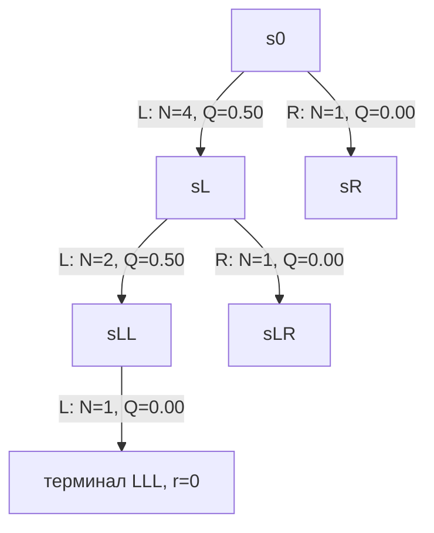

# Вопрос 15. Monte Carlo Tree Search в общем виде.

> **Источники:** лекция 15 (`Slides/RL_MIPT_Lecture_15.pdf`, стр. 5–17), конспект [1] (Иванов, «Reinforcement Learning Textbook») § 7.3 «Планирование для дискретного управления», стр. 176–182 (+ вводный § 7.2, стр. 173–176). Для сверки: Browne et al. (2012) «A Survey of MCTS Methods»; Kocsis & Szepesvári (2006) «Bandit based Monte-Carlo Planning» (UCT); Silver et al. (2017, AlphaGo Zero; 2018, AlphaZero); Schrittwieser et al. (2020, MuZero); Sutton & Barto § 8.11.
> **Пререквизиты:** [Основы: MDP](00-osnovy.md#mdp), [Основы: функции ценности](00-osnovy.md#value), [Основы: exploration vs exploitation](00-osnovy.md#exploration), [Основы: карта методов курса](00-osnovy.md#taxonomy).
> **Связанные билеты:** [Билет 14](14-bandits.md) — многорукие бандиты и вывод оценки UCB, на которой построен UCT; [Билет 16](16-lqr-ilqr-mbrl.md) — общая схема model-based RL, планирование для непрерывного управления (LQR/iLQR), Dyna и MPC; [Билет 2](02-bellman-pi-vi.md) — уравнения Беллмана, Policy/Value Iteration, с которыми MCTS полезно сравнивать.

[TOC]

## 1. Зачем это нужно и где стоит в курсе

Все методы, которые мы разбирали раньше (DQN, PPO, SAC), устроены так: агент один раз обучает сеть, а потом в каждом состоянии делает один быстрый прямой проход и мгновенно выдаёт действие. Человек так не играет в шахматы: перед ходом он **думает** — мысленно проигрывает варианты, оценивает получившиеся позиции, отбрасывает явно плохие ветки и углубляется в перспективные. Это и есть **планирование (planning)**: использование модели среды (симулятора), чтобы «прожить будущее в голове» перед реальным ходом.

Формально (конспект, опр. 88): при известных $p(s' \mid s,a)$ и $r(s,a)$ найти

$$
\operatorname*{argmax}_{(a_0, a_1, a_2, \dots)} \ \mathbb{E}_{\tau \mid s_0, a_0, a_1, \dots}\big[R(\tau)\big].
$$

Обучения здесь нет — есть только вычислительно дорогой перебор. В карте курса ([Основы: таксономия](00-osnovy.md#taxonomy)) это ветка **model-based / planning**: модель не выучивается, а даётся (или выучивается отдельно — [Билет 16](16-lqr-ilqr-mbrl.md)).

Почему нельзя просто перебрать всё? Для детерминированной среды $s' = f(s,a)$ можно построить полное дерево игры и получить гарантированно оптимальный план. Но размер дерева — это (ветвление)$^{\text{глубина}}$. В шахматах ветвление $b \approx 35$, длина партии $d \approx 80$, то есть $35^{80}$ вариантов; в го $b \approx 250$, $d \approx 150$, то есть $250^{150}$. Значит, перебор обязан быть **неполным**, и весь вопрос в том, какую часть дерева строить.

Классический ответ из шахматных программ — **minimax с alpha-beta отсечением**: перебираем дерево **равномерно** до фиксированной глубины $d$, а листья оцениваем **рукописной эвристикой** (материал, структура пешек, безопасность короля). Для шахмат это сработало; для го — нет: позиция в го не раскладывается на локальные признаки вида «это стоит +0.3 пешки», хорошей ручной оценочной функции никто не сумел написать, а при ветвлении 250 недостижима даже глубина 6–8.

!!! note Интуиция
    MCTS отвечает на оба возражения сразу. Во-первых, дерево строится **неравномерно**: перспективные ветки углубляются, бесперспективные остаются почти не раскрытыми. Во-вторых, вместо рукописной эвристики лист оценивается **случайным доигрыванием** до конца эпизода: «добьём партию как попало сто раз и посмотрим, в скольких случаях выиграли». Никаких знаний о предметной области не требуется — только симулятор.

Компромисс «углубляться в перспективное vs проверять недоисследованное» — это дилемма exploration/exploitation, только теперь она стоит **в каждом узле дерева**. Отсюда мостик к [билету 14](14-bandits.md): каждый узел — маленький многорукий бандит, и решается он тем же принципом оптимизма при неопределённости.

## 2. Постановка задачи и обозначения

**Что требуется от среды:**

1. **Симулятор** $p(s', r \mid s, a)$, из которого можно сэмплировать переходы сколько угодно раз, «откатываясь» назад бесплатно. Классический MCTS предполагает, что симулятор **идеален**; в MuZero его заменят выученной моделью.
2. **Дискретное** (и не слишком большое) пространство действий $\mathcal{A}$ — иначе «перебрать все дуги из узла» невозможно.
3. Желательно **детерминированность** и эпизодичность. Для стохастических MDP планирование в виде «найти лучшую последовательность действий» вообще **неоптимально** (конспект, теорема 81): план фиксируется заранее и не реагирует на выпавший исход, поэтому осторожный план может побить рискованный, хотя оптимальная **стратегия** выбрала бы рискованный и адаптировалась. Лечится перепланированием на каждом шаге (§ 4.2).

**Дерево MDP** (конспект, опр. 92): дерево с корнем в текущем состоянии $s_0$, где каждой дуге соответствует действие, а узел на уровне $t$ отвечает плану $a_0, a_1, \dots, a_{t-1}$ — пути от корня. Важно: узел — это **план**, а не состояние (в детерминированной среде это одно и то же, в стохастической — нет). Конспект обозначает узлы буквой $\aleph$; мы для краткости пишем $s$, подразумевая «узел, в который приводит этот путь».

**Что хранится на дуге $(s,a)$:**

| Обозначение | Смысл |
|---|---|
| $N(s,a)$ | сколько раз итерация MCTS прошла по этой дуге (счётчик посещений) |
| $W(s,a)$ | сумма всех полученных через эту дугу оценок reward-to-go |
| $Q(s,a) = W(s,a)/N(s,a)$ | средняя (Монте-Карло) оценка ценности дуги |
| $N(s) = \sum_a N(s,a)$ | число посещений узла |
| $P(s,a)$ | *(только AlphaZero)* априорная вероятность действия от нейросети |

Сокращённо: $N$ — «сколько раз пробовали», $Q$ — «насколько в среднем хорошо получалось». Их достаточно, чтобы в каждом узле решать бандитскую задачу.

## 3. Основная теория: четыре фазы и почему UCT работает

### 3.1. Одна итерация MCTS

Одна итерация (один «шаг MCTS-процедуры») состоит из четырёх фаз. Изначально дерево состоит из одного корня.


**1. Selection.** Стартуем в корне $s_0$. Пока текущий узел — не лист, выбираем действие с помощью **TreePolicy**, которая видит только $N(s,a)$ и $Q(s,a)$ у дуг этого узла, спускаемся по соответствующей дуге и сэмплируем $s', r \sim p(s', r \mid s, a)$. Всю пройденную траекторию (действия и награды) запоминаем. Именно здесь дерево растёт неравномерно: TreePolicy тянет спуск в перспективные ветки.

Стандартный выбор TreePolicy — **UCT (Upper Confidence bounds applied to Trees)**, то есть UCB1 из [билета 14](14-bandits.md), применённый в каждом узле:

$$
a \;=\; \operatorname*{argmax}_{a \in \mathcal{A}} \left[\, Q(s,a) \;+\; c\,\sqrt{\frac{\ln N(s)}{N(s,a)}} \,\right].
$$

Первое слагаемое — эксплуатация (идём туда, где в среднем хорошо), второе — разведка (бонус дугам, по которым ходили редко относительно общего числа заходов в узел). Константа $c > 0$ регулирует баланс и должна быть согласована с масштабом наград. Это ровно UCB1 из [билета 14](14-bandits.md): там бонус записан как $\sqrt{2\ln t/N_k} = \sqrt{2}\cdot\sqrt{\ln t/N_k}$, то есть UCB1 — частный случай UCT с $c = \sqrt{2}$ (значение, которое теория Хёфдинга даёт для наград в $[0,1]$); роль «общего числа проб» $t$ играет $N(s)$ — число заходов в узел. Дуге с $N(s,a) = 0$ по соглашению приписывают бонус $+\infty$, чтобы каждое действие было опробовано хотя бы раз.

В AlphaZero используется вариант **PUCT**, где бонус домножен на априорную вероятность от нейросети:

$$
a \;=\; \operatorname*{argmax}_{a} \left[\, Q(s,a) \;+\; c\,P(s,a)\,\frac{\sqrt{N(s)}}{1 + N(s,a)} \,\right].
$$

Смысл тот же: бонус обратно пропорционален числу выборов действия, а числитель $\sqrt{N(s)}$ растёт неограниченно, так что рано или поздно будет опробовано любое действие. Но множитель $P(s,a)$ сразу направляет перебор в ходы, которые сеть считает разумными, — критично при большом $|\mathcal{A}|$ (в го до 192 легальных ходов).

**2. Expansion.** В достигнутом листе создаём новых детей. В варианте конспекта — сразу для **всех** $a \in \mathcal{A}$; в классическом варианте — одного ребёнка для одного ещё не пробованного действия. Если $|\mathcal{A}|$ велико, раскрывают случайное подмножество действий.

**3. Simulation (Evaluation).** Для нового листа нужна хоть какая-то оценка reward-to-go $\hat{V}$. Универсальный способ: доиграть эпизод до конца **DefaultPolicy** — стратегией, которая не использует дерево (чаще всего просто равномерно случайной); полученный $R(\tau_a)$ и есть оценка. Второе название фазы — Evaluation, потому что вместо доигрывания годится любая эвристика оценки позиции: рукописная (как в minimax) или — в AlphaZero — обученная value-сеть $V_\theta(s)$.

**4. Backpropagation (Update).** Идём от листа обратно к корню и для **каждой пройденной дуги** $(s,a)$ обновляем статистики новым сэмплом $\hat{V}$ (reward-to-go после посещения этой дуги: сумма реальных наград, собранных по дереву, плюс оценка из листа):

$$
N(s,a) \leftarrow N(s,a) + 1, \qquad
W(s,a) \leftarrow W(s,a) + \hat{V}, \qquad
Q(s,a) \leftarrow \frac{W(s,a)}{N(s,a)}.
$$

Ровно то же самое можно записать в инкрементальной форме (как в конспекте), без хранения $W$:

$$
Q(s,a) \leftarrow Q(s,a) + \frac{1}{N(s,a)}\big(\hat{V} - Q(s,a)\big).
$$

!!! warning Игры двух игроков
    Если это игра двух игроков, на каждом уровне дерева ходит другая сторона, поэтому при подъёме знак оценки меняется: $\hat{V} \to -\hat{V}$ (или $\hat{V} \to 1 - \hat{V}$ для наград в $[0,1]$). Каждый узел должен хранить ценность **с точки зрения того, кто в нём ходит**. Забыть про смену знака — самая частая ошибка в реализациях.

### 3.2. Anytime-свойство и выбор итогового хода

MCTS — **anytime-алгоритм**: его можно прервать после любого числа итераций $K$ и получить осмысленный ответ, качество которого растёт с $K$. Это отличает его от minimax с фиксированной глубиной, который обязан досчитать весь уровень, чтобы результат был корректен. Практически: «думаем ровно столько, сколько нам отвели секунд».

Когда итерации закончились, **реальный** ход выбирается из статистик корня $s_0$, и TreePolicy для этого не годится — в ней заложена разведка, которая на инференсе только вредит. Варианты:

- **robust child** — $a = \operatorname*{argmax}_a N(s_0,a)$ (самое исследованное действие) — стандарт;
- **max child** — $a = \operatorname*{argmax}_a Q(s_0,a)$ (самое ценное в среднем);
- **visit distribution с температурой** $T$: $\pi_{\text{MCTS}}(a \mid s_0) \propto N(s_0,a)^{1/T}$ — стохастическая стратегия, нужная для разнообразия партий при обучении и для дистилляции. Здесь $T$ — температура в обычном смысле: $T \to 0$ даёт argmax по посещениям (robust child), $T = 1$ — ровно пропорционально посещениям, большие $T$ размывают распределение к равномерному. Это запись AlphaGo Zero / AlphaZero.

!!! warning Две записи одной формулы
    В конспекте (алгоритм 28) та же стратегия записана как $\pi(a_0 \mid s_0) \propto n(\aleph_0, a_0)^{T}$ — без обратной степени. Это **то же самое семейство** распределений, просто там $T$ играет роль **обратной** температуры: $T_{\text{конспект}} = 1/T_{\text{наш}}$. В записи конспекта argmax получается при $T \to \infty$, пропорционально посещениям — при $T = 1$, равномерно — при $T \to 0$. Если на экзамене пишете $n^T$, оговорите, что $T$ здесь обратная температура.

### 3.3. Почему UCT работает

В узле $s$ мы выбираем из $|\mathcal{A}|$ «ручек»; про каждую есть эмпирическое среднее $Q(s,a)$ и число проб $N(s,a)$. Это буквально задача многорукого бандита ([билет 14](14-bandits.md)): дуге, по которой ходили мало, могло просто не повезти с сэмплом, и списывать её рано. UCB1 строит для каждой ручки верхнюю доверительную границу и выбирает максимальную — тот же **принцип оптимизма при неопределённости**, применённый в каждом узле дерева независимо.

**Результат Kocsis & Szepesvári (2006)** (формулируем без доказательства): для UCT в конечном дереве с ограниченными наградами

- оценка в корне сходится к правильному (minimax/оптимальному) значению: $Q(s_0,a) \to Q^*(s_0,a)$ при $N \to \infty$;
- вероятность выбрать в корне неоптимальное действие стремится к нулю (авторы показывают полиномиальную скорость этого убывания).

То есть MCTS **состоятелен**: при бесконечном бюджете он даёт оптимальный ход, а эвристика в Simulation влияет только на скорость, а не на предел. Интуиция: чем больше итераций, тем глубже дерево и тем меньше вклад эвристической оценки листа — в пределе дерево построено целиком. Эвристика лишь подсказывает, куда MCTS пойдёт раскрывать дерево в первую очередь.

Оговорки, о которых любят спрашивать:

- Применение бандитов здесь — **эвристика**, а не строгая теория: распределение reward-to-go в ветке **меняется** по мере раскрытия дерева, то есть бандит нестационарный, а UCB1 выводился для стационарного.
- Rollout'ы случайной политикой имеют **огромную дисперсию**: одна партия «как попало» почти ничего не говорит о позиции. Отсюда медленная сходимость и желание заменить их на value-сеть.
- **Ловушки (traps)**: если позиция хороша при всех ходах, кроме одного опровержения, усредняющий backup размывает катастрофу («в среднем-то неплохо»), и MCTS может потребовать экспоненциально много итераций, чтобы её заметить. Поэтому чистый MCTS исторически проигрывал alpha-beta в тактических шахматах, а в го, где тактика мягче, — выигрывал.
- Константа $c$: слишком большая — дерево широкое и мелкое; слишком малая — жадный глубокий спуск в одну ветку и риск застрять в локально хорошем плане.

## 4. Алгоритм и его применения

### 4.1. Псевдокод (вариант из конспекта, алгоритм 28)

```text
Вход: s0 — текущее состояние реальной среды;
      p(s',r | s,a) — симулятор; C — константа UCT;
      root — корень дерева в памяти со счётчиками N(s,a) и оценками Q(s,a);
      K — число итераций; T — температура.

Для k = 1..K:
  1. Садимся в корень: узел := root, s := s0, траектория tau := (s0).
  2. Selection: пока узел — не лист:
       N(s) := сумма_a N(s,a)
       a := argmax_a [ Q(s,a) + C * sqrt( ln N(s) / N(s,a) ) ]
       сэмплируем s', r ~ p(s',r | s,a); дописываем (a, r, s') в tau
       узел := child(узел, a); s := s'
  3. Expansion + Simulation: для каждого a из A:
       создаём нового ребёнка hat_node с дугой для действия a
       симулируем доигрывание tau_a случайной DefaultPolicy из (s,a)
       инициализируем N(hat_node, a) := 1, Q(hat_node, a) := R(tau_a)
  4. Backpropagation: для каждой пройденной дуги (узел, a) в tau:
       hat_V := reward-to-go в tau после этой дуги, где награда
                после листа оценена как среднее по a от R(tau_a)
       Q(узел,a) := Q(узел,a) + (1/N(узел,a)) * (hat_V - Q(узел,a))
       N(узел,a) := N(узел,a) + 1

Выход: стратегия pi(a0 | s0) пропорциональна N(root, a0)^(1/T)
       (в записи конспекта -- N(root, a0)^T, где T -- обратная температура).
```

Что происходит содержательно. Шаг 2 — «выбираем самый перспективный из уже рассмотренных планов». Шаг 3 — «продлеваем его на один ход вперёд во все стороны и грубо оцениваем результат». Шаг 4 — «разносим новую информацию по всем решениям, которые к ней привели». Выход — не одно действие, а **распределение**: планировщик честно признаёт, что не перебрал всё. По ресурсам процедура **очень дорогая по времени** (тысячи симуляций на реальный ход) и **разумная по памяти** (за итерацию добавляется $|\mathcal{A}|$ узлов в этом варианте и ровно один — в классическом).

### 4.2. MCTS как онлайн-стратегия

Предобучать дерево один раз и потом играть по нему не принято: мы быстро попадём в состояния, которых в дереве нет. Поэтому MCTS считают **не построением дерева, а самой стратегией** — просто очень медленной:

1. Сидя в реальном $s_0$, делаем, условно, 1000 итераций MCTS.
2. Выбираем ход $a_0$ по статистикам корня и отправляем его в **реальную** среду.
3. Получаем настоящее $s_1$, **переносим корень** в `child(root, a0)` и выбрасываем остальное дерево (наверх мы никогда не пойдём — прошлое не изменить). Поддерево сохранённого ребёнка переиспользуется: накопленные там $N$ и $Q$ никуда не деваются.
4. Повторяем.

Это **планирование с обратной связью** (receding horizon): план строится заново на каждом шаге, реально исполняется только первое действие. Так лечится теорема 81: жёсткий план стохастику не переживёт, а перепланирование — да, потому что мы каждый раз стартуем из фактически наступившего состояния. Та же идея в непрерывном управлении называется MPC ([Билет 16](16-lqr-ilqr-mbrl.md)).

### 4.3. Дистилляция MCTS: планировщик как улучшитель политики

MCTS даёт хорошие ходы, но каждый стоит тысячу симуляций. Идея: **дистиллировать** его в нейросеть — это имитационное обучение, где экспертом выступает сам MCTS. Играем много партий MCTS-стратегией, для каждого встреченного $s$ запоминаем целевое распределение $\pi_{\text{MCTS}}(a \mid s) \propto N(s_0,a)^{1/T}$ и учим сеть $p_\theta(a \mid s)$ его воспроизводить, минимизируя KL (при фиксированном таргете это кросс-энтропия):

$$
\mathbb{E}_{s}\,\mathrm{KL}\big(\pi_{\text{MCTS}}(\cdot \mid s) \,\|\, p_\theta(\cdot \mid s)\big)
= -\,\mathbb{E}_{s} \sum_a \pi_{\text{MCTS}}(a \mid s)\log p_\theta(a \mid s) + \mathrm{const}(\theta) \to \min_\theta .
$$

Дальше — ключевой ход: полученную сеть засунуть **обратно внутрь MCTS**, чтобы ускорить перебор, получить ещё более сильный MCTS, снова дистиллировать, и так по кругу.

!!! info Связь с Policy Iteration
    Эту петлю удобно читать как обобщённую policy iteration ([Билет 2](02-bellman-pi-vi.md)). Монте-Карло оценки $Q(s,a)$ внутри дерева — это **policy evaluation**; поиск по дереву бандитами, который смещает вероятность на лучшие ходы, — это **policy improvement**: $\pi_{\text{MCTS}}$ гарантированно сильнее «голой» сети $p_\theta$, потому что она видела последствия ходов, а не только текущую позицию. Обучение сети на $\pi_{\text{MCTS}}$ — это шаг обобщения улучшения на все состояния сразу. Именно поэтому схема сходится к чему-то сильному, стартуя со случайных весов: планировщик всё время немного впереди сети, а сеть догоняет.

### 4.4. AlphaZero

AlphaZero — это ровно алгоритм 28 плюс одна нейросеть $ (p_\theta(a\mid s),\, V_\theta(s)) $ с двумя головами, встроенная в две точки:

1. **Simulation заменена на value-сеть.** Вместо случайного доигрывания берём $\hat{V}_a := V_\theta(\hat{s})$ — дёшево и на порядки точнее случайного rollout'а (это же и убирает главный источник дисперсии).
2. **Prior в Selection.** TreePolicy становится PUCT с множителем $P(s,a) = p_\theta(a \mid s)$: ходы, которые в прошлых партиях по итогам перебора оказывались плохими, получают низкую вероятность и почти не раскрываются. В новом узле, где все $Q = 0$ и $N = 0$, вместо случайного тыканья мы сразу опираемся на опыт предыдущих игр.

Данные берутся из **self-play**: программа играет сама с собой (за противника — та же текущая MCTS-стратегия), на ход делается порядка 800–1600 итераций MCTS, дерево на каждую партию строится с нуля. Для каждого состояния сохраняются $\pi_{\text{MCTS}}(a\mid s)$ и реальный исход партии $z$. Обучение — одним лоссом:

$$
\mathrm{Loss}(\theta) = \mathbb{E}_{s}\left[\,(z - V_\theta(s))^2 \;-\; \sum_a \pi_{\text{MCTS}}(a \mid s)\log p_\theta(a \mid s) \;+\; \alpha\|\theta\|^2 \,\right] \to \min_\theta .
$$

Три слагаемых: MSE для value-головы на исходах, кросс-энтропия для policy-головы на visit-distribution, $L_2$-регуляризация; $\alpha$ здесь — коэффициент регуляризации (обозначение конспекта), а не learning rate. Никаких человеческих партий и рукописных признаков — только правила игры. Деталь: в буфере можно держать довольно старые партии, потому что $\pi_{\text{MCTS}}$ остаётся разумной, даже если сети пока плохи (при глубоком раскрытии дерева $V_\theta$ перестаёт быть решающей, а $p_\theta$ влияет лишь на порядок исследования внутри дерева).

### 4.5. MuZero

MuZero снимает последнее сильное требование — **наличие симулятора**. Вместо него обучаются три сети, и MCTS работает целиком в **латентном пространстве**: **representation** $h_\theta(s_0) \to z_0$ кодирует реальное состояние в компактный вектор (корень дерева); **dynamics** $g_\theta(z, a) \to (z', \hat r)$ играет роль симулятора в латенте (детерминированно выдаёт следующий латент и награду за шаг); **prediction** $(p_\theta(a \mid z), V_\theta(z))$ — те же две головы AlphaZero, но принимающие латент, так что их можно звать в любом узле дерева.

Ключевая идея обучения: латент **не обязан** реконструировать реальное состояние, лосс не требует $g_\theta(h_\theta(s),a) \approx h_\theta(s')$ — такое требование заставляло бы латент быть «простым для предсказания» в ущерб смыслу. Вместо этого разворачивается роллаут длины $K$: латент $z^{(k)} = g_\theta(z^{(k-1)}, a^{(k-1)})$ прогоняется вперёд, и на каждом шаге к нему прикладываются те же три таргета из реальной игры (reward-to-go для $V_\theta$, $\pi_{\text{MCTS}}$ для $p_\theta$, награда за шаг для $\hat r_\theta$); всё суммируется и учится end-to-end. Латент обязан быть **достаточным** для предсказания наград, ценностей и хорошей стратегии — и ничего сверх того. Цена: модель неидеальна, поэтому итераций планирования делают меньше, чем в AlphaZero.

## 5. Пример: 5 итераций MCTS руками

Детерминированное дерево глубины 3, в каждом узле два действия **L** и **R**, награда только в конце: **LLR $= 1$, все остальные семь листьев $= 0$**. Значит $V^*(s_0) = 1$, и оптимальный первый ход — L. Константа $c = 1$, оценки храним на дугах. Для наглядности используем классический вариант Expansion (один новый ребёнок за итерацию); в варианте конспекта раскрываются сразу все $|\mathcal{A}|$ детей, принцип тот же.

**Итерация 1.** Корень — лист, у него не пробовано действие L (бонус $+\infty$). Раскрываем $s_L$; случайное доигрывание из $s_L$ выпало L, R $\Rightarrow$ лист LLR, $\hat V = 1$.
Backup: $N(s_0,L)=1,\ W=1,\ Q(s_0,L)=1$.

**Итерация 2.** У корня не пробовано R. Раскрываем $s_R$; доигрывание R, R $\Rightarrow$ RRR, $\hat V = 0$.
Backup: $N(s_0,R)=1,\ W=0,\ Q(s_0,R)=0$.

**Итерация 3.** Корень раскрыт полностью, $N(s_0)=2$, $\ln 2 = 0.693$. Индексы UCT:

$$
\text{L}: \ 1 + 1\cdot\sqrt{0.693/1} = 1.833, \qquad \text{R}: \ 0 + \sqrt{0.693/1} = 0.833 .
$$

Идём в L. В $s_L$ не пробовано L $\Rightarrow$ раскрываем $s_{LL}$; доигрывание R $\Rightarrow$ LLR, $\hat V = 1$.
Backup: $N(s_L,L)=1, Q(s_L,L)=1$; $N(s_0,L)=2, W=2, Q(s_0,L)=1$.

**Итерация 4.** $N(s_0)=3$, $\ln 3 = 1.099$:

$$
\text{L}: \ 1 + \sqrt{1.099/2} = 1.741, \qquad \text{R}: \ 0 + \sqrt{1.099/1} = 1.048 .
$$

Снова L. В $s_L$ не пробовано R $\Rightarrow$ раскрываем $s_{LR}$; доигрывание L $\Rightarrow$ LRL, $\hat V = 0$.
Backup: $N(s_L,R)=1, Q(s_L,R)=0$; $N(s_0,L)=3, W=2, Q(s_0,L)=0.667$.

**Итерация 5.** $N(s_0)=4$, $\ln 4 = 1.386$:

$$
\text{L}: \ 0.667 + \sqrt{1.386/3} = 1.347, \qquad \text{R}: \ 0 + \sqrt{1.386/1} = 1.177 .
$$

Идём в L; в $s_L$ ($N(s_L)=2$): L даёт $1 + \sqrt{0.693/1} = 1.833$, R даёт $0.833$ $\Rightarrow$ идём в $s_{LL}$. Там раскрываем действие L — сразу терминал LLL, $\hat V = 0$.
Backup: $N(s_{LL},L)=1, Q=0$; $N(s_L,L)=2, W=1, Q=0.5$; $N(s_0,L)=4, W=2, Q(s_0,L)=0.5$.

Состояние дерева после 5 итераций:



Итоговый ход: $\operatorname*{argmax}_a N(s_0,a) = L$ — верно. Две вещи стоит заметить. Дерево заметно **несимметрично**: под L три дуги, под R — ни одной, ресурсы ушли в перспективную ветку. И $Q(s_0,L)$ **упала** с 1 до 0.5, когда перебор нашёл плохой лист LLL: усредняющий backup смешивает хорошие и плохие продолжения, а не берёт максимум, поэтому $Q$ сходится к правильному значению медленно (а $N$, накопленная за всю историю, устойчивее — аргумент в пользу robust child).

## 6. Подводные камни, сравнения, типичные ошибки

| | **MCTS** | **minimax + alpha-beta** | **Value Iteration** | **model-free (DQN/PPO)** |
|---|---|---|---|---|
| Нужна модель/симулятор | да (или выученная) | да | да, **полная** $p, r$ в явном виде | нет |
| Нужна ручная эвристика оценки | нет (rollout или value-сеть) | **да**, критично | нет | нет |
| Anytime | **да** | нет (нужен целый уровень) | нет (нужна сходимость) | да (сеть готова всегда) |
| Обход пространства | выборочный, асимметричный | равномерный до глубины $d$ | **всё** $\mathcal{S}$ на каждой итерации | по опыту |
| Масштаб | огромные $\mathcal{S}$, умеренные $|\mathcal{A}|$ | средние $|\mathcal{A}|$, нужна тактическая точность | только маленькие таблицы | огромные $\mathcal{S}$ и $\mathcal{A}$ |
| Стоимость одного решения | **очень высокая** (тысячи симуляций) | высокая | нулевая (таблица готова) | один forward pass |
| Результат | действие/распределение **в данном** $s_0$ | действие в данном $s_0$ | $V^*$ **везде** | стратегия везде |

!!! warning Подводный камень 1: стохастика
    Планирование как поиск последовательности действий в стохастической среде **неоптимально** (теорема 81): усреднение по исходам делает рискованные, но правильные планы неотличимыми от посредственных. Лечится перепланированием на каждом шаге и chance-узлами (узлы, где «ходит природа», и по ним берётся среднее, а не максимум).

!!! warning Подводный камень 2: качество симулятора
    MCTS хорош ровно настолько, насколько точна модель. С выученной моделью ошибки накапливаются с глубиной, и планировщик начинает эксплуатировать дыры в собственной модели: выбирает план, который в модели даёт +1000, а в реальности не работает. Отсюда правило MuZero: с неидеальной моделью делать **меньше** итераций планирования.

!!! warning Подводный камень 3: масштаб наград
    $c$ в UCT сравнивается с $Q$ напрямую. Если награды не нормированы (лежат, скажем, в $[0, 10^4]$), бонус разведки становится незаметным и MCTS вырождается в жадный спуск. В реализациях $Q$ нормируют к $[0,1]$ по min/max, встреченным в дереве.

!!! warning Типичные ошибки на экзамене
    (1) Сказать, что в узлах дерева хранятся состояния — в общем случае там хранятся **планы**. (2) Забыть смену знака при backup в играх двух игроков. (3) Сказать, что MCTS «строит дерево один раз» — нет, он перезапускается перед каждым реальным ходом. (4) Спутать $p_\theta$ и итоговую стратегию AlphaZero: играет **MCTS**, а $p_\theta$ — лишь вспомогательный prior. (5) Сказать, что AlphaZero делает rollout'ы — нет, он их **полностью убрал**, заменив на $V_\theta$.

## 7. Ответ за 5 минут

1. **Задача.** Планирование: дан симулятор $p(s',r\mid s,a)$ и дискретные действия, надо в текущем $s_0$ найти хороший ход. Формально $\operatorname*{argmax}_{a_0,a_1,\dots}\mathbb{E}[R(\tau)]$.
2. **Проблема.** Полное дерево экспоненциально ($35^{80}$ в шахматах, $250^{150}$ в го); равномерный minimax требует хорошей рукописной эвристики оценки, которой для го не существует.
3. **Идея MCTS.** Строим дерево **неравномерно**, углубляясь в перспективные ветки; листья оцениваем **случайными доигрываниями**, а не эвристикой.
4. **Что храним на дуге:** $N(s,a)$ — счётчик, $W(s,a)$ — сумма оценок, $Q = W/N$ — среднее.
5. **Четыре фазы.** Selection (спуск по TreePolicy до листа) $\to$ Expansion (добавили детей) $\to$ Simulation (rollout DefaultPolicy до конца эпизода) $\to$ Backpropagation ($N{+}{=}1$, $W{+}{=}\hat V$ вверх по пути; в играх двух игроков со сменой знака).
6. **TreePolicy = UCT:** $a=\operatorname*{argmax}_a[\,Q(s,a)+c\sqrt{\ln N(s)/N(s,a)}\,]$ — тот же UCB из билета 14, тот же принцип оптимизма при неопределённости, только в каждом узле.
7. **Свойства.** Anytime; Kocsis–Szepesvári (2006): вероятность выбрать в корне неоптимальный ход $\to 0$, оценка сходится к minimax-значению при $N \to \infty$.
8. **Выбор реального хода:** не TreePolicy (там лишняя разведка), а $\operatorname*{argmax}_a N(s_0,a)$ или $\pi_{\text{MCTS}}(a\mid s_0)\propto N(s_0,a)^{1/T}$.
9. **Как стратегия:** перед каждым ходом 1000 итераций, ход в среду, корень переносим в ребёнка, поддерево переиспользуем — планирование с обратной связью.
10. **Дистилляция:** учим сеть $p_\theta$ на $\pi_{\text{MCTS}}$ кросс-энтропией, $V_\theta$ — на исходах. Это policy iteration: MCTS = improvement, обучение сети = evaluation + обобщение.
11. **AlphaZero:** prior $P(s,a)=p_\theta$ в PUCT-формуле $Q + cP\sqrt{N(s)}/(1+N(s,a))$, $V_\theta$ вместо rollout, self-play, лосс $(z-v)^2 - \pi^\top\log p + \alpha\|\theta\|^2$.
12. **MuZero:** тот же цикл, но симулятора нет — MCTS бегает в латенте по сетям representation $h_\theta$ / dynamics $g_\theta$ / prediction $(p_\theta, V_\theta)$, обученным end-to-end на награды, ценности и $\pi_{\text{MCTS}}$.

## 8. Вероятные допвопросы экзаменатора

**Зачем в UCT логарифм $\ln N(s)$?** Он берётся из вывода UCB1 ([билет 14](14-bandits.md)): концентрационное неравенство Хёфдинга даёт ширину доверительного интервала $\sqrt{\ln(\text{число проб})/N(s,a)}$. Логарифм делает бонус растущим, но очень медленно: недоисследованная дуга рано или поздно будет выбрана (гарантия полноты перебора), но ресурсы всё равно уходят в лучшие ветки.

**Почему итоговый ход выбирают по $N$, а не по $Q$?** $Q$ — среднее по конечному числу сэмплов, и при малом $N(s,a)$ оно может быть высоким просто по везению; $N$ же велико только если дуга была хороша **стабильно** на протяжении всего поиска (UCT по построению тратит на лучшие ходы больше посещений). Поэтому $N$ — устойчивый агрегат всей истории поиска: при обрыве поиска в неудачный момент argmax по $Q$ может «дёрнуться», argmax по $N$ — почти никогда.

**Что если среда стохастическая?** (а) Формально планирование как поиск последовательности действий тогда неоптимально (теорема 81): план не реагирует на исход. (б) Практически спасает перепланирование на каждом шаге. (в) Аккуратно — вводят chance-узлы (узлы природы), в которых берут не максимум, а среднее по сэмплированным исходам; узел дерева тогда соответствует истории, а не плану. Побочный эффект: ветвление растёт, итераций нужно сильно больше.

**Чем AlphaZero отличается от AlphaGo?** AlphaGo обучался на партиях людей (supervised policy network) плюс RL, использовал несколько сетей, гибридную оценку листа (смесь value-сети и обычного rollout'а) и много знаний о го (рукописные признаки, шаблоны для быстрой rollout-политики). AlphaGo Zero убрал человеческие партии и rollout'ы: одна сеть с двумя головами, чистый self-play с нуля. AlphaZero — обобщение AlphaGo Zero на произвольную игру с симулятором (шахматы, сёги, го), без специфичных для го приёмов вроде симметрий доски.

**Что MCTS даёт по сравнению с просто обученной политикой?** Политика $p_\theta(a\mid s)$ — «интуиция»: быстрое предположение по внешнему виду позиции. MCTS — проверка последствий: он прокручивает будущее и может опровергнуть интуицию конкретным вариантом. Поэтому $\pi_{\text{MCTS}}$ систематически **сильнее** породившей её $p_\theta$; это и есть шаг policy improvement. Цена — тысячекратное замедление на решение и требование симулятора.

**Как MCTS связан с policy iteration?** Монте-Карло усреднение $Q(s,a)$ по симуляциям — это policy evaluation текущей «дерево+DefaultPolicy» стратегии; перераспределение посещений бандитом в пользу лучших дуг — policy improvement. В AlphaZero петля замыкается явно: MCTS улучшает $p_\theta$ (improvement), обучение сети на $\pi_{\text{MCTS}}$ и $z$ переносит улучшение на все состояния (evaluation + обобщение), и цикл повторяется.

**Чем Simulation отличается от Selection?** Selection работает **внутри** дерева и использует накопленные $N, Q$, поэтому она адаптивная. Simulation работает **за пределами** дерева, где узлов ещё не существует и статистик нет, поэтому DefaultPolicy обязана быть слепой. Граница между ними — «фронт» растущего дерева: как только лист станет внутренним узлом, его дуги перейдут под управление TreePolicy.

**Можно ли применить MCTS к непрерывным действиям?** В лоб нет: «создать ребёнка для каждого $a$» бессмысленно при $|\mathcal{A}| = \infty$. Используют progressive widening (число детей узла ограничивают как $\lceil N(s)^\alpha\rceil$, новых сэмплируют из политики-прайора) либо переходят к другим планировщикам — CEM/MPPI или LQR/iLQR ([Билет 16](16-lqr-ilqr-mbrl.md), [Билет 1](01-cem.md)).
