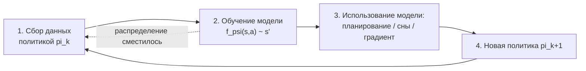

# Вопрос 16. Линейно-квадратичный регулятор и его итеративная версия. Общая схема Model-based RL.

> **Источники:** лекция 15 (`Slides/RL_MIPT_Lecture_15.pdf`, стр. 5, 19–44), конспект [1] (Иванов, «Reinforcement Learning Textbook») § 7.4 «Планирование для непрерывного управления», стр. 183–188; § 7.2 «Обучаемые модели окружения», стр. 173–176; введение к главе 7, стр. 166. Для сверки: S. Levine, CS285, лекции «Optimal Control and Planning» и «Model-Based RL»; Tassa, Erez, Todorov (2012) «Synthesis and Stabilization of Complex Behaviors through Online Trajectory Optimization» (iLQG/DDP); Sutton (1991) «Dyna»; Ha & Schmidhuber (2018) «World Models»; Chua et al. (2018) «PETS»; Hafner et al. (2019–2023) «Dreamer».
> **Пререквизиты:** [Основы: MDP](00-osnovy.md#mdp), [Основы: функции ценности](00-osnovy.md#value), [Основы: градиентный спуск](00-osnovy.md#gradient), [Основы: карта методов курса](00-osnovy.md#taxonomy).
> **Связанные билеты:** [Билет 2](02-bellman-pi-vi.md) — уравнения Беллмана и динамическое программирование (LQR — это ровно DP, разрешённое аналитически); [Билет 15](15-mcts.md) — планирование для **дискретных** действий (MCTS, AlphaZero/MuZero); [Билет 1](01-cem.md) — кросс-энтропийный метод, который используется как «безградиентный» планировщик внутри MPC.

[TOC]

## 1. Зачем это нужно и где стоит в курсе

Все model-free алгоритмы курса (DQN, PPO, SAC) устроены одинаково: агент тыкается в среду и медленно, миллионами шагов, вытаскивает из наград информацию о том, что хорошо. Причина расточительности в том, что агент **не знает физики мира** и вынужден выяснять экспериментально даже тривиальное: если толкнуть тележку вправо, она поедет вправо.

Но во многих задачах модель уже есть или её легко получить: траекторию ракеты считают по уравнениям Ньютона, манипулятор робота описывается уравнениями динамики твёрдого тела, правила шахмат известны точно. Если динамика $s' = f(s,a)$ известна, незачем платить за опыт реальными падениями: можно **прокрутить будущее в голове** и выбрать лучший план.

!!! note Интуиция
    Так работает мысленная репетиция. Перед тем как сказать неприятную фразу начальнику, человек прогоняет разговор в голове несколько раз, оценивает исходы и выбирает формулировку. Он не проводит сто реальных разговоров, чтобы методом Монте-Карло оценить $Q(s,a)$ — он использует внутреннюю модель собеседника. Model-based RL — это ровно попытка дать агенту такую внутреннюю модель.

В [карте курса](00-osnovy.md#taxonomy) это ветка **model-based / planning**. Она распадается на две части. Для **дискретных** действий планировщик строит дерево — это MCTS, [билет 15](15-mcts.md). Для **непрерывных** действий перебирать нечего: действие — вектор из $\mathbb{R}^d$, дерева не построишь. Здесь работает аппарат **оптимального управления**: прямое дифференцирование, LQR и iLQR — это и есть основная тема билета. Вторая тема — что делать, если модель не дана, а выучивается; это общая схема model-based RL, которая объединяет всё вместе.

## 2. Постановка задачи и обозначения

### 2.1. Задача оптимального управления

Считаем, что динамика **известна**, **детерминирована** и **дифференцируема**: $s_{t+1} = f_t(s_t, a_t)$, где $s_t \in \mathbb{R}^n$ — состояние, $a_t \in \mathcal{A} \equiv \mathbb{R}^d$ — действие (непрерывное!), $t = 0, \dots, T-1$ — дискретное время, горизонт $T$ конечен, $\gamma = 1$. Индекс $t$ у функций означает, что мы **не** предполагаем однородность: в оптимальном управлении принято разрешать динамике и стоимости зависеть от времени.

В оптимальном управлении принято не максимизировать награду, а **минимизировать стоимость (cost)** $c_t(s,a)$. Связь тривиальна: $c = -r$, всё «перевёрнуто». Задача:

$$
\min_{a_0, \dots, a_{T-1}} \ \sum_{t=0}^{T-1} c_t(s_t, a_t) + c_T(s_T) \quad \text{при} \quad s_{t+1} = f_t(s_t,a_t), \ s_0 \text{ задано}.
$$

Здесь $c_T(s_T)$ — терминальная стоимость (штраф за то, где мы закончили). Из-за детерминированности динамики выбор действий полностью определяет траекторию, поэтому ищем не стратегию $\pi(a\mid s)$, а **оптимальное управление** — просто набор чисел $a_0 \dots a_{T-1}$, называемый **планом (plan)**.

!!! info Конвенции
    Конспект и слайды пишут то же самое через награду и максимум: $r_t(s,a) = \frac12 [s;a]^\top R_t [s;a] + [s;a]^\top r_t$, матрицы $R_t$ отрицательно определены. (Буква $r_t$ там перегружена: слева это функция награды, справа — вектор её линейного коэффициента; у нас им соответствуют $c_t(s,a)$ и $c_t$.) Все формулы для $K_t, k_t, V_t$ при этом **буквально совпадают** с нашими (условие $\nabla_a Q = 0$ одно и то же), меняется лишь требование знакоопределённости: у нас $C_{aa} \succ 0$ (минимум), у них $R_{aa} \prec 0$ (максимум). Дальше пишу через стоимость — так принято в литературе по управлению и у Левина.

### 2.2. Прямое дифференцирование (shooting) и почему оно плохо

Первое, что приходит в голову: подставить ограничение внутрь функционала. Раскрутим динамику:

$$
J(a_0, \dots, a_{T-1}) = c_0(s_0, a_0) + c_1\big(f_0(s_0,a_0), a_1\big) + c_2\Big(f_1\big(f_0(s_0,a_0),a_1\big), a_2\Big) + \dots
$$

Получилась обычная дифференцируемая функция от вектора всех действий — считаем $\nabla_{a_{0:T-1}} J$ автодифференцированием и делаем градиентный спуск ([Основы: градиент](00-osnovy.md#gradient)). Такой подход называется **shooting method**: мы «выстреливаем» траекторией от $s_0$ и правим прицел. Вычислительный граф при этом в точности как у RNN, развёрнутой на $T$ шагов.

Проблема — **обусловленность**. Действие $a_0$ влияет на все $T$ последующих состояний, действие $a_{T-1}$ — только на последнее. Производные по ранним действиям содержат произведение $T$ якобианов $\prod_t \nabla_s f_t$, и, как в RNN, они либо взрываются, либо затухают экспоненциально. Гессиан такой $J$ плохо обусловлен, градиентный спуск ползёт по нему крошечными шагами, а ландшафт вдобавок полон локальных минимумов. Значит, нужен метод, **учитывающий структуру задачи** — то, что ограничения цепочечные. Такой метод — динамическое программирование, и в линейно-квадратичном случае оно решается аналитически.

## 3. Основная теория

### 3.1. Общая схема model-based RL

Прежде чем разбирать планировщики, зафиксируем общую рамку: откуда вообще берётся модель и как её использовать. Схема (конспект, алгоритм 27) — цикл из четырёх шагов.



**Шаг 1 — собрать данные.** Любой политикой: случайной на первой итерации, текущей дальше. В датасет $\mathcal{D}$ кладутся переходы $(s,a,r,s')$.

**Шаг 2 — обучить модель динамики $\hat f_\psi(s,a)$.** Это обычное обучение с учителем: минимизируем $\sum_{(s,a,s') \in \mathcal{D}} \lVert \hat f_\psi(s,a) - s' \rVert^2$ (и отдельно $\hat r_\psi$, если награда неизвестна). Варианты:

- **детерминированная** $s' \approx \hat f_\psi(s,a)$ — дёшево, но не отражает стохастичность среды;
- **стохастическая** $p_\psi(s' \mid s,a)$, обычно гауссиана с предсказываемыми средним и дисперсией — ловит *алеаторную* неопределённость (шум среды);
- **ансамбль** из $N$ сетей с разной инициализацией — ловит *эпистемическую* неопределённость (незнание модели там, где мало данных). Это ключ к борьбе с model bias, см. ниже; так устроен PETS (Chua et al., 2018);
- **в латентном пространстве**: если $s$ — картинки, сравнивать сгенерированное изображение с реальным по $\ell_2$ бессмысленно. Тогда учат **модель мира (world model)**: автокодировщик (VAE) сжимает наблюдение в компактный вектор $z$, а рекуррентная сеть (RNN) предсказывает динамику уже в пространстве $z$ (Ha & Schmidhuber, 2018). Конспект (опр. 89) определяет модель мира максимально широко: любая модель, явно или неявно обучающаяся динамике среды.

**Шаг 3 — использовать модель.** Три разных способа (сравнение — в таблице §6.1):

- **(а) планирование на лету.** Модель используется как симулятор внутри планировщика, и политикой является сам запуск планировщика. Планировать «один раз на весь эпизод» плохо: модель неточна, а в стохастичной среде даже точное решение задачи планирования может быть неоптимально (конспект, теорема 81). Поэтому используют **планирование с обратной связью**, оно же **MPC (Model Predictive Control)**, оно же **receding horizon**: спланировали $H$ шагов вперёд → **выполнили только первое действие** → увидели реальное $s_1$ → **перепланировали заново**. Внутри MPC планировщиком берут random shooting (насэмплировать сотни случайных планов, выбрать лучший), CEM ([билет 1](01-cem.md) — тот же кросс-энтропийный метод, но оптимизируемая переменная — план, а не веса сети) или iLQR (§3.5);
- **(б) генерация «воображаемых» данных.** Раскручиваем модель, получаем синтетические переходы и обучаем на них обычный model-free алгоритм. Классика — **Dyna** (Sutton, 1991): после каждого реального шага сделать $k$ «мысленных» обновлений Q-функции на переходах из модели; конспект называет это **сновидениями (dreaming)** (опр. 91). Современный представитель — **Dreamer** (Hafner et al.), где актор-критик обучается целиком внутри латентной модели мира. Выигрыш — sample efficiency; цена — wall-clock time: воображаемых траекторий нужно очень много;
- **(в) дифференцирование через модель.** Если $\hat f_\psi$ дифференцируема, прогоняем политику через модель на $H$ шагов и получаем $\nabla_\theta J$ backprop-ом через время. Это ровно прямое дифференцирование из §2.2 со всеми его болезнями, поэтому применяется только на коротких горизонтах.

**Шаг 4 — повторить.** Обучить модель один раз и успокоиться нельзя из-за **сдвига распределения (distribution shift)**: модель точна только там, где бывала политика $\pi_k$, а планировщик находит план, оптимальный **для модели**, и уводит агента ровно туда, где модель не проверялась. Значит, надо сходить в среду новой политикой, дособрать данные именно в этой области и дообучить модель. Цикл обязателен.

!!! warning Главная болезнь: model bias
    Планировщик — это оптимизатор, и он **эксплуатирует ошибки модели**. Если сеть по недоразумению предсказывает, что в углу карты робот получает бесконечную награду, iLQR найдёт этот угол за одну итерацию. Чем сильнее планировщик, тем опаснее неточная модель. Второй эффект — **накопление ошибки**: ошибка на шаг $\varepsilon$ за $H$ шагов раскрутки превращается в нечто вроде $O(\varepsilon \cdot H)$ или хуже, и на горизонте 100 предсказанная траектория не имеет с реальностью ничего общего.

    Лечится тремя приёмами: (1) **ансамбли и оценка неопределённости** — планируем по среднему по ансамблю и штрафуем разброс, тогда агент сам избегает областей, где модель «не уверена»; (2) **короткие rollout'ы** — воображать не 500 шагов, а 5–15, стартуя из реальных состояний буфера; (3) **перепланирование (MPC)** — не доверять плану дальше первого действия.

### 3.2. LQR: постановка

Вернёмся к известной динамике. Возьмём частный случай, где всё считается аналитически: динамика **линейна**, стоимость **квадратична** (hence the name — Linear Quadratic Regulator). Обозначим $z_t := \begin{bmatrix} s_t \\ a_t \end{bmatrix}$ — склеенный вектор состояния и действия. Тогда

$$
f_t(s,a) = F_t z_t + f_t, \qquad c_t(s,a) = \tfrac12 z_t^\top C_t z_t + c_t^\top z_t .
$$

$F_t$ — матрица $n \times (n+d)$ (выход $f$ — вектор состояния), $f_t$ — вектор сдвига; частный случай — привычная запись $s_{t+1} = A_t s_t + B_t a_t$, то есть $F_t = [A_t \ \ B_t]$, $f_t = 0$. $C_t$ — симметричная матрица $(n{+}d)\times(n{+}d)$, $c_t$ — вектор; частный случай — $c = \frac12 s^\top Q s + \frac12 a^\top R a$ («не уходи далеко от нуля и не трать много топлива»), то есть $C_t = \mathrm{diag}(Q, R)$. Свободный член квадратичной формы опускаем: он не зависит от траектории и на оптимум не влияет.

Разобьём $C_t$ и $c_t$ на блоки по состоянию и действию:

$$
C_t = \begin{bmatrix} C_{t,ss} & C_{t,sa} \\ C_{t,as} & C_{t,aa}\end{bmatrix}, \qquad c_t = \begin{bmatrix} c_{t,s} \\ c_{t,a}\end{bmatrix}, \qquad C_{t,sa} = C_{t,as}^\top .
$$

Предполагаем $C_{t,aa} \succ 0$ (положительно определена) — иначе минимума по действию нет.

### 3.3. LQR: вывод обратного прохода — суть билета

Работает обычное динамическое программирование «с конца» ([билет 2](02-bellman-pi-vi.md)): LQR — это Value Iteration с конечным горизонтом, в котором все $\min$ берутся в замкнутом виде. Ключевое наблюдение:

> **Утверждение.** Для всех $t$ функция $V_t^*(s)$ — квадратичная форма от $s$, функция $Q_t^*(s,a)$ — квадратичная форма от $z = [s;a]$, а оптимальное действие $a_t^*$ — **линейная** функция от $s_t$.

Доказывается индукцией назад по $t$; база — $V_T(s) = c_T(s)$ квадратична по предположению (если терминальной стоимости нет, $V_T \equiv 0$). Разберём **один шаг индукции** — это и есть то, что просят у доски.

**Шаг 1. Предположение индукции.** Пусть уже известно

$$
V_{t+1}(s') = \tfrac12 (s')^\top V_{t+1,ss}\, s' + v_{t+1,s}^\top s' + \mathrm{const}.
$$

**Шаг 2. Строим $Q_t$.** По уравнению Беллмана для детерминированной среды $Q_t(s,a) = c_t(s,a) + V_{t+1}(f_t(s,a))$. Подставляем линейную динамику $s' = F_t z + f_t$ внутрь квадратичной формы — подстановка линейного в квадратичное оставляет квадратичное:

$$
\begin{aligned}
V_{t+1}(F_t z + f_t) &= \tfrac12 (F_t z + f_t)^\top V_{t+1,ss}(F_t z + f_t) + v_{t+1,s}^\top (F_t z + f_t) \\
&= \tfrac12 z^\top F_t^\top V_{t+1,ss} F_t z \; + \; z^\top \big(F_t^\top V_{t+1,ss} f_t + F_t^\top v_{t+1,s}\big) + \mathrm{const}.
\end{aligned}
$$

Складывая с $c_t(z)$, получаем снова квадратичную форму $Q_t(z) = \frac12 z^\top Q_t z + q_t^\top z + \mathrm{const}$, где

$$
\boxed{\;Q_t = C_t + F_t^\top V_{t+1,ss} F_t, \qquad q_t = c_t + F_t^\top V_{t+1,ss} f_t + F_t^\top v_{t+1,s}.\;}
$$

**Шаг 3. Минимизируем по действию.** Берём градиент квадратичной формы по блоку действий и приравниваем нулю:

$$
\nabla_a Q_t(s,a) = Q_{t,as}\, s + Q_{t,aa}\, a + q_{t,a} = 0
\quad \Longrightarrow \quad
a_t^* = -Q_{t,aa}^{-1}\big(Q_{t,as}\, s + q_{t,a}\big).
$$

Это **линейная** функция от $s$. Вводим стандартные обозначения:

$$
\boxed{\;K_t := -Q_{t,aa}^{-1} Q_{t,as}, \qquad k_t := -Q_{t,aa}^{-1} q_{t,a}, \qquad a_t^* = K_t s_t + k_t. \;}
$$

Обращать приходится матрицу размера $d \times d$, где $d$ — размерность действия; в задачах управления обычно $d \lesssim 100$, так что это не страшно.

**Шаг 4. Получаем $V_t$.** Подставляем $a^* = K_t s + k_t$ обратно в $Q_t$ — линейное в квадратичное, снова квадратичное:

$$
V_t(s) = Q_t(s, K_t s + k_t) = \tfrac12 s^\top V_{t,ss} s + v_{t,s}^\top s + \mathrm{const},
$$

$$
\begin{aligned}
V_{t,ss} &= Q_{t,ss} + Q_{t,sa} K_t + K_t^\top Q_{t,as} + K_t^\top Q_{t,aa} K_t, \\
v_{t,s} &= q_{t,s} + Q_{t,sa} k_t + K_t^\top q_{t,a} + K_t^\top Q_{t,aa} k_t .
\end{aligned}
$$

Откуда берётся каждое слагаемое в $v_{t,s}$: подставив $a=K_ts+k_t$, линейный по $s$ вклад дают перекрёстные члены $\frac12 s^\top Q_{sa}a$ и $\frac12 a^\top Q_{as}s$ (вместе $Q_{sa}k_t$), квадратичный член $\frac12 a^\top Q_{aa}a$ (даёт $K_t^\top Q_{aa}k_t$), линейный член $q_a^\top a$ (даёт $K_t^\top q_{t,a}$) и, наконец, сам $q_s^\top s$. Индукция замкнулась: $V_t$ снова квадратична, можно делать шаг $t-1$. ∎

!!! warning Сверка с конспектом
    В алгоритме 29 конспекта строка для $v_t$ извлекается из PDF испорченной ($v_t := Q_{t,sa}k_T + q_t^\top K_t^\top q_t$ — так формула просто не собирается по размерностям). Правильная — та, что выписана выше; её легко получить самому подстановкой $a=K_ts+k_t$, и она совпадает с CS285 С. Левина. Ещё одно расхождение чисто техническое: конспект нумерует шаги $t=1\dots T$ и пишет $F_{t+1},V_{t+1}$ там, где у нас $F_t,V_{t+1}$ — это сдвиг индексации на единицу, а не разные формулы.

**Что мы получили.** Оптимальный контроллер — **линейная обратная связь (linear feedback)** $a_t = K_t s_t + k_t$, а не просто набор чисел. Это важно: контроллер реагирует на состояние. Если систему толкнуло в сторону, $K_t s_t$ автоматически скорректирует действие, тогда как «план из чисел» продолжил бы выполнять заготовленную последовательность.

!!! info Уравнение Риккати
    В однородном случае ($F_t \equiv [A\ B]$, $C_t \equiv \mathrm{diag}(Q,R)$, $f_t = 0$, $c_t = 0$) рекурсия на $V_{t,ss}$ превращается в **разностное уравнение Риккати (Riccati equation)**, а при $T \to \infty$ — в его стационарную версию, дискретное алгебраическое уравнение Риккати $P = Q + A^\top P A - A^\top P B\,(R + B^\top P B)^{-1} B^\top P A$. Его решение $P$ даёт **постоянный** во времени контроллер $K = -(R + B^\top P B)^{-1}B^\top P A$. Именно такие регуляторы стоят в автопилотах и стабилизаторах — это и есть «ЛКР» из классической теории управления.

### 3.4. Шумная динамика: почему контроллер не меняется

Пусть среда стохастична, но специальным образом: $s_{t+1} \sim \mathcal{N}\big(F_t z_t + f_t,\ \Sigma_t\big)$, то есть $s_{t+1} = A s_t + B a_t + \varepsilon$, $\varepsilon \sim \mathcal{N}(0,\Sigma_t)$, причём ковариация $\Sigma_t$ зависит только от времени, но **не** от состояния и действия («шум сенсоров», одинаковый по всему пространству).

**Теорема.** При таком предположении схема LQR остаётся неизменной: те же $K_t, k_t$.

*Идея доказательства.* Меняется только связь $Q$ и $V$: теперь $Q_t(s,a) = c_t(s,a) + \mathbb{E}_{s'}\,V_{t+1}(s')$. Нужно взять матожидание квадратичной формы по гауссиане, а оно (matrix cookbook, ур. 318) равно

$$
\mathbb{E}_{s' \sim \mathcal{N}(\mu,\Sigma)} \big[(s')^\top V s'\big] = \mathrm{Tr}(V\Sigma) + \mu^\top V \mu, \qquad \mu = F_t z_t + f_t .
$$

Поэтому $\mathbb{E}_{s'} V_{t+1}(s') = V_{t+1}(\mu) + \frac12\mathrm{Tr}(V_{t+1,ss}\Sigma_t)$. Второе слагаемое — **константа**: оно не зависит ни от $s_t$, ни от $a_t$ (именно потому, что $\Sigma_t$ от них не зависит). Константа не влияет ни на $\arg\min$ по $a$, ни на матрицы $Q_t, q_t$. ∎

Содержательно это **принцип эквивалентности достоверности (certainty equivalence)**: оптимально управлять шумной линейной системой так же, как если бы шума не было и мы всегда попадали в среднее. Свойство редкое и хрупкое — оно ломается, как только $\Sigma$ начинает зависеть от $a$ (тогда становится выгодно выбирать «менее шумные» действия) или стоимость перестаёт быть квадратичной.

### 3.5. iLQR: что делать, когда всё нелинейно

Реальные $f$ и $c$ не линейны и не квадратичны. Идея — стандартная для численной оптимизации: **локально аппроксимировать** задачу такой, которую умеем решать точно, сделать шаг, перецентрироваться, повторить.

Пусть есть текущая **номинальная траектория** $\hat s_0, \hat a_0, \hat s_1, \dots, \hat s_T$ (на первой итерации — от случайного или нулевого плана, честно прогнанного через настоящую $f$). Разложим в окрестности неё: $f$ — в ряд Тейлора до первого члена, $c$ — до второго.

$$
\delta s_t := s_t - \hat s_t, \quad \delta a_t := a_t - \hat a_t, \qquad
\delta s_{t+1} \approx \nabla_s f_t \cdot \delta s_t + \nabla_a f_t \cdot \delta a_t ,
$$

$$
c_t(s_t,a_t) \approx \tfrac12 \begin{bmatrix}\delta s_t \\ \delta a_t\end{bmatrix}^\top \nabla^2_{s,a} c_t(\hat s_t, \hat a_t) \begin{bmatrix}\delta s_t \\ \delta a_t\end{bmatrix} + \nabla_{s,a} c_t(\hat s_t,\hat a_t)^\top \begin{bmatrix}\delta s_t \\ \delta a_t\end{bmatrix}.
$$

То есть берём $F_t := \nabla_{s,a} f_t(\hat s_t, \hat a_t)$ (якобиан), $C_t := \nabla^2_{s,a} c_t(\hat s_t, \hat a_t)$ (гессиан), $c_t := \nabla_{s,a} c_t(\hat s_t, \hat a_t)$ (градиент) — и получаем **ровно задачу LQR, но в переменных отклонений** $\delta s, \delta a$. Прогоняем обратный проход, получаем $\delta a_t = K_t \delta s_t + k_t$.

Дальше **прямой проход**, и вот тут два тонких момента.

**Момент первый.** Прямой проход делается по **настоящим** $f$ и $c$, а не по их разложениям: иначе мы бы просто верили аппроксимации и никогда не исправляли её ошибку. Действие берётся как

$$
a_t = \hat a_t + K_t(s_t - \hat s_t) + \alpha\, k_t .
$$

Конспект записывает то же самое компактнее, спрятав перецентровку в свободный член: $k_t \leftarrow k_t - K_t \hat s_t + \hat a_t$.

**Момент второй.** Множитель $\alpha \in (0,1]$ — **линейный поиск (line search)**. Тейлор точен лишь в малой окрестности; если шагнуть далеко, новая траектория может оказаться **хуже** старой. Поэтому пробуют $\alpha = 1, 0.5, 0.25, \dots$, пока суммарная реальная стоимость не уменьшится. Важно, что $\alpha$ домножает только $k_t$ (сдвиг), но не $K_t$: обратная связь нужна полной, иначе траектория расползётся.

Полученная траектория становится новой номинальной, и всё повторяется до сходимости.

!!! tip Связь с методом Ньютона
    iLQR — это **Гаусс–Ньютон** для задачи оптимального управления: он использует вторые производные стоимости, но только первые производные динамики. Полный Ньютон учитывал бы ещё и вторые производные $f$ (это тензор $n \times (n{+}d) \times (n{+}d)$) — такой вариант называется **DDP (Differential Dynamic Programming)**. DDP сходится быстрее в окрестности решения, но считать и хранить тензор дорого, поэтому на практике почти всегда берут iLQR. Отсюда же берётся стандартный приём **регуляризации**: если $Q_{t,aa}$ близка к вырожденной или не положительно определена, используют $Q_{t,aa} + \mu I$ — это в точности демпфирование Левенберга–Марквардта, которое при большом $\mu$ превращает шаг iLQR в маленький градиентный шаг.

**Как iLQR живёт в RL.** Как планировщик внутри **MPC**: на каждом реальном шаге делаем несколько итераций iLQR на горизонт $H$, выполняем первое действие, перепланируем с тёплого старта. В model-based RL: если $f$ неизвестна, подставляем выученную $\hat f_\psi$ — раз это нейросеть, $F_t$ считается автодифференцированием. Наконец, локальные контроллеры iLQR можно дистиллировать в одну глобальную нейросетевую политику — на этом построен **Guided Policy Search**.

## 4. Алгоритмы

### 4.1. LQR

```text
LQR — обратный проход (backward pass)
Вход: F_t, f_t (динамика), C_t, c_t (стоимость), t = 0..T-1; терминальная стоимость C_T, c_T
1. Инициализация: V_{T,ss} := C_T,  v_{T,s} := c_T   (коэффициенты терминальной стоимости
                                          c_T(s) = 1/2 s^T C_T s + c_T^T s, только по состоянию:
                                          C_T размера n x n, c_T размера n;
                                          если терминальной стоимости нет — нули)
2. for t = T-1, T-2, ..., 0:
     a) Q-функция шага:
          Q_t := C_t + F_t^T V_{t+1,ss} F_t
          q_t := c_t + F_t^T V_{t+1,ss} f_t + F_t^T v_{t+1,s}
     b) контроллер (минимум квадратичной формы по действию):
          K_t := -(Q_{t,aa})^{-1} Q_{t,as}
          k_t := -(Q_{t,aa})^{-1} q_{t,a}
     c) V-функция шага:
          V_{t,ss} := Q_{t,ss} + Q_{t,sa} K_t + K_t^T Q_{t,as} + K_t^T Q_{t,aa} K_t
          v_{t,s}  := q_{t,s}  + Q_{t,sa} k_t + K_t^T q_{t,a}  + K_t^T Q_{t,aa} k_t
Выход: контроллер pi_t(s) = K_t s + k_t для всех t
```

```text
LQR — прямой проход (forward pass)
Вход: K_t, k_t; динамика f; начальное состояние s_0
for t = 0, 1, ..., T-1:
     1. a_t := K_t s_t + k_t
     2. s_{t+1} := f_t(s_t, a_t)
Выход: план a_0, a_1, ..., a_{T-1} и траектория s_0..s_T
```

Обратный проход отвечает на вопрос «сколько будет стоить остаток эпизода, если я сейчас в $s$», и, поскольку ответ всегда квадратичен, его удаётся хранить двумя объектами $V_{ss}, v_s$ вместо целой функции. Прямой проход применяет найденный контроллер: раз динамика детерминирована и $s_0$ известно, траектория восстанавливается однозначно.

### 4.2. iLQR

```text
iLQR
Вход: f (динамика), c (стоимость), s_0, число итераций N
Инициализировать номинальную траекторию (ŝ_t, â_t): прогнать нулевой/случайный план через настоящую f
На каждой итерации 1..N:
  1. Линеаризация/квадратизация вокруг (ŝ_t, â_t) для всех t:
         F_t := grad_{s,a} f(ŝ_t, â_t)       # якобиан динамики
         C_t := hess_{s,a} c(ŝ_t, â_t)       # гессиан стоимости
         c_t := grad_{s,a} c(ŝ_t, â_t)       # градиент стоимости
     (при необходимости регуляризация: Q_{t,aa} += mu * I)
  2. Обратный проход LQR с (F_t, C_t, c_t) -> K_t, k_t   # в переменных отклонений
  3. Прямой проход с линейным поиском:
         для alpha из {1, 0.5, 0.25, ...}:
             s_0' := s_0
             for t = 0..T-1:
                 a_t' := â_t + K_t (s_t' - ŝ_t) + alpha * k_t
                 s_{t+1}' := f(s_t', a_t')          # НАСТОЯЩАЯ динамика
             если суммарная настоящая стоимость уменьшилась — принять и выйти из цикла по alpha
  4. (ŝ, â) := (s', a')
Выход: план â_0 ... â_{T-1} и локальный контроллер K_t, k_t
```

### 4.3. Общая схема model-based RL

```text
Model-Based RL (конспект, алгоритм 27)
Гиперпараметры: способ использования модели (планировщик / сны / backprop), архитектура модели
Инициализировать модель psi случайно, датасет D пустым, политику pi_0 случайной
На итерации k = 0, 1, 2, ...:
  1. Собрать данные: прогнать pi_k в РЕАЛЬНОЙ среде, добавить переходы (s,a,r,s') в D
  2. Дообучить модель: minimize_psi  sum_{(s,a,s') in D} || f_psi(s,a) - s' ||^2
     (и r_psi, если награда неизвестна; для ансамбля — обучить N моделей на бутстрэпе D)
  3. Получить pi_{k+1}, используя модель:
        (а) pi_{k+1} := MPC-планировщик (CEM / random shooting / iLQR) поверх f_psi; или
        (б) сгенерировать короткие воображаемые rollout'ы из состояний D и обучить на них
            model-free алгоритм (Dyna / Dreamer); или
        (в) продифференцировать сумму наград по theta через f_psi (backprop through time)
  4. goto 1   # обязательно: распределение состояний изменилось, модель надо дообучить
```

## 5. Пример: скалярный LQR с числами

Система: $s_{t+1} = s_t + a_t$ (один шаг «интегратора»: действие — приращение). Стоимость $c(s,a) = s^2 + a^2$ на шагах $t=0,1$ плюс терминальная $c_2(s) = s^2$. Горизонт $T = 2$, старт $s_0 = 1$. Содержательно: «приведи систему в ноль, но не дёргай ручку слишком сильно».

Для скалярного случая удобно писать $V_t(s) = p_t s^2$.

**Инициализация.** $V_2(s) = s^2$, то есть $p_2 = 1$.

**Шаг $t=1$.**

$$
Q_1(s,a) = \underbrace{s^2 + a^2}_{c} + \underbrace{p_2 (s+a)^2}_{V_2(f(s,a))} = 2s^2 + 2sa + 2a^2 .
$$

Минимизируем по $a$: $\partial_a Q_1 = 2s + 4a = 0 \Rightarrow a = -\tfrac12 s$. Значит

$$
K_1 = -\tfrac12, \qquad k_1 = 0 .
$$

(Сверка с общей формулой: в записи $\frac12 z^\top Q_1 z$ имеем $Q_{1,aa} = 4$, $Q_{1,as} = 2$, и $K_1 = -Q_{1,aa}^{-1}Q_{1,as} = -2/4 = -1/2$.)

Подставляем обратно: $V_1(s) = 2s^2 - s^2 + \tfrac12 s^2 = \tfrac32 s^2$, то есть $p_1 = 1.5$.

**Шаг $t=0$.**

$$
Q_0(s,a) = s^2 + a^2 + 1.5(s+a)^2 = 2.5 s^2 + 3sa + 2.5a^2 .
$$

$\partial_a Q_0 = 3s + 5a = 0 \Rightarrow a = -0.6\,s$, то есть

$$
K_0 = -0.6, \qquad k_0 = 0, \qquad V_0(s) = 1.6\, s^2 .
$$

**Прямой проход из $s_0 = 1$.**

| $t$ | $s_t$ | $K_t$ | $a_t = K_t s_t$ | $s_{t+1} = s_t + a_t$ | стоимость шага |
|---|---|---|---|---|---|
| 0 | 1.0 | $-0.6$ | $-0.6$ | 0.4 | $1 + 0.36 = 1.36$ |
| 1 | 0.4 | $-0.5$ | $-0.2$ | 0.2 | $0.16 + 0.04 = 0.20$ |
| 2 | 0.2 | — | — | — | $0.04$ (терминальная) |

Суммарная стоимость $1.36 + 0.20 + 0.04 = 1.6$ — ровно $V_0(1) = 1.6\cdot 1^2$, как и должно быть. Для сравнения: «ничего не делать» ($a \equiv 0$) стоит $3$, «обнулить состояние сразу» ($a_0 = -1$) стоит $2$. Оптимум — компромисс: гасить состояние постепенно. Два поучительных эффекта: $\lvert K_1\rvert < \lvert K_0 \rvert$ (ближе к концу эпизода будущего меньше, стимул тратиться на управление слабее) и $k_t = 0$ при всех $t$ (задача симметрична относительно нуля; ненулевые $k_t$ появляются при сдвиге $f_t$ или линейном члене в стоимости).

## 6. Подводные камни, сравнения, типичные ошибки

### 6.1. Способы использования модели

| Способ | Плюсы | Минусы | Примеры |
|---|---|---|---|
| Планирование на лету (MPC) | Нет обучения политики; мгновенно адаптируется к новой цели/награде; ошибка модели гасится перепланированием | Очень дорого на каждом шаге принятия решения; нужна дифференцируемость (iLQR) или много сэмплов (CEM) | iLQR-MPC, PETS, random shooting |
| «Сны» — данные для model-free | Резкий рост sample efficiency; можно взять любой готовый алгоритм (SAC, DQN) | Model bias: алгоритм учится на выдуманном опыте; wall-clock time растёт | Dyna, MBPO, Dreamer |
| Backprop через модель | Прямой градиент по $\theta$, теоретически самый информативный сигнал | Затухающие/взрывающиеся градиенты, плохая обусловленность (та же болезнь, что в §2.2) | SVG, PILCO, короткие горизонты в Dreamer |
| Модель как признаки (латентное пространство) | Убирает лишнюю информацию из наблюдений; помогает даже model-free | Не даёт планирования само по себе | World Models (VAE+RNN), автокодировщик отдельно от RL |

### 6.2. Model-based vs model-free

| | Model-based | Model-free |
|---|---|---|
| Sample efficiency | Высокая: $10^3$–$10^5$ шагов | Низкая: $10^6$–$10^8$ шагов |
| Асимптотическое качество | Обычно **ниже**: упирается в потолок точности модели | Обычно **выше**: оптимизируется настоящая награда |
| Вычислительная стоимость | Высокая (планирование на каждом шаге / генерация снов) | Ниже, один прямой проход сети |
| Перенос на новую цель | Лёгкий: модель не зависит от награды, меняем только $c$ | Нужно переучивать всё |
| Где применяют | Робототехника, где реальные шаги дороги; управление непрерывными системами | Симуляторы, игры, где шаги дёшевы |

### 6.3. Сравнение планировщиков

| | LQR | iLQR | MPC + CEM | MCTS | Model-free (SAC/PPO) |
|---|---|---|---|---|---|
| Действия | непрерывные | непрерывные | непрерывные | дискретные | любые |
| Нужна модель | да, точная линейная | да, дифференцируемая | да, достаточно симулятора | да, симулятор | нет |
| Нужны производные | нет (даны матрицы) | **да** (якобиан $f$, гессиан $c$) | нет | нет | по политике, не по среде |
| Горизонт | конечный $T$ (или $\infty$ через Риккати) | конечный $T$ | короткий $H$, скользящий | глубина дерева | бесконечный, через $\gamma$ |
| Решение | глобально оптимальное | **локальное** | локальное, стохастический поиск | асимптотически оптимальное | глобальная политика |
| Выход | контроллер $K_t s + k_t$ | план + локальный контроллер | первое действие | первое действие | политика $\pi_\theta(a\mid s)$ |
| Билет | 16 | 16 | 16 + [1](01-cem.md) | [15](15-mcts.md) | 7–12 |

### 6.4. Подводные камни

!!! warning iLQR находит только локальный минимум
    Метод сходится к траектории, локально оптимальной относительно начального приближения. Если робота нужно провести в обход препятствия, а начальный план шёл «сквозь» него, iLQR будет упорно оптимизировать проход сквозь стену. Лечение — многократный запуск из разных инициализаций, тёплый старт от разумной эвристики или комбинация со стохастическим глобальным поиском (CEM).

!!! warning Ограничения на действия LQR не видит
    Формула $a = K s + k$ выдаёт что угодно, в том числе тягу в 10 раз больше максимальной. Простое обрезание (клиппинг) ломает оптимальность и может дестабилизировать систему. Корректные решения — box-DDP (учёт активных ограничений при минимизации по $a$), штраф за выход за границы прямо в $c(s,a)$ или численные методы с ограничениями.

!!! warning Чувствительность к модели и размерность
    Всё построение опирается на правильность $f$. С выученной $\hat f_\psi$ качество плана определяется точностью модели именно там, куда план уводит, — а там данных меньше всего (model bias, §3.1). Плюс вычисления: обратный проход обращает $Q_{t,aa}$ ($d\times d$) на каждом из $T$ шагов, а линеаризация требует гессиана стоимости размера $(n{+}d)^2$. Для $n \sim 10^4$ (картинки) это неприменимо напрямую — отсюда интерес к латентным моделям мира, где планируют в пространстве размерности 30–200.

!!! warning Типичные ошибки на экзамене
    (1) Сказать, что LQR даёт «план из чисел» — нет, он даёт **обратную связь** $K_t s_t + k_t$. (2) Перепутать направление проходов: контроллер считается **назад**, траектория — **вперёд**. (3) Забыть, что в forward pass iLQR используются **настоящие** $f, c$, а не их разложения. (4) Сказать, что certainty equivalence верна всегда — она верна только для аддитивного гауссова шума с ковариацией, не зависящей от $s,a$.

## 7. Ответ за 5 минут

1. **Задача.** Известна детерминированная дифференцируемая динамика $s_{t+1} = f_t(s_t,a_t)$ и стоимость $c_t = -r_t$, действия непрерывны. Минимизируем $\sum_t c_t(s_t,a_t)$ по плану $a_{0:T-1}$. Это **планирование**, обучения здесь нет.
2. **Наивно (shooting).** Подставить динамику внутрь и дифференцировать по всем действиям: граф как у RNN длины $T$ ⟹ затухающие/взрывающиеся градиенты, локальные минимумы.
3. **Идея LQR.** Пусть $f$ линейна ($F_t z + f_t$, $z = [s;a]$), $c$ квадратична ($\frac12 z^\top C_t z + c_t^\top z$). Тогда DP с конца решается аналитически.
4. **Индукция.** $V_{t+1}$ квадратична ⟹ $Q_t = c_t + V_{t+1}(F_t z + f_t)$ квадратична (линейное в квадратичное), матрицы: $Q_t = C_t + F_t^\top V_{t+1,ss}F_t$, $q_t = c_t + F_t^\top V_{t+1,ss}f_t + F_t^\top v_{t+1,s}$.
5. **Минимум по действию.** $\nabla_a Q_t = Q_{as}s + Q_{aa}a + q_a = 0 \Rightarrow a_t = K_t s_t + k_t$, где $K_t = -Q_{aa}^{-1}Q_{as}$, $k_t = -Q_{aa}^{-1}q_a$. Подстановка обратно даёт квадратичную $V_t$ — индукция замкнулась.
6. **Итог.** Обратный проход $t = T{-}1 \dots 0$ даёт контроллеры $K_t, k_t$; прямой проход из $s_0$ даёт траекторию. Оптимальное управление — **линейная обратная связь**. В бесконечном горизонте рекурсия на $V_{ss}$ — уравнение Риккати, контроллер постоянный.
7. **Шум.** $s' \sim \mathcal{N}(F z + f, \Sigma_t)$ ничего не меняет: $\mathbb{E}[(s')^\top V s'] = \mathrm{Tr}(V\Sigma) + \mu^\top V\mu$, лишний член — константа. Принцип certainty equivalence.
8. **iLQR.** Нелинейный случай: вокруг номинальной траектории раскладываем $f$ в Тейлора до 1-го члена, $c$ — до 2-го, решаем LQR **в отклонениях** $\delta s, \delta a$, делаем forward pass по **настоящим** $f,c$ с $a_t = \hat a_t + K_t\delta s_t + \alpha k_t$ (line search), повторяем. Это Гаусс–Ньютон; полный Ньютон со вторыми производными $f$ — DDP.
9. **Схема model-based RL.** (1) собрать данные → (2) обучить $\hat f_\psi$ supervised (детерминированная / стохастическая / ансамбль / латентная, как World Models) → (3) использовать: MPC-планирование, «сны» (Dyna, Dreamer) или backprop через модель → (4) снова собрать данные новой политикой (distribution shift!) и повторить.
10. **Главная проблема.** Model bias: планировщик эксплуатирует ошибки модели, а ошибка накапливается по горизонту. Лечится ансамблями с оценкой неопределённости, короткими rollout'ами и перепланированием (MPC).
11. **Выбор.** Непрерывные действия + дифференцируемая модель ⟹ iLQR; дискретные действия ⟹ MCTS ([билет 15](15-mcts.md)); нужна асимптотика и шаги дёшевы ⟹ model-free.

## 8. Вероятные допвопросы экзаменатора

**Почему решение LQR — линейная обратная связь, а не просто набор чисел?**
Потому что $V_{t+1}$ квадратична, значит $Q_t$ квадратична по $[s;a]$, а условие $\nabla_a Q_t = 0$ — линейное уравнение относительно $a$ с коэффициентом при $s$. Отсюда $a = K s + k$. Содержательно это лучше плана из чисел: контроллер реагирует на отклонение состояния и сам себя стабилизирует.

**Зачем обратный проход, если можно просто продифференцировать по действиям?**
Можно, но получается shooting: вычислительный граф длины $T$, градиенты взрываются или затухают, гессиан ужасно обусловлен. Обратный проход эксплуатирует структуру задачи (цепочечные ограничения) и решает локальную аппроксимацию **точно** за один проход, а не итеративно.

**Чем iLQR отличается от DDP?**
iLQR линеаризует динамику (только первые производные $f$) и квадратизует стоимость — это Гаусс–Ньютон. DDP дополнительно берёт вторые производные динамики (тензор) — это полный метод Ньютона. DDP сходится быстрее у оптимума, но тензор дорого считать и хранить, поэтому на практике почти всегда iLQR.

**Почему гауссов шум в динамике не меняет контроллер?**
Матожидание квадратичной формы по гауссиане равно $\mathrm{Tr}(V\Sigma) + \mu^\top V\mu$. Первый член не зависит ни от $s$, ни от $a$ (ковариация постоянна по предположению), то есть это аддитивная константа, а константа не влияет на $\arg\min$. Ломается это сразу, как только $\Sigma$ зависит от действия: тогда выгодно выбирать менее шумные действия.

**Что такое MPC и зачем перепланировать на каждом шаге?**
Model Predictive Control: планируем на горизонт $H$, выполняем только первое действие, наблюдаем реальное следующее состояние и планируем заново. Нужно по двум причинам: (1) в стохастичной среде точное решение задачи планирования вообще может быть неоптимальным (конспект, теорема 81) — план не умеет ветвиться по исходам; (2) модель неточна, и перепланирование из реального состояния обнуляет накопленную ошибку предсказания.

**В чём главная проблема model-based RL?**
Model bias вкупе со сдвигом распределения. Модель точна только там, где собраны данные; планировщик — оптимизатор, поэтому он целенаправленно ищет и эксплуатирует области, где модель ошибочно обещает высокую награду. Отсюда обязательность итеративного цикла «спланировал → сходил в реальную среду → дообучил модель» и приёмы с ансамблями и короткими rollout'ами.

**Как связаны Dyna и реплей-буфер?**
Реплей-буфер переигрывает **реальные** прошлые переходы; Dyna дополнительно генерирует **синтетические** переходы из модели, в том числе для пар $(s,a)$, которых агент не пробовал. Реплей-буфер — вырожденная «непараметрическая модель», умеющая воспроизводить только виденное; выученная модель обобщает на невиданное, но платит за это риском ошибиться. Кстати, для непрерывных действий MCTS не годится ровно потому, что перебирать в $\mathbb{R}^d$ нечего ([билет 15](15-mcts.md)).

**LQR — это же просто динамическое программирование?**
Да, буквально: это Value Iteration с конечным горизонтом ([билет 2](02-bellman-pi-vi.md)). Уникальность в том, что для линейно-квадратичного класса все шаги DP берутся в замкнутой форме, поэтому «таблица» ценностей сжимается до пары $V_{ss}, v_s$ на каждый момент времени, и непрерывность пространств перестаёт быть препятствием.
