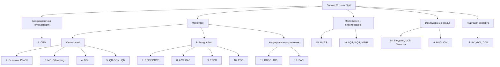
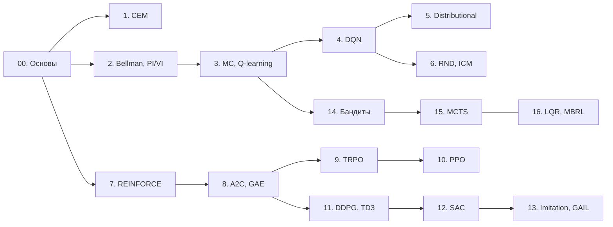

# Ответы к экзамену по обучению с подкреплением

Это набор развёрнутых письменных ответов на все 16 вопросов устного экзамена по курсу **«Обучение с подкреплением»** (МФТИ, ФПМИ, весна–лето 2026, лектор Н. Е. Юдин). Каждый ответ — самостоятельный файл: формулировка вопроса, зачем метод нужен, строгая постановка, теория с выкладками, псевдокод, числовой пример, подводные камни и сжатый план ответа у доски.

Набор писался для человека, который **слабо знаком с ML и RL** и хочет понять, а не заучить. Поэтому порядок изложения всюду один и тот же: сначала интуиция и бытовая аналогия, потом формула, потом словами — что эта формула говорит. Каждая буква объясняется при первом появлении; всё общее (MDP, $V$/$Q$/$A$, bias–variance, KL, реплей-буфер) вынесено в отдельный файл пререквизитов, чтобы не повторяться шестнадцать раз.

**Как читать.** Начните с [**00-osnovy.md**](00-osnovy.md) — без него билеты не читаются. Дальше идите по билетам в порядке, предложенном ниже (он отличается от номеров: зависимости между темами важнее нумерации). Каждый билет заканчивается двумя разделами для последнего дня перед экзаменом — **«Ответ за 5 минут»** и **«Вероятные допвопросы экзаменатора»**; см. раздел «Как готовиться» ниже.

**Что нужно для рендера.** Файлы используют KaTeX-формулы, диаграммы Mermaid и адмонишены. Всё это разом умеет **VS Code + расширение Markdown Preview Enhanced (MPE)**: откройте файл и нажмите `Ctrl+K V`. В штатном превью VS Code и на GitHub формулы и адмонишены отрендерятся не полностью — диаграммы будут, адмонишены превратятся в текст.

## Легенда адмонишенов

| Блок | Что внутри |
|---|---|
| `!!! note` **Интуиция** | Объяснение «на пальцах» или бытовая аналогия — то, что стоит понять до формулы. |
| `!!! tip` **Как запомнить / Практический совет** | Мнемоника, удобная формулировка, совет по реализации. |
| `!!! warning` **Типичная ошибка / Подводный камень** | Место, где обычно ошибаются: знак, индекс, неверная интуиция, случай, когда метод не работает. |
| `!!! question` **На экзамене спросят** | Конкретный вопрос экзаменатора и правильный ответ на него. |
| `!!! example` **Пример** | Числовой или игровой пример с конкретными значениями. |
| `!!! info` **Историческая справка / Связь с другими темами** | Откуда метод взялся и как связан с соседними билетами. |

## Оглавление

Обозначения источников: «лекция N» — `Slides/RL_MIPT_Lecture_N.pdf`; «[1] §X» — конспект Иванова, разделы X. Столбец «Источники» воспроизводит то, что указано в самом списке вопросов (`Exam/Questions.pdf`); внутри каждого билета в шапке источники расписаны подробнее, со страницами.

| № | Билет | Формулировка вопроса | Источники |
|---|---|---|---|
| 0 | [Основы](00-osnovy.md) | *Пререквизиты: MDP, траектории, $V/Q/A$, Монте-Карло, bias–variance, on/off-policy, exploration.* | лекция 1, начало лекции 2; [1] гл. 1, §3.1, §3.4.6–3.4.7 |
| 1 | [01-cem.md](01-cem.md) | Кросс-энтропийный метод в общем виде. Его применение для решения задач оптимизации и задач обучения с подкреплением. | лекция 1; [1] гл. 1–2 (§2.2) |
| 2 | [02-bellman-pi-vi.md](02-bellman-pi-vi.md) | Уравнения Беллмана для функций ценности. Алгоритмы Policy/Value Iteration. | лекция 2; [1] §3.1–3.3 |
| 3 | [03-mc-q-learning.md](03-mc-q-learning.md) | Табличные методы: Монте-Карло, Q-learning. | лекция 3; [1] §3.4–3.5 |
| 4 | [04-dqn.md](04-dqn.md) | Алгоритм DQN и его модификации: Double DQN, приоритезированный буфер, дуэльная архитектура, шумные сети, многошаговый DQN, память. | лекция 4; [1] §4.1–4.2 |
| 5 | [05-distributional.md](05-distributional.md) | Distributional подход в RL. Алгоритм QR-DQN. Алгоритм Implicit Quantile Networks. | лекция 5; [1] §4.3 |
| 6 | [06-intrinsic-motivation.md](06-intrinsic-motivation.md) | Внутренняя мотивация: дистилляция случайной сети (RND) и внутренний модуль любопытства (ICM). | лекция 6; [1] §8.2 |
| 7 | [07-reinforce.md](07-reinforce.md) | Подход Policy Gradient. Алгоритм REINFORCE и его модификации. | лекция 7; [1] §5.1–5.2 |
| 8 | [08-a2c-gae.md](08-a2c-gae.md) | Подход Policy Gradient. Алгоритм A2C и его модификации, оценка GAE. | лекция 8; [1] §5.1–5.2 |
| 9 | [09-trpo.md](09-trpo.md) | Метод Trust-Region Policy Optimization (TRPO), его теоретическое обоснование. | лекция 9; [1] §5.3.1–5.3.3 |
| 10 | [10-bias-variance-ppo.md](10-bias-variance-ppo.md) | Bias-variance trade-off в обучении с подкреплением. Оценка GAE. Алгоритм Proximal Policy Optimization (PPO). | лекция 10; [1] §5.3.4–5.3.6 |
| 11 | [11-dpg-ddpg-td3.md](11-dpg-ddpg-td3.md) | Детерминированный градиент по политике. Off-policy алгоритмы для задач непрерывного управления: DDPG, Twin Delayed DDPG (TD3). | лекция 11; [1] §6.1 |
| 12 | [12-sac.md](12-sac.md) | Обучение с подкреплением с добавлением энтропии. Алгоритм Soft Actor-Critic. | лекция 12; [1] §6.2 |
| 13 | [13-imitation-irl.md](13-imitation-irl.md) | Имитационное обучение и обратное обучение с подкреплением. Схема Guided Cost Learning. Генеративно-состязательное имитационное обучение (GAIL). | лекция 13; [1] §8.1 |
| 14 | [14-bandits.md](14-bandits.md) | Задача многоруких бандитов, UCB-бандиты, алгоритм сэмплирования по Томпсону. | лекция 14; [1] §7.1–7.2 |
| 15 | [15-mcts.md](15-mcts.md) | Monte Carlo Tree Search в общем виде. | лекция 15; [1] гл. 7 (§7.3) |
| 16 | [16-lqr-ilqr-mbrl.md](16-lqr-ilqr-mbrl.md) | Линейно-квадратичный регулятор и его итеративная версия. Общая схема Model-based RL. | лекция 15; [1] гл. 7 (§7.4) |

## Карта курса

## Рекомендуемый порядок чтения

Стрелка $X \to Y$ означает «билет $Y$ опирается на билет $X$; читать $X$ раньше». Линия без стрелки — билеты поясняют друг друга и читаются в любом порядке.

Практически это означает четыре «дорожки», которые можно проходить независимо:

1. **Value-based:** [2](02-bellman-pi-vi.md) → [3](03-mc-q-learning.md) → [4](04-dqn.md) → [5](05-distributional.md), затем [6](06-intrinsic-motivation.md) (внутренняя мотивация опирается на DQN-овский сеттинг).
2. **Policy gradient:** [7](07-reinforce.md) → [8](08-a2c-gae.md) → [9](09-trpo.md) → [10](10-bias-variance-ppo.md).
3. **Непрерывное управление:** [11](11-dpg-ddpg-td3.md) → [12](12-sac.md) → [13](13-imitation-irl.md) (GAIL — это состязательная схема поверх PPO/SAC).
4. **Планирование и модели:** [3](03-mc-q-learning.md) → [14](14-bandits.md) → [15](15-mcts.md) ↔ [16](16-lqr-ilqr-mbrl.md) (MCTS и LQR — два полюса планирования: дискретный поиск и непрерывная оптимизация; читаются в любом порядке, но взаимно поясняют друг друга).

Билет [1](01-cem.md) (CEM) стоит особняком и читается первым: он не требует теории оценочных функций и хорошо показывает, насколько плохо работает RL, если **не** пользоваться структурой MDP.

## Как готовиться

1. **Сначала [00-osnovy.md](00-osnovy.md), целиком и подряд.** Это не «введение, которое можно пролистать»: в билетах обозначения и общие понятия не повторяются, вместо них стоят ссылки вида `00-osnovy.md#mdp`. Держите файл открытым в соседней вкладке — разделы [«Карта методов»](00-osnovy.md#taxonomy) и [«Глоссарий обозначений»](00-osnovy.md#notation) нужны постоянно.
2. **Потом билеты — дорожками**, в порядке из раздела выше, а не по номерам: внутри дорожки каждый следующий билет чинит недостаток предыдущего, и так они запоминаются как одна история, а не как 16 несвязанных методов.
3. **Первый проход по билету** — разделы 1–6 подряд, вместе с числовым примером: цель — понять, откуда берётся каждая формула.
4. **Наизусть — только «Ответ за 5 минут»**: 8–12 пунктов с ключевыми формулами, ровно тот план, который разворачивают у доски. Проверка готовности — написать эти формулы на листе по памяти и проговорить вслух, что означает каждая буква.
5. **Накануне** — прогнать «Ответ за 5 минут» по всем 16 билетам и «Вероятные допвопросы экзаменатора»: оттуда приходят вопросы «а что будет, если...» и «чем отличается от...».

## Источник

Основной источник фактов и формулировок — настольная книга курса:

> S. Ivanov, «Reinforcement Learning Textbook», arXiv preprint [arXiv:2201.09746](https://arxiv.org/abs/2201.09746), 2022. Локальная копия: `Books/Конспект в поддержку лекций.pdf`.

Дополнительно использовались: R. Sutton, A. Barto, «Reinforcement Learning: An Introduction» (`Books/RLbook2020.pdf`), A. Agarwal et al., «Reinforcement Learning: Theory and Algorithms» (`Books/rltheorybook_ABJKS.pdf`), K. Murphy, «Reinforcement Learning: An Overview», 2025 (`Books/RL обзор.pdf`), Z. Botev et al., «The Cross-Entropy Method for Optimization» (`Papers/Cross-Entropy Method.pdf`) и оригинальные статьи, на которые есть ссылки внутри билетов.
